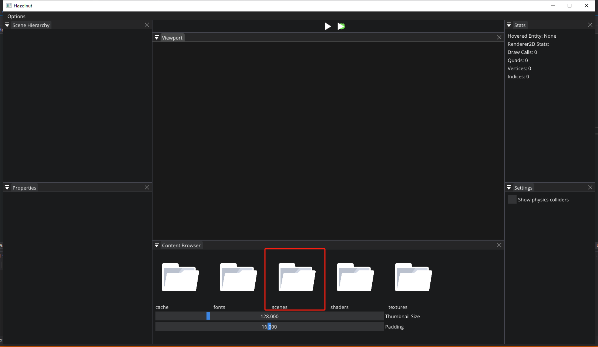
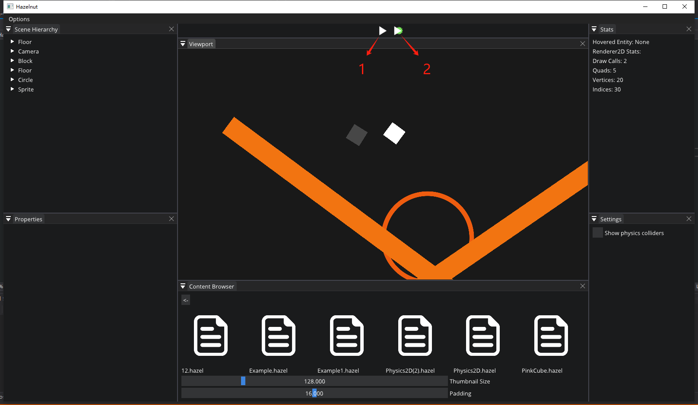
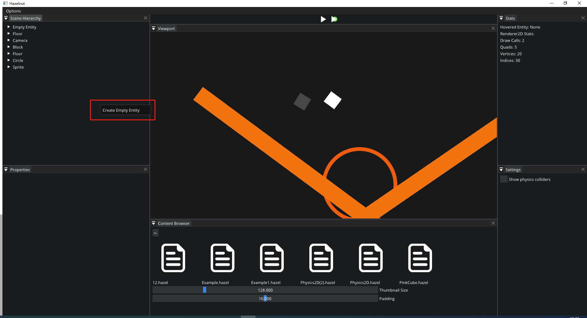
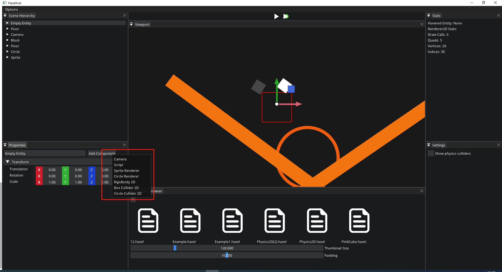
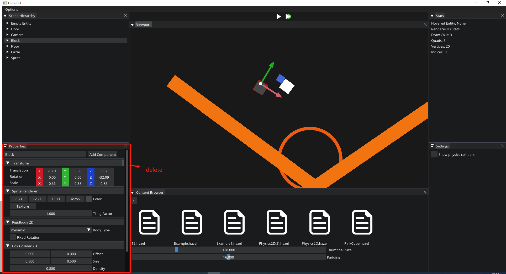
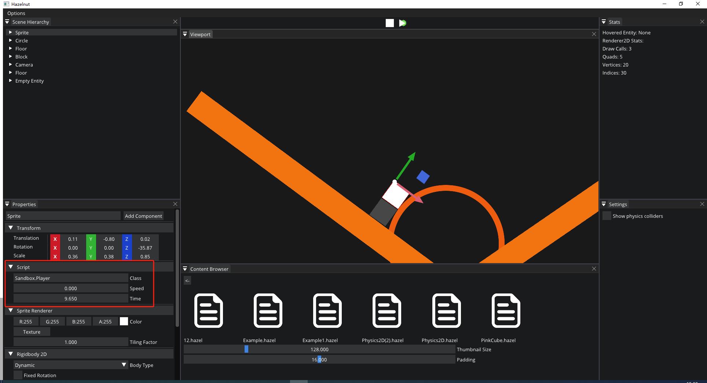
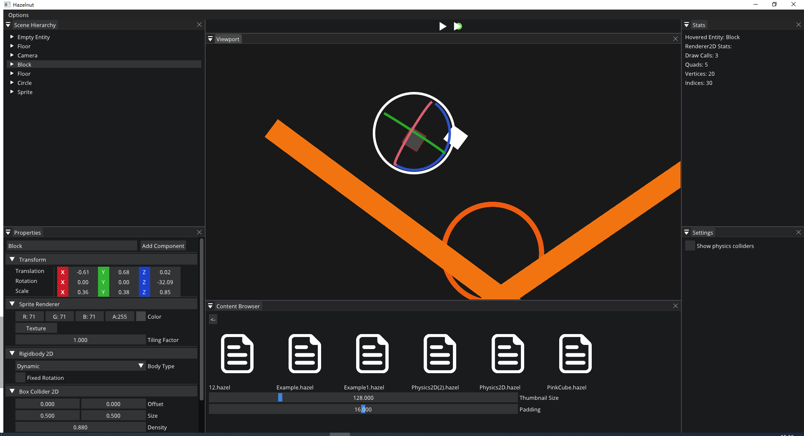
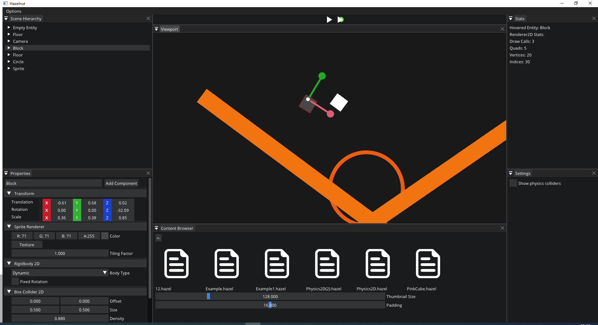

# GameEngine
它一个是用于Windows的早期交互式应用程序和渲染引擎。目前并没有实现太多，但是这个存储库中的所有内容都是在参考Hazel的YouTube视频实现的https://www.youtube.com/@TheCherno。

## 开始 

建议使用 Visual Studio 2017 或 2019，引擎在其他开发环境中正式未经测试，它专注于 Windows 版本。 

**1. 下载存储库：** 

首先使用  `git clone --recursive https://github.com/ZUKUNFTL/GameEngine`。 

如果存储库之前是非递归克隆的，请使用  `git submodule update --init` 克隆必要的子模块。 

如果仍然有子模块无法克隆，可以切换到子模块目录，并手动切换到对应版本，使用 git reset --hard <commmit code>。

**2. 配置依赖关系：** 

1. 运行 [Setup.bat ](https://github.com/TheCherno/Hazel/blob/master/scripts/Setup.bat)文件，找到  `scripts` 文件夹。这将下载项目所需的先决条件（如果尚不存在）。 
2. 一个先决条件是 Vulkan SDK。如果未安装，脚本将执行  `VulkanSDK.exe` 文件，并提示用户安装 SDK。 
3. 安装后，再次运行 [Setup.bat ](https://github.com/TheCherno/Hazel/blob/master/scripts/Setup.bat)文件。如果 Vulkan SDK 安装正确，它将下载 Vulkan SDK 调试库。（这可能需要更长的时间） 
4. 下载并解压缩文件后， [将 ](https://github.com/TheCherno/Hazel/blob/master/scripts/Win-GenProjects.bat)自动执行Win-GenProjects.bat脚本文件，然后生成一个 Visual Studio 解决方案文件供用户使用。 

如果进行了更改，或者如果要重新生成项目文件，请重新运行  [Win-GenProjects.bat ](https://github.com/TheCherno/Hazel/blob/master/scripts/Win-GenProjects.bat) 脚本文件，该文件位于  `scripts` 文件夹。 

项目包含另外一个解决方案，运行GameEngine\Hazelnut\SandboxProject\Assets\Scripts目录下的 [Win-GenProjects.bat ](https://github.com/TheCherno/Hazel/blob/master/scripts/Win-GenProjects.bat) 脚本文件，你会看到生成一个 Visual Studio 解决方案文件，它是关于C#脚本的解决方案。

## 一些操作指导

- 场景文件

  引擎中已经自带了一些场景文件，存储在scenes文件夹中，如果需要测试，建议打开其中的Physics2D为前缀的文件。

  

- 状态介绍

  

​	当前状态为编辑状态，可以为场景添加各种实体。状态1为游戏状态，为主相机视角。状态2为物理引擎模拟状态，为编辑状态的相机视角。

- 添加实体和组件

  右键左上方空白处，可以添加实体。

  

目前支持实体添加以上几种组件：依次为相机，脚本，方形渲染，圆形渲染，刚体，方形刚体碰撞，圆形刚体碰撞。

所有组件的属性都显示在左下方。组件标题栏的最右方可以删除组件。

- 启动脚本组件

  因为脚本组件需要在游戏状态才能起作用，这里另作解释，目前只内嵌了wasd来控制实体的脚本。

  

在为实体添加脚本组件后，在class中写入Sandbox.Player来选择相关脚本，在speed中填入数值，切换到游戏状态后，脚本启动，我们就可以通过wasd来控制实体移动。

- 编辑状态中实体的几种状态介绍

在编辑状态，选中实体后，通过qwer快捷键可以切换实体的编辑状态，依次为，不可编辑，移动，转动，伸缩4个状态。

**移动状态**

**旋转状态**

**伸缩状态**

