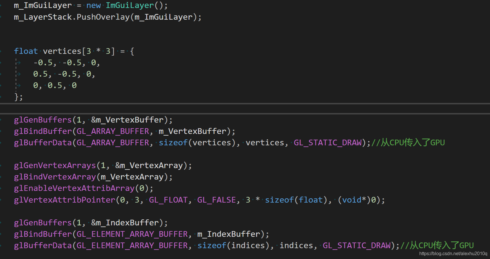

# 游戏引擎笔记

## opengl 和glfw 以及 glad的关系

OpenGL

首先，OpenGL是一个开放的图形库，用于渲染2D和3D的图形。它只是一种标准或规范，具体的实现是由驱动开发商针对特定显卡实现的。因此，OpenGL本身并不提供创建窗口或处理用户输入的功能，这就需要用到GLFW库。
GLFW

GLFW是一个专门针对OpenGL的C语言库，它提供了一些渲染物体所需的最低限度的接口。它允许用户创建OpenGL上下文，定义窗口参数以及处理用户输入。简单来说，GLFW负责创建窗口，处理窗口相关的事件（如键盘和鼠标输入），并提供一个OpenGL上下文供你的程序使用。
GLAD

然后，我们有GLAD。由于OpenGL驱动版本众多，它大多数函数的位置都无法在编译时确定下来，需要在运行时查询。所以任务就落在了开发者身上，开发者需要在运行时获取函数地址并将其保存在一个函数指针中供以后使用。取得地址的方法因平台而异,代码非常复杂，而且很繁琐，我们需要对每个可能使用的函数都要重复这个过程。幸运的是，有些库能简化此过程，其中GLAD是目前最新，也是最流行的库。GLAD是用来管理OpenGL的函数指针的，所以在调用任何OpenGL的函数之前我们需要初始化GLAD。GLAD也可以使OpenGL基础渲染变得简单。


## 1. 代码的整体架构

因为一个人构建出 unreal 之类的肯定不现实。我们会聚焦于构建我们需要的最小的基础框架，先能够运行，然后我们会不停迭代、增强、增加更多特性、提高稳定性、更好的性能和优化，和其他之类的事情。我们不会一开始就尝试去写百分百完美的强大的可扩展的代码，因为那会花费我们一年的时间来最终获得一个窗口应用程序。

那么下面就来讨论一下一个游戏引擎需要些什么（只是看看要包括些什么，并不是实现的顺序）。

第一点要做的是需要一个入口点：Entry Point。一个入口点本质上就是当我们希望我们的应用程序或者游戏使用这个引擎启动的时候会发生什么。这是很多人会忽视的东西。比如是什么控制了 main 函数？什么控制了main函数的代码执行？是客户端控制的？或者游戏控制的？或者是某些东西，比如是引擎实际控制的？或者我们可能用宏实现，或者导入什么东西。

之后要有一个 Application Layout （应用层）：处理程序的生命周期和事件之类的东西的那部分代码。比如说我们的主循环，也就是保持我们的程序运行和渲染的那个循环，也就是保持时间流动的那个循环。也就是执行(驱动)我们的游戏希望执行的全部代码的那个循环。关于事件比如改变窗口大小或者关闭窗口，或者输入事件，比如鼠标或者键盘，所有这些东西都要在应用层处理。我们需要一种方式来让我们的游戏或者引擎作为一个实际的应用程序运行在任何可能要运行的平台上，这就是应用层要解决的。

接下来需要一个 Window Layout （窗口层）。然后在这一层里面我们要处理 input （输入）和 event （事件）。由于输入可以放到事件里面（输入事件），所以我们的事件管理系统会处理输入事件，从我们的窗口和应用程序捕获输入事件。事件管理系统也会是非常重要的东西，我们需要构建一个非常基础的消息和广播系统。基础的意思是说只要，我们应用程序内的某些层可以订阅事件。并且当事件发生的时候，可以从应用层的堆栈获得通知。当事件传播到那些层的时候，那些层可以选择是否要把事件传播到哪些东西，就像一个所有者系统。某种程度上它就是一个基础的消息系统。当事件发生的时候，我们可以中断，或者不是真的中断。总之事件发生的时候，然后我们会得到通知，本质上就是因为我们的 onEvent() 函数会被调用。

然后是渲染器 Render ，可能会是我们需要处理的最大的系统之一。渲染器就是实际渲染图形到屏幕上的那个东西。

接下来是 Render API abstraction 。最开始我们只会用 OpenGL ，之后还需要各种 API 。我们要把所有的东西设置成API无关的，这样新增一种 API 就不是完全重写。显然有的东西不得不是API独特的，比如我们可以就写一个叫 “上载纹理” 的函数，然后为四种API各做一个实现不同，因为我们创建渲染器的方式会因为API而不同。因为如果你用Vulkan的方式，相比于使用OpenGL的方式做特定的事情的时候vulkan可能会更高效。因此我们仍然需要写两份代码，而不是把每个 OpenGL 的函数拷贝一份然后。。。

接着是 Debugging Support 调试支持。就比如日志系统，那可以是很简单的东西。还有比如性能，为此我们需要一种分析系统，我们希望应用程序能有一种潜在的方式，运行一种在 VisualStudio 设置之外的特殊的模式。我们希望应用程序能够自己运行调试，因此可以运行在任何平台上。而不用担心，运行特定平台可用的特定工具。我们希望把工具代码插入到自己的代码中，但是（工具代码）只在调试模式下运行。可以为每个函数计时并且汇总成好看的视图，任何也许用某种工具查看之类的。

然后还希望有一些 Scripting 脚本，比如 Lua 或者 C# 或者 Python 之类的。需要脚本语言，避免完全使用 C++。我们可以像艺术家和内容创造者那样轻松地写高级脚本语言而不用担心内存的问题。

还有 Memory System 内存系统。需要管理好资源。以及调试内存之类的。

还需要实体组件系统（ECS，Entity Component System）。这是一种让我们能在世界创建游戏对象的模块化的方式。比如让世界里的每个独立实体或游戏对象能包含特定的组件或系统，因此我们能定义行为以及动作的具体细节。它就是一种让我们能定义引擎要对实体做的事情的方式。

还需要 Physics Solution 物理解算。

还有 File I/O ，VFS（虚拟文件系统）

还有Build System 构建系统，把3D模型或材质需要能转换为自定义格式，那是为我们的引擎优化的格式。所以不用在运行时浪费时间转换格式，因为我们可以离线处理。热交换资产，希望比如开着 PS 在纹理上画了一些东西，按下 Ctrl + S，我们希望在运行时构建系统捕获然后实时地重新构建导入游戏，所以我们能更新东西，甚至比如3D模型，调整一些顶点或者进行某种修改，然后就热交换到引擎里。所以我们能在游戏运行时修改，这不是一个非常重要的系统，现在可能不值得讨论。

不过暂时我们只支持Windows只支持OpenGL。我们的C++代码文件里不会包含任何Windows代码，比如 Win32 API 代码。因为显然引擎要在未来支持其他的平台。所以会抽象那些东西，保证平台或渲染API独特的代码分散在它自己的文件里。在其他平台或者渲染API的时候它们不会被编译。

## 2. github,VS的项目设置

这一节我们要设置好所有东西：Github仓库、Visual Studio 解决方案和项目、依赖配置，然后我们要链接项目到一期，做一个屏幕上打印 Hello World 的简单程序。但是会为我们的游戏引擎组织好结构和配置。

GitHub上建立好工程，选择 Apache-2.0 License ，具体选什么 License 可以看下面这个图：


然后在 VS 中创建好工程，并且 git clone 一下：（这里因为文件夹非空会有冲突，所以我们先创建到 Git 文件夹中，但是关心的是里头的内容，然后选择复制粘贴出来）


​		这里我们把引擎选择编译成一个 DLL ，然后外部链接上最终的 exe ，选择 DLL 的原因是我们可以自己选择加载或者卸载 DLL ，主要的原因是我们会有很多依赖，我们会需要链接很多库到引擎里。如果用静态库的话，我们的所有的静态库都会被链接到游戏里面，我们的引擎依赖那些库，如果使用静态库的话，那些需要链接到引擎的库文件实际上全部会链接到游戏。用DLL的话基本上就像一个exe文件，所以我们可以把所有东西都链接到那个DLL，然后我们的游戏只会依赖那一个单独的包含了全部需要的内容的DLL文件，而不是无数的其他的库文件。

​		所以本质上我们要做的，就是把所有的依赖都链接到那个引擎的DLL文件，这意味着它们都需要是静态库。我们需要做的就是，把所有静态库链接到引擎DLL然后把引擎DLL链接到游戏。
我们不希望管 x86 32位的平台，所以直接remove掉：


然后我们这样配置 VS ：


output 为：$(SolutionDir)bin\$(Configuration)-$(Platform)\$(ProjectName)\
intermediate 为：$(SolutionDir)bin-int\$(Configuration)-$(Platform)\$(ProjectName)\

这样输出的 HEngine.dll 就会在 \bin\debug-x64\HEngine\HEngine.dll 了。中间文件这样设置是想不放在 bin 文件夹中，这样我们就能直接复制粘贴 bin 文件夹而不要中间文件了。

然后 Solution -> Add -> New Proj ：


然后新的Proj一样的设置：


 接着我们关闭 Solution，在文件夹中查看这个 sln 文件：


打开的话源码会是这样的：


我们改一下顺序，把 Sandbox 提前：


这样别人查看的时候 Sandbox 就会自动成为启动项目，而不是 HEngine 了。

而在我们的文件中有 .vs 来记录一些用户的设置，比如谁是启动文件之类的：


然后 Sandbox 添加 reference ：


而 VS 在编译 dll 文件时，会一起生成 dll 和 lib，lib 文件会包含所有那个dll文件导出的函数，因此我们就不需要手动从dll文件加载函数或者符号了。同时也会生成包含实际机器码和其他链接内容的dll文件。因此我们可以静态链接 HEngine.lib 到sandbox.exe但是运行时需要dll文件。 


其中的lib文件被链接到我们的sandbox中，这样它就知道哪些函数是可用的，以及它们在dll中的位置。

但是现在我们仍然不能直接运行，因为还没设置dll的查找路径，所以我们手动贴一下（把HEngine.dll帖到下面这里来）：


## 3. 程序的入口点和.gitignore的编写

上一节我们的 Sandbox 的项目的 Application.cpp是这样写的：

```cpp
namespace HEngine
{
	__declspec(dllimport) void Print();
}

void main()
{
	HEngine::Print();
}
```

这意味着 main 函数是由 Application 定义的，但是引擎的入口应该由引擎负责定义，我们希望这些是由引擎端控制的。我们要在 Sandbox 项目里创建一个 Application 类，来定义和启动我们的应用程序。我们还要把 __declspec(dllimport) 和 __declspec(dllexport) 写到宏里，然后我们可以重用头文件。

同时最终我们再手动写一个 gitignore。

这里说下如何将代码提交到github。

在工作目录通过gitstatus命令来查看跟踪的文件或者未跟踪的文件


在工作目录下编写一个.gitignore文件来对不需要添加的文件或者目录进行忽略：


git reset .命令可以撤销当前文件夹添加的跟踪文件，git add *将所有文件添加跟踪，git commit -m "..."将文件添加到本地，git push origin master将代码上传到远程代码库。

## 4.日志模块的添加

日志就是我们记录事件的一种方式。这里的事件不只是字面意义，因为事件可以是任何东西。

我们要写一个日志库。日志最大的议题是格式化不同的类型。只是打印一个字符串很简单，但是我们希望能打印的不只是文本，所以需要一种好的格式化方式，不定参的格式化。

总之，我们要使用一个叫 spdlog 的库：https://github.com/gabime/spdlog

C++没有定义导入和使用库的方法。很多时候基本上就是选择一个你想用的构建系统，比如 CMake 或者 Premake 之类的。然后保证你使用的每个库写到构建系统里。像这样你可以更新和维护它。或者用 git-submodule 添加它们，如果你用 GitHub 就可以用 git-submodule ，这可能是最好的方式。

我们要做的就是添加一个 .gitmodules 文件，然后我们实际克隆 HEngine 的时候，也会克隆所有 submodule 。这很有用，因为可以持有一个版本的完整代码。

我们在命令行里输入：`$ git submodule add https://github.com/gabime/spdlog HEngine/vendor/spdlog`


同时也会自动帮我们生成一个 .gitmodules 文件：


但是毕竟是我们的引擎，我们希望 HEngine::Log 而不是 spdlog::log，于是我们在引擎中创建了一个Log类。我们要做的是创建两个控制台，一个客户端的，一个引擎的，一个叫 Core，一个叫 App。

这里需要注意的是头文件的顺序：


如果日志模块写在了引用它模块的下面，将会导致编译错误，entryPoint引用了日志模块，因此，日志的引用必须在它之前。

尽管SandBox模块引入了Hazel.h头文件，但是在编译log.h文件时，里面的包含头文件它并没有包含，因此在SandBox中也需要加入日志模块的相关头文件路径。


## 5. Premake Game Engine Series

本期会讨论CMake之类的构建问题。首先是为什么需要项目生成，而不是直接VS呢？主要就是不同平台的问题了。

我们要用的是 Premake：https://github.com/premake/premake-core/releases

不用CMake是Cherno个人不喜欢。Premake是用lua来写，而且用起来很简单。

然后我们写 premake5.lua ：


 这里release未必是发行版本，Dist才是完全的发行版本；release就是一个更快的Debug比如去掉一些日志啥的来测试。


这里两个星号意思是递归搜索文件夹、子文件夹

我们可以使用过滤器，即平台又配置可以这样：


 最后我们用命令行生成：`vendor\bin\premake\premake5.exe vs2019`

```lua
workspace "Hazel"
	architecture"x64"

	configurations
	{
		"Debug",
		"Release",
		"Dist"
	}

outputdir = "%{cfg.buildcfg}-%{cfg.system}-%{cfg.architecture}"

buildcfg代表我们的是发布还是调试，system代表我们的系统是mac还是windows，archittecture代表我们是x64还是32的

location代表我们相对路径的当前目录
shadredlib代表我们是动态库
targetdir代表我们二进制文件的输出目录，等于我们把所有东西都放在bin/debug-windows-x64/Hazel
objdir带我们的中间文件的输出目录
project "Hazel"
	location "Hazel"
	kind "SharedLib"
	language "C++"

	targetdir("bin/" .. outputdir .. "/%{prj.name}")
	objdir("bin-int/" .. outputdir .. "/%{prj.name}")

	递归读取所有的cpp和h文件
	files
	{
		"%{prj.name}/src/**.h",
		"%{prj.name}/src/**.cpp"
	}
	包含头文件路径
	includedirs
	{
		"%{prj.name}/vendor/spdlog/include"
	}

	filter说明它只适用于所选的系统
	staticruntim这和静态库链接相关
	filter "system:windows"
		cppdialect "C++17"
		staticruntim "On"
		systemversion "latest"
		
		定义宏
		defines
		{
			"HZ_PLATFORM_WINDOWS",
			"HZ_BUILD_DLL"
		}

		在hazel中进入bin目录并复制hazel.dll到sandbox中
		postbuildcommands
		{
			("{COPY} %{cfg.buildtarget.relpath} ../bin/" .. outputdir .. "/Sandbox")
		}

	filter "configurations:Debug"
		defines "HZ_DEBUG"
		symbols "On"

	filter "configurations:Debug"
		defines "HZ_RELEASE"
		symbols "On"

	filter "configurations:Debug"
		defines "HZ_DIST"
		symbols "On"
	
project "Sandbox"
	location "Sandbox"
	kind "ConsoleApp"
	language "C++"

	targetdir("bin/" .. outputdir .. "/%{prj.name}")
	objdir("bin-int/" .. outputdir .. "/%{prj.name}")

	files
	{
		"%{prj.name}/src/**.h",
		"%{prj.name}/src/**.cpp"
	}
	includedirs
	{
		"Hazel/vendor/spdlog/include",
		"Hazel/src"
	}

	需要链接的项目
	links
	{
		"Hazel"
	}

	filter "system:windows"
		cppdialect "C++17"
		staticruntim "On"
		systemversion "10.0"
		
		defines
		{
			"HZ_PLATFORM_WINDOWS"
		}

	filter "configurations:Debug"
		defines "HZ_DEBUG"
		symbols "On"

	filter "configurations:Debug"
		defines "HZ_RELEASE"
		symbols "On"

	filter "configurations:Debug"
		defines "HZ_DIST"
		symbols "On"
```

## 6. 事件系统

这一节要写一个事件系统，从而可以处理收到的窗口事件等，比如窗口关闭、改变大小、输入事件等等。

我们不希望 Application 依赖 window，window 类应当完全不知晓 Application，而Application要创建window 。所以我们需要创建一种方法，可以把所有事件发送回到 App，然后 Application 可以处理它们。当窗口中发生了一个事件，window 类会收到一个事件回调，然后它要构造一个 HEngine 事件，然后用某种方法传给 App。

当 App 创建了一个 window 类的时候，同时给 window 类设置一个事件回调，所以每当窗口得到一个事件，它检查回调现在是否为 null ，如果不是 null，就用这些事件数据调用回调。然后 App 会有一个函数叫 onEvent() 接受一个事件的引用，会从 window 调用这个函数。

这些一般被称为阻塞事件，因为当我们处理这些鼠标按下事件的时候，可能直接在栈上构造事件，然后立即调用回调函数。所以当我们处理这个事件的时候，会暂停所有其他事件。因此称为阻塞事件。未来可以创建带缓冲的事件，基本上就是捕获这些信息，在某个地方队列存储，不阻塞其他事件，然后可能每帧遍历事件队列。然后调度和处理它们，而不是在收到事件时立即处理。


对于KeyEvent，第一次是按下事件，之后都是重复事件。

这里我们的公共抽象基类 Event 有这些接口：

```c++
virtual EventType GetEventType() const = 0;
virtual const char* GetName() const = 0;
virtual int GetCategoryFlags() const = 0;
virtual std::string ToString() const { return GetName(); }

```

然后我们通过两个宏来实现：

```c++
#define EVENT_CLASS_TYPE(type) static EventType GetStaticType() { return EventType::##type; }\
								virtual EventType GetEventType() const override { return GetStaticType(); }\
								virtual const char* GetName() const override { return #type; }

#define EVENT_CLASS_CATEGORY(category) virtual int GetCategoryFlags() const override { return category; }

```

GetStaticType 是想直接通过 Event 名字就获取到它的类型，又搞了一个成员函数 GetEventType，主要是想通过 Event 指针来拿到事件的类型实现多态的目的，后面的 GetName 就是调试的目的了。

## 7. 添加预编译头文件

VS 预编译头需要一个 include 预编译头文件的源文件，而 GCC 和 Clang 则不需要。

premake5.lua 只需要新增这两行：

```cpp
pchheader "hepch.h"
pchsource "HEngine/src/hepch.cpp"
```

其中 pchsource 只有在为 vs 才会需要，相当于 vs 中的use pch和create pch

## 8. 窗口抽象化并添加GLFW模块

当目前为止我们起码有了 日志 和 事件 系统，在 Cherno 看来这是创建窗口之前必须的。

我们之前说过 glfw ，一个跨平台的库，然而可能最终我们还是要上 win32 api，因为glfw不能支持dx，然而dx是由Windows开发，在Windows上运行时显然会比其他 API 都要好。

所以此时我们必须思考要如何进行抽象。Cherno 的选择是，为每个平台实现一个窗口类。（当然 glfw 已经是一种平台抽象的方式了，然而未来在 windows 我们要切换到使用 win32 api）

基本上平台抽象我们要建一个 Platform 文件夹，然后在其中再建一个 Windows 文件夹之类的，之后可能还会加 Linux、Mac 之类的，在 Platform 文件夹中也会放渲染 API 独特的代码，比如 OpenGL、DirectX、Vulkan、Metal 之类的东西也会收在里面。

我们甚至可能会有一个 POSIX 文件夹，放 Linux、Mac、Android 相关的相同的代码。

用一下命令下载GLFW:

    git submodule add https://github.com/glfw/glfw HEngine/vendor/GLFW

但是在这里我们的 GLFW 也需要构建成一个 project，于是我们 fork 一下原 GLFW 仓库，然后加一个 premake5.lua

关于删去 gitsubmodule 的内容：https://stackoverflow.com/questions/12898278/issue-with-adding-common-code-as-git-submodule-already-exists-in-the-index

## 9. 将事件系统添加到应用程序中

这里事件回调有点晕，梳理一下：

首先是有一个抽象接口 Window 类，我们写在 src \ HEngine \ Window.h 中，其中有一个函数 static Window* Create(const WindowProps& props = WindowProps());，用来让各个平台予以实现，其中 WindowProps 是一个包含窗口属性（window properties）的结构体：

```c++
struct WindowProps
{
	std::string Title;
	unsigned int Width;
	unsigned int Height;

	WindowProps(const std::string& title = "HEngine",
		unsigned int width = 1280,
		unsigned int height = 720)
		: Title(title), Width(width), Height(height)
	{
	}
};
```

于是乎，在我们的框架中，Application 类中加一个成员：`std::unique_ptr<Window> m_Window;`，那么在它的构造函数中我们只需要调用Create方法就好了:

```c++
Application::Application()
{
	m_Window = std::unique_ptr<Window>(Window::Create());
	m_Window->SetEventCallback(HE_BIND_EVENT_FN(Application::OnEvent));
}
```

注意，我们之前的 Create 方法只是在 Window 类中声明了，但是其真正链接的时候是在 WindowsWindow.cpp （位于 src \ Platform \ Windows）中的：

```c++
Window* Window::Create(const WindowProps& props)
{
	return new WindowsWindow(props);
}
```

我想在之后我们会用宏去判断，应该是链接到那个平台的实现。现在由于只有Windows平台，就直接写了。

以上是窗口的创建，那么事件是如何回调的呢？

在`void WindowsWindow::Init(const WindowProps& props)`方法中，首先是要glfw的窗口初始化，这里我们使用了：

```c++
glfwSetWindowUserPointer(m_Window, &m_Data);
```

而 m_Window 是由函数 glfwCreateWindow 创建的 GLFWwindow 窗口，m_Data 则是 WindowsWindow 类中的成员，类型为我们自定义的结构体：

```c++
struct WindowData
{
	std::string Title;
	unsigned int Width, Height;
	bool VSync;

	EventCallbackFn EventCallback;
};
```

这一行其实就是让窗口内部的userPointer指向我们的m_Data：window->userPointer = pointer;，那么之后我们就可以使用代码：
WindowData& data = *(WindowData*)glfwGetWindowUserPointer(window);

通过上面这个代码，我们就可以直接从窗口拿到我们自定义的窗口数据，此为回调的基础。

注意我们的窗口数据有一个成员：EventCallbackFn EventCallback;，此为回调函数：using EventCallbackFn = std::function<void(Event&)>;

而要对事件处理，首先自然有一个事件的抽象基类 Event ，其对应的处理类为 EventDispatcher ：

```c++
class EventDispatcher
{
	template<typename T>
	using EventFn = std::function<bool(T&)>;
public:
	EventDispatcher(Event& event)
		: m_Event(event)
	{
	}

	template<typename T>
	bool Dispatch(EventFn<T> func)
	{
		if (m_Event.GetEventType() == T::GetStaticType())
		{
			m_Event.m_Handled = func(*(T*)&m_Event);
			return true;
		}
		return false;
	}
private:
	Event& m_Event;
};
```

如上，其中有成员 Event，还有对应的处理函数 Dispatch，Dispatch 接收一个函数，然后在内部进行处理（先判断一下这个函数是不是处理咱们的内部事件的）。这里我们直接转换为模板参数T的类型，因为我们在if中已经判断好了，就不用较慢的 dynamic_cast 了。

那么各种事件是如何进行交互回调的呢？

**比如我们鼠标移动，要在控制台打印，它会这样做到：**

1. 我们的 OnUpdate 函数，其内部会进行 glfw 的事件判断：glfwPollEvents

```c++
void WindowsWindow::OnUpdate()
{
	glfwPollEvents();
	glfwSwapBuffers(m_Window);
}
```

2. 对鼠标移动的事件，在我们的窗口类 WindowsWindow 的构造函数中就已经写好对应的 glfw 回调方法：`glfwSetCursorPosCallback`：

```c++
glfwSetCursorPosCallback(m_Window, [](GLFWwindow* window, double xPos, double yPos)
{
	WindowData& data = *(WindowData*)glfwGetWindowUserPointer(window);

	MouseMovedEvent event((float)xPos, (float)yPos);
	data.EventCallback(event);
});
```

3. 注意到，我们的方法中都有这么一行：data.EventCallback(event);，而 data 是我们之前所述的，通过 window 的 UserPointer 获取得到的，是我们自定义的类型 WindowData，内部有回调函数 EventCallback（通过 std::function<void(Event&)> 封在闭包内），从而通过这个回调函数来进行事件的处理。

4. 这个回调函数我们是在 Application 的构造函数中就设定好的，就为我们实现的 OnEvent 函数：

   ```c++
   Application::Application()
   {
   	m_Window = std::unique_ptr<Window>(Window::Create());
   	m_Window->SetEventCallback(HE_BIND_EVENT_FN(Application::OnEvent));
   }
   ```

   ```c++
   void Application::OnEvent(Event& e)
   {
   	EventDispatcher dispatcher(e);
   	dispatcher.Dispatch<WindowCloseEvent>(HE_BIND_EVENT_FN(Application::OnWindowClose));
   
   	HE_CORE_TRACE("{0}", e);
   }
   ```

   可以看到，这个函数的最后会调用 `HE_CORE_TRACE("{0}", e);`，这是我们引擎中日志打印的方法。能够对事件生效是因为我们写了如下重载:

   ```c++
   inline std::ostream& operator<<(std::ostream& os, const Event& e)
   {
   	return os << e.ToString();
   }
   ```

   而 ToString 则是一个多态函数，每个我们写的 Event 事件都会 override 实现这个函数。

   同时我们发现，OnEvent 中还有一个 EventDispatcher 来对事件进行特定的处理，比如我们想实现关闭窗口，对应我们写的事件为 WindowCloseEvent，并且写下对应的处理函数：

   ```c++
   bool Application::OnWindowClose(WindowCloseEvent& e)
   {
   	m_Running = false;
   	return true;
   }
   ```

   这里的 HE_BIND_EVENT_FN 实现为 #define HE_BIND_EVENT_FN(fn) std::bind(&fn, this, std::placeholders::_1)，所以这一行实际上是把 OnWindowClose 先绑定好 this 指针，剩下一个参数就是 WindowCloseEvent，这个参数需要与 Dispatch 的模板参数对应，然后就会通过这个传入的函数去执行事件的处理了。

## 10. 添加图层

我们现在是有一个 App 框架，里头的 Run 会不断进行游戏循环。

那么这一讲的 Layer 层系统，我们希望在进行游戏循环的时候，每个被启用的层（Layer）都会按照层栈顺序更新。通过这种更新循环，可以在层上进行渲染。显然因为层栈是有顺序的，这很重要。意味着你可以把层放在其他层的上面，这会决定绘制顺序。层栈对于构建、覆层系统也很有用。覆层能让你把层推至层栈的后半部分。

基本上就是说，我们有一个连续的层列表，但是覆层总会在列表的最后，因此总在最后渲染。

但是在进行事件的时候，比如角色开枪，其点击了一下屏幕的按钮，我们希望这个事件直接被按钮处理了，而不是传播到之后的开枪处理中。因此我们要有正向遍历列表和反向遍历列表——正向遍历列表来渲染、更新等等，然后反向遍历来处理事件。 反向的意思是说从最上层开始向下处理，而不是像渲染一样自底向上。

这里我们的 Layer 是这样的：


```c++
class HENGINE_API Layer
{
public:
	Layer(const std::string& name = "Layer");
	virtual ~Layer();

	virtual void OnAttach() {}
	virtual void OnDetach() {}
	virtual void OnUpdate() {}
	virtual void OnEvent(Event& event) {}

	inline const std::string& GetName() const { return m_DebugName; }
protected:
	std::string m_DebugName;
};

```

当层推入层栈，成为程序的一部分时，被 Attached （链接）。当层被移除时，Detach（分离）。基本上和 OnInit 和 OnShutdown 差不多。OnUpdate 则是在层更新时由 Application 调用，应该每帧调用一次。OnEvent，当层得到事件时，我们从这里接收。这些都是虚函数，所以可以在创建自己的层时 override

LayerStack 代码如下：

```c++
class HENGINE_API LayerStack
{
public:
	LayerStack();
	~LayerStack();

	void PushLayer(Layer* layer);
	void PushOverlay(Layer* overlay);
	void PopLayer(Layer* layer);
	void PopOverlay(Layer* overlay);

	std::vector<Layer*>::iterator begin() { return m_Layers.begin(); }
	std::vector<Layer*>::iterator end() { return m_Layers.end(); }
private:
	std::vector<Layer*> m_Layers;
	std::vector<Layer*>::iterator m_LayerInsert;
};

```

注意我们搞了一个 overlay，这个 overlay 就是刚刚说的覆层。实现如下：

```c++
LayerStack::LayerStack()
{
	m_LayerInsert = m_Layers.begin();
}

LayerStack::~LayerStack()
{
	for (Layer* layer : m_Layers)
		delete layer;
}

void LayerStack::PushLayer(Layer* layer)
{
	m_LayerInsert = m_Layers.emplace(m_LayerInsert, layer);
}

void LayerStack::PushOverlay(Layer* overlay)
{
	m_Layers.emplace_back(overlay);
}

void LayerStack::PopLayer(Layer* layer)
{
	auto it = std::find(m_Layers.begin(), m_Layers.end(), layer);
	if (it != m_Layers.end())
	{
		m_Layers.erase(it);
		m_LayerInsert--;
	}
}

void LayerStack::PopOverlay(Layer* overlay)
{
	auto it = std::find(m_Layers.begin(), m_Layers.end(), overlay);
	if (it != m_Layers.end())
		m_Layers.erase(it);
}

```

也就是说，推入一个 layer，就想正常地 push 进去，通过类中的迭代器m_LayerInsert放入，m_LayerInsert也就是正常 layer 的最后一个位置；而要是是 overlay ，我们就不需要管迭代器 m_LayerInsert 的位置，而是直接 emplace_back 进去，因此 LayerStack 中的排列像是这样 ： layer layer overlayer overlayer ，而 m_LayerInsert 就应该指向这里第二个 layer 的位置，即最后一个非 overlayer 的 layer。

## 11. 添加GLAD库

现在大多数采用 glad 获取一堆 glxxx 函数的函数指针。用 glfw 管理操作系统的窗口管理器给到的 framebuffer，然后OpenGL 在上面画画的方式。

GLAD GitHub：https://github.com/Dav1dde/glad
在线生成服务：https://glad.dav1d.de/

对于Cherno而言（UI）是在游戏引擎或是任何图形项目中第一个要设置的，因为这可以同时显示信息和调整参数。比如 Cherno 不希望每次都重新编译来调整一个参数，只要在屏幕上有个滑条就好。

为了能让 IMGUI 工作，以及我们实现的前瞻性规划，我们首先要能使用现代OpenGL。

基本上我们需要一种方式，从显卡驱动加载所有的现代OpenGL的函数，到C++代码中。因此我们能调用存储于图形驱动程序的函数。

在 OpenGL 系列中我们使用了 GLEW（OpenGL Extension Wrangler），这里要用 GLAD（相比GLEW更好更现代）。

我们将首先在网站上配置好它，下载，然后添加为一个单独的项目，添加项目premake文件，提交到我们的存储库。因此不会像之前 GLFW 以及未来的 IMGUI 一样，要fork其他的存储库。


Generate 后，点 glad.zip 下载，然后就有了我们需要的所有东西。

随后添加 glad 进premake管理，然后在glfw窗口初始化的时候添加这一行调用 gladLoadGLLoader ：


## 12. 添加imGui库

这里要做的事被称为 “hack” 。

编写软件的其中一种方式是，第一件事是 make it work，第二件事是 make it correct，最后一件事是 make it fast。所以我们要让它运行起来，用奇技淫巧，因为我希望在屏幕上看到 IMGUI。

正确方法是合理抽象，以替代原始的 OpenGL 函数调用。（原始调用是我们今天要做的）我们希望整个 IMGUI 依赖 HEngine 而不是原始的 OpenGL api。因为我们还没用渲染器，那些的前提是首先要有一个渲染器。但我们希望在有渲染器之前就加入 IMGUI 因而我们能在编写渲染器的时候调试，这样就会方便很多。

Dear ImGui主要用于程序员的图形Debug工具(类似于Unity的ImGUI)，举个例子，如果没有ImGUI，要调整好一个参数，要反复在代码里面修改数值，然后编译运行项目查看效果，这样很麻烦，而通过ImGui，就可以实现直接在图形界面调试参数的功能。虽然这玩意儿的性能不足以用于runtime的实际游戏，但是先凑合用着吧。

imgui的编写premake方法与之前相同。

github地址： https://github.com/TheCherno/imgui 

用命令添加子模块：git submodule add https://gitclone.com/github.com/TheCherno/imgui Hazel/vendor/imgui

怎么使用ImGui的代码

ImGui的代码仓库里给了两种代码：

​	一种是源代码，Hazel需要引用这部分代码，作为库文件，类似于引用GLFW和Glad库文件项目一样
​	一种是使用ImGui的源代码的examples代码，就是教你怎么调用的

对于第一种代码，为其生成一个premake5.lua文件，然后为其生成一个Project即可，如下图所示：


至于具体怎么在Hazel里用，就需要参考ImGui的例子代码了，由于我们用的是glfw库加上OpenGL3的版本，所以要参考的两个cpp文件为：imgui_impl_opengl3.cpp和imgui_impl_glfw.cpp

以下是imgui_impl_glfw.cpp的部分代码，可以看到基本是ImGui把glfw库的很多函数和功能封装到了ImGui自己的类中：

```c++
static GLFWwindow*          g_Window = NULL;    // Main window
static bool ImGui_ImplGlfw_Init(GLFWwindow* window, bool install_callbacks, GlfwClientApi client_api)
{
    g_Window = window;
    g_Time = 0.0;

    // Setup backend capabilities flags
    ImGuiIO& io = ImGui::GetIO();
    io.BackendFlags |= ImGuiBackendFlags_HasMouseCursors;         // We can honor GetMouseCursor() values (optional)
    io.BackendFlags |= ImGuiBackendFlags_HasSetMousePos;          // We can honor io.WantSetMousePos requests (optional, rarely used)
    io.BackendPlatformName = "imgui_impl_glfw";

    // Keyboard mapping. ImGui will use those indices to peek into the io.KeysDown[] array.
    io.KeyMap[ImGuiKey_Tab] = GLFW_KEY_TAB;
    io.KeyMap[ImGuiKey_LeftArrow] = GLFW_KEY_LEFT;
    io.KeyMap[ImGuiKey_RightArrow] = GLFW_KEY_RIGHT;
    io.KeyMap[ImGuiKey_UpArrow] = GLFW_KEY_UP;
    io.KeyMap[ImGuiKey_DownArrow] = GLFW_KEY_DOWN;
    io.KeyMap[ImGuiKey_PageUp] = GLFW_KEY_PAGE_UP;
    io.KeyMap[ImGuiKey_PageDown] = GLFW_KEY_PAGE_DOWN;
    io.KeyMap[ImGuiKey_Home] = GLFW_KEY_HOME;
    io.KeyMap[ImGuiKey_End] = GLFW_KEY_END;
    io.KeyMap[ImGuiKey_Insert] = GLFW_KEY_INSERT;
    io.KeyMap[ImGuiKey_Delete] = GLFW_KEY_DELETE;
    io.KeyMap[ImGuiKey_Backspace] = GLFW_KEY_BACKSPACE;
    io.KeyMap[ImGuiKey_Space] = GLFW_KEY_SPACE;
    io.KeyMap[ImGuiKey_Enter] = GLFW_KEY_ENTER;
    io.KeyMap[ImGuiKey_Escape] = GLFW_KEY_ESCAPE;
    io.KeyMap[ImGuiKey_KeyPadEnter] = GLFW_KEY_KP_ENTER;
    io.KeyMap[ImGuiKey_A] = GLFW_KEY_A;
    io.KeyMap[ImGuiKey_C] = GLFW_KEY_C;
    io.KeyMap[ImGuiKey_V] = GLFW_KEY_V;
    io.KeyMap[ImGuiKey_X] = GLFW_KEY_X;
    io.KeyMap[ImGuiKey_Y] = GLFW_KEY_Y;
    io.KeyMap[ImGuiKey_Z] = GLFW_KEY_Z;

    io.SetClipboardTextFn = ImGui_ImplGlfw_SetClipboardText;
    io.GetClipboardTextFn = ImGui_ImplGlfw_GetClipboardText;
    io.ClipboardUserData = g_Window;
#if defined(_WIN32)
    io.ImeWindowHandle = (void*)glfwGetWin32Window(g_Window);
#endif

    // Create mouse cursors
    // (By design, on X11 cursors are user configurable and some cursors may be missing. When a cursor doesn't exist,
    // GLFW will emit an error which will often be printed by the app, so we temporarily disable error reporting.
    // Missing cursors will return NULL and our _UpdateMouseCursor() function will use the Arrow cursor instead.)
    GLFWerrorfun prev_error_callback = glfwSetErrorCallback(NULL);
    g_MouseCursors[ImGuiMouseCursor_Arrow] = glfwCreateStandardCursor(GLFW_ARROW_CURSOR);
    g_MouseCursors[ImGuiMouseCursor_TextInput] = glfwCreateStandardCursor(GLFW_IBEAM_CURSOR);
    g_MouseCursors[ImGuiMouseCursor_ResizeNS] = glfwCreateStandardCursor(GLFW_VRESIZE_CURSOR);
    g_MouseCursors[ImGuiMouseCursor_ResizeEW] = glfwCreateStandardCursor(GLFW_HRESIZE_CURSOR);
    g_MouseCursors[ImGuiMouseCursor_Hand] = glfwCreateStandardCursor(GLFW_HAND_CURSOR);
#if GLFW_HAS_NEW_CURSORS
    g_MouseCursors[ImGuiMouseCursor_ResizeAll] = glfwCreateStandardCursor(GLFW_RESIZE_ALL_CURSOR);
    g_MouseCursors[ImGuiMouseCursor_ResizeNESW] = glfwCreateStandardCursor(GLFW_RESIZE_NESW_CURSOR);
    g_MouseCursors[ImGuiMouseCursor_ResizeNWSE] = glfwCreateStandardCursor(GLFW_RESIZE_NWSE_CURSOR);
    g_MouseCursors[ImGuiMouseCursor_NotAllowed] = glfwCreateStandardCursor(GLFW_NOT_ALLOWED_CURSOR);
#else
    g_MouseCursors[ImGuiMouseCursor_ResizeAll] = glfwCreateStandardCursor(GLFW_ARROW_CURSOR);
    g_MouseCursors[ImGuiMouseCursor_ResizeNESW] = glfwCreateStandardCursor(GLFW_ARROW_CURSOR);
    g_MouseCursors[ImGuiMouseCursor_ResizeNWSE] = glfwCreateStandardCursor(GLFW_ARROW_CURSOR);
    g_MouseCursors[ImGuiMouseCursor_NotAllowed] = glfwCreateStandardCursor(GLFW_ARROW_CURSOR);
#endif
    glfwSetErrorCallback(prev_error_callback);

    // Chain GLFW callbacks: our callbacks will call the user's previously installed callbacks, if any.
    g_PrevUserCallbackMousebutton = NULL;
    g_PrevUserCallbackScroll = NULL;
    g_PrevUserCallbackKey = NULL;
    g_PrevUserCallbackChar = NULL;
    if (install_callbacks)
    {
        g_InstalledCallbacks = true;
        g_PrevUserCallbackMousebutton = glfwSetMouseButtonCallback(window, ImGui_ImplGlfw_MouseButtonCallback);
        g_PrevUserCallbackScroll = glfwSetScrollCallback(window, ImGui_ImplGlfw_ScrollCallback);
        g_PrevUserCallbackKey = glfwSetKeyCallback(window, ImGui_ImplGlfw_KeyCallback);
        g_PrevUserCallbackChar = glfwSetCharCallback(window, ImGui_ImplGlfw_CharCallback);
    }

    g_ClientApi = client_api;
    return true;
}
```

接下来在Platform文件夹下，创建OpenGL文件夹：

​		把imgui_impl_opengl3的头文件和源文件放进去，更名为ImGuiOpenGLRenderer，用来存放ImGui调用OpenGL的代码。
而原本用到的imgui_impl_glfw相关内容，就直接Copy和Paste到ImGuiLayer里。

这里我们添加一个ImGUILayer类，它主要用于我们debug：


借鉴例子代码，Copy到这个类即可：

```c++
#include "hzpch.h"
#include "ImGuiLayer.h"
#include "imgui.h"
#include "GLFW/glfw3.h"
#include "Platform/OpenGL//ImGuiOpenGLRenderer.h"
#include <stdio.h>
#include "Hazel/Application.h"

Hazel::ImGuiLayer::ImGuiLayer()
{
}

Hazel::ImGuiLayer::~ImGuiLayer()
{
}

void Hazel::ImGuiLayer::OnAttach()
{
	ImGui::CreateContext();
	ImGui::StyleColorsDark();

	ImGuiIO& io = ImGui::GetIO();
	io.BackendFlags |= ImGuiBackendFlags_HasMouseCursors;
	io.BackendFlags |= ImGuiBackendFlags_HasSetMousePos;

	// TEMPORARY: should eventually use Hazel key codes
	io.KeyMap[ImGuiKey_Tab] = GLFW_KEY_TAB;
	io.KeyMap[ImGuiKey_LeftArrow] = GLFW_KEY_LEFT;
	io.KeyMap[ImGuiKey_RightArrow] = GLFW_KEY_RIGHT;
	io.KeyMap[ImGuiKey_UpArrow] = GLFW_KEY_UP;
	io.KeyMap[ImGuiKey_DownArrow] = GLFW_KEY_DOWN;
	io.KeyMap[ImGuiKey_PageUp] = GLFW_KEY_PAGE_UP;
	io.KeyMap[ImGuiKey_PageDown] = GLFW_KEY_PAGE_DOWN;
	io.KeyMap[ImGuiKey_Home] = GLFW_KEY_HOME;
	io.KeyMap[ImGuiKey_End] = GLFW_KEY_END;
	io.KeyMap[ImGuiKey_Insert] = GLFW_KEY_INSERT;
	io.KeyMap[ImGuiKey_Delete] = GLFW_KEY_DELETE;
	io.KeyMap[ImGuiKey_Backspace] = GLFW_KEY_BACKSPACE;
	io.KeyMap[ImGuiKey_Space] = GLFW_KEY_SPACE;
	io.KeyMap[ImGuiKey_Enter] = GLFW_KEY_ENTER;
	io.KeyMap[ImGuiKey_Escape] = GLFW_KEY_ESCAPE;
	io.KeyMap[ImGuiKey_A] = GLFW_KEY_A;
	io.KeyMap[ImGuiKey_C] = GLFW_KEY_C;
	io.KeyMap[ImGuiKey_V] = GLFW_KEY_V;
	io.KeyMap[ImGuiKey_X] = GLFW_KEY_X;
	io.KeyMap[ImGuiKey_Y] = GLFW_KEY_Y;
	io.KeyMap[ImGuiKey_Z] = GLFW_KEY_Z;

	ImGui_ImplOpenGL3_Init("#version 410");
	/*
	// 这里的函数，参考了ImGui给的例子：example_glfw_opengl3的文件里的main函数
	IMGUI_CHECKVERSION();
	ImGui::CreateContext();
	ImGui::StyleColorsDark();
	
	ImGuiIO& io = ImGui::GetIO();
	io.BackendFlags |= ImGuiBackendFlags_HasMouseCursors;         // We can honor GetMouseCursor() values (optional)
	io.BackendFlags |= ImGuiBackendFlags_HasSetMousePos;          // We can honor io.WantSetMousePos requests (optional, rarely used)
	// 指定ImGui的IO按键
	// TEMPORARY: 只是暂时这么写，后期需要使用Hazel自己封装的KeyCode类
	io.KeyMap[ImGuiKey_Tab] = GLFW_KEY_TAB;
	io.KeyMap[ImGuiKey_LeftArrow] = GLFW_KEY_LEFT;
	io.KeyMap[ImGuiKey_RightArrow] = GLFW_KEY_RIGHT;
	io.KeyMap[ImGuiKey_UpArrow] = GLFW_KEY_UP;
	io.KeyMap[ImGuiKey_DownArrow] = GLFW_KEY_DOWN;
	io.KeyMap[ImGuiKey_PageUp] = GLFW_KEY_PAGE_UP;
	io.KeyMap[ImGuiKey_PageDown] = GLFW_KEY_PAGE_DOWN;
	io.KeyMap[ImGuiKey_Home] = GLFW_KEY_HOME;
	io.KeyMap[ImGuiKey_End] = GLFW_KEY_END;
	io.KeyMap[ImGuiKey_Insert] = GLFW_KEY_INSERT;
	io.KeyMap[ImGuiKey_Delete] = GLFW_KEY_DELETE;
	io.KeyMap[ImGuiKey_Backspace] = GLFW_KEY_BACKSPACE;
	io.KeyMap[ImGuiKey_Space] = GLFW_KEY_SPACE;
	io.KeyMap[ImGuiKey_Enter] = GLFW_KEY_ENTER;
	io.KeyMap[ImGuiKey_Escape] = GLFW_KEY_ESCAPE;
	io.KeyMap[ImGuiKey_KeyPadEnter] = GLFW_KEY_KP_ENTER;
	io.KeyMap[ImGuiKey_A] = GLFW_KEY_A;
	io.KeyMap[ImGuiKey_C] = GLFW_KEY_C;
	io.KeyMap[ImGuiKey_V] = GLFW_KEY_V;
	io.KeyMap[ImGuiKey_X] = GLFW_KEY_X;
	io.KeyMap[ImGuiKey_Y] = GLFW_KEY_Y;
	io.KeyMap[ImGuiKey_Z] = GLFW_KEY_Z;
	// ImGui为opengl做的初始设置
	ImGui_ImplOpenGL3_Init("#version 410");*/
}

void Hazel::ImGuiLayer::OnDettach()
{
	// Cleanup
	ImGui_ImplOpenGL3_Shutdown();
	ImGui::DestroyContext();
}

void Hazel::ImGuiLayer::OnEvent(Event &)
{
}


void Hazel::ImGuiLayer::OnUpdate()
{
	ImGuiIO& io = ImGui::GetIO();
	Application& app = Application::Get();
	io.DisplaySize = ImVec2(app.GetWindow().GetWindowWidth(), app.GetWindow().GetWindowHeight());

	float time = (float)glfwGetTime();
	io.DeltaTime = m_Time > 0.0f ? (time - m_Time) : (1.0f / 60.0f);
	m_Time = time;

	ImGui_ImplOpenGL3_NewFrame();
	ImGui::NewFrame();

	static bool show = true;
	ImGui::ShowDemoWindow(&show);

	ImGui::Render();
	ImGui_ImplOpenGL3_RenderDrawData(ImGui::GetDrawData());

	/*
	// 这里也是参照ImGui给的Example写Update的函数，主要做了以下功能
	// 1. 创建Frame然后进行Render
	// 2. 根据窗口大小，动态给ImGui设置窗口展示大小
	// 3. 设置DeltaTime
	ImGuiIO& io = ImGui::GetIO();
	LOG(io.Fonts->IsBuilt() && "Font atlas not built! It is generally built by the renderer backend. Missing call to renderer _NewFrame() function? e.g. ImGui_ImplOpenGL3_NewFrame().");
	// Setup display size (every frame to accommodate for window resizing)
	io.DisplaySize = ImVec2((float)Application::Get().GetWindow().GetWindowWidth()
		, (float)Application::Get().GetWindow().GetWindowHeight());
	// Start the Dear ImGui frame
	ImGui_ImplOpenGL3_NewFrame();
	
	// Setup time step
	double current_time = glfwGetTime();
	io.DeltaTime = m_Time > 0.0 ? (float)(current_time - m_Time) : (float)(1.0f / 60.0f);
	m_Time = current_time;
	ImGui::NewFrame();
	static bool showWindow = true;
	ImGui::ShowDemoWindow(&showWindow);
	// Rendering
	ImGui::Render();
	ImGui_ImplOpenGL3_RenderDrawData(ImGui::GetDrawData());*/
}

```


## 13. 为imGuiLayer层添加事件系统

这一节来整合 ImGui 和之前写好的事件系统。

我们先这样写：

```c++
 void ImGuiLayer::OnEvent(Event& event)
{
    EventDispatcher dispatcher(event);
    dispatcher.Dispatch<MouseButtonPressedEvent>(HE_BIND_EVENT_FN(ImGuiLayer::OnMouseButtonPressedEvent));
    dispatcher.Dispatch<MouseButtonReleasedEvent>(HE_BIND_EVENT_FN(ImGuiLayer::OnMouseButtonReleasedEvent));
    dispatcher.Dispatch<MouseMovedEvent>(HE_BIND_EVENT_FN(ImGuiLayer::OnMouseMovedEvent));
    dispatcher.Dispatch<MouseScrolledEvent>(HE_BIND_EVENT_FN(ImGuiLayer::OnMouseScrolledEvent));
    dispatcher.Dispatch<KeyPressedEvent>(HE_BIND_EVENT_FN(ImGuiLayer::OnKeyPressedEvent));
    dispatcher.Dispatch<KeyReleasedEvent>(HE_BIND_EVENT_FN(ImGuiLayer::OnKeyReleasedEvent));
    //dispatcher.Dispatch<KeyTypedEvent>(HE_BIND_EVENT_FN(ImGuiLayer::OnKeyTypedEvent));
    dispatcher.Dispatch<WindowResizeEvent>(HE_BIND_EVENT_FN(ImGuiLayer::OnWindowResizeEvent));
}

bool ImGuiLayer::OnMouseButtonPressedEvent(MouseButtonPressedEvent& e)
{
    ImGuiIO& io = ImGui::GetIO();
    io.MouseDown[e.GetMouseButton()] = true;

    return false;
}

```

这里先写成 return false 是因为我们暂时不希望有其他层吸收这个事件。无论点击哪里，我们不希望这个 Layer 消耗掉一个鼠标事件，因此现在应当要是 false。

这里的 KeyPressed 的实现中，注意这个 KeySuper，Super 是 Win 键，取决于你的平台。Mac上是 Cmd，也所以叫 Super 而不是 Win 键。

```c++
bool ImGuiLayer::OnKeyPressedEvent(KeyPressedEvent& e)
{
    ImGuiIO& io = ImGui::GetIO();
    io.KeysDown[e.GetKeyCode()] = true;

   io.KeyCtrl = io.KeysDown[ImGui_ImplGlfw_KeyToImGuiKey(GLFW_KEY_LEFT_CONTROL)] || io.KeysDown[ImGui_ImplGlfw_KeyToImGuiKey(GLFW_KEY_RIGHT_CONTROL)];
    io.KeyShift = io.KeysDown[ImGui_ImplGlfw_KeyToImGuiKey(GLFW_KEY_LEFT_SHIFT)] || io.KeysDown[ImGui_ImplGlfw_KeyToImGuiKey(GLFW_KEY_RIGHT_SHIFT)];
    io.KeyAlt = io.KeysDown[ImGui_ImplGlfw_KeyToImGuiKey(GLFW_KEY_LEFT_ALT)] || io.KeysDown[ImGui_ImplGlfw_KeyToImGuiKey(GLFW_KEY_RIGHT_ALT)];
    io.KeySuper = io.KeysDown[ImGui_ImplGlfw_KeyToImGuiKey(GLFW_KEY_LEFT_SUPER)] || io.KeysDown[ImGui_ImplGlfw_KeyToImGuiKey(GLFW_KEY_RIGHT_SUPER)];
    return false;
}

```

这里的 ImGui_ImplGlfw_KeyToImGuiKey 函数是我从官方的示例抄下来的。这时按下 Ctrl + S 就会在 S 按下的时候检查修饰键并设置为 true 或 false。

对于 OnKeyTypedEvent 我们从下图这里抄代码（这个函数就是想对文本框输入东西有用）：


## 14. 添加输入轮询系统

​	  	现在要为引擎添加新的功能，我们的应用需要能够知道键盘的输入状态，比如Unity里按住W和鼠标右键就可以实现摄像机的推进，所以引擎需要能够知道键盘的W键是否被按下，为了解决这个问题，首先想到的就是，对W键设置一个Pressed变量，当产生对W的OnKeyPressedEvent时，将其置为true，产生对W的OnKeyReleasedEvent时，将其置为false，然而这样做非常繁琐，因为这代表着，每一个键，包括鼠标按键，都需要添加一个记录其状态的变量。

​		我们的思路是创建一个Input接口类，这个类根据不同平台生成对应的的Input子类，比如Windows平台下有class WindowsInput : public Input，Input类的接口需要判断某个键的状态、鼠标点击状态等，由于一个系统不会存在两个同样的键，也不会有两个鼠标，所以把这些函数都设计为Static函数，最开始我思考的接口设计是这样：

```c++
namespace Hazel
{
	class HAZEL_API Input
	{
	public:
		Input();
		virtual ~Input();
		virtual static bool IsKeyPressed(int keycode) = 0;//得知keycode键的按键状态
		virtual static bool GetMouseX(int keycode) = 0;
		virtual static bool GetMouseY(int keycode) = 0;
	}
}
```

​		然而这里出现了问题，问题在于我用了static的虚函数，这是不对的，因为虚函数是对象的多态，属于类的实例化对象的方法，而static函数属于类，而不属于对象，所以It's not meaningful，况且虚函数所用的虚指针vptr不是static对象，所以static函数不可以使用它。

​		为了解决上述问题，保证一个系统只有一个Input实例，可以用单例模式，单例暴露的接口是static函数，而实现的具体方法是单例的虚函数，代码设计如下：

```c++
namespace Hazel
{
	class HAZEL_API Input
	{
	public:
		Input();
		virtual ~Input();
		inline static bool IsKeyPressed(int keycode) { return s_Instance -> IsKeyPressedImp(keycode); }
		static bool GetMouseX() { return s_Instance -> GetMouseXImp(); }
		static bool GetMouseY() { return s_Instance -> GetMouseYImp(); }
	protected:
		virtual bool IsKeyPressedImp(int keycode) = 0;
		virtual bool GetMouseXImp() = 0;
		virtual bool GetMouseYImp() = 0;
	private:
		static Input* s_Instance;
	}
}
```

而子类继承它之后可以在它的实现中去初始化单例：


​		这是之前的Window接口类的状态，由于Input的子类需要获取具体的Window得到相关的按键信息，比如glfwGetKey函数，所以需要为Window接口类添加一个接口函数，用来返回具体window的指针，比如返回WindowsWindow类内的私有成员GLFWWindow，如下所示：

```c++
class HAZEL_API Window
{
	...
	virtual void* GetNativeWindow() = 0;
}
```

## 15. 添加Hazel的键码

到目前我们仍然是依赖于 glfw 的一些api，我们这一节希望丢掉 glfw 的键鼠代码依赖。

```c++
#include "Hazel/KeyCodes.h"
#include "Hazel/MouseButtonCodes.h"
```

我们这里创立了如上两个文件，并从 glfw3.h 中把这些按键码抄过来了。可是比如 win32 api，他的按键码和 glfw 的按键码是不一样的：


一种方法是在特定平台上通过宏判断然后赋予不同给的指，但是这样做的话，如果要保存按键码之类的（序列化啥的），就不方便比较了。

另一种就是搞一个 map 去映射按键码，让所有的平台都遵循一套键码。

## 16. 添加Docking功能

​		游戏引擎，比如Unity、UE4里的窗口都是可以拖拽(Docking)的，这是编辑器最基本的功能，为了不采用WPF、QT这些技术来完成拖拽功能，可以直接用ImGui来完成，而ImGui在其Docking分支正在开发这一功能，还没合并到master上，这意味着这个相关功能可能会随时更新，还记得之前的ImGui的相关代码怎么做的吗，我是把相关代码抽离出来，放到了自己的ImGuiLayer.cpp里，然而这么做的缺点是，当ImGui改动代码的时候，我必须去看它改动了什么，然后再去手动Merge改动，这也不符合我使用git submodule的初衷，之前使用submodule的时候，都是引用该Project，然后把该submodule的源文件放进来，然而这里由于imgui里的源文件很多是我们不需要的，所以这里把其中的重要文件放到了ImGuiBuild.cpp里，直接当作头文件include进来，源码就不加在project的source列表里了。

所以需要做以下事情：

​		切换ImGui分支：cd到Imgui的submodule，切换到docking分支，添加premake5.lua文件然后上传
清除之前在ImGuiLayer.cpp里粘贴的ImGuiOpengl3Renderer和ImGuiGlfw3的相关内容，然后建立一个ImGuiBuild.cpp，把相关文件include进来(类似UnityBuild的做法)，如下图所示:


设计思路
		之前的ImGuiLayer是在SandboxApp.cpp里加入的，而实际上ImGui应该是游戏引擎自带的东西，不应该是由用户定义添加到LayerStack里，所以需要为Application提供固有的ImGuiLayer成员，可以用宏括起来，Release游戏的时候，就不用这个东西，设计思路如下：

```c++
	class HAZEL_API Application
	{
	public:
		Application();
		virtual ~Application();
		inline static Application& Get() { return *s_Instance;  }

		void OnEvent(Event& e);
		void Run();
		bool OnWindowClose(WindowCloseEvent& e);
		void PushLayer(Layer* layer);
		Layer* PopLayer();
		Window& GetWindow()const { return *m_Window; }
	private:
		static Application* s_Instance;

	protected:
		std::unique_ptr<Window>m_Window;
		ImGuiLayer* m_ImGuiLayer;// 添加ImGUILayer
		LayerStack m_LayerStack;
		bool m_Running = true;
	};
```

​		为了让每一个Layer都有一个ImGuiLayer，让每一个Layer都继承一个接口，用于绘制ImGui的内容，同时让ImGuiLayer成为Hazel内在(intrinsic)的部分，需要在Application里面加上对应的LayerStack，与其内部的Layer一一对应，设计思路如下：

```c++
class HAZEL_API Layer
{
public:
	Layer (const std::string& name = "Layer");
	virtual ~Layer ();
	virtual void OnAttach() {}; //当layer添加到layer stack的时候会调用此函数，相当于Init函数
	virtual void OnDettach() {}; //当layer从layer stack移除的时候会调用此函数，相当于Shutdown函数
	virtual void OnEvent(Event&) {};
	virtual void OnUpdate() {};
	virtual void OnImGuiRender() {};
private:
	...
}
```

然后在实际Run的Loop里，先调用Layer的正常函数，再调用其ImGuiRender函数，如下所示：

```c++
while (m_Running)
{
	// 每帧开始Clear
	glClearColor(1, 0, 1, 1);
	glClear(GL_COLOR_BUFFER_BIT);
	// Application并不应该知道调用的是哪个平台的window，Window的init操作放在Window::Create里面
	// 所以创建完window后，可以直接调用其loop开始渲染
	for (Layer* layer : m_LayerStack)
	{
		layer->OnUpdate();
	}

	m_ImGuiLayer->Begin();//统一调用，调用了NewFrame
	for (Layer* layer : m_LayerStack)
	{
		// 每一个Layer都在调用ImGuiRender函数
		// 目前有两个Layer, Sandbox定义的ExampleLayer和构造函数添加的ImGuiLayer
		layer->OnImGuiRender();
	}
	m_ImGuiLayer->End();//统一结束调用，调用了EndFrame
	
	// 每帧结束调用glSwapBuffer
	m_Window->OnUpdate();
}
```

### Cherno提出的作业

在完成上述功能后，就可以把ImGui对应的窗口任意拖拽了，但为了在SandboxApp展示的窗口，也就是原始的Windows的粉色窗口上绘制对应的内容，需要在ExampleLayer里的OnImGuiRender里进行绘制，代码如下所示：


大概意思就是，Linker找不到Begin、Text和End函数的定义，这是为什么呢？

这是因为原本Hazel引擎做成了dll，从外部可以调用的类和函数都是用HAZEL_API定义的，然而ImGui用的是IMGUI_API，而ImGUI的内容是作为lib文件链接到Hazel.dll里的，IMGUI_API默认是没有任何定义的，所以ImGUI的相关API并没有声明为dllexport，在SandBOX中当然是不能运行的。

所以需要对IM_GUI进行处理，在IMGUI的工程里是dllexport，在Sandbox工程里是dllimport，具体做法如下：

由于Hazel是以ImGui的project作为reference，所以在ImGui的项目上，其项目应该定义IMGUI_API这个宏为__declspec(dllexport )，负责导出API
然后在运行的SandboxApp的项目中，定义IMGUI_API这个宏为__declspec(dllimport)，就可以了。

实际上定义宏的具体方式也有多种，我一开始想到了两种：

第一种是直接改Core.h文件，内容如下所示：


然而这个方法有个缺点，就是我得在ImGui.h前面加上#Include "Core.h"，否则在ImGui.cpp里根本就不知道IMGUI_API这个宏已经定义过了，这样做会更改git submodule里的cpp内容，从父模块改变子模块的内容，这样并不好。

第二种方法是直接修改submodule里对应的premake5.lua文件：

因为了解到premake里面可以直接设定宏，所以考虑export部分放在premake文件里，而import部分还是不变
所以Core.h变为：


### Hazel引擎是dll还是lib？

一般来说，一个exe文件（sandbox）链接dll(hazel)文件，如果它决定使用不存在的东西就会出现链接错误。因此，我们要做的是确保我们希望用到的东西都导入到dll文件中，但如果用到那些我们没有在dll中不没有使用的函数在exe中可以被使用呢？答案是使用一个模块定义文件，你要做的就是列出所有你想到处的函数签名，这将是dll将要导出的。这意味着hazel链接到的所有东西都在这个定义文件中，它包含在我们的二进制文件中用于导出，这样我们就可以在sandbox中导入它，这就可以解决问题。但这个定义文件必须我们手动去写，并且比较麻烦，因此后续我们可能考虑将hazel改为静态链接库。静态链接会将所有东西都链接到exe文件中，这意味着一切都是正确的版本，一切都是最新的，并且链接速度更快，因为所有连接器知道所有进入的符号，它实际上可以做内联这样的优化，这在dll文件中是不可能的，因为它是一个单独的模块，我们只需要一个exe文件，不在需要导出导入宏。

引擎作为dll的优点：

- hotswapping code
- Easy to Link

引擎作为dll的缺点：

- 没有static linking快，因为Linker可以对static link的东西做优化，比如inline操作
- lib只会产生一个exe，比dll方便
- 不用担心dll的版本与使用引擎的代码不匹配的问题
- 使用dll，有一些因为使用template或者其他内容的警告很难处理，比如说下面这个警告：

```c++
// 因为使用了智能指针，而没有把unique_ptr作为dll接口导出(dll boundary issues)
warning C4251: 'Hazel::Application::m_Window': class 'std::unique_ptr<Hazel::Window,std::default_delete<_Ty>>' needs to have dll-interface to be used by clients of class 'Hazel::Application
```

也可以维护两个版本，一个dll版本一个lib版本，但是工作量太大，就算了。

其实，一个Game Engine没有太大必要去做成hot swappable的，Game Engine做出来的游戏很有必要支持热更，但是游戏引擎本身就没必要了，比如说Doom这个游戏，他们就是把游戏的内容做成dll，然后用Engine去启动这个dll作为游戏，这样用户可以直接热更dll更新游戏，但是引擎本身是不会更新的，所以说具体使用Engine的时候，Engine改动的频率不会很高，所以最终还是决定把Hazel从dynamic library改为static library，热更可以交给编写游戏程序的脚本语言来做，而不一定非得用C++支持热更。

## 17. Rendering（渲染系统介绍）

​		Renderging负责在屏幕上的绘制工作，同时接受与外部Input的交互，为了表现更好的画面效果，需要使用Graphics [Processing](https://so.csdn.net/so/search?q=Processing&spm=1001.2101.3001.7020) Unit（GPU），GPU的主要优点是：能并行处理、能很快的进行数学运算(比如矩阵的运算)。

### Design Architecture

​		如何Draw API Line，举个例子，不同的平台上渲染的方式都不同，那么如何设计出那些通用的API方法，也就是找到一个普适的由Hazel的Drawing API Line组成的程序，根据平台的不同，去使用对应的override的方法。举个例子，Vulkan和OpenGL完全不一样，在OpenGL里，绘制一个三角形需要创建对应的Contex，而Vulkan里面需要调用Command Queue、rendering devices等等，但是二者肯定是有通用的地方的，比如都需要上传对应的vertices数据、上传对应的顶点数据、上传一个shader、调用drawcall等等，那么设计游戏引擎的时候，能不能设计出来通用的API框架呢？

### 如何设计Graphics API Abstraction

​		下面给出了一个架构图，右边的都是具体与各个platform绑定的API，所以右边的API，需要对每一个平台，完成该平台对应的具体API的实现，简单的说，就是右边的东西都是与Platform相关的，这些东西属于Render API Primitives，而左边的渲染概念是所有平台通用的，举个例子，如果现在多了一个平台，叫Toby平台，那么右边所有的内容，都需要加一个分支，也就是增加对应的Toby平台的API的相关内容，而左边的内容是完全不会改变的：
 

关于渲染，如何画出上面这条线，也就是如何决定哪些类的平台无关的，哪些类是平台通用的，其实挺难的。即使做出了上面的这个划分，实际执行起来也没有那么简单，因为不同的平台使用的primitive(图左边的内容)可能也不是一样的，比如在OpenGL和Vulkan实现Deffered Renderer，在OpenGL上只需要创建一些frame buffers就可以了，而Vulkan需要额外的内容，比如pipelines、descriptive sets等，两个平台上相同内容的执行逻辑本身就是不一样的

关于左边的内容，这里再进一步解释一下

- Scene Graph：场景里物体的Hierarchy，相当于Unity的Scene Hierarchy，UE4的World Outliner
- Sorting：用于决定物体的渲染顺序，可以用于透明颜色的Blending，还可以把相同Material的物体sort到一起，然后一起渲染
- Culling：决定哪些在Frustum里面，比如Occlusion Culling
- Material：Material其实就是Shader和Uniform Data的集合(或者再加一个Texture)
- LOD
- Animation
- Camera：Camera can be tied to a framebuffer or a camera may be redering to a render target
- VFX：Visual Effects，比如粒子系统
- postVFX：后处理效果，比如说颜色矫正，实现眩晕、酒醉效果或Screen Space Occlusion等

还有些内容，比如Render Command Queue，这个Queue用来存储所有渲染的指令，这样就可以开一个单独的线程用于执行这个Queue，Command Queue在Vulkan里是本身就有的，而OpenGL就没有这个功能，所以需要单独为OpenGL添加这一块的功能

### 如何开始渲染部分的工作

- 首先，选择使用OpenGL来开始工作，因为它是最简单和容易的图形库
- 然后，需要build Render API，这里就是使用OpenGL渲染出一个三角形即可，这一步我以前做过，没啥难度，注意这里并不是一次性build所有的Render API
- 接着，需要build Renderer，这个Renderer可以绘制一个三角形

总体流程如下图所示：


## 18. 创建渲染上下文

​		开始搭建渲染引擎的第一件事，就是创建对应的Render Context，这个Context是与平台相关的，不同的平台对应的Render Context也是不同的，现阶段不会像之前设计EventSystem那样先搭建好大多数的代码框架，而是会先从Render Context开始搭建。像之前我们在window中写的创建上下文接口glfwMakeContextCurrent()和交换缓冲区接口glfwSwapBuffers(),他们实际上只支持opengl，但由于我们的引擎在之后将支持不同的平台，例如Vulkan，因此我们要将这些操作抽出来放在context类中去做。

PS：GLFW支持OpenGL和Vulkan

现在要做的就是创建一个Context类，经过反复考虑谁应该拥有Context后，决定，Context需要作为一个Static对象放到Window类里，这样就是一个Window里绘制一个平台的渲染图像，有的引擎可以在一个Window里实现左半边用DirectX绘制，右半边用OpenGL绘制，Hazel引擎暂时不打算支持这种功能。

其实具体的做法，就是创建一个Context类，然后把OpenGL的相关操作再封装一层，Context的基类如下所示：

```c++
class GraphicsContext{
public:
	virtual void Init() = 0;		// 创建context，相当于把glfwSetCurrentContext封装到这里
	virtual void SwapBuffer() = 0;	// 
};
```

然后实现一个OpenGL平台的Context类，之后还会有vulkan等不同的实现：

```c++
    class OpenGLContext :public GraphicsContext {
	public:
		OpenGLContext(GLFWwindow* windowHandle);

		virtual void Init() override;
		virtual void SwapBuffers() override;
	private:
		GLFWwindow* m_WindowHandle;
	};
	
	OpenGLContext::OpenGLContext(GLFWwindow* windowHandle)
		:m_WindowHandle(windowHandle)
	{
		HZ_CORE_ASSERT(windowHandle, "Window handle is null!")
	}

	void OpenGLContext::Init()
	{
		glfwMakeContextCurrent(m_WindowHandle);
		//初始化GLAD
		int status = gladLoadGLLoader((GLADloadproc)glfwGetProcAddress);
		HZ_CORE_ASSERT(status, "Failed to initialize Glad");
	}

	void OpenGLContext::SwapBuffers()
	{
		glfwSwapBuffers(m_WindowHandle);
	}

```

## 19. 画出第一个三角形

本课重点是：

- 温习怎么使用VAO、VBO和EBO
- 想想绘制三角形的代码应该放哪

根据课程，绘制三角形的代码放到了Application里，应该也只是暂时的，一开始我打算放在WindowsWindow.cpp里，感觉放Application好一点，毕竟绘制三角形的操作不应该在Window代码里执行。

```c++
int indices[3] = { 0,1,2 };
	Application::Application()
	{
		HAZEL_ASSERT(!s_Instance, "Already Exists an application instance");
		s_Instance = this;
		m_Window = std::unique_ptr<Window>(Window::Create());
		m_Window->SetEventCallback(std::bind(&Application::OnEvent, this, std::placeholders::_1));
		m_ImGuiLayer = new ImGuiLayer();
		m_LayerStack.PushOverlay(m_ImGuiLayer);

		// 创建VAO,VBO,EBO
		float vertices[3 * 3] = {
			-0.5, -0.5, 0,
			0.5, -0.5, 0,
			0, 0.5, 0
		};

		glGenBuffers(1, &m_VertexBuffer);
		glBindBuffer(GL_ARRAY_BUFFER, m_VertexBuffer);
		glBufferData(GL_ARRAY_BUFFER, sizeof(vertices), vertices, GL_STATIC_DRAW);//从CPU传入了GPU

		glGenVertexArrays(1, &m_VertexArray);
		glBindVertexArray(m_VertexArray);
		glEnableVertexAttribArray(0);
		glVertexAttribPointer(0, 3, GL_FLOAT, GL_FALSE, 3 * sizeof(float), (void*)0);

		glGenBuffers(1, &m_IndexBuffer);
		glBindBuffer(GL_ELEMENT_ARRAY_BUFFER, m_IndexBuffer);
		glBufferData(GL_ELEMENT_ARRAY_BUFFER, sizeof(indices), indices, GL_STATIC_DRAW);//从CPU传入了GPU
	}

	void Application::Run() 
	{
		std::cout << "Run Application" << std::endl;
		while (m_Running)
		{
			// 每帧开始Clear
			glClearColor(0.1f, 0.1f, 0.1f, 1);
			glClear(GL_COLOR_BUFFER_BIT);
			 
			glBindVertexArray(m_VertexArray);
			// 注意最后一个参数是nullptr
			glDrawElements(GL_TRIANGLES, 3, GL_UNSIGNED_INT, nullptr);

			// Application并不应该知道调用的是哪个平台的window，Window的init操作放在Window::Create里面
			// 所以创建完window后，可以直接调用其loop开始渲染
			for (Layer* layer : m_LayerStack)
			{
				layer->OnUpdate();
			}

			m_ImGuiLayer->Begin();
			for (Layer* layer : m_LayerStack)
			{
				// 每一个Layer都在调用ImGuiRender函数
				// 目前有两个Layer, Sandbox定义的ExampleLayer和构造函数添加的ImGuiLayer
				layer->OnImGuiRender();
			}
			m_ImGuiLayer->End();
			
			// 每帧结束调用glSwapBuffer
			m_Window->OnUpdate();
		}
	}

```

**通过OpenGL获取设备的显卡信息**
 如下代码所示：

```c++
void OpenGLContext::Init() {
	glfwMakeContextCurrent(m_Window);
	int status = gladLoadGLLoader((GLADloadproc)glfwGetProcAddress);
	HAZEL_ASSERT(status, "Failed to init glad");
	
	LOG("OpenGL Info:");
	LOG("    Vendor: {0}", glGetString(GL_VENDOR));//打印厂商
	LOG("    Renderer: {0}", glGetString(GL_RENDERER));
	LOG("    Version: {0}", glGetString(GL_VERSION));
}

```

对于一些电脑，可能这里不会默认使用最新的显卡，比如N卡可以在NVDIA ControlPanel里对这个exe使用高质量的GPU处理器，如下图所示:




## 20. 渲染API的抽象

这一课的目的，是判断Hazel引擎具体该怎么设计渲染相关的API，让它可以支持多个平台的渲染工作。

Compile Time Or Runtime
关于游戏引擎Hazel，它需要可以根据不同的平台使用不同的渲染接口，比如DirectX、OpenGL、Metal或者Vulkan等。目前有两种做法。
第一种是在Compile Time决定Hazel引擎使用哪种渲染API，具体是通过不同的宏来实现的，比如USE_OPENGL_RENDERER这些宏，然后根据这些宏的设定，对引擎代码进行编译，就只会编译OpenGL相关的渲染代码，如果我想要OpenGL来实现绘制，就使用对应的宏build OpenGL的代码，如果想用Vulkan就用Vulkan对应的宏来build Vulkan的代码，总之最后的build出来的引擎就只是支持一个平台的渲染API。
这样做的坏处时，一次build只能用一个平台的渲染API，而且每次切换渲染的API时，都需要rebuild相关代码，这对开发者来说是很不友好的，比如说同样的技术实现的画面效果，用DX或OpenGL应该是一样的，如果不一样就说明出了什么问题，如果开发者要对比两个平台的画面效果，那么要反复切换宏，然后rebuild，这很麻烦。虽然可以把各个渲染平台对应的组件，设置为各自的dll，但仍然需要在Compile Time重新编译代码，生成新的引擎build（应该最终是exe文件）。而好处就是，引擎在runtime不必花时间去判断到底用哪个平台的渲染API，所以runtime下效率会更快

第二种是在Runtime决定使用哪种渲染API，既然是Runtime那么肯定是不能用宏了，有人之前用if条件去为每一个渲染的API做一个条件判断，这样做工程量很大，也有点傻，这里建议的做法是利用多态(虚函数)来做，比如说有Shader类，那么就有OpenGLShader和DirectXShader这样各平台的派生类，这样在build时会编译所有可用平台的相关渲染api，比如ios平台就会编译OpenGL和metal的渲染API。

**抽象具体的API------抽象RendererAPI的类型**

 首先，必须有一个全局的参数，来表示当前位于什么平台，这个很容易理解，这个参数可以用枚举来表示，如下所示：

```c++
enum class RendererAPI
{
	None = 0, OpenGL = 1//后续还会再加，目前只有两种
};
```

然后设计一个GetAPI函数，用于得到当前运行的渲染API类型，同时还要创建一个static变量，代表当前平台的具体值，可以把这些内容放到一个类里，类就叫RenderAPI：

```c++
class Renderer
{
public:
	static inline RendererAPI GetAPI const { return m_RendererAPI; }
private:
	static m_RendererAPI;
};
Renderer::m_RendererAPI = RendererAPI::OpenGL;//这个参数可以在Runtime更改的，只要提供SetAPI函数就可以了
```

### VBO(vertex Buffer)和IBO(index buffer)的抽象

在之前的Application.cpp里，我们实现了绘制有色三角形的过程，但是这段代码明显是基于OpenGL平台的，如下图所示：

 

 现在的目的，就是把这些创建VBO、VAO和EBO的操作，抽象化，把上面的这一段代码改成如下代码所示的样子：

```c++
float vertices[3 * 3] = {
	-0.5, -0.5, 0,
	0.5, -0.5, 0,
	0, 0.5, 0
};

VertexBuffer buffer = VertexBufer::Create(sizeof(vertices), vertices);
buffer.Bind();
```

注意这里的VertexBuffer是一个抽象类，实际上在Runtime它会根据具体的对象的类型执行对应的Create函数，一个VertexBuffer应该具有创建Buffer、BindBuffer和UnbindBuffer的操作，基类接口设计如下：

```c++
class VertexBuffer
{
public:
	virtual ~VertexBuffer() = 0;
	virtual void Bind() const = 0;// 别忘了加const
	virtual void Unbind() const = 0;
	static VertexBuffer* Create(float* vertices, uint32_t size);
};
```

同理还有EBO，也就是IndexBuffer，跟VertexBuffer接口类差不多：

```c++
class IndexBuffer
{
public:
	virtual ~IndexBuffer() = 0;
	virtual void Bind() const = 0;// 别忘了加const
	virtual void Unbind() const = 0;
	static IndexBuffer* Create(int* indices, uint32_t size);
};
```

之后可以通过宏来控制在不同的平台下包含哪些头文件来编译不同的渲染API

```c++
#if HZ_PLATFORM_WINDOWS
#include "Platform/Direct3D/Direct3DBuffer.h"
#endif	
VertexBuffer* VertexBuffer::Create(float* vertices, uint32_t size)
	{
		switch (Renderer::GetAPI())
		{
			case RendererAPI::None: HZ_CORE_ASSERT(false, "RendererAPI::None is currently not supported!"); return nullptr;
				#if HZ_PLATFORM_WINDOWS
			case RendererAPI::OpenGL: return new OpenGLVertexBuffer(vertices, size);
				#endif
		}

		HZ_CORE_ASSERT(false, "Unknown RendererAPI!");
		return nullptr;
	}
```

### 布局类Vertex Buffer Layouts

​		其实这一块就是VAO的内容，VAO负责定义从Vertex Buffer中挖取数据的方式，所以我理解的是，VBO本身会分配内存，而VAO应该只是记录从VBO中挖取内存的方式，本身并不分配内存，参考Vertex Buffer Layout，从这个角度理解，可以把VAO、或者说VBO中顶点分割的情况，记录在VertexBuffer里面。

​		所以我们有两种方式去进行渲染：我们可以为整个程序创建一个全局的VAO,然后每次绑定不同的缓冲区和不同的顶点规范。要么为每一块几何图形都创建一个单独的VAO，然后绑定VBO并指定该规范一次，当需要绘制时，你只需要绑定一个不同的VAO就行了，然后绑定EBO，最后使用GL_DRAW函数。使用哪一种方式需要视场景而定。		

​		因为每一次都要指定 vertex buffer 的布局，但是不同的 vertex buffer 的布局是可能不一样的，所以每一次都需要执行 glEnableVertexAttribArray 和 glVertexAttribPointer 两条指令去指示。搞出 Vertex Arrays 其实就是针对这样的情况，Vertex Arrays 里头就包含了这些状态。于是我们就可以针对不同的 drawcall 去写不同的 vertex array object 了。

其本质就是：

原来调用一次drawcall要执行：

- 绑定shader
- 绑定vertex buffer
- 指示其layout（set up the vertex layout）
- 绑定index buffer
- 调用drawcall（glDrawElements）

现在变为了：

- 绑定shader
- 绑定vertex array
- 调用drawcall

. .
因此就是用 vertex array object 去包含了 vertex buffer 和其 layout 这些状态。

PS1：提两个OpenGL与DX不同的点：

​		在OpenGL里，描述顶点缓存的布局，与顶点着色器的关系不大，而DX里，只有绑定了顶点着色器后，才可以描述Buffer Layout。
在DX里，只有Vertex Buffer和Buffer Layout这种东西，没有像OpenGL这样专门搞一个VAO来描述最终使用的顶点数据，所以这里就按照DX的来，每一个Vertex Buffer，都有他自己对应的BufferLayout（所以要定义一个BufferLayout的类）

PS2：在OpenGL里，对VertexArray和VertexBuffer的理解：VertexArray有点像是VertexBuffer的parent容器，一个OpenGL里的VertexArray应该是有16个顶点属性的槽位，可以存放多个VertexBuffer的数据（这里应该存的是地址，不是真实复制了数据吧）。比如说，我可以有三个VBO，一个放顶点坐标，一个放normal，一个放纹理，最后都加入到VAO里，也是可以的。

代码如下：

```c++
m_VertexBuffer = std::unique_ptr<VertexBuffer>(VertexBuffer::Create(vertices, sizeof(vertices)));
m_VertexBuffer->Bind();

// 原本是这么写的
glGenVertexArrays(1, &m_VertexArray);
glBindVertexArray(m_VertexArray);
glEnableVertexAttribArray(0);
glVertexAttribPointer(0, 3, GL_FLOAT, GL_FALSE, 3 * sizeof(float), (void*)0);

// 现在想改成这么写，核心就是创建一个layout, 然后设置给顶点Buffer
BufferLayout layout = {
	// vertexBuffer里每七个浮点数是一组，前面三个数是Position，后面四个是Color
	{ ShaderDataType::Float3, "a_Position" },// 这里的a_Position就是Shader里输入的参数名字
	{ ShaderDataType::Float4, "a_Color" }
};
m_VertexBuffer->SetLayout(layout);

uint32_t index = 0;
const auto& layout = m_VertexBuffer->GetLayout();
// 这里的for需要在layout的vector里写iterator begin和end
for (const auto& element : layout)
{
    glEnableVertexAttribArray(index);
    glVertexAttribPointer(index,
        element.GetComponentCount(),
        ShaderDataTypeToOpenGLBaseType(element.Type),
        element.Normalized? GL_TRUE : GL_FALSE,
        layout.GetStride(),
        (const void*)element.Offset);
	index++;
}
```

### VAO(vertexArray)的抽象

OpenGL里的VAO，其实本身不包含任何Buffer的数据，它只是记录了Vertex Buffer和IndexBuffer的引用，并且使用glVertexAttribPointer函数来决定VAO通过哪种方式来挖取 VBO中的数据。

这一节课的目的是创建Vertex Array类，由于OpenGL有VAO这个东西，而DX里完全没有这个概念，但是前期的Hazel引擎是极大程度依赖OpenGL的，所以目前是先创建VertexArray类，至于Dx这种的，里面可能会有对应VertexArray的API，但里面的执行代码弄成空的就行了。

同之前的几节课一样，这里仍然是有一些关于Vertex Array的代码要把它抽象化：

```c++
// 1. 创建VertexArray，这一段还没抽象化
glGenVertexArrays(1, &m_VertexArray);
glBindVertexArray(m_VertexArray);

// 这一段已经成功抽象化了
{
	BufferLayout layout = {
	{ShaderDataType::FLOAT3, "a_Pos" },
	{ShaderDataType::FLOAT4, "a_Color" }
	};
	m_VertexBuffer->SetBufferLayout(layout);
}

BufferLayout layout = m_VertexBuffer->GetBufferLayout();
int index = 0;
// 2. 指定VAO挖数据的方法，这一段也没抽象化
for (const BufferElement& element : layout)
{
	glEnableVertexAttribArray(index);
	glVertexAttribPointer(index,
	GetShaderTypeDataCount(element.GetType()),
	GetShaderDataTypeToOpenGL(element.GetType()), 
		element.IsNormalized()? GL_TRUE : GL_FALSE,
		layout.GetStride(),
		(const void*)(element.GetOffset()));
	index++;
}
```

这里单独建一个`VertexArray`的cpp和h文件，之所以单独建立cpp和h文件，是因为Cherno还不确定相关的VertexArray的内容以后还会不会会保留，毕竟DX里是没有这个概念的

```c++
// 直接复制VertexBuffer的相关内容就行：
class VertexArray
{
public:
	// 这些都是跟VertexBuffer和IndexBuffer的接口一样的
	virtual ~VertexArray() {};
	virtual void Bind() const = 0;
	virtual void Unbind() const = 0;//Unbind函数一般用于debuging purposes
	
	// 注意这个Create函数与VertexBuffer的Create函数一样，为static的函数，在定义的时候不需要写static关键字
	// 而且这个Create函数是在基类定义的，因为创建的窗口对象应该包含多种平台的派生类对象，所以放到了基类里
	// 而且这个基类的cpp引用了相关的派生类的头文件，相关的Create函数定义在VertexArray.cpp里完成
	static VertexArray* Create(float* vertices, uint32_t size);
	
	// 原本VertexBuffer的接口SetLayout的函数就不需要了

	// 由于一个VAO可以挖取多个VBO的数据，所以需要添加记录相关VBO引用的接口
	virtual void AddVertexBuffer(std::shared_ptr<VertexBuffer>& )  = 0;
	virtual void AddIndexBuffer(std::shared_ptr<IndexBuffer>& )  = 0;
	
};

```

接下来就是创建OpenGLVertexArray的头文件和cpp文件了，放到Platform的文件夹里，实现过程跟OpenGLVertexBuffer差不多，不多说了，唯一需要注意的就是这里的AddVertexBuffer函数和AddIndexBuffer函数，在之前的Application.cpp里，有一段是OpenGL相关的代码，调用了glVertexAttribPointer函数，具体作用是把VertexBuffer的数据挖到VAO里（其实是记录的引用），这一段代码会转移到AddVertexBuffer函数里，代码如下所示：

```c++
void OpenGLVertexArray::AddVertexBuffer(std::shared_ptr<VertexBuffer>& vertexBuffer)
{
	HAZEL_CORE_ASSERT(vertexBuffer->GetBufferLayout().GetCount(), "Empty Layout in VertexBuffer!");
	BufferLayout layout = vertexBuffer->GetBufferLayout();
	int index = 0;
	for (const BufferElement& element : layout)
	{
		glEnableVertexAttribArray(index);
		glVertexAttribPointer(index,
			GetShaderTypeDataCount(element.GetType()),
			GetShaderDataTypeToOpenGL(element.GetType()),
			element.IsNormalized() ? GL_TRUE : GL_FALSE,
			layout.GetStride(),
			(const void*)(element.GetOffset()));
		index++;
	}
}

```

### 关于std::intializer_list

C++11提供了std::initializer_list，它可以代表一组同一类型组成的List，注意这里说的intializer_list与类成员列初始化(member initializer list)不是一个东西。

话不多说，直接看一个例子，这个例子实现了一个累加函数，计算传入的参数的总和：

```c++
#include <iostream>
#include <initializer_list>

int calcSum(std::initializer_list<int> list)
{
	int total= 0;
	for(auto i : list)
	{
		total += i;
	}
	return total;
}

int main()
{
	// 一定不要忘了花括号
	std::cout << calcSum({1,2,3}) << std::endl; 
	std::cout << calcSum({1,43,21,2,3}) << std::endl; 
	std::cin.get();
	return 0;
} 
```

再结合上模板，就更好用了：

```
// 做一个万能的打印输入元素的函数
template<typename T>
void print(std::initializer_list<T> list)
{
	for(auto i : list)
		std::cout << i << std::endl;
}
```

结合上面的例子，可以看出来，当参数个数不确定、但参数类型是统一的时候，很适合使用initializer_list(不过感觉直接输入对应的vector也也是可以的)，下面是Cherno使用的时候涉及到的代码：

```c++
// 使用Initializer作为参数创建layout的构造函数
// std::vector<BufferElement> m_Elements
BufferLayout(const std::initializer_list<BufferElement>& elements)
			: m_Elements(elements)
{
	CalculateOffsetsAndStride();
}

void CalculateOffsetsAndStride()
{
	uint32_t offset = 0;
	m_Stride = 0;
	for (auto& element : m_Elements)
	{
		element.Offset = offset;	
		offset += element.Size;
		m_Stride += element.Size;
	}
}

// 在创建layout的时候
BufferLayout layout = {
	// 这里不创建vector而是用initializer_list是为了什么？方便写入或者避免拷贝吗
	{ ShaderDataType::Float3, "a_Position" },
	{ ShaderDataType::Float4, "a_Color" }
};

m_VertexBuffer->SetLayout(layout);

```

额外提一下**为什么这里用了initializer_list，而没有直接用vector**，可以看一下，如果用vector传入会发生什么：

```c++
// 代码会变成这么写
// 构造函数参数变为vector
BufferLayout(const std::vector<BufferElement>& elements)
			: m_Elements(elements)
			{
				...
			}
			
// 在创建layout的时候
std::vector<BufferElement> vec = {
	{ ShaderDataType::Float3, "a_Position" },
	{ ShaderDataType::Float4, "a_Color" }
};

BufferLayout layout(vec);

```

可以看到，使用vector这么写也可以，但是写起来会更麻烦一些。另外，由于这段代码在创建vec的时候，仍然是用了initializer_list，所以它本质上是差不多的。注意两点，第一点，这里的vec是由intializer_list发生隐式转换得到的，第二点，这里的m_Elements会去拷贝elements，所以如果输入的elements是左值，可能还会做一次深拷贝，所以这么写应该才能达到initializer_list的相同性能水平：

```c++
// 在创建layout的时候
std::vector<BufferElement> vec = {
	{ ShaderDataType::Float3, "a_Position" },
	{ ShaderDataType::Float4, "a_Color" }
};

BufferLayout layout(std::move(vec));
```

### 为什么VertexArray里只有一个EBO，但是多个VBO

这里我回想了一下我之前写OpenGL的代码，里面是一个物体对应一个单独的VAO和VBO，然后实际绘制的时候切换VAO就行了，代码如下所示：

```c++
// 在渲染的Loop里
// 绘制1号三角形
glBindVertexArray(VAO[0]);
glDrawArrays(GL_TRIANGLES, 0, 3);
// 绘制2号三角形
glBindVertexArray(VAO[1]);
glDrawArrays(GL_TRIANGLES, 0, 3);
```

而且这里面绘制的物体，他的Vertex Buffer里面都自带了顶点的组合顺序，比如Cube，他不是8个顶点，而是36个顶点，顺序绘制就行了，所以没有使用EBO：

```c++
// 里面的vertex buffer 自带顺序，调用的函数是，glDrawArrays不是glDrawElements，没有用到EBO
float vertices[] = {
    -0.5f, -0.5f, -0.5f,
     0.5f, -0.5f, -0.5f,
     0.5f,  0.5f, -0.5f,
     0.5f,  0.5f, -0.5f,
    -0.5f,  0.5f, -0.5f,
    -0.5f, -0.5f, -0.5f,
    
    -0.5f, -0.5f,  0.5f,
     0.5f, -0.5f,  0.5f,
     0.5f,  0.5f,  0.5f,
     0.5f,  0.5f,  0.5f,
    -0.5f,  0.5f,  0.5f,
    -0.5f, -0.5f,  0.5f,
    
    -0.5f,  0.5f,  0.5f,
    -0.5f,  0.5f, -0.5f,
    -0.5f, -0.5f, -0.5f,
    -0.5f, -0.5f, -0.5f,
    -0.5f, -0.5f,  0.5f,
    -0.5f,  0.5f,  0.5f,
    
     0.5f,  0.5f,  0.5f,
     0.5f,  0.5f, -0.5f,
     0.5f, -0.5f, -0.5f,
     0.5f, -0.5f, -0.5f,
     0.5f, -0.5f,  0.5f,
     0.5f,  0.5f,  0.5f,
    
    -0.5f, -0.5f, -0.5f,
     0.5f, -0.5f, -0.5f,
     0.5f, -0.5f,  0.5f,
     0.5f, -0.5f,  0.5f,
    -0.5f, -0.5f,  0.5f,
    -0.5f, -0.5f, -0.5f,
    
    -0.5f,  0.5f, -0.5f,
     0.5f,  0.5f, -0.5f,
     0.5f,  0.5f,  0.5f,
     0.5f,  0.5f,  0.5f,
    -0.5f,  0.5f,  0.5f,
    -0.5f,  0.5f, -0.5f,
};

```

所以他说的一个VAO，一般只需要一个EBO（而且我搜的是OpenGL一次只支持一个EBO），我看了一下glDrawElements的函数接口大概就知道了，如果说VAO是顶点数据按分类的不同挖取出来的，那么EBO就可以是顶点数据对应的索引数据组成的一个buffer，它可以存储多块顶点数据对应的索引顺序：

```c++
// 这个indices应该包含很多VertexBuffer的顶点顺序
std::vector indices;

// fill "indices" as needed

// Generate a buffer for the indices
 GLuint elementbuffer;
 glGenBuffers(1, &elementbuffer);
 glBindBuffer(GL_ELEMENT_ARRAY_BUFFER, elementbuffer);
 glBufferData(GL_ELEMENT_ARRAY_BUFFER, indices.size() * sizeof(unsigned int), &indices[0], GL_STATIC_DRAW);

// Index buffer
 glBindBuffer(GL_ELEMENT_ARRAY_BUFFER, elementbuffer);

 // Draw the triangles !
 glDrawElements(
     GL_TRIANGLES,      // mode
     indices.size(),    // count
     GL_UNSIGNED_INT,   // type
     (void*)0           // element array buffer offset
 );

```

### uint32_t和unsinged int

额外提一下，IndexBuffer的Create函数里的indices数组，Cherno用的是uint32_t* indices，我在C++里输入uint32_t，F12点进去发现在C++ runtime的头文件stdint.h里有typedef unsigned int uint32_t;，所以二者有啥区别，为啥不直接写unsigned int呢。uint32_t保证了该变量一定是32位无符号的2，也就是说，在别的平台上可能uint32_t不等同于unsigned int

## 21. 渲染框架的搭建（Render Flow And Submission）

- 背景


在前面，我们从无到有，绘制出了三角形，然后把相关的VerterBuffer、VertexArray、IndexBuffer进行了抽象化，也就是说目前Application里不会有具体的OpenGL这种平台相关的代码，还剩下一个DrawCall没有进行抽象化，也就是里面的glDrawElements函数，还有相关的glClear和glClearColor没有抽象化。

- Renderer Architecture


前面做的抽象化，比如VertexBuffer、VertexArray，这些都是渲染要用到的相关概念的类抽象，真正的跨平台 用于渲染的Renderer类还没有创建起来。

思考一下，一个Renderer需要干什么 它需要Render一个Geometry。Render一个Geometry需要以下内容：

1. 一个Vertex Array，包含了VertexBuffers和一个IndexBuffer
2. 一个Shader
3. 人物的视角，即Camera系统，本质上就是一个Projection和View矩阵
4. 绘制物体的所在的世界坐标，前面的VertexBuffer里记录的是局部坐标，也就是Model(World)矩阵
5. Cube表面的材质属性，wooden或者plastic，金属度等相关属性，这个也可以属于Shader的范畴
6. 环境信息：比如环境光照、比如Environment Map、Radiance Map

这些信息可以分为两类：

1. 环境相关的信息：渲染不同的物体时，环境信息也一般是相同的，比如环境光照、人物的视角等。
2. 被渲染的物体相关的信息：不同物体的相关信息很多是不同的，比如VertexArray，也可能部分属性相同（比如材质），这些相同的内容可以在批处理里进行处理，从而优化性能

总结得到，一个Renderer应该具有以下功能：

1. 设置环境相关的信息
2. 接受被渲染的物体，传入它对应的数据，比如Vertex Array、引用的Material和Shader
3. 渲染物体，调用DrawCall
4. 批处理，为了优化性能，把相同材质的物体一起渲染等

因此可以把Renderer每帧执行的任务分为四个步骤：

1. BeginScene: 负责每帧渲染前的环境设置
2. Submit：收集场景数据，同时收集渲染命令，提交渲染命令到队列里
3. EndScene：对收集到的场景数据进行优化
4. Render：按照渲染队列，进行渲染


具体步骤如下：
1. BeginScene
由于环境相关的信息是相同的，所以在Renderer开始渲染的阶段，需要先搭建相关环境，为此设计了一个Begin Scene函数。Begin Scene阶段，基本就是告诉Renderer，我要开始渲染一个场景，然后会设置其周围的环境（比如环境光照）、Camera。

2. Submit
这个阶段，就可以渲染每一个Mesh了，他们的Transform矩阵一般是不同的，依次传给Renderer就可以了，这里会把所有的渲染命令都commit到RenderCommandQueue里。

3. End Scene
应该是在这个阶段，在收集完场景数据后，做一些优化的操作，比如

    把使用相同的材质的物体合并到一起(Batch)
    把在Frustum外部的物体Cull掉
    根据位置进行排序

4. Render
在把所有的东西都commit到RenderCommandQueue里后，所有的Scene相关的东西，现在Renderer都处理好了，也都拥有了该数据，就可以开始渲染了。

整体四个过程的代码大体如下：

```c++
// 在Render Loop里
while (m_Running)
{
	// 这个ClearColor是游戏最底层的颜色，一般不会出现在用户界面里，可能用得比较少
	RenderCommand::SetClearColor();// 参数省略
	RenderCommand::Clear();
	RenderCommand::DrawIndexed();
	
	Renderer::BeginScene();// 用于设置Camera、Environment和lighting等
	Renderer::Submit();// 提交Mesh给Renderer
    Renderer::EndScene();
    
	// 在多线程渲染里，可能会在这个阶段用一个另外的线程执行Render::Flush操作，需要结合Render Command Queue
	Renderer::Flush();
	...
}
```

本课要做的实际内容

上面虽然介绍完了渲染架构，大体上是统一处理物体，然后统一渲染，但是由于目前相关的架构还没搭起来，所以这节课仍然是Bind一个VAO，然后调用一次DrawCall，以后会改进的。这节课的目的还是抽象Application.cpp里的OpenGL相关部分的代码。

目前就剩glClear、glClearColor和DrawCall的代码需要抽象化了，也就是这三句：

```c++
glClearColor(0.1f, 0.1f, 0.1f, 1);
glClear(GL_COLOR_BUFFER_BIT);
glDrawElements(GL_TRIANGLES, m_QuadVertexArray->GetIndexBuffer()->GetCount(), GL_UNSIGNED_INT, nullptr);
```

这些代码，打算把它抽象为：

```c++
// 这个ClearColor是游戏最底层的颜色，一般不会出现在用户界面里，用洋红色这种offensive的颜色比较好
RenderCommand::SetClearColor(glm::vec4(1.0, 0.0, 1.0, 1.0));// 直接用glm里的vec4好了
RenderCommand::Clear();
RenderCommand::DrawIndexed();
```

RenderAPI、Renderer和RenderCommand类的对比：

​		Renderer的概念明晰一点，目前主要是准备渲染数据相关的接口。
​		RenderAPI和RenderCommand类有点难区分，RenderCommand类里面应该都是static函数，而且RendererAPI是一个虚基类，具体每个平台都有各自的PlatformRendererAPI类，而RenderCommand类里的static函数会直接调用RendererAPI类，也就是说，RenderCommand和Renderer类都是与Platform无关的，没有子类需要继承他们。在RenderCommand类只是把RendererAPI的内容，做了一个静态的封装，这样做是为了以后把函数加入到RenderCommandQueue里做的架构设计，也是为了后面的多线程渲染做铺垫。

**最后的Loop代码结构**
 这一节课完成后，代码结构是这样的：

```c++
void Application::Run()
{
	std::cout << "Run Application" << std::endl;
	while (m_Running)
	{
		// 每帧开始Clear
		RenderCommand::Clear();
		RenderCommand::ClearColor(glm::vec4(1, 0, 1.0, 1));

		Renderer::BeginScene();
		m_BlueShader->Bind();
		Renderer::Submit(m_QuadVertexArray);			// 调用vertexArray->Bind函数
		RenderCommand::DrawIndexed(m_QuadVertexArray);

		m_Shader->Bind();
		Renderer::Submit(m_VertexArray);
		RenderCommand::DrawIndexed(m_VertexArray);

		Renderer::EndScene();

		// Application并不应该知道调用的是哪个平台的window，Window的init操作放在Window::Create里面
		// 所以创建完window后，可以直接调用其loop开始渲染
		for (Layer* layer : m_LayerStack)
			layer->OnUpdate();

		m_ImGuiLayer->Begin();
		for (Layer* layer : m_LayerStack)
			// 每一个Layer都在调用ImGuiRender函数
			// 目前有两个Layer, Sandbox定义的ExampleLayer和构造函数添加的ImGuiLayer
			layer->OnImGuiRender();

		m_ImGuiLayer->End();
		
		// 每帧结束调用glSwapBuffer
		m_Window->OnUpdate();
	}
}
```

## 22. 相机系统

​		相机系统的代码框架(architecture)很重要，它决定了游戏引擎能否将更多的时间花在渲染上，从而提高帧数。Camera除了与渲染相关，还与玩家有着交互， 比如User Input、比如玩家移动的时候，Camera往往也需要移动，所以说，Camera既受GamePlay影响，也会被Submit到Renderer做渲染工作，这节课的主要目的是Planning。

Camera本身是一个虚拟的概念，它的本质其实就是View和Projection矩阵的设置，其属性有：

- 相机的位置
- 相机的相关属性，比如FOV（视场角度），比如Aspect Ratio（高宽比）
- MVP三个矩阵里，M是与模型密切相关的，但是不同模型在同一个相机下，V和P矩阵是相同的，所以说，VP矩阵属于相机的属性

​		实际渲染时，默认相机都是在世界坐标系原点，朝向-z方向看的，当调整相机属性时，比如说Zoom In的时候，相机的位置并没有变，实际上是整个世界的物体在靠近相机，即往Camera这边平移；当我们向左移动相机的时候，其实没有Camera这个概念，实际上我们是把所有世界的物体向右移，所以，相机的transform变化矩阵与物体的transform变化矩阵正好是互逆的。也就是说，我们可以通过记录相机的transformation矩阵，然后取逆矩阵，就可以得到对应的View矩阵了，这里只需要Position和Rotation，因为相机是没有缩放的。

视图矩阵：

​		它代表了我们相机的位置和方向，它实际上只是移动几何学，所以为了模拟摄像机向左移动，我们真正需要做的是把所有东西都向右移动。我们用相机的位置和旋转构造这个矩阵，然后求逆，这个矩阵就是我们用来变换我们所有物体的视图矩阵。

投影矩阵：

​		松散的讲，它定义了远处的物体的一个投影，就像给场景增加透视，离相机更近的物体会被放大，越远则会缩小。我们的视场角度和高宽比则是在这个矩阵中进行定义的。因此它定义了视野以及如何看待世界。其中有一个叫正交投影矩阵，通常用于二维渲染，在这种情况下，距离远的物体实际上不会变小。

模型矩阵：

​		它也被称为世界矩阵，本质上是我们模型的变换矩阵，它代表了我们模型的位置和旋转角度。

​		因此我们要做的就是取透视矩阵，把它和视图矩阵相乘，然后我们将它与模型矩阵相乘，然后最终乘以我们的实际顶点。最终得到的就是我们需要在屏幕上渲染的全貌。其中，proj*view，合称vp矩阵，它应该属于Camera，因为同一个相机里的所有的物体的vp矩阵都是一样的，而model矩阵应该属于物体对应的Object（比如Unity的GameObject），vertPos则属于Mesh上的点。

```
gl_Position = project * view * model * vertPos;
```

​	最终得到的gl_Position就是我们vertexShader所需的数据。

Camera作为参数传给Renderer的BeginScene函数
具体在代码里的思路是，在游戏的Game Loop里有一个BeginScene函数，这个函数是Renderer的静态函数，会去更新相机、灯光等设置，所以这里的BeginScene函数里需要接受Camera类的对象作为参数，不过这里的作为参数，会有两种做法：

- Camera对象作为引用传入BeginScene函数，传入的是引用
- Camera对象作值传入BeginScene函数，传入的是值

正常情况下，我思考的肯定是第一种传Camera的方法，但是这里却需要选择第二种，原因就在于，这里是多线程渲染，因为在多线程渲染里，会把函数都放在RenderCommandQueue里执行，这个BeginScene也会放进去，而在RenderCommandQueue里的函数，如果存了相机的引用，是一件比较危险的事情，因为多线程代码里有了camera的引用，camera在多线程渲染的时候就不保证是不变的，如果渲染时主线程更改了Camera的相关信息，比如Camera的Pos, 就会乱套（注意，传入const& 也不行，因为这只能保证不在RenderCommandQueue里去改Camera的信息，并不代表主线程里不可以改变Camera的信息）

​		总结一下，我们需要一个begins函数，它把相机作为参数，它需要从摄像机获得投影矩阵，视图矩阵它基本上是相机变换的逆矩阵，我们把它们放入我们的新场景，然后当某些东西被submit时，它就会被渲染，在我们绑定shader时，们需要看到我们提交的vertexArray是什么，同时上传模型矩阵和我们之前得到的相机的两个矩阵。

## 23. 把Application.cpp里的内容移到Sandbox对应的Project

​		Application类应该主要负责进行While循环，在里面调用各个Layer的Update函数，而SandboxApp类虽然继承于Application类，但是也只是个大致的空壳而已，它的存在是为了把new出来的ExampleLayer加入到继承来的m_LayerStack里，具体的绘制Quad和Triangle的的操作应该放到Sandbox对应Project的Layer里，大概是这样，同时添加了通过按键来控制物体的移动：

```C++
#include <Hazel.h>
#include "imgui/imgui.h"

class ExampleLayer :public Hazel::Layer
{
public:
	ExampleLayer()
		: Layer("Example"), m_Camera(-1.6f, 1.6f, -0.9f, 0.9f), m_CameraPosition(0.0f)
	{
		m_VertexArray.reset(Hazel::VertexArray::Create());

		float vertices[3 * 7] = {
			//逆时针
			-0.5f, -0.5f, 0.0f, 0.8f, 0.2f, 0.8f, 1.0f,
			 0.5f, -0.5f, 0.0f, 0.2f, 0.3f, 0.8f, 1.0f,
			 0.0f,  0.5f, 0.0f, 0.8f, 0.8f, 0.2f, 1.0f
		};

		std::shared_ptr<Hazel::VertexBuffer> vertexBuffer;
		vertexBuffer.reset(Hazel::VertexBuffer::Create(vertices, sizeof(vertices)));

		Hazel::BufferLayout layout = {
			{Hazel::ShaderDataType::Float3, "a_Positon"},
			{Hazel::ShaderDataType::Float4, "a_Color"},
		};

		vertexBuffer->SetLayout(layout);
		m_VertexArray->AddVertexBuffer(vertexBuffer);

		uint32_t indices[3] = { 0, 1, 2 };
		std::shared_ptr<Hazel::IndexBuffer> indexBuffer;
		indexBuffer.reset(Hazel::IndexBuffer::Create(indices, sizeof(indices) / sizeof(uint32_t)));
		m_VertexArray->SetIndexBuffer(indexBuffer);

		std::string vertexSrc = R"(
			#version 330 core
			
			layout(location = 0) in vec3 a_Position;
			layout(location = 1) in vec4 a_Color;

			uniform mat4 u_ViewProjection;

			out vec3 v_Position;
			out vec4 v_Color;

			void main()
			{
				v_Position = a_Position;
				v_Color = a_Color;
				gl_Position = u_ViewProjection * vec4(a_Position, 1.0);	
			}
		)";

		std::string fragmentSrc = R"(
			#version 330 core
			
			layout(location = 0) out vec4 color;
			in vec3 v_Position;
			in vec4 v_Color;

			void main()
			{
				color = vec4(v_Position * 0.5 + 0.5, 1.0);
				color = v_Color;
			}
		)";

		m_Shader.reset(new Hazel::Shader(vertexSrc, fragmentSrc));

		m_SquareVA.reset(Hazel::VertexArray::Create());
		float squareVertices[3 * 4] = {
			-0.75f, -0.75f, 0.0f,
			 0.75f, -0.75f, 0.0f,
			 0.75f,  0.75f, 0.0f,
			-0.75f,  0.75f, 0.0f
		};
		std::shared_ptr<Hazel::VertexBuffer> squareVB;
		squareVB.reset(Hazel::VertexBuffer::Create(squareVertices, sizeof(squareVertices)));

		squareVB->SetLayout({
			{Hazel::ShaderDataType::Float3, "a_Positon"}
			});
		m_SquareVA->AddVertexBuffer(squareVB);
		uint32_t squareIndices[6] = { 0, 1, 2, 2, 3, 0 };
		std::shared_ptr<Hazel::IndexBuffer> squareIB;
		squareIB.reset(Hazel::IndexBuffer::Create(squareIndices, sizeof(squareIndices) / sizeof(uint32_t)));
		m_SquareVA->SetIndexBuffer(squareIB);

		std::string blueShaderVertexSrc = R"(
			#version 330 core
			
			layout(location = 0) in vec3 a_Position;

			uniform mat4 u_ViewProjection;
			out vec3 v_Position;

			void main()
			{
				v_Position = a_Position;
				gl_Position = u_ViewProjection * vec4(a_Position, 1.0);	
			}
		)";

		std::string blueShaderFragmentSrc = R"(
			#version 330 core
			layout(location = 0) out vec4 color;
			in vec3 v_Position;

			void main()
			{
				color = vec4(0.2, 0.3, 0.8, 1.0);
			}
		)";

		m_BlueShader.reset(new Hazel::Shader(blueShaderVertexSrc, blueShaderFragmentSrc));
		
	}

	void OnUpdate() override
	{
		if (Hazel::Input::IsKeyPressed(HZ_KEY_LEFT))
			m_CameraPosition.x -= m_CameraMoveSpeed;
		else if (Hazel::Input::IsKeyPressed(HZ_KEY_RIGHT))
			m_CameraPosition.x += m_CameraMoveSpeed;

		if (Hazel::Input::IsKeyPressed(HZ_KEY_UP))
			m_CameraPosition.y += m_CameraMoveSpeed;
		else if (Hazel::Input::IsKeyPressed(HZ_KEY_DOWN))
			m_CameraPosition.y -= m_CameraMoveSpeed;

		if (Hazel::Input::IsKeyPressed(HZ_KEY_A))
			m_CameraRotation += m_CameraRotationSpeed;
		if (Hazel::Input::IsKeyPressed(HZ_KEY_D))
			m_CameraRotation -= m_CameraRotationSpeed;

		Hazel::RenderCommand::SetClearColor({ 0.1f, 0.1f, 0.1f, 1 });
		Hazel::RenderCommand::Clear();

		m_Camera.SetPosition(m_CameraPosition);
		m_Camera.SetRotation(m_CameraRotation);

		Hazel::Renderer::BeginScene(m_Camera);

		Hazel::Renderer::Submit(m_BlueShader, m_SquareVA);
		Hazel::Renderer::Submit(m_Shader, m_VertexArray);

		Hazel::Renderer::EndScene();
	}

	void OnEvent(Hazel::Event& event) override
	{
	}

	virtual void OnImGuiRender() override
	{
	}
private:
	std::shared_ptr<Hazel::Shader> m_Shader;
	std::shared_ptr<Hazel::VertexArray> m_VertexArray;

	std::shared_ptr<Hazel::Shader> m_BlueShader;
	std::shared_ptr<Hazel::VertexArray> m_SquareVA;

	Hazel::OrthographicCamera m_Camera;
	glm::vec3 m_CameraPosition;
	float m_CameraMoveSpeed = 5.0f;

	float m_CameraRotation = 0.0f;
	float m_CameraRotationSpeed = 180.0f;
};

class Sandbox :public Hazel::Application
{
public:
	Sandbox()
	{
		PushLayer(new ExampleLayer());
	}

	~Sandbox()
	{
	}
};

Hazel::Application* Hazel::CreateApplication()
{ 
	return new Sandbox();
}
```

​		我们也可以通过事件系统来实现按键控制物体移动(在onevent中做)，但是这个方法并不好，会卡顿，因为事件转发需要时间。所以移动选择摄像机应该放在update每一帧更新上。

**问题举例与解决：**

**问题描述**

若规定每帧移动速度为speed = 60m/s

若屏幕的HZ为60帧，那么它1秒会移动60次，60 * speed = 3600m

若屏幕的HZ为100帧，那么它1秒会移动100次，100*speed = 6000m

**计算deltatime**

HZ为60的，1/60 = 0.01666666

HZ为100的，1/100 = 0.01

解决方法：乘以deltatime

​		Timestep系统的设计原理是：虽然不同机器执行一次Loop函数的用时不同，但只要把每一帧里的运动，跟该帧所经历的时间相乘，就能抵消因为帧率导致的数据不一致的问题。因为函数执行的速度是与执行函数的时间成反比的，这样就能去除调用函数过快带来的影响，毕竟函数每秒调用次数越多，其每帧所用时间就越少。比如说函数里物体的速度是X m/s，那么X* DeltaTime，即使机器A渲染1秒渲染了5帧，机器B1秒渲染了8帧，它们在1s的时间点的总DeltaTime还是不变的，位移也都是X。所以只需要记录每帧的DeltaTime，然后在Movement里乘以它即可，具体其实就是把之前在循环里调用的函数，比如OnUpdate函数，从无参函数变成带一个TimeStep参数的函数而已。

规定每帧移动速度为speed = 60m/s

若屏幕的HZ为60帧，那么它1秒会移动60次，60 * speed * deltatime(1/60) = 60m

若屏幕的HZ为100帧，那么它1秒会移动100次，100*speed * deltatime(1/100)= 60m

公式

S = HZ * 1 / HZ * speed = speed

不管什么显示器，得出1秒的每一帧的间隔时间，乘以速度，在1秒内的路程是一样的。

这样就与现实世界的时间联系起来了。

理论计算deltatime与实际写代码计算deltatime：以60HZ举例（自己推的，大概率有误）

deltatime理论上等于1/60帧（每帧平均时间），但实际代码上deltatime是两帧之间的间隔时间。

这样一帧移动的实际距离为：

S = 1 * deltatime * speed = deltatime * speed

1秒内渲染实际的帧数(60)，移动的理论距离为：

S = deltatime * speed * 60 = 1 / 60 * speed * 60 = speed

注意细节在于实际与理论 距离。

大致上我们只需要在每个更新接口传入deltTime，再乘以位移即可，代码如下：

```c++
#pragma once

namespace Hazel {

	//为了修复在OnUpdate中每帧移动旋转摄像机，由于不同电脑的刷新率不同，从而使得在不同配置下的机器显示的不一致。
	class TimeStep
	{
	public:
		TimeStep(float time = 0.0f)
			:m_Time(time)
		{
		}

		operator float() const { return m_Time; }

		float GetSeconds() const { return m_Time; }
		float GetMilliseconds() const { return m_Time * 1000.0f; }

	private:
		float m_Time;
			
	};
}
```

```c++
void Application::Run()
	{
		while (m_Running)
		{
			//这里后期应该要用平台的公共接口来获取时间platform::gettime(),在windows中我们用GLFW的接口
			float time = (float)glfwGetTime();
			//计算delta time（每帧之间的间隔）
			TimeStep timestep = time - m_LastFrameTime;
			m_LastFrameTime = time;
			
			auto [x, y] = Input::GetMousePosition();
			//HZ_CORE_TRACE("{0}, {1}", x, y);
			//更新每个图层
			// Application并不应该知道调用的是哪个平台的window，Window的init操作放在Window::Create里面
			// 所以创建完window后，可以直接调用其loop开始渲染
			for (Layer* layer : m_LayerStack)
				layer->OnUpdate(timestep);

			//统一调用，调用了NewFrame
			m_ImGuiLayer->Begin();
			for (Layer* layer : m_LayerStack)
				// 每一个Layer都在调用ImGuiRender函数
				layer->OnImGuiRender();
			//统一结束调用，调用了EndFrame
			m_ImGuiLayer->End();

			m_Window->OnUpdate();
		}
	}
```

```c++
void ExampleLayer::OnUpdate(Hazel::TimeStep ts) override
	{
		HZ_TRACE("Delta time: {0}s ({1}ms)", ts.GetMilliseconds(), ts.GetMilliseconds());

		if (Hazel::Input::IsKeyPressed(HZ_KEY_LEFT))
			m_CameraPosition.x -= m_CameraMoveSpeed * ts;
		else if (Hazel::Input::IsKeyPressed(HZ_KEY_RIGHT))
			m_CameraPosition.x += m_CameraMoveSpeed * ts;

		if (Hazel::Input::IsKeyPressed(HZ_KEY_UP))
			m_CameraPosition.y += m_CameraMoveSpeed * ts;
		else if (Hazel::Input::IsKeyPressed(HZ_KEY_DOWN))
			m_CameraPosition.y -= m_CameraMoveSpeed * ts;

		if (Hazel::Input::IsKeyPressed(HZ_KEY_A))
			m_CameraRotation += m_CameraRotationSpeed * ts;
		if (Hazel::Input::IsKeyPressed(HZ_KEY_D))
			m_CameraRotation -= m_CameraRotationSpeed * ts;

		Hazel::RenderCommand::SetClearColor({ 0.1f, 0.1f, 0.1f, 1 });
		Hazel::RenderCommand::Clear();

		m_Camera.SetPosition(m_CameraPosition);
		m_Camera.SetRotation(m_CameraRotation);

		Hazel::Renderer::BeginScene(m_Camera);

		Hazel::Renderer::Submit(m_BlueShader, m_SquareVA);
		Hazel::Renderer::Submit(m_Shader, m_VertexArray);

		Hazel::Renderer::EndScene();
	}
```

## 24. Transforms变换

**此节目的：**

1. ​		当前实现已经可以在窗口用OpenGL绘制出2D图形，但是这些2D图形始终以屏幕中心为基准点，所以需要实现能改变这些2D图形基准点，也就是改变这些2D图形位置。(2D图形可以等同于3Dmodel模型)
2. 改变一个图形在世界空间的位置，但是只使用图形的同一组顶点数据

**如何改变这些图形的位置**

使用Model矩阵，在这里被叫做transform矩阵

transform矩阵 = 平移矩阵*旋转矩阵*缩放矩阵*向量

**Api设计**

```c++
static void Submit(const std::shared_ptr<Shader>& shader, const std::shared_ptr<VertexArray>& vertexArray, glm::mat4 transform = glm::mat4(1.0f)); 
```

**有无给transform矩阵设置值的效果**


之前我们得到的公式是：gl_Position=project * view * world(Transform) * verpos

现在目前有了摄像机的Project、View矩阵，和图形的verpos顶点位置。

若没有给Transform矩阵设置值（Transform矩阵默认为单位矩阵），经过单位矩阵图形转换到世界空间的位置，默认在世界空间的原点，若有给Transform矩阵设置值，经过Transform(Model)矩阵，可以改变物体在世界空间的位置。

## 25. Shader的抽象

- 此节目的：

完成Shader的抽象，因为目前只有Shader类，应该像顶点数组、顶点缓冲一样完善Shader的抽象。

- 关键代码

**动态指针强转**

```c++
std::dynamic_pointer_cast<Hazel::OpenGLShader>(m_FlatShader)->UploadUniformFloat3("u_Color", m_SquareColor);
```

因为要执行OpenGLShader（子类）**独有的函数**UploadUniformFloat3，而Shader（父类）里没有这个函数UploadUniformFloat3，所以需要**动态指针强转**，转为[派生类](https://so.csdn.net/so/search?q=派生类&spm=1001.2101.3001.7020)的指针类型。

**由于上传的是vec3，所以[fragment](https://so.csdn.net/so/search?q=fragment&spm=1001.2101.3001.7020)的代码uniform接受的是vec3，而color是vec4类型，所以要补充最后A通道**。

**使用imgui对应效果图的颜色选择器**：

```c++
virtual void OnImgGuiRender()override {
    ImGui::Begin("Settings");
    ImGui::ColorEdit3("Square Color",glm::value_ptr(m_SquareColor));
    ImGui::End();
}
```

## 26. 添加Hazel::Scope and Hazel::Ref

- 此节目的

  只是将[shared_ptr](https://so.csdn.net/so/search?q=shared_ptr&spm=1001.2101.3001.7020)与unique_ptr给与**别名**

```C++
#pragma once
#include <memory>

.....
namespace Hazel {
	template<typename T>
	using Scope = std::unique_ptr<T>;

	template<typename T>
	using Ref = std::shared_ptr<T>;
}
```

**有人说ExampleLayer中的[Shader](https://so.csdn.net/so/search?q=Shader&spm=1001.2101.3001.7020)指针应该为unique_ptr，而不是shared_ptr。**

Cherno解释说：

目前运行机制是

C++程序上传数据给shader去渲染，这一段过程需要时间

而电脑屏幕显示的是上一帧，显卡现在在渲染当前帧。

假设这个类指针指向OpenGLShader，且这个指针是unique_ptr
    在Renderer中需要用到OpenGLShader上传数据给显卡上的Shader程序，这需要时间。
    但是若当前Renderer的容器ExampleLayer关闭了，指针离开作用域，那么这个OpenGLShader指针指向的内存也会被释放
    而Renderer中并不知道，还在使用这个指针指向的内存，就会报错。

**解决方法**

1. 所以需要用shared_ptr指向OpenGLShader
2. 这样用shared_ptr做参数，上传数据时指针计数为2
3. 当ExampleLayer销毁，shared_ptr离开作用域，指针计数减一
4. 计数为1，这个OpenGLShader指针指向的内存就不会销毁了。

**这里几个知识点：**

- shared_ptr是线程安全的，它的引用计数的加和减操作都是原子级别的，为了保证多线程，会造成额外的消耗，所以如果不是在多线程下使用的，为了更高效，未来还可能需要实现自己引擎的shared_ptr类，无非不是线程安全的。
- 根据编程经验，绝大多数情况下，可以使用shared_ptr，而不是unique_ptr，二者性能开销其实不大，如果二者性能开销较大，可能还不如用raw pointers。
- 这里的Hazel::Ref，也就是shared_ptr引用计数的部分，可以视作一个非常粗略的AssetManager，一旦资源的引用计数为0，则自动销毁该资源。

## 27. 添加纹理

​		这一章的内容不难，目的是创建一个Texture类，这里的Texture类跟之前的VertexArray，Buffer类是类似的。先创建一个抽象基类，这个基类代表各个平台通用的Texture，然后创建对应的Create Texture函数，然后根据RenderAPI的Platform类型，在Create函数里返回不同平台下的Texture对象，代码如下：

```C++
namespace Hazel 
{
	// Texture可以分为多种类型, 比如CubeTexture, Texture2D
	class Texture
	{
	public:
		virtual ~Texture() = default;

		virtual uint32_t GetWidth() const = 0;
		virtual uint32_t GetHeight() const = 0;

		virtual void Bind(uint32_t slot = 0) const = 0;
	};

	// 注意, 这里额外包了个Texture2D类, 继承于Texture类
	class Texture2D : public Texture
	{
	public:
		static Ref<Texture2D> Create(const std::string& path);
	};

    std::shared_ptr<Texture2D> Texture2D::Create(const std::string& path)
	{
		switch (Renderer::GetAPI())
		{
			case RendererAPI::API::None:    HZ_CORE_ASSERT(false, "RendererAPI::None is currently not supported!"); return nullptr;
			case RendererAPI::API::OpenGL:  return std::make_shared<OpenGLTexture2D>(path);
		}

		HZ_CORE_ASSERT(false, "Unknown RendererAPI!");
		return nullptr;
	}
} 
```

视频里额外提到的内容：

- Textures并不只是单纯的颜色组合出来的一张图而已，它还可以存储一些离线计算的结果，还有法线贴图等，比如动画里，甚至可以用其存储skin矩阵。
- 当加载Texture失败时，可以返回一张洋红色的贴图，或者直接绘制洋红色，表示这个材质丢了。
- 目前的Texture2D的实例类，比如OpenGLTexture2D，是从构造函数里读取文件的，所以目前不支持资源的热更，后续需要通过AssetManager实现，Texture2D的热更，这样我在编辑的时候，替换文件，能马上显示最新的贴图效果。
- 这里通过stb_image库来加载贴图，所有需要的内容都放在stb_image.h的头文件里，支持JPG, PNG, TGA, BMP, PSD, GIF, HDR, PIC格式。
- 这里读取贴图时，会返回一个整型，叫做channels，它代表了贴图里面的通道个数，比如RGB格式的图片，通道个数为3，RGBA的则为4，对于灰度图这种贴图，通道个数甚至可能为1。

**shader相关代码**

```C++
// 二、渲染正方形的纹理颜色。这里纹理坐标是基于左下角为中心算的，负的为0，正的为1，比如(-0.5f, 0.5f)的坐标纹理是(0.0f, 1.0f)，可以看结果图，更好理解
float squareVertices[5 * 4] = {
    -0.5f, -0.5f, 0.0f, 0.0f, 0.0f,
    0.5f, -0.5f, 0.0f, 1.0f, 0.0f,
    0.5f,  0.5f, 0.0f, 1.0f, 1.0f,
    -0.5f,  0.5f, 0.0f, 0.0f, 1.0f
};
......
    // 2.1设置顶点缓冲区布局
    squareVB->SetLayout({
        {Hazel::ShaderDataType::Float3, "a_Position"},
        {Hazel::ShaderDataType::Float2, "a_TexCoord"}
    });
......
    // 4.着色器
    std::string squareShaderVertexSrc = R"(
			#version 330 core

			layout(location = 0) in vec3 a_Position;
			layout(location = 1) in vec2 a_TexCoord;

			uniform mat4 u_ViewProjection;
			uniform mat4 u_Transform;

			out vec3 v_Position;
			out vec2 v_TexCoord;

			void main(){
				v_TexCoord = a_TexCoord;
				gl_Position = u_ViewProjection * u_Transform * vec4(a_Position, 1.0);
			}			
		)";
std::string squareShaderfragmentSrc = R"(
			#version 330 core

			layout(location = 0) out vec4 color;

			in vec2 v_TexCoord;

			uniform vec3 u_Color;

			void main(){
				color = vec4(v_TexCoord, 0.0f, 1.0f);	
			}			
		)";
m_SquareShader.reset(Hazel::Shader::Create(squareShaderVertexSrc, squareShaderfragmentSrc));
......
    // 1.带纹理颜色的正方形
    Hazel::Renderer::Submit(m_SquareShader, m_SquareVertexArray);
```

**效果**


**注意问题**

**1.图片模糊(采样方式)**

由于图片是64*64的，很小，在矩形上被放大，而放大采用的采样的方式是线性插值，所以很模糊

```C++
/*告诉opengl，纹理放大时用线性过滤*/
glTextureParameteri(m_RendererID, GL_TEXTURE_MAG_FILTER, GL_LINE);
需要改成
/*告诉opengl，纹理放大时用周围颜色的平均值过滤*/
glTextureParameteri(m_RendererID, GL_TEXTURE_MAG_FILTER, GL_NEAREST);
```

**2.图片被翻转**

```
stbi_set_flip_vertically_on_load(1);// 设置垂直翻转，由于OpenGL是从上往下的，所以要设置
```

stb_image地址: https://github.com/nothings/stb/blob/master/stb_image.h

stb_image.cpp文件需要定义宏：

```C++
#include "hzpch.h"
#define STB_IMAGE_IMPLEMENTATION
#include "stb_image.h"
```

## 28. 添加blending

- 此节目的

为了添加混合效果

- 如何实现

OpenGL自带的函数即可

```c++
// 开启混合
glEnable(GL_BLEND);
// 混合函数
glBlendFunc(GL_SRC_ALPHA, GL_ONE_MINUS_SRC_ALPHA);
```

- 什么是混合

两张图片有一部分叠加在一起，需要得出这重叠的部分最终的颜色。

- 如何混合

根据两张图片的alpha通道，由**公式**推出来最终颜色。


参考Blog：[LearnOpenGL-高级OpenGL-3.混合](https://blog.csdn.net/qq_34060370/article/details/129507006)

- 例子演示与代码

sandboxapp.cpp

```c++
......    
// 只需绑定和上传一次，所以放在这里
m_SquareTexture = Hazel::Texture2D::Create("asserts/textures/Checkerboard.png"); // Create返回的是shared_ptr，所以只需要赋值=
m_SquareBlendTexture = Hazel::Texture2D::Create("asserts/textures/ChernoLogo.png"); // Create返回的是shared_ptr，所以只需要赋值=

// 混合的带纹理的正方形
m_SquareBlendTexture->Bind();
glm::mat4 squareTexCoordBlendtransfrom = glm::translate(glm::mat4(1.0f), { 0.25f, -0.25f, 0.0f });
Hazel::Renderer::Submit(m_SquareTexCoordShader, m_SquareTexCoordVertexArray, squareTexCoordBlendtransfrom);
......
// 混合需要用的纹理
Hazel::Ref<Hazel::Texture2D> m_SquareBlendTexture;		// 纹理
......
```


**错误原因**

新读取的图片是RGBA,**4**个通道的图片，而原先的代码只读取RGB**三**个通道，与图片实际通道**不符合**，所以会读取颜色出错。

需要修改代码：**根据channel不同设置不同格式**

OpenGLTexture.cpp

```c++
......
OpenGLTexture2D::OpenGLTexture2D(const std::string& path):
m_Path(path)
{
    int width, height, channels;
    stbi_set_flip_vertically_on_load(1);// 设置垂直翻转，由于OpenGL是从上往下的，所以要设置
    /*
    路径，加载完返回大小，通道rgb、rbga，返回的字符串指针指向的就是读取的纹理图片数据！
    */
    stbi_uc* data = stbi_load(path.c_str(), &width, &height, &channels, 0);
    HZ_CORE_ASSERT(data, "Failed to load image");
    m_Width = width;
    m_Height = height;
	// 这里解决BUG的代码-----------------------------------------------------
    GLenum internalFormat = 0, dataFormat = 0;
    if (channels == 4) {
    internalFormat = GL_RGBA8;
    dataFormat = GL_RGBA;
    }
    else if (channels == 3) {
    internalFormat = GL_RGB8;
    dataFormat = GL_RGB;
    }
    HZ_CORE_ASSERT(internalFormat & dataFormat, "图片格式不支持");
    /*是纹理、要1个、生成纹理缓冲区返回id给变量*/ // 是GL_TEXTURE_2D，写错过GL_TEXTURE
    glCreateTextures(GL_TEXTURE_2D, 1, &m_RendererID);
    /*告诉OpenGLm_RendererID的纹理存储的是rbg8位，宽高的缓冲区*/
    glTextureStorage2D(m_RendererID, 1, internalFormat, m_Width, m_Height);
    /*告诉opengl，纹理缩小时用线性过滤*/
    glTextureParameteri(m_RendererID, GL_TEXTURE_MIN_FILTER, GL_LINE);
    /*告诉opengl，纹理放大时用周围颜色的平均值过滤*/
    glTextureParameteri(m_RendererID, GL_TEXTURE_MAG_FILTER, GL_NEAREST);
    /*指定截取子区域，将纹理图片数据给上传OpenGL。m_RendererID后一个参数是级别。。。啥东西？*/
    glTextureSubImage2D(m_RendererID, 0, 0, 0, m_Width, m_Height, dataFormat, GL_UNSIGNED_BYTE, data);
    /*设置完OpenGL后可以释放，生成的字符串*/
    stbi_image_free(data);
}
......
```

## 29. 加载Shader文件并编译

- 此节目的


​		由于之前的着色器代码是写在Sandbox中的，属于硬编码，并且不好扩展和编写和美观等。

​		想设计成从文件加载着色器代码，所以需要写相关代码读取文件内容，最终得到相应着色器代码

- 如何实现

  使用面向对象处理，将Shader代码加载作为Shader类的行为。

  将shader代码放到assert文件夹下，成为资源，用Shader类的函数代码加载解析这个文件（使用C++的fstream类读取文件内容）

  得到着色器代码字符串后再编译、链接、删除。

- 关键代码

  OpenGlShader的字符串读取放在string里，解析结果放在map的value中。

```c++
std::string OpenGLShader::ReadFile(const std::string& filepath)
{
    std::string result;
    std::ifstream in(filepath, std::ios::in, std::ios::binary);// 二进制读取？为什么还是保持字符串的形式？
    if (in) {
        in.seekg(0, std::ios::end);			// 将指针放在最后面
        result.resize(in.tellg());			// 初始化string的大小, in.tellg()返回位置
        in.seekg(0, std::ios::beg);			// in指回头部
        in.read(&result[0], result.size());	// in读入放在result指向的内存中
    }
    else {
        HZ_CORE_ERROR("不能打开文件:{0}", filepath);
    }
    return result;
}
std::unordered_map<GLenum, std::string> OpenGLShader::PreProcess(const std::string& source)
{
    std::unordered_map<GLenum, std::string> shaderSources;

    std::string typeToken = "#type";
    size_t typeTokenLen = typeToken.size();
    size_t findCurPos = source.find(typeToken, 0);
    size_t findNextPos = findCurPos;
    while (findNextPos != std::string::npos) {
        size_t curlineEndPos = source.find_first_of("\r\n", findCurPos);///r/n写错为/r/n
        HZ_CORE_ASSERT(curlineEndPos != std::string::npos, "解析shader失败" );
        size_t begin = findCurPos + typeTokenLen + 1;

        std::string type = source.substr(begin, curlineEndPos - begin);// 获取到是vertex还是fragment
        HZ_CORE_ASSERT(ShaderTypeFromString(type), "无效的shader的类型	");

        size_t nextLinePos = source.find_first_not_of("\r\n", curlineEndPos);
        findNextPos = source.find(typeToken, nextLinePos);
        // 获取到具体的shader代码
        shaderSources[ShaderTypeFromString(type)] = source.substr(nextLinePos, findNextPos - (nextLinePos == std::string::npos ? source.size() - 1 : nextLinePos));

        findCurPos = findNextPos;
    }
    return shaderSources;
    /*
			用find，而不是find_firtst_of，因为
			find返回完全匹配的字符串的的位置；
			find_first_of返回 被查 匹配字符串中某个字符的第一次出现位置。

			std::string::npos是一个非常大的数
			source.substr(0, source.size() + 10000)截取到从头到末尾，不会报错
		*/
}
```

## 30. 添加Shader库

- 为什么要Shader库

  为了重复使用的shader，存储在cpu中需要的时候使用，不用再创建。

- 如何存储

  map键值对

  键：shader名称

  值：引用智能指针指向Shader

- 关键代码

  从文件读取，根据文件名设置Map的键值

  ```c++
  OpenGLShader::OpenGLShader(const std::string& filepath)
  {
      std::string source = ReadFile(filepath);
      HZ_CORE_ASSERT(source.size(), "GLSL读取的字符串为空");
      auto shaderSources = PreProcess(source);
      Compile(shaderSources);
      /*
      asserts\shaders\Texture.glsl
      asserts/shaders/Texture.glsl
      Texture.glsl
      */
      auto lastSlash = filepath.find_last_of("/\\");// 字符串中最后一个正斜杠或者反斜杠
      lastSlash = lastSlash == std::string::npos ? 0 : lastSlash + 1;
      auto lastDot = filepath.rfind('.');
      auto count = lastDot == std::string::npos ? filepath.size() - lastSlash : lastDot - lastSlash;
      m_Name = filepath.substr(lastSlash, count);// Texture.glsl
  }
  ```


## 31. 如何建立一个2D渲染器

- 渲染架构

目前引擎里Render的代码是这样的：

```c++
// 把Camera里的VP矩阵信息传到Renderer的SceneData里
Hazel::Renderer::BeginScene(m_Camera);
{
	glm::mat4 scale = glm::scale(glm::mat4(1.0f), glm::vec3(0.1f));
	
	...
	flatColorShader->UploadUniformVec4("u_Color", m_FlatColor);
	// Submit里面会bind shader, 上传Vertex Array, 然后调用DrawCall
	Hazel::Renderer::Submit(flatColorShader, m_QuadVertexArray, transform);

	...
	Hazel::Renderer::Submit(textureShader, m_QuadVertexArray, transform);
	...
}
Hazel::Renderer::EndScene();
```

​		这里面的操作基本就是，设置统一的SceneData后，针对各个VertexArray，也就是[Mesh](https://so.csdn.net/so/search?q=Mesh&spm=1001.2101.3001.7020)，提交其Mesh数据，然后添加对应的Draw的命令。

但这套操作，对于绘制2D的内容而言，不太符合，有这么几个原因：

- 2D的渲染过程中，基本没有Mesh这个概念，它不需要Vertex Array，因为万物皆可用矩形(Quad)来表示
- 2D的渲染，也没啥Shader和Material的概念，因为它就是一张图贴上去而已，还要啥渲染（感觉加点类似光照的后处理是不是就行了）？

​		那么如何设计相关的2D渲染呢，由于3D渲染和2D渲染的相机不同，这里直接可以分为两个Scene，然后设置不同的Renderer即可设计两种Renderer，分别负责2D和3D的内容，大概是这样：

```c++
Hazel::Renderer::BeginScene(m_Camera);
{
	Hazel::Renderer::DrawCube(...);//	3D
	...
}
Hazel::Renderer::EndScene();

Hazel::Renderer2D::BeginScene(m_OrthographicCamera);
{
	Hazel::Renderer2D::DrawQuad(...);//	2D
	...
}
Hazel::Renderer2D::EndScene();

```

### 2D Renderer需要支持的内容

2D的Renderer主要需要实现以下内容：

- 2D Batch Render: 支持批处理的2D Renderer，主要是合并多个Quad的Geometry
- Texture Atlas的支持:纹理集，多个纹理组成一张大的纹理图片
- Sprite Animation系统:如果sprite像素**低**，像处理**纹理Altas**一样，由动画序列帧组成一张动画图片，然后读取;如果sprite像素**高**，需要用**关键帧**，类似视频编码解码的技术。
- 贴图Data压缩技术：大概是只保留第一帧的全数据，后面都只记录产生变化的像素的Delta值，主要是为了支持高精度的贴图，后面会细聊
- UI系统：主要是Layout系统，还挺复杂的，比如怎么布置UI、UI元素怎么随窗口变化而自动匹配、怎么对其Text、怎么支持不同分辨率的屏幕、Font文件的读取和使用(文字的SpriteSheet)
- 后处理系统：为了做好2D游戏，这个系统是必须的，比如做2D的爆炸特效、实现HDR、粒子系统、blur、bloom的后处理效果、Color Grading用于矫正颜色
- Scripting：暂时不需要考虑

在性能上，**目标**是实现每帧绘制10W个quad，而且fps在60以上。

**关于BatchRenderer和Texture Atlas**
		目前是做2D的部分，那么先实现2D的quad的批处理即可，至于每帧的贴图个数，实际上游戏引擎里的需求，一般每帧用到一两百张贴图就已经很多了。假设GPU上有32个贴图槽位，假设其中的8个是用于其他需求的，不是用于直接渲染的，那么还剩24个槽位。那么120张贴图，就要Flush Renderer五次，也就是五次Draw Call。所以2D的渲染来说，Texture Atlas或者说Sprite Sheet，至关重要。就是在一张贴图上，尽可能多的存储贴图内容。当然，这种适合小的低像素的贴图，才能进行组合，如果是一个4K的贴图，那么一般是不会把它合并到Texture Atlas里面的。
**关于Scripting**
		当谈到Game Engine与User的Interaction部分时，人们很容易想到ECS架构或者CGO(Composable GameObjects)。也就是说GameObject可以通过Component来组合，而不是代码里面的通过继承来组合(比如多重继承)。比如一个Player，是个Entity，然后里面添加各种Component，比如：

- Transform组件
- Renderer组件
- Script组件，用于负责Interaction和自定义行为

​		但这里提到的是Scriting。有的是用[lua](https://so.csdn.net/so/search?q=lua&spm=1001.2101.3001.7020)作为脚本语言，UE4里用蓝图作为可视化的脚本，还提供了U++；Frosbite里也提供了类似蓝图的schematics，Unity是C#，基本的游戏引擎都有这块部分。

## 32. Camera控制类

**此节目的**

创建OrthographicCameraController类

在SandboxApp里面有[camera](https://so.csdn.net/so/search?q=camera&spm=1001.2101.3001.7020)移动旋转的方法，希望能将Camera的控制方法抽象成一个**类**。

好处：更好的封装，这样在SandboxApp中就不需要写那么多方法。

除了前面有的相机的移动和旋转功能，还应该补充这些东西：

- Zoom in/out，根据zoom的数值来调整对应的Projection Matrix。
- 根据窗口Resize的事件，动态调整对应的Projection Matrix。
- 一个小技巧，Camera水平移动的速度可以与Zoom的值成反比，Zoom越大，相机移动越慢。

### 测试宽高比对图形显示的效果

```c++
Hazel::OrthographicCameraController::OrthographicCameraController(float aspectRatio, bool rotation)
    :m_AspectRatio(aspectRatio), m_Camera(-m_AspectRatio * m_ZoomLevel, m_AspectRatio* m_ZoomLevel,-m_ZoomLevel, m_ZoomLevel), m_Rotation(rotation)
    {
        /*
        	宽：m_Camera的第一个、第二个参数（不包含符号）。-m_AspectRatio * m_ZoomLevel、m_AspectRatio* m_ZoomLevel
        	高：m_Camera的第三个、第四个参数（不包含符号）。-m_ZoomLevel、m_ZoomLevel
        */
    }
```

宽=1，高=1。m_Camera（-1，1，-1,1）


宽=1，高=2。m_Camera（-1，1，-2,2）


看右上角的黄色方块，宽还是4个，**高明显增多**，所以，高变大代表**上下视角变大**，物体**高缩小**。

宽=2，高=1。m_Camera（-2，2，-1,1）


看右上角的黄色方块，高还是4个，**宽明显增多**，所以，宽变大代表**左右视角变大**，物体**宽**缩小。

### 关键代码

- 宽高比

在1280*720下的界面，宽1280>高720，宽明显比高 像素占位**多**。

需传入1280/720=1.7左右，将宽放大，从而**左右视角变大**，物体**宽**缩小（如上测试结果），达到正常比例。

```c++
// , m_Camera(-1.6f, 1.6f, -0.9f, 0.9f)
ExampleLayer() : Layer("Example"), m_CameraController(1280.0f / 720.0f, true)
```

- m_ZoomLevel视野影响物体大小

```c++
 m_Camera(-m_AspectRatio * m_ZoomLevel, m_AspectRatio* m_ZoomLevel,-m_ZoomLevel, m_ZoomLevel)
```

视野**放大**，物体缩小

视野**缩小**，物体放大

由上的测试结果：第一第二参数放大那么物体宽**缩小**、第三第四参数放大那么物体高**缩小**

所以：m_ZoomLevel视野放大，物体宽和高都缩小，反之视野缩小，物体放大。

- m_ZoomLevel视野影响摄像机移动速度

```c++
// 视野放大，摄像机移动速度变快，视野缩小，摄像机移动速度变慢
m_CameraTranslationSpeed = m_ZoomLevel;
```

视野**放大**，物体缩小，摄像机移动速度变**快**

视野**缩小**，物体放大，摄像机移动速度变**慢**

### 代码修改

- OrthographicCameraController

```c++
#pragma once
#include "Hazel/Renderer/OrthographicCamera.h"
#include "Hazel/Core/Timestep.h"
#include "Hazel/Events/ApplicationEvent.h"
#include "Hazel/Events/MouseEvent.h"

namespace Hazel {
	class OrthographicCameraController
	{
	public:
		OrthographicCameraController(float aspectRatio, bool rotation = false);

		void OnUpdate(Timestep ts);
		void OnEvent(Event& e);

		OrthographicCamera& GetCamera() { return m_Camera; }
		const OrthographicCamera& GetCamera() const { return m_Camera; }
	private:
		bool OnMouseScrolled(MouseScrolledEvent& e);
		bool OnWindowResized(WindowResizeEvent& e);
	private:
		float m_AspectRatio;
		float m_ZoomLevel = 1.0f;
		OrthographicCamera m_Camera;  

		bool m_Rotation;

		glm::vec3 m_CameraPosition = { 0.0f, 0.0f, 0.0f };
		float m_CameraRotation = 0.0f;
		float m_CameraTranslationSpeed = 5.0f, m_CameraRotationSpeed = 180.0f;
	};
}
```

```c++
#include "hzpch.h"
#include "OrthographicCameraController.h"
#include "Input.h"
#include "KeyCodes.h"
namespace Hazel {
	Hazel::OrthographicCameraController::OrthographicCameraController(float aspectRatio, bool rotation)
		:m_AspectRatio(aspectRatio), m_Camera(-m_AspectRatio * m_ZoomLevel, m_AspectRatio* m_ZoomLevel,-m_ZoomLevel, m_ZoomLevel), m_Rotation(rotation)
	{
	}
	void Hazel::OrthographicCameraController::OnUpdate(Timestep ts)
	{
		if (Input::IsKeyPressed(HZ_KEY_W)) {
			m_CameraPosition.y += m_CameraTranslationSpeed * ts;
		}
		else if (Input::IsKeyPressed(HZ_KEY_S)) {
			m_CameraPosition.y -= m_CameraTranslationSpeed * ts;
		}
		if (Input::IsKeyPressed(HZ_KEY_A)) {
			m_CameraPosition.x -= m_CameraTranslationSpeed * ts;
		}
		else if (Input::IsKeyPressed(HZ_KEY_D)) {
			m_CameraPosition.x += m_CameraTranslationSpeed * ts;
		}
		if (m_Rotation) {
			if (Input::IsKeyPressed(HZ_KEY_Q)) {
				m_CameraRotation += m_CameraRotationSpeed * ts; // 注意是+
			}
			else if (Input::IsKeyPressed(HZ_KEY_E)) {
				m_CameraRotation -= m_CameraRotationSpeed * ts;
			}
			m_Camera.SetRotation(m_CameraRotation);
		}
		// 修改后要重新设置
		m_Camera.SetPosition(m_CameraPosition);

		// 视野放大，摄像机移动速度变快，视野缩小，摄像机移动速度变慢
		m_CameraTranslationSpeed = m_ZoomLevel;
	}	

	void Hazel::OrthographicCameraController::OnEvent(Event& e)
	{
		EventDispatcher dispatcher(e);
		dispatcher.Dispatch<MouseScrolledEvent>(HZ_BIND_EVENT_FN(OrthographicCameraController::OnMouseScrolled));
		dispatcher.Dispatch<WindowResizeEvent>(HZ_BIND_EVENT_FN(OrthographicCameraController::OnWindowResized));
	}

	bool Hazel::OrthographicCameraController::OnMouseScrolled(MouseScrolledEvent& e)
	{
		m_ZoomLevel -= e.GetYOffset() * 0.25f;
		m_ZoomLevel = std::max(m_ZoomLevel, 0.25f);
		m_Camera.SetProjection(-m_AspectRatio * m_ZoomLevel, m_AspectRatio * m_ZoomLevel, -m_ZoomLevel, m_ZoomLevel);
		return false;
	}

	bool Hazel::OrthographicCameraController::OnWindowResized(WindowResizeEvent& e)
	{
		m_AspectRatio = (float)e.GetWidth() / (float)e.GetHeight();
		m_Camera.SetProjection(-m_AspectRatio * m_ZoomLevel, m_AspectRatio * m_ZoomLevel, -m_ZoomLevel, m_ZoomLevel);
		return false;
	}
}
```

## 33. 窗口Resize

- 引出


​		由于之前我们虽然设置了CameraController的窗口resize事件，但是OpenGL并没有改变渲染的位置，依旧是原先的大小和位置，所以需要调整OpenGL的渲染视口。后期我们需要为引擎实现不依靠停留在窗口也可以渲染的区域，需要用到OpenGL的frame buffer

- 此节目的


为了实现调整窗口大小后

1. OpenGL绘图的区域也会相应调整
2. 窗口调为0*0，OpenGL不应该渲染图形了

3. 摄像机也会根据窗口大小的变换，依旧保持正确的宽高比

**当窗口大小改变时**

原先窗口大小与显示效果


**错误例子**

窗口放大，Opengl渲染区域不变

如图，依旧是原先那一小块区域：重点观看**黄色块**，发现依旧渲染那么几块。


当窗口放大，OpenGL**绘图的区域**相应调整后

因**未调整摄像机的宽高比**，显示的比例不对


**正确的例子**


**关键代码**

Application.cpp

使用事件调度器捕捉响应Window调整大小事件

```c++
dispatcher.Dispatch<WindowResizeEvent>(BIND_EVENT_FN(OnWindowResize));// 捕捉响应Window调整大小事件

bool Application::OnWindowResize(WindowResizeEvent& e)
{
    if (e.GetWidth() == 0 || e.GetHeight() == 0) {
        m_Minimized = true;
        return false;
    }
    m_Minimized = false;
    Renderer::OnWindowResize(e.GetWidth(), e.GetHeight());// 在这个函数中，调用OpenGLRendererAPI::SetViewport
    return false;
}

if (!m_Minimized) {
    // 每一层在update
    for (Layer* layer : m_LayerStack) {
        layer->OnUpdate(timestep);
    }
}
```

OpenGL改变视口：**绘图的区域**改变

```c++
void OpenGLRendererAPI::SetViewport(uint32_t x, uint32_t y, uint32_t width, uint32_t height)
{
	glViewport(x, y, width, height);
}

```

窗口大小调整，摄像机需要依旧保持正确的宽高比

```c++
bool Hazel::OrthographicCameraController::OnWindowResized(WindowResizeEvent& e)
{
    // 重新计算宽高比
    m_AspectRatio = (float)e.GetWidth() / (float)e.GetHeight();
    m_Camera.SetProjection(-m_AspectRatio * m_ZoomLevel, m_AspectRatio * m_ZoomLevel, -m_ZoomLevel, m_ZoomLevel);
    return false;
}

```

## 34. 预备在SandBox封装2D渲染

- 此节所做

  将Sandbox项目中的ExampleLayer渲染代码**移到**在Sandbox项目中新创建的SandBox2D(Layer)类中。

  在SandBox2D类中**调用**Hazel项目中的OpenGL渲染类。

**遇到的Bug**


由于Hazel.h中#include “Hazel/Core/EntryPoint.h”,

在SandboxApp中#include "Hazel.h"了

但Sandbox2D中又#include "Hazel.h"了

在EntryPoint.h中具有main函数的定义，这样的话SandboxApp与Sandbox2D中**都有一份**main函数的定义

所以会报main已经定义。

**代码修改**

Sandbox2D

```c++
#pragma once
#include "Hazel.h"

class Sandbox2D :public Hazel::Layer
{
public:
	Sandbox2D();
	virtual ~Sandbox2D();
	virtual void OnAttach() override;
	virtual void OnDetach()override;

	virtual void OnUpdate(Hazel::Timestep ts) override;
	virtual void OnImgGuiRender() override;
	virtual void OnEvent(Hazel::Event& event) override;
private:
	Hazel::OrthographicCameraController m_CameraController;
	Hazel::Ref<Hazel::Shader> m_FlatShader;			// shader类 指针
	Hazel::Ref<Hazel::VertexArray> m_FlatVertexArray;

	glm::vec4 m_FlatColor = { 0.2f, 0.3f, 0.8f, 1.0f };
};
```

```c++
#include "Sandbox2D.h"
#include "imgui/imgui.h"
#include <Platform/OpenGL/OpenGLShader.h>
#include <glm/gtc/matrix_transform.hpp>
#include <glm/gtc/type_ptr.hpp>
Sandbox2D::Sandbox2D() : Layer("Sandbox2D"), m_CameraController(1280.0f / 720.0f, true){}
void Sandbox2D::OnAttach(){
	// 渲染网格 flat
	float flatVertices[3 * 4] = {
		-0.75f, -0.75f, 0.0f,
		0.75f, -0.75f, 0.0f,
		0.75f,  0.75f, 0.0f,
		-0.75f,  0.75f, 0.0f
	};
	// 1.创建顶点数组
	m_FlatVertexArray = (Hazel::VertexArray::Create());
	// 2.创建顶点缓冲区
	Hazel::Ref<Hazel::VertexBuffer> flatVB;
	flatVB.reset(Hazel::VertexBuffer::Create(flatVertices, sizeof(flatVertices)));
	// 2.1设置顶点缓冲区布局
	flatVB->SetLayout({
		{Hazel::ShaderDataType::Float3, "a_Position"}
		});
	// 1.1顶点数组添加顶点缓冲区，并且在这个缓冲区中设置布局
	m_FlatVertexArray->AddVertexBuffer(flatVB);
	// 3.索引缓冲
	uint32_t flatIndices[] = { 0, 1, 2, 2, 3, 0 };
	Hazel::Ref<Hazel::IndexBuffer> flatIB;
	flatIB.reset(Hazel::IndexBuffer::Create(flatIndices, sizeof(flatIndices) / sizeof(uint32_t)));
	// 1.2顶点数组设置索引缓冲区
	m_FlatVertexArray->SetIndexBuffer(flatIB);
	m_FlatShader = (Hazel::Shader::Create("assets/shaders/FlatColor.glsl"));
}
void Sandbox2D::OnDetach(){}
Sandbox2D::~Sandbox2D(){}
void Sandbox2D::OnUpdate(Hazel::Timestep ts){
	m_CameraController.OnUpdate(ts);

	Hazel::RenderCommand::SetClearColor({ 0.1f, 0.1f, 0.1f, 1 });
	Hazel::RenderCommand::Clear();

	Hazel::Renderer::BeginScene(m_CameraController.GetCamera());

	std::dynamic_pointer_cast<Hazel::OpenGLShader>(m_FlatShader)->Bind();
	std::dynamic_pointer_cast<Hazel::OpenGLShader>(m_FlatShader)->UploadUniformFloat4("u_Color", m_FlatColor);
	glm::mat4 squareTexCoordtransfrom = glm::translate(glm::mat4(1.0f), { 0.0f, 0.0f, 0.0f });
	Hazel::Renderer::Submit(m_FlatShader, m_FlatVertexArray, squareTexCoordtransfrom);

	Hazel::Renderer::EndScene();
}
void Sandbox2D::OnImgGuiRender(){
	ImGui::Begin("Settings");
	ImGui::ColorEdit4("Square Color", glm::value_ptr(m_FlatColor));
	ImGui::End();
}
void Sandbox2D::OnEvent(Hazel::Event& event){
	// 事件
	m_CameraController.OnEvent(event);
}

```

## 35. 开始2D渲染类

此节所作

- 需要在之前的的基础上的Sandbox2D类再做一次封装，将去除关于着色器、顶点缓冲这些关于代码，只需使用简单的Api调用就能绘制**单个quad图形**。
- **新建一个**Renderer2D类来渲染单个2Dquad图形，而不是用Rednerer类来渲染一个大场景。

API设计

```
Hazel::Renderer2D::BeginScene(m_CameraController.GetCamera());
Hazel::Renderer2D::DrawQuad({ 0.0f, 0.0f }, { 1.0f, 1.0f }, { 0.8f, 0.2f, 0.3f, 1.0f });
Hazel::Renderer2D::EndScene();
```

渲染架构抽象的**增加Renderer2D类**的类图


**2D渲染类的函数是静态的解释**

1. OpenGL绘图是一个设置**状态顺序**的过程
2. 在2D渲染类中只是简单的调用设置OpenGL状态，并**不需要实例化**
3. **不需要**让一个2D渲染类开始场景，另一个2D渲染类绘制
4. 综上，只需要一个就行，所以静态即可

**代码改变**

Sandbox2D.cpp

```
#include "Sandbox2D.h"
#include "imgui/imgui.h"
#include <glm/gtc/matrix_transform.hpp>
#include <glm/gtc/type_ptr.hpp>
#include <Hazel/Renderer/Renderer2D.h>
Sandbox2D::Sandbox2D() : Layer("Sandbox2D"), m_CameraController(1280.0f / 720.0f, true){}
void Sandbox2D::OnAttach(){
	//Hazel::Renderer2D::Init();
}
void Sandbox2D::OnDetach(){}
Sandbox2D::~Sandbox2D(){}
void Sandbox2D::OnUpdate(Hazel::Timestep ts){
	m_CameraController.OnUpdate(ts);
    // 只需这几个API即可渲染图形，状态初始化代码都被设置在Renderer2D类中
	Hazel::RenderCommand::SetClearColor({ 0.1f, 0.1f, 0.1f, 1 });
	Hazel::RenderCommand::Clear();
	Hazel::Renderer2D::BeginScene(m_CameraController.GetCamera());
	Hazel::Renderer2D::DrawQuad({0.0f, 0.0f}, {1.0f,1.0f}, m_FlatColor);
	Hazel::Renderer2D::EndScene();
}
void Sandbox2D::OnImgGuiRender(){
	ImGui::Begin("Settings");
	ImGui::ColorEdit4("Square Color", glm::value_ptr(m_FlatColor));
	ImGui::End();
}
void Sandbox2D::OnEvent(Hazel::Event& event){
	// 事件
	m_CameraController.OnEvent(event);
}
```

Renderer2D

```
#pragma once
#include "OrthographicCamera.h"
namespace Hazel {
	class Renderer2D
	{
	public:
		static void Init();
		static void Shutdown();
		static void BeginScene(const OrthographicCamera& camera);
		static void EndScene();
		// 画图元
		static void DrawQuad(const glm::vec2& position, const glm::vec2& size, const glm::vec4& color);
		static void DrawQuad(const glm::vec3& position, const glm::vec2& size, const glm::vec4& color);
	};
}
```

```
#include "hzpch.h"
#include "Renderer2D.h"
#include "VertexArray.h"
#include "Shader.h"
#include "RenderCommand.h"
#include <Platform/OpenGL/OpenGLShader.h>

namespace Hazel {
    // 拥有033节以前的渲染器类作为属性
	static struct Renderer2DStorage{
		Ref<VertexArray> QuadVertexArray;
		Ref<Shader> FlatColorShader;
	};
	static Renderer2DStorage* s_Data;
	void Hazel::Renderer2D::Init(){
		s_Data = new Renderer2DStorage();
		// 渲染网格 flat
		float flatVertices[3 * 4] = {
			-0.75f, -0.75f, 0.0f,
			0.75f, -0.75f, 0.0f,
			0.75f,  0.75f, 0.0f,
			-0.75f,  0.75f, 0.0f
		};
		// 1.创建顶点数组
		s_Data->QuadVertexArray = (Hazel::VertexArray::Create());

		// 2.创建顶点缓冲区
		Hazel::Ref<Hazel::VertexBuffer> flatVB;
		flatVB.reset(Hazel::VertexBuffer::Create(flatVertices, sizeof(flatVertices)));

		// 2.1设置顶点缓冲区布局
		flatVB->SetLayout({
			{Hazel::ShaderDataType::Float3, "a_Position"}
			});

		// 1.1顶点数组添加顶点缓冲区，并且在这个缓冲区中设置布局
		s_Data->QuadVertexArray->AddVertexBuffer(flatVB);

		// 3.索引缓冲
		uint32_t flatIndices[] = { 0, 1, 2, 2, 3, 0 };

		Hazel::Ref<Hazel::IndexBuffer> flatIB;
		flatIB.reset(Hazel::IndexBuffer::Create(flatIndices, sizeof(flatIndices) / sizeof(uint32_t)));

		// 1.2顶点数组设置索引缓冲区
		s_Data->QuadVertexArray->SetIndexBuffer(flatIB);
		// 加载shader
		s_Data->FlatColorShader = (Hazel::Shader::Create("assets/shaders/FlatColor.glsl"));
	}
	void Hazel::Renderer2D::Shutdown(){
		delete s_Data; // 手动管理内存
	}
	void Hazel::Renderer2D::BeginScene(const OrthographicCamera& camera){
		// 上传矩阵数据到glsl
		std::dynamic_pointer_cast<OpenGLShader>(s_Data->FlatColorShader)->UploadUniformMat4("u_ViewProjection", camera.GetViewProjectionMatrix());
		std::dynamic_pointer_cast<OpenGLShader>(s_Data->FlatColorShader)->UploadUniformMat4("u_Transform", glm::mat4(1.0f));
	}
	void Hazel::Renderer2D::EndScene(){}
	void Hazel::Renderer2D::DrawQuad(const glm::vec2& position, const glm::vec2& size, const glm::vec4& color){
		DrawQuad({ position.x, position.y, 0.0f }, size, color);
	}
	void Hazel::Renderer2D::DrawQuad(const glm::vec3& position, const glm::vec2& size, const glm::vec4& color){
		s_Data->QuadVertexArray->Bind();		// 绑定顶点数组
		s_Data->FlatColorShader->Bind();		// 绑定shader
		std::dynamic_pointer_cast<OpenGLShader>(s_Data->FlatColorShader)->UploadUniformFloat4("u_Color", color);
		RenderCommand::DrawIndexed(s_Data->QuadVertexArray);
	}
}
```

## 36. 2DTransform

- 此节所做1：控制图形在屏幕的位置和大小

在之前我们的Renderer2D渲染类的DrawQuad方法有position和size两个参数
这两个参数控制了绘画图形的位置和缩放，此节要做的就是将其实现。

- 此节所做2：Shader类添加纯虚函数


Renderer2D渲染类中的shader类需要动态指针强转成子类（因为子类具有父类没有的函数）
所以需要在父类上添加对应纯虚函数，让子类去实现
这样基类类型指针指向子类并调用子类函数时，不需要动态指针强转，通过动态多态能执行子类的函数
