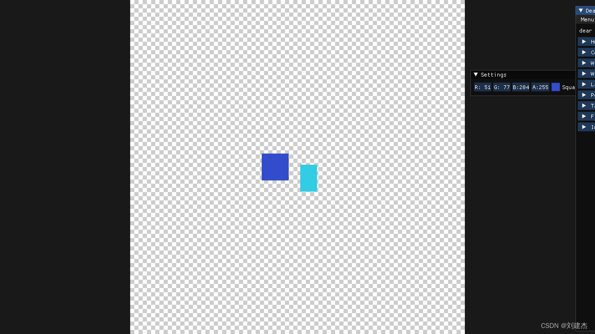

# 游戏引擎笔记

## opengl 和glfw 以及 glad的关系

OpenGL

首先，OpenGL是一个开放的图形库，用于渲染2D和3D的图形。它只是一种标准或规范，具体的实现是由驱动开发商针对特定显卡实现的。因此，OpenGL本身并不提供创建窗口或处理用户输入的功能，这就需要用到GLFW库。
GLFW

GLFW是一个专门针对OpenGL的C语言库，它提供了一些渲染物体所需的最低限度的接口。它允许用户创建OpenGL上下文，定义窗口参数以及处理用户输入。简单来说，GLFW负责创建窗口，处理窗口相关的事件（如键盘和鼠标输入），并提供一个OpenGL上下文供你的程序使用。
GLAD

然后，我们有GLAD。由于OpenGL驱动版本众多，它大多数函数的位置都无法在编译时确定下来，需要在运行时查询。所以任务就落在了开发者身上，开发者需要在运行时获取函数地址并将其保存在一个函数指针中供以后使用。取得地址的方法因平台而异,代码非常复杂，而且很繁琐，我们需要对每个可能使用的函数都要重复这个过程。幸运的是，有些库能简化此过程，其中GLAD是目前最新，也是最流行的库。GLAD是用来管理OpenGL的函数指针的，所以在调用任何OpenGL的函数之前我们需要初始化GLAD。GLAD也可以使OpenGL基础渲染变得简单。


## 1. 代码的整体架构

因为一个人构建出 unreal 之类的肯定不现实。我们会聚焦于构建我们需要的最小的基础框架，先能够运行，然后我们会不停迭代、增强、增加更多特性、提高稳定性、更好的性能和优化，和其他之类的事情。我们不会一开始就尝试去写百分百完美的强大的可扩展的代码，因为那会花费我们一年的时间来最终获得一个窗口应用程序。

那么下面就来讨论一下一个游戏引擎需要些什么（只是看看要包括些什么，并不是实现的顺序）。

第一点要做的是需要一个入口点：Entry Point。一个入口点本质上就是当我们希望我们的应用程序或者游戏使用这个引擎启动的时候会发生什么。这是很多人会忽视的东西。比如是什么控制了 main 函数？什么控制了main函数的代码执行？是客户端控制的？或者游戏控制的？或者是某些东西，比如是引擎实际控制的？或者我们可能用宏实现，或者导入什么东西。

之后要有一个 Application Layout （应用层）：处理程序的生命周期和事件之类的东西的那部分代码。比如说我们的主循环，也就是保持我们的程序运行和渲染的那个循环，也就是保持时间流动的那个循环。也就是执行(驱动)我们的游戏希望执行的全部代码的那个循环。关于事件比如改变窗口大小或者关闭窗口，或者输入事件，比如鼠标或者键盘，所有这些东西都要在应用层处理。我们需要一种方式来让我们的游戏或者引擎作为一个实际的应用程序运行在任何可能要运行的平台上，这就是应用层要解决的。

接下来需要一个 Window Layout （窗口层）。然后在这一层里面我们要处理 input （输入）和 event （事件）。由于输入可以放到事件里面（输入事件），所以我们的事件管理系统会处理输入事件，从我们的窗口和应用程序捕获输入事件。事件管理系统也会是非常重要的东西，我们需要构建一个非常基础的消息和广播系统。基础的意思是说只要，我们应用程序内的某些层可以订阅事件。并且当事件发生的时候，可以从应用层的堆栈获得通知。当事件传播到那些层的时候，那些层可以选择是否要把事件传播到哪些东西，就像一个所有者系统。某种程度上它就是一个基础的消息系统。当事件发生的时候，我们可以中断，或者不是真的中断。总之事件发生的时候，然后我们会得到通知，本质上就是因为我们的 onEvent() 函数会被调用。

然后是渲染器 Render ，可能会是我们需要处理的最大的系统之一。渲染器就是实际渲染图形到屏幕上的那个东西。

接下来是 Render API abstraction 。最开始我们只会用 OpenGL ，之后还需要各种 API 。我们要把所有的东西设置成API无关的，这样新增一种 API 就不是完全重写。显然有的东西不得不是API独特的，比如我们可以就写一个叫 “上载纹理” 的函数，然后为四种API各做一个实现不同，因为我们创建渲染器的方式会因为API而不同。因为如果你用Vulkan的方式，相比于使用OpenGL的方式做特定的事情的时候vulkan可能会更高效。因此我们仍然需要写两份代码，而不是把每个 OpenGL 的函数拷贝一份然后。。。

接着是 Debugging Support 调试支持。就比如日志系统，那可以是很简单的东西。还有比如性能，为此我们需要一种分析系统，我们希望应用程序能有一种潜在的方式，运行一种在 VisualStudio 设置之外的特殊的模式。我们希望应用程序能够自己运行调试，因此可以运行在任何平台上。而不用担心，运行特定平台可用的特定工具。我们希望把工具代码插入到自己的代码中，但是（工具代码）只在调试模式下运行。可以为每个函数计时并且汇总成好看的视图，任何也许用某种工具查看之类的。

然后还希望有一些 Scripting 脚本，比如 Lua 或者 C# 或者 Python 之类的。需要脚本语言，避免完全使用 C++。我们可以像艺术家和内容创造者那样轻松地写高级脚本语言而不用担心内存的问题。

还有 Memory System 内存系统。需要管理好资源。以及调试内存之类的。

还需要实体组件系统（ECS，Entity Component System）。这是一种让我们能在世界创建游戏对象的模块化的方式。比如让世界里的每个独立实体或游戏对象能包含特定的组件或系统，因此我们能定义行为以及动作的具体细节。它就是一种让我们能定义引擎要对实体做的事情的方式。

还需要 Physics Solution 物理解算。

还有 File I/O ，VFS（虚拟文件系统）

还有Build System 构建系统，把3D模型或材质需要能转换为自定义格式，那是为我们的引擎优化的格式。所以不用在运行时浪费时间转换格式，因为我们可以离线处理。热交换资产，希望比如开着 PS 在纹理上画了一些东西，按下 Ctrl + S，我们希望在运行时构建系统捕获然后实时地重新构建导入游戏，所以我们能更新东西，甚至比如3D模型，调整一些顶点或者进行某种修改，然后就热交换到引擎里。所以我们能在游戏运行时修改，这不是一个非常重要的系统，现在可能不值得讨论。

不过暂时我们只支持Windows只支持OpenGL。我们的C++代码文件里不会包含任何Windows代码，比如 Win32 API 代码。因为显然引擎要在未来支持其他的平台。所以会抽象那些东西，保证平台或渲染API独特的代码分散在它自己的文件里。在其他平台或者渲染API的时候它们不会被编译。

## 2. github,VS的项目设置

这一节我们要设置好所有东西：Github仓库、Visual Studio 解决方案和项目、依赖配置，然后我们要链接项目到一期，做一个屏幕上打印 Hello World 的简单程序。但是会为我们的游戏引擎组织好结构和配置。

GitHub上建立好工程，选择 Apache-2.0 License ，具体选什么 License 可以看下面这个图：


然后在 VS 中创建好工程，并且 git clone 一下：（这里因为文件夹非空会有冲突，所以我们先创建到 Git 文件夹中，但是关心的是里头的内容，然后选择复制粘贴出来）


​		这里我们把引擎选择编译成一个 DLL ，然后外部链接上最终的 exe ，选择 DLL 的原因是我们可以自己选择加载或者卸载 DLL ，主要的原因是我们会有很多依赖，我们会需要链接很多库到引擎里。如果用静态库的话，我们的所有的静态库都会被链接到游戏里面，我们的引擎依赖那些库，如果使用静态库的话，那些需要链接到引擎的库文件实际上全部会链接到游戏。用DLL的话基本上就像一个exe文件，所以我们可以把所有东西都链接到那个DLL，然后我们的游戏只会依赖那一个单独的包含了全部需要的内容的DLL文件，而不是无数的其他的库文件。

​		所以本质上我们要做的，就是把所有的依赖都链接到那个引擎的DLL文件，这意味着它们都需要是静态库。我们需要做的就是，把所有静态库链接到引擎DLL然后把引擎DLL链接到游戏。
我们不希望管 x86 32位的平台，所以直接remove掉：


然后我们这样配置 VS ：


output 为：$(SolutionDir)bin\$(Configuration)-$(Platform)\$(ProjectName)\
intermediate 为：$(SolutionDir)bin-int\$(Configuration)-$(Platform)\$(ProjectName)\

这样输出的 HEngine.dll 就会在 \bin\debug-x64\HEngine\HEngine.dll 了。中间文件这样设置是想不放在 bin 文件夹中，这样我们就能直接复制粘贴 bin 文件夹而不要中间文件了。

然后 Solution -> Add -> New Proj ：


然后新的Proj一样的设置：


 接着我们关闭 Solution，在文件夹中查看这个 sln 文件：


打开的话源码会是这样的：


我们改一下顺序，把 Sandbox 提前：


这样别人查看的时候 Sandbox 就会自动成为启动项目，而不是 HEngine 了。

而在我们的文件中有 .vs 来记录一些用户的设置，比如谁是启动文件之类的：


然后 Sandbox 添加 reference ：


而 VS 在编译 dll 文件时，会一起生成 dll 和 lib，lib 文件会包含所有那个dll文件导出的函数，因此我们就不需要手动从dll文件加载函数或者符号了。同时也会生成包含实际机器码和其他链接内容的dll文件。因此我们可以静态链接 HEngine.lib 到sandbox.exe但是运行时需要dll文件。 


其中的lib文件被链接到我们的sandbox中，这样它就知道哪些函数是可用的，以及它们在dll中的位置。

但是现在我们仍然不能直接运行，因为还没设置dll的查找路径，所以我们手动贴一下（把HEngine.dll帖到下面这里来）：


## 3. 程序的入口点和.gitignore的编写

上一节我们的 Sandbox 的项目的 Application.cpp是这样写的：

```cpp
namespace HEngine
{
	__declspec(dllimport) void Print();
}

void main()
{
	HEngine::Print();
}
```

这意味着 main 函数是由 Application 定义的，但是引擎的入口应该由引擎负责定义，我们希望这些是由引擎端控制的。我们要在 Sandbox 项目里创建一个 Application 类，来定义和启动我们的应用程序。我们还要把 __declspec(dllimport) 和 __declspec(dllexport) 写到宏里，然后我们可以重用头文件。

同时最终我们再手动写一个 gitignore。

这里说下如何将代码提交到github。

在工作目录通过gitstatus命令来查看跟踪的文件或者未跟踪的文件


在工作目录下编写一个.gitignore文件来对不需要添加的文件或者目录进行忽略：


git reset .命令可以撤销当前文件夹添加的跟踪文件，git add *将所有文件添加跟踪，git commit -m "..."将文件添加到本地，git push origin master将代码上传到远程代码库。

## 4.日志模块的添加

日志就是我们记录事件的一种方式。这里的事件不只是字面意义，因为事件可以是任何东西。

我们要写一个日志库。日志最大的议题是格式化不同的类型。只是打印一个字符串很简单，但是我们希望能打印的不只是文本，所以需要一种好的格式化方式，不定参的格式化。

总之，我们要使用一个叫 spdlog 的库：https://github.com/gabime/spdlog

C++没有定义导入和使用库的方法。很多时候基本上就是选择一个你想用的构建系统，比如 CMake 或者 Premake 之类的。然后保证你使用的每个库写到构建系统里。像这样你可以更新和维护它。或者用 git-submodule 添加它们，如果你用 GitHub 就可以用 git-submodule ，这可能是最好的方式。

我们要做的就是添加一个 .gitmodules 文件，然后我们实际克隆 HEngine 的时候，也会克隆所有 submodule 。这很有用，因为可以持有一个版本的完整代码。

我们在命令行里输入：`$ git submodule add https://github.com/gabime/spdlog HEngine/vendor/spdlog`


同时也会自动帮我们生成一个 .gitmodules 文件：


但是毕竟是我们的引擎，我们希望 HEngine::Log 而不是 spdlog::log，于是我们在引擎中创建了一个Log类。我们要做的是创建两个控制台，一个客户端的，一个引擎的，一个叫 Core，一个叫 App。

这里需要注意的是头文件的顺序：


如果日志模块写在了引用它模块的下面，将会导致编译错误，entryPoint引用了日志模块，因此，日志的引用必须在它之前。

尽管SandBox模块引入了Hazel.h头文件，但是在编译log.h文件时，里面的包含头文件它并没有包含，因此在SandBox中也需要加入日志模块的相关头文件路径。


## 5. Premake Game Engine Series

本期会讨论CMake之类的构建问题。首先是为什么需要项目生成，而不是直接VS呢？主要就是不同平台的问题了。

我们要用的是 Premake：https://github.com/premake/premake-core/releases

不用CMake是Cherno个人不喜欢。Premake是用lua来写，而且用起来很简单。

然后我们写 premake5.lua ：


 这里release未必是发行版本，Dist才是完全的发行版本；release就是一个更快的Debug比如去掉一些日志啥的来测试。


这里两个星号意思是递归搜索文件夹、子文件夹

我们可以使用过滤器，即平台又配置可以这样：


 最后我们用命令行生成：`vendor\bin\premake\premake5.exe vs2019`

```lua
workspace "Hazel"
	architecture"x64"

	configurations
	{
		"Debug",
		"Release",
		"Dist"
	}

outputdir = "%{cfg.buildcfg}-%{cfg.system}-%{cfg.architecture}"

buildcfg代表我们的是发布还是调试，system代表我们的系统是mac还是windows，archittecture代表我们是x64还是32的

location代表我们相对路径的当前目录
shadredlib代表我们是动态库
targetdir代表我们二进制文件的输出目录，等于我们把所有东西都放在bin/debug-windows-x64/Hazel
objdir带我们的中间文件的输出目录
project "Hazel"
	location "Hazel"
	kind "SharedLib"
	language "C++"

	targetdir("bin/" .. outputdir .. "/%{prj.name}")
	objdir("bin-int/" .. outputdir .. "/%{prj.name}")

	递归读取所有的cpp和h文件
	files
	{
		"%{prj.name}/src/**.h",
		"%{prj.name}/src/**.cpp"
	}
	包含头文件路径
	includedirs
	{
		"%{prj.name}/vendor/spdlog/include"
	}

	filter说明它只适用于所选的系统
	staticruntim这和静态库链接相关
	filter "system:windows"
		cppdialect "C++17"
		staticruntim "On"
		systemversion "latest"
		
		定义宏
		defines
		{
			"HZ_PLATFORM_WINDOWS",
			"HZ_BUILD_DLL"
		}

		在hazel中进入bin目录并复制hazel.dll到sandbox中
		postbuildcommands
		{
			("{COPY} %{cfg.buildtarget.relpath} ../bin/" .. outputdir .. "/Sandbox")
		}

	filter "configurations:Debug"
		defines "HZ_DEBUG"
		symbols "On"

	filter "configurations:Debug"
		defines "HZ_RELEASE"
		symbols "On"

	filter "configurations:Debug"
		defines "HZ_DIST"
		symbols "On"
	
project "Sandbox"
	location "Sandbox"
	kind "ConsoleApp"
	language "C++"

	targetdir("bin/" .. outputdir .. "/%{prj.name}")
	objdir("bin-int/" .. outputdir .. "/%{prj.name}")

	files
	{
		"%{prj.name}/src/**.h",
		"%{prj.name}/src/**.cpp"
	}
	includedirs
	{
		"Hazel/vendor/spdlog/include",
		"Hazel/src"
	}

	需要链接的项目
	links
	{
		"Hazel"
	}

	filter "system:windows"
		cppdialect "C++17"
		staticruntim "On"
		systemversion "10.0"
		
		defines
		{
			"HZ_PLATFORM_WINDOWS"
		}

	filter "configurations:Debug"
		defines "HZ_DEBUG"
		symbols "On"

	filter "configurations:Debug"
		defines "HZ_RELEASE"
		symbols "On"

	filter "configurations:Debug"
		defines "HZ_DIST"
		symbols "On"
```

## 6. 事件系统

这一节要写一个事件系统，从而可以处理收到的窗口事件等，比如窗口关闭、改变大小、输入事件等等。

我们不希望 Application 依赖 window，window 类应当完全不知晓 Application，而Application要创建window 。所以我们需要创建一种方法，可以把所有事件发送回到 App，然后 Application 可以处理它们。当窗口中发生了一个事件，window 类会收到一个事件回调，然后它要构造一个 HEngine 事件，然后用某种方法传给 App。

当 App 创建了一个 window 类的时候，同时给 window 类设置一个事件回调，所以每当窗口得到一个事件，它检查回调现在是否为 null ，如果不是 null，就用这些事件数据调用回调。然后 App 会有一个函数叫 onEvent() 接受一个事件的引用，会从 window 调用这个函数。

这些一般被称为阻塞事件，因为当我们处理这些鼠标按下事件的时候，可能直接在栈上构造事件，然后立即调用回调函数。所以当我们处理这个事件的时候，会暂停所有其他事件。因此称为阻塞事件。未来可以创建带缓冲的事件，基本上就是捕获这些信息，在某个地方队列存储，不阻塞其他事件，然后可能每帧遍历事件队列。然后调度和处理它们，而不是在收到事件时立即处理。


对于KeyEvent，第一次是按下事件，之后都是重复事件。

这里我们的公共抽象基类 Event 有这些接口：

```c++
virtual EventType GetEventType() const = 0;
virtual const char* GetName() const = 0;
virtual int GetCategoryFlags() const = 0;
virtual std::string ToString() const { return GetName(); }

```

然后我们通过两个宏来实现：

```c++
#define EVENT_CLASS_TYPE(type) static EventType GetStaticType() { return EventType::##type; }\
								virtual EventType GetEventType() const override { return GetStaticType(); }\
								virtual const char* GetName() const override { return #type; }

#define EVENT_CLASS_CATEGORY(category) virtual int GetCategoryFlags() const override { return category; }

```

GetStaticType 是想直接通过 Event 名字就获取到它的类型，又搞了一个成员函数 GetEventType，主要是想通过 Event 指针来拿到事件的类型实现多态的目的，后面的 GetName 就是调试的目的了。

## 7. 添加预编译头文件

VS 预编译头需要一个 include 预编译头文件的源文件，而 GCC 和 Clang 则不需要。

premake5.lua 只需要新增这两行：

```cpp
pchheader "hepch.h"
pchsource "HEngine/src/hepch.cpp"
```

其中 pchsource 只有在为 vs 才会需要，相当于 vs 中的use pch和create pch

## 8. 窗口抽象化并添加GLFW模块

当目前为止我们起码有了 日志 和 事件 系统，在 Cherno 看来这是创建窗口之前必须的。

我们之前说过 glfw ，一个跨平台的库，然而可能最终我们还是要上 win32 api，因为glfw不能支持dx，然而dx是由Windows开发，在Windows上运行时显然会比其他 API 都要好。

所以此时我们必须思考要如何进行抽象。Cherno 的选择是，为每个平台实现一个窗口类。（当然 glfw 已经是一种平台抽象的方式了，然而未来在 windows 我们要切换到使用 win32 api）

基本上平台抽象我们要建一个 Platform 文件夹，然后在其中再建一个 Windows 文件夹之类的，之后可能还会加 Linux、Mac 之类的，在 Platform 文件夹中也会放渲染 API 独特的代码，比如 OpenGL、DirectX、Vulkan、Metal 之类的东西也会收在里面。

我们甚至可能会有一个 POSIX 文件夹，放 Linux、Mac、Android 相关的相同的代码。

用一下命令下载GLFW:

    git submodule add https://github.com/glfw/glfw HEngine/vendor/GLFW

但是在这里我们的 GLFW 也需要构建成一个 project，于是我们 fork 一下原 GLFW 仓库，然后加一个 premake5.lua

关于删去 gitsubmodule 的内容：https://stackoverflow.com/questions/12898278/issue-with-adding-common-code-as-git-submodule-already-exists-in-the-index

## 9. 将事件系统添加到应用程序中

这里事件回调有点晕，梳理一下：

首先是有一个抽象接口 Window 类，我们写在 src \ HEngine \ Window.h 中，其中有一个函数 static Window* Create(const WindowProps& props = WindowProps());，用来让各个平台予以实现，其中 WindowProps 是一个包含窗口属性（window properties）的结构体：

```c++
struct WindowProps
{
	std::string Title;
	unsigned int Width;
	unsigned int Height;

	WindowProps(const std::string& title = "HEngine",
		unsigned int width = 1280,
		unsigned int height = 720)
		: Title(title), Width(width), Height(height)
	{
	}
};
```

于是乎，在我们的框架中，Application 类中加一个成员：`std::unique_ptr<Window> m_Window;`，那么在它的构造函数中我们只需要调用Create方法就好了:

```c++
Application::Application()
{
	m_Window = std::unique_ptr<Window>(Window::Create());
	m_Window->SetEventCallback(HE_BIND_EVENT_FN(Application::OnEvent));
}
```

注意，我们之前的 Create 方法只是在 Window 类中声明了，但是其真正链接的时候是在 WindowsWindow.cpp （位于 src \ Platform \ Windows）中的：

```c++
Window* Window::Create(const WindowProps& props)
{
	return new WindowsWindow(props);
}
```

我想在之后我们会用宏去判断，应该是链接到那个平台的实现。现在由于只有Windows平台，就直接写了。

以上是窗口的创建，那么事件是如何回调的呢？

在`void WindowsWindow::Init(const WindowProps& props)`方法中，首先是要glfw的窗口初始化，这里我们使用了：

```c++
glfwSetWindowUserPointer(m_Window, &m_Data);
```

而 m_Window 是由函数 glfwCreateWindow 创建的 GLFWwindow 窗口，m_Data 则是 WindowsWindow 类中的成员，类型为我们自定义的结构体：

```c++
struct WindowData
{
	std::string Title;
	unsigned int Width, Height;
	bool VSync;

	EventCallbackFn EventCallback;
};
```

这一行其实就是让窗口内部的userPointer指向我们的m_Data：window->userPointer = pointer;，那么之后我们就可以使用代码：
WindowData& data = *(WindowData*)glfwGetWindowUserPointer(window);

通过上面这个代码，我们就可以直接从窗口拿到我们自定义的窗口数据，此为回调的基础。

注意我们的窗口数据有一个成员：EventCallbackFn EventCallback;，此为回调函数：using EventCallbackFn = std::function<void(Event&)>;

而要对事件处理，首先自然有一个事件的抽象基类 Event ，其对应的处理类为 EventDispatcher ：

```c++
class EventDispatcher
{
	template<typename T>
	using EventFn = std::function<bool(T&)>;
public:
	EventDispatcher(Event& event)
		: m_Event(event)
	{
	}

	template<typename T>
	bool Dispatch(EventFn<T> func)
	{
		if (m_Event.GetEventType() == T::GetStaticType())
		{
			m_Event.m_Handled = func(*(T*)&m_Event);
			return true;
		}
		return false;
	}
private:
	Event& m_Event;
};
```

如上，其中有成员 Event，还有对应的处理函数 Dispatch，Dispatch 接收一个函数，然后在内部进行处理（先判断一下这个函数是不是处理咱们的内部事件的）。这里我们直接转换为模板参数T的类型，因为我们在if中已经判断好了，就不用较慢的 dynamic_cast 了。

那么各种事件是如何进行交互回调的呢？

**比如我们鼠标移动，要在控制台打印，它会这样做到：**

1. 我们的 OnUpdate 函数，其内部会进行 glfw 的事件判断：glfwPollEvents

```c++
void WindowsWindow::OnUpdate()
{
	glfwPollEvents();
	glfwSwapBuffers(m_Window);
}
```

2. 对鼠标移动的事件，在我们的窗口类 WindowsWindow 的构造函数中就已经写好对应的 glfw 回调方法：`glfwSetCursorPosCallback`：

```c++
glfwSetCursorPosCallback(m_Window, [](GLFWwindow* window, double xPos, double yPos)
{
	WindowData& data = *(WindowData*)glfwGetWindowUserPointer(window);

	MouseMovedEvent event((float)xPos, (float)yPos);
	data.EventCallback(event);
});
```

3. 注意到，我们的方法中都有这么一行：data.EventCallback(event);，而 data 是我们之前所述的，通过 window 的 UserPointer 获取得到的，是我们自定义的类型 WindowData，内部有回调函数 EventCallback（通过 std::function<void(Event&)> 封在闭包内），从而通过这个回调函数来进行事件的处理。

4. 这个回调函数我们是在 Application 的构造函数中就设定好的，就为我们实现的 OnEvent 函数：

   ```c++
   Application::Application()
   {
   	m_Window = std::unique_ptr<Window>(Window::Create());
   	m_Window->SetEventCallback(HE_BIND_EVENT_FN(Application::OnEvent));
   }
   ```

   ```c++
   void Application::OnEvent(Event& e)
   {
   	EventDispatcher dispatcher(e);
   	dispatcher.Dispatch<WindowCloseEvent>(HE_BIND_EVENT_FN(Application::OnWindowClose));
   
   	HE_CORE_TRACE("{0}", e);
   }
   ```

   可以看到，这个函数的最后会调用 `HE_CORE_TRACE("{0}", e);`，这是我们引擎中日志打印的方法。能够对事件生效是因为我们写了如下重载:

   ```c++
   inline std::ostream& operator<<(std::ostream& os, const Event& e)
   {
   	return os << e.ToString();
   }
   ```

   而 ToString 则是一个多态函数，每个我们写的 Event 事件都会 override 实现这个函数。

   同时我们发现，OnEvent 中还有一个 EventDispatcher 来对事件进行特定的处理，比如我们想实现关闭窗口，对应我们写的事件为 WindowCloseEvent，并且写下对应的处理函数：

   ```c++
   bool Application::OnWindowClose(WindowCloseEvent& e)
   {
   	m_Running = false;
   	return true;
   }
   ```

   这里的 HE_BIND_EVENT_FN 实现为 #define HE_BIND_EVENT_FN(fn) std::bind(&fn, this, std::placeholders::_1)，所以这一行实际上是把 OnWindowClose 先绑定好 this 指针，剩下一个参数就是 WindowCloseEvent，这个参数需要与 Dispatch 的模板参数对应，然后就会通过这个传入的函数去执行事件的处理了。

## 10. 添加图层

我们现在是有一个 App 框架，里头的 Run 会不断进行游戏循环。

那么这一讲的 Layer 层系统，我们希望在进行游戏循环的时候，每个被启用的层（Layer）都会按照层栈顺序更新。通过这种更新循环，可以在层上进行渲染。显然因为层栈是有顺序的，这很重要。意味着你可以把层放在其他层的上面，这会决定绘制顺序。层栈对于构建、覆层系统也很有用。覆层能让你把层推至层栈的后半部分。

基本上就是说，我们有一个连续的层列表，但是覆层总会在列表的最后，因此总在最后渲染。

但是在进行事件的时候，比如角色开枪，其点击了一下屏幕的按钮，我们希望这个事件直接被按钮处理了，而不是传播到之后的开枪处理中。因此我们要有正向遍历列表和反向遍历列表——正向遍历列表来渲染、更新等等，然后反向遍历来处理事件。 反向的意思是说从最上层开始向下处理，而不是像渲染一样自底向上。

这里我们的 Layer 是这样的：


```c++
class HENGINE_API Layer
{
public:
	Layer(const std::string& name = "Layer");
	virtual ~Layer();

	virtual void OnAttach() {}
	virtual void OnDetach() {}
	virtual void OnUpdate() {}
	virtual void OnEvent(Event& event) {}

	inline const std::string& GetName() const { return m_DebugName; }
protected:
	std::string m_DebugName;
};

```

当层推入层栈，成为程序的一部分时，被 Attached （链接）。当层被移除时，Detach（分离）。基本上和 OnInit 和 OnShutdown 差不多。OnUpdate 则是在层更新时由 Application 调用，应该每帧调用一次。OnEvent，当层得到事件时，我们从这里接收。这些都是虚函数，所以可以在创建自己的层时 override

LayerStack 代码如下：

```c++
class HENGINE_API LayerStack
{
public:
	LayerStack();
	~LayerStack();

	void PushLayer(Layer* layer);
	void PushOverlay(Layer* overlay);
	void PopLayer(Layer* layer);
	void PopOverlay(Layer* overlay);

	std::vector<Layer*>::iterator begin() { return m_Layers.begin(); }
	std::vector<Layer*>::iterator end() { return m_Layers.end(); }
private:
	std::vector<Layer*> m_Layers;
	std::vector<Layer*>::iterator m_LayerInsert;
};

```

注意我们搞了一个 overlay，这个 overlay 就是刚刚说的覆层。实现如下：

```c++
LayerStack::LayerStack()
{
	m_LayerInsert = m_Layers.begin();
}

LayerStack::~LayerStack()
{
	for (Layer* layer : m_Layers)
		delete layer;
}

void LayerStack::PushLayer(Layer* layer)
{
	m_LayerInsert = m_Layers.emplace(m_LayerInsert, layer);
}

void LayerStack::PushOverlay(Layer* overlay)
{
	m_Layers.emplace_back(overlay);
}

void LayerStack::PopLayer(Layer* layer)
{
	auto it = std::find(m_Layers.begin(), m_Layers.end(), layer);
	if (it != m_Layers.end())
	{
		m_Layers.erase(it);
		m_LayerInsert--;
	}
}

void LayerStack::PopOverlay(Layer* overlay)
{
	auto it = std::find(m_Layers.begin(), m_Layers.end(), overlay);
	if (it != m_Layers.end())
		m_Layers.erase(it);
}

```

也就是说，推入一个 layer，就想正常地 push 进去，通过类中的迭代器m_LayerInsert放入，m_LayerInsert也就是正常 layer 的最后一个位置；而要是是 overlay ，我们就不需要管迭代器 m_LayerInsert 的位置，而是直接 emplace_back 进去，因此 LayerStack 中的排列像是这样 ： layer layer overlayer overlayer ，而 m_LayerInsert 就应该指向这里第二个 layer 的位置，即最后一个非 overlayer 的 layer。

## 11. 添加GLAD库

现在大多数采用 glad 获取一堆 glxxx 函数的函数指针。用 glfw 管理操作系统的窗口管理器给到的 framebuffer，然后OpenGL 在上面画画的方式。

GLAD GitHub：https://github.com/Dav1dde/glad
在线生成服务：https://glad.dav1d.de/

对于Cherno而言（UI）是在游戏引擎或是任何图形项目中第一个要设置的，因为这可以同时显示信息和调整参数。比如 Cherno 不希望每次都重新编译来调整一个参数，只要在屏幕上有个滑条就好。

为了能让 IMGUI 工作，以及我们实现的前瞻性规划，我们首先要能使用现代OpenGL。

基本上我们需要一种方式，从显卡驱动加载所有的现代OpenGL的函数，到C++代码中。因此我们能调用存储于图形驱动程序的函数。

在 OpenGL 系列中我们使用了 GLEW（OpenGL Extension Wrangler），这里要用 GLAD（相比GLEW更好更现代）。

我们将首先在网站上配置好它，下载，然后添加为一个单独的项目，添加项目premake文件，提交到我们的存储库。因此不会像之前 GLFW 以及未来的 IMGUI 一样，要fork其他的存储库。


Generate 后，点 glad.zip 下载，然后就有了我们需要的所有东西。

随后添加 glad 进premake管理，然后在glfw窗口初始化的时候添加这一行调用 gladLoadGLLoader ：


## 12. 添加imGui库

这里要做的事被称为 “hack” 。

编写软件的其中一种方式是，第一件事是 make it work，第二件事是 make it correct，最后一件事是 make it fast。所以我们要让它运行起来，用奇技淫巧，因为我希望在屏幕上看到 IMGUI。

正确方法是合理抽象，以替代原始的 OpenGL 函数调用。（原始调用是我们今天要做的）我们希望整个 IMGUI 依赖 HEngine 而不是原始的 OpenGL api。因为我们还没用渲染器，那些的前提是首先要有一个渲染器。但我们希望在有渲染器之前就加入 IMGUI 因而我们能在编写渲染器的时候调试，这样就会方便很多。

Dear ImGui主要用于程序员的图形Debug工具(类似于Unity的ImGUI)，举个例子，如果没有ImGUI，要调整好一个参数，要反复在代码里面修改数值，然后编译运行项目查看效果，这样很麻烦，而通过ImGui，就可以实现直接在图形界面调试参数的功能。虽然这玩意儿的性能不足以用于runtime的实际游戏，但是先凑合用着吧。

imgui的编写premake方法与之前相同。

github地址： https://github.com/TheCherno/imgui 

用命令添加子模块：git submodule add https://gitclone.com/github.com/TheCherno/imgui Hazel/vendor/imgui

怎么使用ImGui的代码

ImGui的代码仓库里给了两种代码：

​	一种是源代码，Hazel需要引用这部分代码，作为库文件，类似于引用GLFW和Glad库文件项目一样
​	一种是使用ImGui的源代码的examples代码，就是教你怎么调用的

对于第一种代码，为其生成一个premake5.lua文件，然后为其生成一个Project即可，如下图所示：


至于具体怎么在Hazel里用，就需要参考ImGui的例子代码了，由于我们用的是glfw库加上OpenGL3的版本，所以要参考的两个cpp文件为：imgui_impl_opengl3.cpp和imgui_impl_glfw.cpp

以下是imgui_impl_glfw.cpp的部分代码，可以看到基本是ImGui把glfw库的很多函数和功能封装到了ImGui自己的类中：

```c++
static GLFWwindow*          g_Window = NULL;    // Main window
static bool ImGui_ImplGlfw_Init(GLFWwindow* window, bool install_callbacks, GlfwClientApi client_api)
{
    g_Window = window;
    g_Time = 0.0;

    // Setup backend capabilities flags
    ImGuiIO& io = ImGui::GetIO();
    io.BackendFlags |= ImGuiBackendFlags_HasMouseCursors;         // We can honor GetMouseCursor() values (optional)
    io.BackendFlags |= ImGuiBackendFlags_HasSetMousePos;          // We can honor io.WantSetMousePos requests (optional, rarely used)
    io.BackendPlatformName = "imgui_impl_glfw";

    // Keyboard mapping. ImGui will use those indices to peek into the io.KeysDown[] array.
    io.KeyMap[ImGuiKey_Tab] = GLFW_KEY_TAB;
    io.KeyMap[ImGuiKey_LeftArrow] = GLFW_KEY_LEFT;
    io.KeyMap[ImGuiKey_RightArrow] = GLFW_KEY_RIGHT;
    io.KeyMap[ImGuiKey_UpArrow] = GLFW_KEY_UP;
    io.KeyMap[ImGuiKey_DownArrow] = GLFW_KEY_DOWN;
    io.KeyMap[ImGuiKey_PageUp] = GLFW_KEY_PAGE_UP;
    io.KeyMap[ImGuiKey_PageDown] = GLFW_KEY_PAGE_DOWN;
    io.KeyMap[ImGuiKey_Home] = GLFW_KEY_HOME;
    io.KeyMap[ImGuiKey_End] = GLFW_KEY_END;
    io.KeyMap[ImGuiKey_Insert] = GLFW_KEY_INSERT;
    io.KeyMap[ImGuiKey_Delete] = GLFW_KEY_DELETE;
    io.KeyMap[ImGuiKey_Backspace] = GLFW_KEY_BACKSPACE;
    io.KeyMap[ImGuiKey_Space] = GLFW_KEY_SPACE;
    io.KeyMap[ImGuiKey_Enter] = GLFW_KEY_ENTER;
    io.KeyMap[ImGuiKey_Escape] = GLFW_KEY_ESCAPE;
    io.KeyMap[ImGuiKey_KeyPadEnter] = GLFW_KEY_KP_ENTER;
    io.KeyMap[ImGuiKey_A] = GLFW_KEY_A;
    io.KeyMap[ImGuiKey_C] = GLFW_KEY_C;
    io.KeyMap[ImGuiKey_V] = GLFW_KEY_V;
    io.KeyMap[ImGuiKey_X] = GLFW_KEY_X;
    io.KeyMap[ImGuiKey_Y] = GLFW_KEY_Y;
    io.KeyMap[ImGuiKey_Z] = GLFW_KEY_Z;

    io.SetClipboardTextFn = ImGui_ImplGlfw_SetClipboardText;
    io.GetClipboardTextFn = ImGui_ImplGlfw_GetClipboardText;
    io.ClipboardUserData = g_Window;
#if defined(_WIN32)
    io.ImeWindowHandle = (void*)glfwGetWin32Window(g_Window);
#endif

    // Create mouse cursors
    // (By design, on X11 cursors are user configurable and some cursors may be missing. When a cursor doesn't exist,
    // GLFW will emit an error which will often be printed by the app, so we temporarily disable error reporting.
    // Missing cursors will return NULL and our _UpdateMouseCursor() function will use the Arrow cursor instead.)
    GLFWerrorfun prev_error_callback = glfwSetErrorCallback(NULL);
    g_MouseCursors[ImGuiMouseCursor_Arrow] = glfwCreateStandardCursor(GLFW_ARROW_CURSOR);
    g_MouseCursors[ImGuiMouseCursor_TextInput] = glfwCreateStandardCursor(GLFW_IBEAM_CURSOR);
    g_MouseCursors[ImGuiMouseCursor_ResizeNS] = glfwCreateStandardCursor(GLFW_VRESIZE_CURSOR);
    g_MouseCursors[ImGuiMouseCursor_ResizeEW] = glfwCreateStandardCursor(GLFW_HRESIZE_CURSOR);
    g_MouseCursors[ImGuiMouseCursor_Hand] = glfwCreateStandardCursor(GLFW_HAND_CURSOR);
#if GLFW_HAS_NEW_CURSORS
    g_MouseCursors[ImGuiMouseCursor_ResizeAll] = glfwCreateStandardCursor(GLFW_RESIZE_ALL_CURSOR);
    g_MouseCursors[ImGuiMouseCursor_ResizeNESW] = glfwCreateStandardCursor(GLFW_RESIZE_NESW_CURSOR);
    g_MouseCursors[ImGuiMouseCursor_ResizeNWSE] = glfwCreateStandardCursor(GLFW_RESIZE_NWSE_CURSOR);
    g_MouseCursors[ImGuiMouseCursor_NotAllowed] = glfwCreateStandardCursor(GLFW_NOT_ALLOWED_CURSOR);
#else
    g_MouseCursors[ImGuiMouseCursor_ResizeAll] = glfwCreateStandardCursor(GLFW_ARROW_CURSOR);
    g_MouseCursors[ImGuiMouseCursor_ResizeNESW] = glfwCreateStandardCursor(GLFW_ARROW_CURSOR);
    g_MouseCursors[ImGuiMouseCursor_ResizeNWSE] = glfwCreateStandardCursor(GLFW_ARROW_CURSOR);
    g_MouseCursors[ImGuiMouseCursor_NotAllowed] = glfwCreateStandardCursor(GLFW_ARROW_CURSOR);
#endif
    glfwSetErrorCallback(prev_error_callback);

    // Chain GLFW callbacks: our callbacks will call the user's previously installed callbacks, if any.
    g_PrevUserCallbackMousebutton = NULL;
    g_PrevUserCallbackScroll = NULL;
    g_PrevUserCallbackKey = NULL;
    g_PrevUserCallbackChar = NULL;
    if (install_callbacks)
    {
        g_InstalledCallbacks = true;
        g_PrevUserCallbackMousebutton = glfwSetMouseButtonCallback(window, ImGui_ImplGlfw_MouseButtonCallback);
        g_PrevUserCallbackScroll = glfwSetScrollCallback(window, ImGui_ImplGlfw_ScrollCallback);
        g_PrevUserCallbackKey = glfwSetKeyCallback(window, ImGui_ImplGlfw_KeyCallback);
        g_PrevUserCallbackChar = glfwSetCharCallback(window, ImGui_ImplGlfw_CharCallback);
    }

    g_ClientApi = client_api;
    return true;
}
```

接下来在Platform文件夹下，创建OpenGL文件夹：

​		把imgui_impl_opengl3的头文件和源文件放进去，更名为ImGuiOpenGLRenderer，用来存放ImGui调用OpenGL的代码。
而原本用到的imgui_impl_glfw相关内容，就直接Copy和Paste到ImGuiLayer里。

这里我们添加一个ImGUILayer类，它主要用于我们debug：


借鉴例子代码，Copy到这个类即可：

```c++
#include "hzpch.h"
#include "ImGuiLayer.h"
#include "imgui.h"
#include "GLFW/glfw3.h"
#include "Platform/OpenGL//ImGuiOpenGLRenderer.h"
#include <stdio.h>
#include "Hazel/Application.h"

Hazel::ImGuiLayer::ImGuiLayer()
{
}

Hazel::ImGuiLayer::~ImGuiLayer()
{
}

void Hazel::ImGuiLayer::OnAttach()
{
	ImGui::CreateContext();
	ImGui::StyleColorsDark();

	ImGuiIO& io = ImGui::GetIO();
	io.BackendFlags |= ImGuiBackendFlags_HasMouseCursors;
	io.BackendFlags |= ImGuiBackendFlags_HasSetMousePos;

	// TEMPORARY: should eventually use Hazel key codes
	io.KeyMap[ImGuiKey_Tab] = GLFW_KEY_TAB;
	io.KeyMap[ImGuiKey_LeftArrow] = GLFW_KEY_LEFT;
	io.KeyMap[ImGuiKey_RightArrow] = GLFW_KEY_RIGHT;
	io.KeyMap[ImGuiKey_UpArrow] = GLFW_KEY_UP;
	io.KeyMap[ImGuiKey_DownArrow] = GLFW_KEY_DOWN;
	io.KeyMap[ImGuiKey_PageUp] = GLFW_KEY_PAGE_UP;
	io.KeyMap[ImGuiKey_PageDown] = GLFW_KEY_PAGE_DOWN;
	io.KeyMap[ImGuiKey_Home] = GLFW_KEY_HOME;
	io.KeyMap[ImGuiKey_End] = GLFW_KEY_END;
	io.KeyMap[ImGuiKey_Insert] = GLFW_KEY_INSERT;
	io.KeyMap[ImGuiKey_Delete] = GLFW_KEY_DELETE;
	io.KeyMap[ImGuiKey_Backspace] = GLFW_KEY_BACKSPACE;
	io.KeyMap[ImGuiKey_Space] = GLFW_KEY_SPACE;
	io.KeyMap[ImGuiKey_Enter] = GLFW_KEY_ENTER;
	io.KeyMap[ImGuiKey_Escape] = GLFW_KEY_ESCAPE;
	io.KeyMap[ImGuiKey_A] = GLFW_KEY_A;
	io.KeyMap[ImGuiKey_C] = GLFW_KEY_C;
	io.KeyMap[ImGuiKey_V] = GLFW_KEY_V;
	io.KeyMap[ImGuiKey_X] = GLFW_KEY_X;
	io.KeyMap[ImGuiKey_Y] = GLFW_KEY_Y;
	io.KeyMap[ImGuiKey_Z] = GLFW_KEY_Z;

	ImGui_ImplOpenGL3_Init("#version 410");
	/*
	// 这里的函数，参考了ImGui给的例子：example_glfw_opengl3的文件里的main函数
	IMGUI_CHECKVERSION();
	ImGui::CreateContext();
	ImGui::StyleColorsDark();
	
	ImGuiIO& io = ImGui::GetIO();
	io.BackendFlags |= ImGuiBackendFlags_HasMouseCursors;         // We can honor GetMouseCursor() values (optional)
	io.BackendFlags |= ImGuiBackendFlags_HasSetMousePos;          // We can honor io.WantSetMousePos requests (optional, rarely used)
	// 指定ImGui的IO按键
	// TEMPORARY: 只是暂时这么写，后期需要使用Hazel自己封装的KeyCode类
	io.KeyMap[ImGuiKey_Tab] = GLFW_KEY_TAB;
	io.KeyMap[ImGuiKey_LeftArrow] = GLFW_KEY_LEFT;
	io.KeyMap[ImGuiKey_RightArrow] = GLFW_KEY_RIGHT;
	io.KeyMap[ImGuiKey_UpArrow] = GLFW_KEY_UP;
	io.KeyMap[ImGuiKey_DownArrow] = GLFW_KEY_DOWN;
	io.KeyMap[ImGuiKey_PageUp] = GLFW_KEY_PAGE_UP;
	io.KeyMap[ImGuiKey_PageDown] = GLFW_KEY_PAGE_DOWN;
	io.KeyMap[ImGuiKey_Home] = GLFW_KEY_HOME;
	io.KeyMap[ImGuiKey_End] = GLFW_KEY_END;
	io.KeyMap[ImGuiKey_Insert] = GLFW_KEY_INSERT;
	io.KeyMap[ImGuiKey_Delete] = GLFW_KEY_DELETE;
	io.KeyMap[ImGuiKey_Backspace] = GLFW_KEY_BACKSPACE;
	io.KeyMap[ImGuiKey_Space] = GLFW_KEY_SPACE;
	io.KeyMap[ImGuiKey_Enter] = GLFW_KEY_ENTER;
	io.KeyMap[ImGuiKey_Escape] = GLFW_KEY_ESCAPE;
	io.KeyMap[ImGuiKey_KeyPadEnter] = GLFW_KEY_KP_ENTER;
	io.KeyMap[ImGuiKey_A] = GLFW_KEY_A;
	io.KeyMap[ImGuiKey_C] = GLFW_KEY_C;
	io.KeyMap[ImGuiKey_V] = GLFW_KEY_V;
	io.KeyMap[ImGuiKey_X] = GLFW_KEY_X;
	io.KeyMap[ImGuiKey_Y] = GLFW_KEY_Y;
	io.KeyMap[ImGuiKey_Z] = GLFW_KEY_Z;
	// ImGui为opengl做的初始设置
	ImGui_ImplOpenGL3_Init("#version 410");*/
}

void Hazel::ImGuiLayer::OnDettach()
{
	// Cleanup
	ImGui_ImplOpenGL3_Shutdown();
	ImGui::DestroyContext();
}

void Hazel::ImGuiLayer::OnEvent(Event &)
{
}


void Hazel::ImGuiLayer::OnUpdate()
{
	ImGuiIO& io = ImGui::GetIO();
	Application& app = Application::Get();
	io.DisplaySize = ImVec2(app.GetWindow().GetWindowWidth(), app.GetWindow().GetWindowHeight());

	float time = (float)glfwGetTime();
	io.DeltaTime = m_Time > 0.0f ? (time - m_Time) : (1.0f / 60.0f);
	m_Time = time;

	ImGui_ImplOpenGL3_NewFrame();
	ImGui::NewFrame();

	static bool show = true;
	ImGui::ShowDemoWindow(&show);

	ImGui::Render();
	ImGui_ImplOpenGL3_RenderDrawData(ImGui::GetDrawData());

	/*
	// 这里也是参照ImGui给的Example写Update的函数，主要做了以下功能
	// 1. 创建Frame然后进行Render
	// 2. 根据窗口大小，动态给ImGui设置窗口展示大小
	// 3. 设置DeltaTime
	ImGuiIO& io = ImGui::GetIO();
	LOG(io.Fonts->IsBuilt() && "Font atlas not built! It is generally built by the renderer backend. Missing call to renderer _NewFrame() function? e.g. ImGui_ImplOpenGL3_NewFrame().");
	// Setup display size (every frame to accommodate for window resizing)
	io.DisplaySize = ImVec2((float)Application::Get().GetWindow().GetWindowWidth()
		, (float)Application::Get().GetWindow().GetWindowHeight());
	// Start the Dear ImGui frame
	ImGui_ImplOpenGL3_NewFrame();
	
	// Setup time step
	double current_time = glfwGetTime();
	io.DeltaTime = m_Time > 0.0 ? (float)(current_time - m_Time) : (float)(1.0f / 60.0f);
	m_Time = current_time;
	ImGui::NewFrame();
	static bool showWindow = true;
	ImGui::ShowDemoWindow(&showWindow);
	// Rendering
	ImGui::Render();
	ImGui_ImplOpenGL3_RenderDrawData(ImGui::GetDrawData());*/
}

```


## 13. 为imGuiLayer层添加事件系统

这一节来整合 ImGui 和之前写好的事件系统。

我们先这样写：

```c++
 void ImGuiLayer::OnEvent(Event& event)
{
    EventDispatcher dispatcher(event);
    dispatcher.Dispatch<MouseButtonPressedEvent>(HE_BIND_EVENT_FN(ImGuiLayer::OnMouseButtonPressedEvent));
    dispatcher.Dispatch<MouseButtonReleasedEvent>(HE_BIND_EVENT_FN(ImGuiLayer::OnMouseButtonReleasedEvent));
    dispatcher.Dispatch<MouseMovedEvent>(HE_BIND_EVENT_FN(ImGuiLayer::OnMouseMovedEvent));
    dispatcher.Dispatch<MouseScrolledEvent>(HE_BIND_EVENT_FN(ImGuiLayer::OnMouseScrolledEvent));
    dispatcher.Dispatch<KeyPressedEvent>(HE_BIND_EVENT_FN(ImGuiLayer::OnKeyPressedEvent));
    dispatcher.Dispatch<KeyReleasedEvent>(HE_BIND_EVENT_FN(ImGuiLayer::OnKeyReleasedEvent));
    //dispatcher.Dispatch<KeyTypedEvent>(HE_BIND_EVENT_FN(ImGuiLayer::OnKeyTypedEvent));
    dispatcher.Dispatch<WindowResizeEvent>(HE_BIND_EVENT_FN(ImGuiLayer::OnWindowResizeEvent));
}

bool ImGuiLayer::OnMouseButtonPressedEvent(MouseButtonPressedEvent& e)
{
    ImGuiIO& io = ImGui::GetIO();
    io.MouseDown[e.GetMouseButton()] = true;

    return false;
}

```

这里先写成 return false 是因为我们暂时不希望有其他层吸收这个事件。无论点击哪里，我们不希望这个 Layer 消耗掉一个鼠标事件，因此现在应当要是 false。

这里的 KeyPressed 的实现中，注意这个 KeySuper，Super 是 Win 键，取决于你的平台。Mac上是 Cmd，也所以叫 Super 而不是 Win 键。

```c++
bool ImGuiLayer::OnKeyPressedEvent(KeyPressedEvent& e)
{
    ImGuiIO& io = ImGui::GetIO();
    io.KeysDown[e.GetKeyCode()] = true;

   io.KeyCtrl = io.KeysDown[ImGui_ImplGlfw_KeyToImGuiKey(GLFW_KEY_LEFT_CONTROL)] || io.KeysDown[ImGui_ImplGlfw_KeyToImGuiKey(GLFW_KEY_RIGHT_CONTROL)];
    io.KeyShift = io.KeysDown[ImGui_ImplGlfw_KeyToImGuiKey(GLFW_KEY_LEFT_SHIFT)] || io.KeysDown[ImGui_ImplGlfw_KeyToImGuiKey(GLFW_KEY_RIGHT_SHIFT)];
    io.KeyAlt = io.KeysDown[ImGui_ImplGlfw_KeyToImGuiKey(GLFW_KEY_LEFT_ALT)] || io.KeysDown[ImGui_ImplGlfw_KeyToImGuiKey(GLFW_KEY_RIGHT_ALT)];
    io.KeySuper = io.KeysDown[ImGui_ImplGlfw_KeyToImGuiKey(GLFW_KEY_LEFT_SUPER)] || io.KeysDown[ImGui_ImplGlfw_KeyToImGuiKey(GLFW_KEY_RIGHT_SUPER)];
    return false;
}

```

这里的 ImGui_ImplGlfw_KeyToImGuiKey 函数是我从官方的示例抄下来的。这时按下 Ctrl + S 就会在 S 按下的时候检查修饰键并设置为 true 或 false。

对于 OnKeyTypedEvent 我们从下图这里抄代码（这个函数就是想对文本框输入东西有用）：


## 14. 添加输入轮询系统

​	  	现在要为引擎添加新的功能，我们的应用需要能够知道键盘的输入状态，比如Unity里按住W和鼠标右键就可以实现摄像机的推进，所以引擎需要能够知道键盘的W键是否被按下，为了解决这个问题，首先想到的就是，对W键设置一个Pressed变量，当产生对W的OnKeyPressedEvent时，将其置为true，产生对W的OnKeyReleasedEvent时，将其置为false，然而这样做非常繁琐，因为这代表着，每一个键，包括鼠标按键，都需要添加一个记录其状态的变量。

​		我们的思路是创建一个Input接口类，这个类根据不同平台生成对应的的Input子类，比如Windows平台下有class WindowsInput : public Input，Input类的接口需要判断某个键的状态、鼠标点击状态等，由于一个系统不会存在两个同样的键，也不会有两个鼠标，所以把这些函数都设计为Static函数，最开始我思考的接口设计是这样：

```c++
namespace Hazel
{
	class HAZEL_API Input
	{
	public:
		Input();
		virtual ~Input();
		virtual static bool IsKeyPressed(int keycode) = 0;//得知keycode键的按键状态
		virtual static bool GetMouseX(int keycode) = 0;
		virtual static bool GetMouseY(int keycode) = 0;
	}
}
```

​		然而这里出现了问题，问题在于我用了static的虚函数，这是不对的，因为虚函数是对象的多态，属于类的实例化对象的方法，而static函数属于类，而不属于对象，所以It's not meaningful，况且虚函数所用的虚指针vptr不是static对象，所以static函数不可以使用它。

​		为了解决上述问题，保证一个系统只有一个Input实例，可以用单例模式，单例暴露的接口是static函数，而实现的具体方法是单例的虚函数，代码设计如下：

```c++
namespace Hazel
{
	class HAZEL_API Input
	{
	public:
		Input();
		virtual ~Input();
		inline static bool IsKeyPressed(int keycode) { return s_Instance -> IsKeyPressedImp(keycode); }
		static bool GetMouseX() { return s_Instance -> GetMouseXImp(); }
		static bool GetMouseY() { return s_Instance -> GetMouseYImp(); }
	protected:
		virtual bool IsKeyPressedImp(int keycode) = 0;
		virtual bool GetMouseXImp() = 0;
		virtual bool GetMouseYImp() = 0;
	private:
		static Input* s_Instance;
	}
}
```

而子类继承它之后可以在它的实现中去初始化单例：


​		这是之前的Window接口类的状态，由于Input的子类需要获取具体的Window得到相关的按键信息，比如glfwGetKey函数，所以需要为Window接口类添加一个接口函数，用来返回具体window的指针，比如返回WindowsWindow类内的私有成员GLFWWindow，如下所示：

```c++
class HAZEL_API Window
{
	...
	virtual void* GetNativeWindow() = 0;
}
```

## 15. 添加Hazel的键码

到目前我们仍然是依赖于 glfw 的一些api，我们这一节希望丢掉 glfw 的键鼠代码依赖。

```c++
#include "Hazel/KeyCodes.h"
#include "Hazel/MouseButtonCodes.h"
```

我们这里创立了如上两个文件，并从 glfw3.h 中把这些按键码抄过来了。可是比如 win32 api，他的按键码和 glfw 的按键码是不一样的：


一种方法是在特定平台上通过宏判断然后赋予不同给的指，但是这样做的话，如果要保存按键码之类的（序列化啥的），就不方便比较了。

另一种就是搞一个 map 去映射按键码，让所有的平台都遵循一套键码。

## 16. 添加Docking功能

​		游戏引擎，比如Unity、UE4里的窗口都是可以拖拽(Docking)的，这是编辑器最基本的功能，为了不采用WPF、QT这些技术来完成拖拽功能，可以直接用ImGui来完成，而ImGui在其Docking分支正在开发这一功能，还没合并到master上，这意味着这个相关功能可能会随时更新，还记得之前的ImGui的相关代码怎么做的吗，我是把相关代码抽离出来，放到了自己的ImGuiLayer.cpp里，然而这么做的缺点是，当ImGui改动代码的时候，我必须去看它改动了什么，然后再去手动Merge改动，这也不符合我使用git submodule的初衷，之前使用submodule的时候，都是引用该Project，然后把该submodule的源文件放进来，然而这里由于imgui里的源文件很多是我们不需要的，所以这里把其中的重要文件放到了ImGuiBuild.cpp里，直接当作头文件include进来，源码就不加在project的source列表里了。

所以需要做以下事情：

​		切换ImGui分支：cd到Imgui的submodule，切换到docking分支，添加premake5.lua文件然后上传
清除之前在ImGuiLayer.cpp里粘贴的ImGuiOpengl3Renderer和ImGuiGlfw3的相关内容，然后建立一个ImGuiBuild.cpp，把相关文件include进来(类似UnityBuild的做法)，如下图所示:


设计思路
		之前的ImGuiLayer是在SandboxApp.cpp里加入的，而实际上ImGui应该是游戏引擎自带的东西，不应该是由用户定义添加到LayerStack里，所以需要为Application提供固有的ImGuiLayer成员，可以用宏括起来，Release游戏的时候，就不用这个东西，设计思路如下：

```c++
	class HAZEL_API Application
	{
	public:
		Application();
		virtual ~Application();
		inline static Application& Get() { return *s_Instance;  }

		void OnEvent(Event& e);
		void Run();
		bool OnWindowClose(WindowCloseEvent& e);
		void PushLayer(Layer* layer);
		Layer* PopLayer();
		Window& GetWindow()const { return *m_Window; }
	private:
		static Application* s_Instance;

	protected:
		std::unique_ptr<Window>m_Window;
		ImGuiLayer* m_ImGuiLayer;// 添加ImGUILayer
		LayerStack m_LayerStack;
		bool m_Running = true;
	};
```

​		为了让每一个Layer都有一个ImGuiLayer，让每一个Layer都继承一个接口，用于绘制ImGui的内容，同时让ImGuiLayer成为Hazel内在(intrinsic)的部分，需要在Application里面加上对应的LayerStack，与其内部的Layer一一对应，设计思路如下：

```c++
class HAZEL_API Layer
{
public:
	Layer (const std::string& name = "Layer");
	virtual ~Layer ();
	virtual void OnAttach() {}; //当layer添加到layer stack的时候会调用此函数，相当于Init函数
	virtual void OnDettach() {}; //当layer从layer stack移除的时候会调用此函数，相当于Shutdown函数
	virtual void OnEvent(Event&) {};
	virtual void OnUpdate() {};
	virtual void OnImGuiRender() {};
private:
	...
}
```

然后在实际Run的Loop里，先调用Layer的正常函数，再调用其ImGuiRender函数，如下所示：

```c++
while (m_Running)
{
	// 每帧开始Clear
	glClearColor(1, 0, 1, 1);
	glClear(GL_COLOR_BUFFER_BIT);
	// Application并不应该知道调用的是哪个平台的window，Window的init操作放在Window::Create里面
	// 所以创建完window后，可以直接调用其loop开始渲染
	for (Layer* layer : m_LayerStack)
	{
		layer->OnUpdate();
	}

	m_ImGuiLayer->Begin();//统一调用，调用了NewFrame
	for (Layer* layer : m_LayerStack)
	{
		// 每一个Layer都在调用ImGuiRender函数
		// 目前有两个Layer, Sandbox定义的ExampleLayer和构造函数添加的ImGuiLayer
		layer->OnImGuiRender();
	}
	m_ImGuiLayer->End();//统一结束调用，调用了EndFrame
	
	// 每帧结束调用glSwapBuffer
	m_Window->OnUpdate();
}
```

### Cherno提出的作业

在完成上述功能后，就可以把ImGui对应的窗口任意拖拽了，但为了在SandboxApp展示的窗口，也就是原始的Windows的粉色窗口上绘制对应的内容，需要在ExampleLayer里的OnImGuiRender里进行绘制，代码如下所示：


大概意思就是，Linker找不到Begin、Text和End函数的定义，这是为什么呢？

这是因为原本Hazel引擎做成了dll，从外部可以调用的类和函数都是用HAZEL_API定义的，然而ImGui用的是IMGUI_API，而ImGUI的内容是作为lib文件链接到Hazel.dll里的，IMGUI_API默认是没有任何定义的，所以ImGUI的相关API并没有声明为dllexport，在SandBOX中当然是不能运行的。

所以需要对IM_GUI进行处理，在IMGUI的工程里是dllexport，在Sandbox工程里是dllimport，具体做法如下：

由于Hazel是以ImGui的project作为reference，所以在ImGui的项目上，其项目应该定义IMGUI_API这个宏为__declspec(dllexport )，负责导出API
然后在运行的SandboxApp的项目中，定义IMGUI_API这个宏为__declspec(dllimport)，就可以了。

实际上定义宏的具体方式也有多种，我一开始想到了两种：

第一种是直接改Core.h文件，内容如下所示：


然而这个方法有个缺点，就是我得在ImGui.h前面加上#Include "Core.h"，否则在ImGui.cpp里根本就不知道IMGUI_API这个宏已经定义过了，这样做会更改git submodule里的cpp内容，从父模块改变子模块的内容，这样并不好。

第二种方法是直接修改submodule里对应的premake5.lua文件：

因为了解到premake里面可以直接设定宏，所以考虑export部分放在premake文件里，而import部分还是不变
所以Core.h变为：


### Hazel引擎是dll还是lib？

一般来说，一个exe文件（sandbox）链接dll(hazel)文件，如果它决定使用不存在的东西就会出现链接错误。因此，我们要做的是确保我们希望用到的东西都导入到dll文件中，但如果用到那些我们没有在dll中不没有使用的函数在exe中可以被使用呢？答案是使用一个模块定义文件，你要做的就是列出所有你想到处的函数签名，这将是dll将要导出的。这意味着hazel链接到的所有东西都在这个定义文件中，它包含在我们的二进制文件中用于导出，这样我们就可以在sandbox中导入它，这就可以解决问题。但这个定义文件必须我们手动去写，并且比较麻烦，因此后续我们可能考虑将hazel改为静态链接库。静态链接会将所有东西都链接到exe文件中，这意味着一切都是正确的版本，一切都是最新的，并且链接速度更快，因为所有连接器知道所有进入的符号，它实际上可以做内联这样的优化，这在dll文件中是不可能的，因为它是一个单独的模块，我们只需要一个exe文件，不在需要导出导入宏。

引擎作为dll的优点：

- hotswapping code
- Easy to Link

引擎作为dll的缺点：

- 没有static linking快，因为Linker可以对static link的东西做优化，比如inline操作
- lib只会产生一个exe，比dll方便
- 不用担心dll的版本与使用引擎的代码不匹配的问题
- 使用dll，有一些因为使用template或者其他内容的警告很难处理，比如说下面这个警告：

```c++
// 因为使用了智能指针，而没有把unique_ptr作为dll接口导出(dll boundary issues)
warning C4251: 'Hazel::Application::m_Window': class 'std::unique_ptr<Hazel::Window,std::default_delete<_Ty>>' needs to have dll-interface to be used by clients of class 'Hazel::Application
```

也可以维护两个版本，一个dll版本一个lib版本，但是工作量太大，就算了。

其实，一个Game Engine没有太大必要去做成hot swappable的，Game Engine做出来的游戏很有必要支持热更，但是游戏引擎本身就没必要了，比如说Doom这个游戏，他们就是把游戏的内容做成dll，然后用Engine去启动这个dll作为游戏，这样用户可以直接热更dll更新游戏，但是引擎本身是不会更新的，所以说具体使用Engine的时候，Engine改动的频率不会很高，所以最终还是决定把Hazel从dynamic library改为static library，热更可以交给编写游戏程序的脚本语言来做，而不一定非得用C++支持热更。

## 17. Rendering（渲染系统介绍）

​		Renderging负责在屏幕上的绘制工作，同时接受与外部Input的交互，为了表现更好的画面效果，需要使用Graphics [Processing](https://so.csdn.net/so/search?q=Processing&spm=1001.2101.3001.7020) Unit（GPU），GPU的主要优点是：能并行处理、能很快的进行数学运算(比如矩阵的运算)。

### Design Architecture

​		如何Draw API Line，举个例子，不同的平台上渲染的方式都不同，那么如何设计出那些通用的API方法，也就是找到一个普适的由Hazel的Drawing API Line组成的程序，根据平台的不同，去使用对应的override的方法。举个例子，Vulkan和OpenGL完全不一样，在OpenGL里，绘制一个三角形需要创建对应的Contex，而Vulkan里面需要调用Command Queue、rendering devices等等，但是二者肯定是有通用的地方的，比如都需要上传对应的vertices数据、上传对应的顶点数据、上传一个shader、调用drawcall等等，那么设计游戏引擎的时候，能不能设计出来通用的API框架呢？

### 如何设计Graphics API Abstraction

​		下面给出了一个架构图，右边的都是具体与各个platform绑定的API，所以右边的API，需要对每一个平台，完成该平台对应的具体API的实现，简单的说，就是右边的东西都是与Platform相关的，这些东西属于Render API Primitives，而左边的渲染概念是所有平台通用的，举个例子，如果现在多了一个平台，叫Toby平台，那么右边所有的内容，都需要加一个分支，也就是增加对应的Toby平台的API的相关内容，而左边的内容是完全不会改变的：
 

关于渲染，如何画出上面这条线，也就是如何决定哪些类的平台无关的，哪些类是平台通用的，其实挺难的。即使做出了上面的这个划分，实际执行起来也没有那么简单，因为不同的平台使用的primitive(图左边的内容)可能也不是一样的，比如在OpenGL和Vulkan实现Deffered Renderer，在OpenGL上只需要创建一些frame buffers就可以了，而Vulkan需要额外的内容，比如pipelines、descriptive sets等，两个平台上相同内容的执行逻辑本身就是不一样的

关于左边的内容，这里再进一步解释一下

- Scene Graph：场景里物体的Hierarchy，相当于Unity的Scene Hierarchy，UE4的World Outliner
- Sorting：用于决定物体的渲染顺序，可以用于透明颜色的Blending，还可以把相同Material的物体sort到一起，然后一起渲染
- Culling：决定哪些在Frustum里面，比如Occlusion Culling
- Material：Material其实就是Shader和Uniform Data的集合(或者再加一个Texture)
- LOD
- Animation
- Camera：Camera can be tied to a framebuffer or a camera may be redering to a render target
- VFX：Visual Effects，比如粒子系统
- postVFX：后处理效果，比如说颜色矫正，实现眩晕、酒醉效果或Screen Space Occlusion等

还有些内容，比如Render Command Queue，这个Queue用来存储所有渲染的指令，这样就可以开一个单独的线程用于执行这个Queue，Command Queue在Vulkan里是本身就有的，而OpenGL就没有这个功能，所以需要单独为OpenGL添加这一块的功能

### 如何开始渲染部分的工作

- 首先，选择使用OpenGL来开始工作，因为它是最简单和容易的图形库
- 然后，需要build Render API，这里就是使用OpenGL渲染出一个三角形即可，这一步我以前做过，没啥难度，注意这里并不是一次性build所有的Render API
- 接着，需要build Renderer，这个Renderer可以绘制一个三角形

总体流程如下图所示：


## 18. 创建渲染上下文

​		开始搭建渲染引擎的第一件事，就是创建对应的Render Context，这个Context是与平台相关的，不同的平台对应的Render Context也是不同的，现阶段不会像之前设计EventSystem那样先搭建好大多数的代码框架，而是会先从Render Context开始搭建。像之前我们在window中写的创建上下文接口glfwMakeContextCurrent()和交换缓冲区接口glfwSwapBuffers(),他们实际上只支持opengl，但由于我们的引擎在之后将支持不同的平台，例如Vulkan，因此我们要将这些操作抽出来放在context类中去做。

PS：GLFW支持OpenGL和Vulkan

现在要做的就是创建一个Context类，经过反复考虑谁应该拥有Context后，决定，Context需要作为一个Static对象放到Window类里，这样就是一个Window里绘制一个平台的渲染图像，有的引擎可以在一个Window里实现左半边用DirectX绘制，右半边用OpenGL绘制，Hazel引擎暂时不打算支持这种功能。

其实具体的做法，就是创建一个Context类，然后把OpenGL的相关操作再封装一层，Context的基类如下所示：

```c++
class GraphicsContext{
public:
	virtual void Init() = 0;		// 创建context，相当于把glfwSetCurrentContext封装到这里
	virtual void SwapBuffer() = 0;	// 
};
```

然后实现一个OpenGL平台的Context类，之后还会有vulkan等不同的实现：

```c++
    class OpenGLContext :public GraphicsContext {
	public:
		OpenGLContext(GLFWwindow* windowHandle);

		virtual void Init() override;
		virtual void SwapBuffers() override;
	private:
		GLFWwindow* m_WindowHandle;
	};
	
	OpenGLContext::OpenGLContext(GLFWwindow* windowHandle)
		:m_WindowHandle(windowHandle)
	{
		HZ_CORE_ASSERT(windowHandle, "Window handle is null!")
	}

	void OpenGLContext::Init()
	{
		glfwMakeContextCurrent(m_WindowHandle);
		//初始化GLAD
		int status = gladLoadGLLoader((GLADloadproc)glfwGetProcAddress);
		HZ_CORE_ASSERT(status, "Failed to initialize Glad");
	}

	void OpenGLContext::SwapBuffers()
	{
		glfwSwapBuffers(m_WindowHandle);
	}

```

## 19. 画出第一个三角形

本课重点是：

- 温习怎么使用VAO、VBO和EBO
- 想想绘制三角形的代码应该放哪

根据课程，绘制三角形的代码放到了Application里，应该也只是暂时的，一开始我打算放在WindowsWindow.cpp里，感觉放Application好一点，毕竟绘制三角形的操作不应该在Window代码里执行。

```c++
int indices[3] = { 0,1,2 };
	Application::Application()
	{
		HAZEL_ASSERT(!s_Instance, "Already Exists an application instance");
		s_Instance = this;
		m_Window = std::unique_ptr<Window>(Window::Create());
		m_Window->SetEventCallback(std::bind(&Application::OnEvent, this, std::placeholders::_1));
		m_ImGuiLayer = new ImGuiLayer();
		m_LayerStack.PushOverlay(m_ImGuiLayer);

		// 创建VAO,VBO,EBO
		float vertices[3 * 3] = {
			-0.5, -0.5, 0,
			0.5, -0.5, 0,
			0, 0.5, 0
		};

		glGenBuffers(1, &m_VertexBuffer);
		glBindBuffer(GL_ARRAY_BUFFER, m_VertexBuffer);
		glBufferData(GL_ARRAY_BUFFER, sizeof(vertices), vertices, GL_STATIC_DRAW);//从CPU传入了GPU

		glGenVertexArrays(1, &m_VertexArray);
		glBindVertexArray(m_VertexArray);
		glEnableVertexAttribArray(0);
		glVertexAttribPointer(0, 3, GL_FLOAT, GL_FALSE, 3 * sizeof(float), (void*)0);

		glGenBuffers(1, &m_IndexBuffer);
		glBindBuffer(GL_ELEMENT_ARRAY_BUFFER, m_IndexBuffer);
		glBufferData(GL_ELEMENT_ARRAY_BUFFER, sizeof(indices), indices, GL_STATIC_DRAW);//从CPU传入了GPU
	}

	void Application::Run() 
	{
		std::cout << "Run Application" << std::endl;
		while (m_Running)
		{
			// 每帧开始Clear
			glClearColor(0.1f, 0.1f, 0.1f, 1);
			glClear(GL_COLOR_BUFFER_BIT);
			 
			glBindVertexArray(m_VertexArray);
			// 注意最后一个参数是nullptr
			glDrawElements(GL_TRIANGLES, 3, GL_UNSIGNED_INT, nullptr);

			// Application并不应该知道调用的是哪个平台的window，Window的init操作放在Window::Create里面
			// 所以创建完window后，可以直接调用其loop开始渲染
			for (Layer* layer : m_LayerStack)
			{
				layer->OnUpdate();
			}

			m_ImGuiLayer->Begin();
			for (Layer* layer : m_LayerStack)
			{
				// 每一个Layer都在调用ImGuiRender函数
				// 目前有两个Layer, Sandbox定义的ExampleLayer和构造函数添加的ImGuiLayer
				layer->OnImGuiRender();
			}
			m_ImGuiLayer->End();
			
			// 每帧结束调用glSwapBuffer
			m_Window->OnUpdate();
		}
	}

```

**通过OpenGL获取设备的显卡信息**
 如下代码所示：

```c++
void OpenGLContext::Init() {
	glfwMakeContextCurrent(m_Window);
	int status = gladLoadGLLoader((GLADloadproc)glfwGetProcAddress);
	HAZEL_ASSERT(status, "Failed to init glad");
	
	LOG("OpenGL Info:");
	LOG("    Vendor: {0}", glGetString(GL_VENDOR));//打印厂商
	LOG("    Renderer: {0}", glGetString(GL_RENDERER));
	LOG("    Version: {0}", glGetString(GL_VERSION));
}

```

对于一些电脑，可能这里不会默认使用最新的显卡，比如N卡可以在NVDIA ControlPanel里对这个exe使用高质量的GPU处理器，如下图所示:


## 20. 渲染API的抽象

这一课的目的，是判断Hazel引擎具体该怎么设计渲染相关的API，让它可以支持多个平台的渲染工作。

Compile Time Or Runtime
关于游戏引擎Hazel，它需要可以根据不同的平台使用不同的渲染接口，比如DirectX、OpenGL、Metal或者Vulkan等。目前有两种做法。
第一种是在Compile Time决定Hazel引擎使用哪种渲染API，具体是通过不同的宏来实现的，比如USE_OPENGL_RENDERER这些宏，然后根据这些宏的设定，对引擎代码进行编译，就只会编译OpenGL相关的渲染代码，如果我想要OpenGL来实现绘制，就使用对应的宏build OpenGL的代码，如果想用Vulkan就用Vulkan对应的宏来build Vulkan的代码，总之最后的build出来的引擎就只是支持一个平台的渲染API。
这样做的坏处时，一次build只能用一个平台的渲染API，而且每次切换渲染的API时，都需要rebuild相关代码，这对开发者来说是很不友好的，比如说同样的技术实现的画面效果，用DX或OpenGL应该是一样的，如果不一样就说明出了什么问题，如果开发者要对比两个平台的画面效果，那么要反复切换宏，然后rebuild，这很麻烦。虽然可以把各个渲染平台对应的组件，设置为各自的dll，但仍然需要在Compile Time重新编译代码，生成新的引擎build（应该最终是exe文件）。而好处就是，引擎在runtime不必花时间去判断到底用哪个平台的渲染API，所以runtime下效率会更快

第二种是在Runtime决定使用哪种渲染API，既然是Runtime那么肯定是不能用宏了，有人之前用if条件去为每一个渲染的API做一个条件判断，这样做工程量很大，也有点傻，这里建议的做法是利用多态(虚函数)来做，比如说有Shader类，那么就有OpenGLShader和DirectXShader这样各平台的派生类，这样在build时会编译所有可用平台的相关渲染api，比如ios平台就会编译OpenGL和metal的渲染API。

**抽象具体的API------抽象RendererAPI的类型**

 首先，必须有一个全局的参数，来表示当前位于什么平台，这个很容易理解，这个参数可以用枚举来表示，如下所示：

```c++
enum class RendererAPI
{
	None = 0, OpenGL = 1//后续还会再加，目前只有两种
};
```

然后设计一个GetAPI函数，用于得到当前运行的渲染API类型，同时还要创建一个static变量，代表当前平台的具体值，可以把这些内容放到一个类里，类就叫RenderAPI：

```c++
class Renderer
{
public:
	static inline RendererAPI GetAPI const { return m_RendererAPI; }
private:
	static m_RendererAPI;
};
Renderer::m_RendererAPI = RendererAPI::OpenGL;//这个参数可以在Runtime更改的，只要提供SetAPI函数就可以了
```

### VBO(vertex Buffer)和IBO(index buffer)的抽象

在之前的Application.cpp里，我们实现了绘制有色三角形的过程，但是这段代码明显是基于OpenGL平台的，如下图所示：

 

 现在的目的，就是把这些创建VBO、VAO和EBO的操作，抽象化，把上面的这一段代码改成如下代码所示的样子：

```c++
float vertices[3 * 3] = {
	-0.5, -0.5, 0,
	0.5, -0.5, 0,
	0, 0.5, 0
};

VertexBuffer buffer = VertexBufer::Create(sizeof(vertices), vertices);
buffer.Bind();
```

注意这里的VertexBuffer是一个抽象类，实际上在Runtime它会根据具体的对象的类型执行对应的Create函数，一个VertexBuffer应该具有创建Buffer、BindBuffer和UnbindBuffer的操作，基类接口设计如下：

```c++
class VertexBuffer
{
public:
	virtual ~VertexBuffer() = 0;
	virtual void Bind() const = 0;// 别忘了加const
	virtual void Unbind() const = 0;
	static VertexBuffer* Create(float* vertices, uint32_t size);
};
```

同理还有EBO，也就是IndexBuffer，跟VertexBuffer接口类差不多：

```c++
class IndexBuffer
{
public:
	virtual ~IndexBuffer() = 0;
	virtual void Bind() const = 0;// 别忘了加const
	virtual void Unbind() const = 0;
	static IndexBuffer* Create(int* indices, uint32_t size);
};
```

之后可以通过宏来控制在不同的平台下包含哪些头文件来编译不同的渲染API

```c++
#if HZ_PLATFORM_WINDOWS
#include "Platform/Direct3D/Direct3DBuffer.h"
#endif	
VertexBuffer* VertexBuffer::Create(float* vertices, uint32_t size)
	{
		switch (Renderer::GetAPI())
		{
			case RendererAPI::None: HZ_CORE_ASSERT(false, "RendererAPI::None is currently not supported!"); return nullptr;
				#if HZ_PLATFORM_WINDOWS
			case RendererAPI::OpenGL: return new OpenGLVertexBuffer(vertices, size);
				#endif
		}

		HZ_CORE_ASSERT(false, "Unknown RendererAPI!");
		return nullptr;
	}
```

### 布局类Vertex Buffer Layouts

​		其实这一块就是VAO的内容，VAO负责定义从Vertex Buffer中挖取数据的方式，所以我理解的是，VBO本身会分配内存，而VAO应该只是记录从VBO中挖取内存的方式，本身并不分配内存，参考Vertex Buffer Layout，从这个角度理解，可以把VAO、或者说VBO中顶点分割的情况，记录在VertexBuffer里面。

​		所以我们有两种方式去进行渲染：我们可以为整个程序创建一个全局的VAO,然后每次绑定不同的缓冲区和不同的顶点规范。要么为每一块几何图形都创建一个单独的VAO，然后绑定VBO并指定该规范一次，当需要绘制时，你只需要绑定一个不同的VAO就行了，然后绑定EBO，最后使用GL_DRAW函数。使用哪一种方式需要视场景而定。		

​		因为每一次都要指定 vertex buffer 的布局，但是不同的 vertex buffer 的布局是可能不一样的，所以每一次都需要执行 glEnableVertexAttribArray 和 glVertexAttribPointer 两条指令去指示。搞出 Vertex Arrays 其实就是针对这样的情况，Vertex Arrays 里头就包含了这些状态。于是我们就可以针对不同的 drawcall 去写不同的 vertex array object 了。

其本质就是：

原来调用一次drawcall要执行：

- 绑定shader
- 绑定vertex buffer
- 指示其layout（set up the vertex layout）
- 绑定index buffer
- 调用drawcall（glDrawElements）

现在变为了：

- 绑定shader
- 绑定vertex array
- 调用drawcall

. .
因此就是用 vertex array object 去包含了 vertex buffer 和其 layout 这些状态。

PS1：提两个OpenGL与DX不同的点：

​		在OpenGL里，描述顶点缓存的布局，与顶点着色器的关系不大，而DX里，只有绑定了顶点着色器后，才可以描述Buffer Layout。
在DX里，只有Vertex Buffer和Buffer Layout这种东西，没有像OpenGL这样专门搞一个VAO来描述最终使用的顶点数据，所以这里就按照DX的来，每一个Vertex Buffer，都有他自己对应的BufferLayout（所以要定义一个BufferLayout的类）

PS2：在OpenGL里，对VertexArray和VertexBuffer的理解：VertexArray有点像是VertexBuffer的parent容器，一个OpenGL里的VertexArray应该是有16个顶点属性的槽位，可以存放多个VertexBuffer的数据（这里应该存的是地址，不是真实复制了数据吧）。比如说，我可以有三个VBO，一个放顶点坐标，一个放normal，一个放纹理，最后都加入到VAO里，也是可以的。

代码如下：

```c++
m_VertexBuffer = std::unique_ptr<VertexBuffer>(VertexBuffer::Create(vertices, sizeof(vertices)));
m_VertexBuffer->Bind();

// 原本是这么写的
glGenVertexArrays(1, &m_VertexArray);
glBindVertexArray(m_VertexArray);
glEnableVertexAttribArray(0);
glVertexAttribPointer(0, 3, GL_FLOAT, GL_FALSE, 3 * sizeof(float), (void*)0);

// 现在想改成这么写，核心就是创建一个layout, 然后设置给顶点Buffer
BufferLayout layout = {
	// vertexBuffer里每七个浮点数是一组，前面三个数是Position，后面四个是Color
	{ ShaderDataType::Float3, "a_Position" },// 这里的a_Position就是Shader里输入的参数名字
	{ ShaderDataType::Float4, "a_Color" }
};
m_VertexBuffer->SetLayout(layout);

uint32_t index = 0;
const auto& layout = m_VertexBuffer->GetLayout();
// 这里的for需要在layout的vector里写iterator begin和end
for (const auto& element : layout)
{
    glEnableVertexAttribArray(index);
    glVertexAttribPointer(index,
        element.GetComponentCount(),
        ShaderDataTypeToOpenGLBaseType(element.Type),
        element.Normalized? GL_TRUE : GL_FALSE,
        layout.GetStride(),
        (const void*)element.Offset);
	index++;
}
```

### VAO(vertexArray)的抽象

OpenGL里的VAO，其实本身不包含任何Buffer的数据，它只是记录了Vertex Buffer和IndexBuffer的引用，并且使用glVertexAttribPointer函数来决定VAO通过哪种方式来挖取 VBO中的数据。

这一节课的目的是创建Vertex Array类，由于OpenGL有VAO这个东西，而DX里完全没有这个概念，但是前期的Hazel引擎是极大程度依赖OpenGL的，所以目前是先创建VertexArray类，至于Dx这种的，里面可能会有对应VertexArray的API，但里面的执行代码弄成空的就行了。

同之前的几节课一样，这里仍然是有一些关于Vertex Array的代码要把它抽象化：

```c++
// 1. 创建VertexArray，这一段还没抽象化
glGenVertexArrays(1, &m_VertexArray);
glBindVertexArray(m_VertexArray);

// 这一段已经成功抽象化了
{
	BufferLayout layout = {
	{ShaderDataType::FLOAT3, "a_Pos" },
	{ShaderDataType::FLOAT4, "a_Color" }
	};
	m_VertexBuffer->SetBufferLayout(layout);
}

BufferLayout layout = m_VertexBuffer->GetBufferLayout();
int index = 0;
// 2. 指定VAO挖数据的方法，这一段也没抽象化
for (const BufferElement& element : layout)
{
	glEnableVertexAttribArray(index);
	glVertexAttribPointer(index,
	GetShaderTypeDataCount(element.GetType()),
	GetShaderDataTypeToOpenGL(element.GetType()), 
		element.IsNormalized()? GL_TRUE : GL_FALSE,
		layout.GetStride(),
		(const void*)(element.GetOffset()));
	index++;
}
```

这里单独建一个`VertexArray`的cpp和h文件，之所以单独建立cpp和h文件，是因为Cherno还不确定相关的VertexArray的内容以后还会不会会保留，毕竟DX里是没有这个概念的

```c++
// 直接复制VertexBuffer的相关内容就行：
class VertexArray
{
public:
	// 这些都是跟VertexBuffer和IndexBuffer的接口一样的
	virtual ~VertexArray() {};
	virtual void Bind() const = 0;
	virtual void Unbind() const = 0;//Unbind函数一般用于debuging purposes
	
	// 注意这个Create函数与VertexBuffer的Create函数一样，为static的函数，在定义的时候不需要写static关键字
	// 而且这个Create函数是在基类定义的，因为创建的窗口对象应该包含多种平台的派生类对象，所以放到了基类里
	// 而且这个基类的cpp引用了相关的派生类的头文件，相关的Create函数定义在VertexArray.cpp里完成
	static VertexArray* Create(float* vertices, uint32_t size);
	
	// 原本VertexBuffer的接口SetLayout的函数就不需要了

	// 由于一个VAO可以挖取多个VBO的数据，所以需要添加记录相关VBO引用的接口
	virtual void AddVertexBuffer(std::shared_ptr<VertexBuffer>& )  = 0;
	virtual void AddIndexBuffer(std::shared_ptr<IndexBuffer>& )  = 0;
	
};

```

接下来就是创建OpenGLVertexArray的头文件和cpp文件了，放到Platform的文件夹里，实现过程跟OpenGLVertexBuffer差不多，不多说了，唯一需要注意的就是这里的AddVertexBuffer函数和AddIndexBuffer函数，在之前的Application.cpp里，有一段是OpenGL相关的代码，调用了glVertexAttribPointer函数，具体作用是把VertexBuffer的数据挖到VAO里（其实是记录的引用），这一段代码会转移到AddVertexBuffer函数里，代码如下所示：

```c++
void OpenGLVertexArray::AddVertexBuffer(std::shared_ptr<VertexBuffer>& vertexBuffer)
{
	HAZEL_CORE_ASSERT(vertexBuffer->GetBufferLayout().GetCount(), "Empty Layout in VertexBuffer!");
	BufferLayout layout = vertexBuffer->GetBufferLayout();
	int index = 0;
	for (const BufferElement& element : layout)
	{
		glEnableVertexAttribArray(index);
		glVertexAttribPointer(index,
			GetShaderTypeDataCount(element.GetType()),
			GetShaderDataTypeToOpenGL(element.GetType()),
			element.IsNormalized() ? GL_TRUE : GL_FALSE,
			layout.GetStride(),
			(const void*)(element.GetOffset()));
		index++;
	}
}

```

### 关于std::intializer_list

C++11提供了std::initializer_list，它可以代表一组同一类型组成的List，注意这里说的intializer_list与类成员列初始化(member initializer list)不是一个东西。

话不多说，直接看一个例子，这个例子实现了一个累加函数，计算传入的参数的总和：

```c++
#include <iostream>
#include <initializer_list>

int calcSum(std::initializer_list<int> list)
{
	int total= 0;
	for(auto i : list)
	{
		total += i;
	}
	return total;
}

int main()
{
	// 一定不要忘了花括号
	std::cout << calcSum({1,2,3}) << std::endl; 
	std::cout << calcSum({1,43,21,2,3}) << std::endl; 
	std::cin.get();
	return 0;
} 
```

再结合上模板，就更好用了：

```
// 做一个万能的打印输入元素的函数
template<typename T>
void print(std::initializer_list<T> list)
{
	for(auto i : list)
		std::cout << i << std::endl;
}
```

结合上面的例子，可以看出来，当参数个数不确定、但参数类型是统一的时候，很适合使用initializer_list(不过感觉直接输入对应的vector也也是可以的)，下面是Cherno使用的时候涉及到的代码：

```c++
// 使用Initializer作为参数创建layout的构造函数
// std::vector<BufferElement> m_Elements
BufferLayout(const std::initializer_list<BufferElement>& elements)
			: m_Elements(elements)
{
	CalculateOffsetsAndStride();
}

void CalculateOffsetsAndStride()
{
	uint32_t offset = 0;
	m_Stride = 0;
	for (auto& element : m_Elements)
	{
		element.Offset = offset;	
		offset += element.Size;
		m_Stride += element.Size;
	}
}

// 在创建layout的时候
BufferLayout layout = {
	// 这里不创建vector而是用initializer_list是为了什么？方便写入或者避免拷贝吗
	{ ShaderDataType::Float3, "a_Position" },
	{ ShaderDataType::Float4, "a_Color" }
};

m_VertexBuffer->SetLayout(layout);

```

额外提一下**为什么这里用了initializer_list，而没有直接用vector**，可以看一下，如果用vector传入会发生什么：

```c++
// 代码会变成这么写
// 构造函数参数变为vector
BufferLayout(const std::vector<BufferElement>& elements)
			: m_Elements(elements)
			{
				...
			}
			
// 在创建layout的时候
std::vector<BufferElement> vec = {
	{ ShaderDataType::Float3, "a_Position" },
	{ ShaderDataType::Float4, "a_Color" }
};

BufferLayout layout(vec);

```

可以看到，使用vector这么写也可以，但是写起来会更麻烦一些。另外，由于这段代码在创建vec的时候，仍然是用了initializer_list，所以它本质上是差不多的。注意两点，第一点，这里的vec是由intializer_list发生隐式转换得到的，第二点，这里的m_Elements会去拷贝elements，所以如果输入的elements是左值，可能还会做一次深拷贝，所以这么写应该才能达到initializer_list的相同性能水平：

```c++
// 在创建layout的时候
std::vector<BufferElement> vec = {
	{ ShaderDataType::Float3, "a_Position" },
	{ ShaderDataType::Float4, "a_Color" }
};

BufferLayout layout(std::move(vec));
```

### 为什么VertexArray里只有一个EBO，但是多个VBO

这里我回想了一下我之前写OpenGL的代码，里面是一个物体对应一个单独的VAO和VBO，然后实际绘制的时候切换VAO就行了，代码如下所示：

```c++
// 在渲染的Loop里
// 绘制1号三角形
glBindVertexArray(VAO[0]);
glDrawArrays(GL_TRIANGLES, 0, 3);
// 绘制2号三角形
glBindVertexArray(VAO[1]);
glDrawArrays(GL_TRIANGLES, 0, 3);
```

而且这里面绘制的物体，他的Vertex Buffer里面都自带了顶点的组合顺序，比如Cube，他不是8个顶点，而是36个顶点，顺序绘制就行了，所以没有使用EBO：

```c++
// 里面的vertex buffer 自带顺序，调用的函数是，glDrawArrays不是glDrawElements，没有用到EBO
float vertices[] = {
    -0.5f, -0.5f, -0.5f,
     0.5f, -0.5f, -0.5f,
     0.5f,  0.5f, -0.5f,
     0.5f,  0.5f, -0.5f,
    -0.5f,  0.5f, -0.5f,
    -0.5f, -0.5f, -0.5f,
    
    -0.5f, -0.5f,  0.5f,
     0.5f, -0.5f,  0.5f,
     0.5f,  0.5f,  0.5f,
     0.5f,  0.5f,  0.5f,
    -0.5f,  0.5f,  0.5f,
    -0.5f, -0.5f,  0.5f,
    
    -0.5f,  0.5f,  0.5f,
    -0.5f,  0.5f, -0.5f,
    -0.5f, -0.5f, -0.5f,
    -0.5f, -0.5f, -0.5f,
    -0.5f, -0.5f,  0.5f,
    -0.5f,  0.5f,  0.5f,
    
     0.5f,  0.5f,  0.5f,
     0.5f,  0.5f, -0.5f,
     0.5f, -0.5f, -0.5f,
     0.5f, -0.5f, -0.5f,
     0.5f, -0.5f,  0.5f,
     0.5f,  0.5f,  0.5f,
    
    -0.5f, -0.5f, -0.5f,
     0.5f, -0.5f, -0.5f,
     0.5f, -0.5f,  0.5f,
     0.5f, -0.5f,  0.5f,
    -0.5f, -0.5f,  0.5f,
    -0.5f, -0.5f, -0.5f,
    
    -0.5f,  0.5f, -0.5f,
     0.5f,  0.5f, -0.5f,
     0.5f,  0.5f,  0.5f,
     0.5f,  0.5f,  0.5f,
    -0.5f,  0.5f,  0.5f,
    -0.5f,  0.5f, -0.5f,
};

```

所以他说的一个VAO，一般只需要一个EBO（而且我搜的是OpenGL一次只支持一个EBO），我看了一下glDrawElements的函数接口大概就知道了，如果说VAO是顶点数据按分类的不同挖取出来的，那么EBO就可以是顶点数据对应的索引数据组成的一个buffer，它可以存储多块顶点数据对应的索引顺序：

```c++
// 这个indices应该包含很多VertexBuffer的顶点顺序
std::vector indices;

// fill "indices" as needed

// Generate a buffer for the indices
 GLuint elementbuffer;
 glGenBuffers(1, &elementbuffer);
 glBindBuffer(GL_ELEMENT_ARRAY_BUFFER, elementbuffer);
 glBufferData(GL_ELEMENT_ARRAY_BUFFER, indices.size() * sizeof(unsigned int), &indices[0], GL_STATIC_DRAW);

// Index buffer
 glBindBuffer(GL_ELEMENT_ARRAY_BUFFER, elementbuffer);

 // Draw the triangles !
 glDrawElements(
     GL_TRIANGLES,      // mode
     indices.size(),    // count
     GL_UNSIGNED_INT,   // type
     (void*)0           // element array buffer offset
 );

```

### uint32_t和unsinged int

额外提一下，IndexBuffer的Create函数里的indices数组，Cherno用的是uint32_t* indices，我在C++里输入uint32_t，F12点进去发现在C++ runtime的头文件stdint.h里有typedef unsigned int uint32_t;，所以二者有啥区别，为啥不直接写unsigned int呢。uint32_t保证了该变量一定是32位无符号的2，也就是说，在别的平台上可能uint32_t不等同于unsigned int

## 21. 渲染框架的搭建（Render Flow And Submission）

- 背景


在前面，我们从无到有，绘制出了三角形，然后把相关的VerterBuffer、VertexArray、IndexBuffer进行了抽象化，也就是说目前Application里不会有具体的OpenGL这种平台相关的代码，还剩下一个DrawCall没有进行抽象化，也就是里面的glDrawElements函数，还有相关的glClear和glClearColor没有抽象化。

- Renderer Architecture


前面做的抽象化，比如VertexBuffer、VertexArray，这些都是渲染要用到的相关概念的类抽象，真正的跨平台 用于渲染的Renderer类还没有创建起来。

思考一下，一个Renderer需要干什么 它需要Render一个Geometry。Render一个Geometry需要以下内容：

1. 一个Vertex Array，包含了VertexBuffers和一个IndexBuffer
2. 一个Shader
3. 人物的视角，即Camera系统，本质上就是一个Projection和View矩阵
4. 绘制物体的所在的世界坐标，前面的VertexBuffer里记录的是局部坐标，也就是Model(World)矩阵
5. Cube表面的材质属性，wooden或者plastic，金属度等相关属性，这个也可以属于Shader的范畴
6. 环境信息：比如环境光照、比如Environment Map、Radiance Map

这些信息可以分为两类：

1. 环境相关的信息：渲染不同的物体时，环境信息也一般是相同的，比如环境光照、人物的视角等。
2. 被渲染的物体相关的信息：不同物体的相关信息很多是不同的，比如VertexArray，也可能部分属性相同（比如材质），这些相同的内容可以在批处理里进行处理，从而优化性能

总结得到，一个Renderer应该具有以下功能：

1. 设置环境相关的信息
2. 接受被渲染的物体，传入它对应的数据，比如Vertex Array、引用的Material和Shader
3. 渲染物体，调用DrawCall
4. 批处理，为了优化性能，把相同材质的物体一起渲染等

因此可以把Renderer每帧执行的任务分为四个步骤：

1. BeginScene: 负责每帧渲染前的环境设置
2. Submit：收集场景数据，同时收集渲染命令，提交渲染命令到队列里
3. EndScene：对收集到的场景数据进行优化
4. Render：按照渲染队列，进行渲染


具体步骤如下：
1. BeginScene
由于环境相关的信息是相同的，所以在Renderer开始渲染的阶段，需要先搭建相关环境，为此设计了一个Begin Scene函数。Begin Scene阶段，基本就是告诉Renderer，我要开始渲染一个场景，然后会设置其周围的环境（比如环境光照）、Camera。

2. Submit
这个阶段，就可以渲染每一个Mesh了，他们的Transform矩阵一般是不同的，依次传给Renderer就可以了，这里会把所有的渲染命令都commit到RenderCommandQueue里。

3. End Scene
应该是在这个阶段，在收集完场景数据后，做一些优化的操作，比如

    把使用相同的材质的物体合并到一起(Batch)
    把在Frustum外部的物体Cull掉
    根据位置进行排序

4. Render
在把所有的东西都commit到RenderCommandQueue里后，所有的Scene相关的东西，现在Renderer都处理好了，也都拥有了该数据，就可以开始渲染了。

整体四个过程的代码大体如下：

```c++
// 在Render Loop里
while (m_Running)
{
	// 这个ClearColor是游戏最底层的颜色，一般不会出现在用户界面里，可能用得比较少
	RenderCommand::SetClearColor();// 参数省略
	RenderCommand::Clear();
	RenderCommand::DrawIndexed();
	
	Renderer::BeginScene();// 用于设置Camera、Environment和lighting等
	Renderer::Submit();// 提交Mesh给Renderer
    Renderer::EndScene();
    
	// 在多线程渲染里，可能会在这个阶段用一个另外的线程执行Render::Flush操作，需要结合Render Command Queue
	Renderer::Flush();
	...
}
```

本课要做的实际内容

上面虽然介绍完了渲染架构，大体上是统一处理物体，然后统一渲染，但是由于目前相关的架构还没搭起来，所以这节课仍然是Bind一个VAO，然后调用一次DrawCall，以后会改进的。这节课的目的还是抽象Application.cpp里的OpenGL相关部分的代码。

目前就剩glClear、glClearColor和DrawCall的代码需要抽象化了，也就是这三句：

```c++
glClearColor(0.1f, 0.1f, 0.1f, 1);
glClear(GL_COLOR_BUFFER_BIT);
glDrawElements(GL_TRIANGLES, m_QuadVertexArray->GetIndexBuffer()->GetCount(), GL_UNSIGNED_INT, nullptr);
```

这些代码，打算把它抽象为：

```c++
// 这个ClearColor是游戏最底层的颜色，一般不会出现在用户界面里，用洋红色这种offensive的颜色比较好
RenderCommand::SetClearColor(glm::vec4(1.0, 0.0, 1.0, 1.0));// 直接用glm里的vec4好了
RenderCommand::Clear();
RenderCommand::DrawIndexed();
```

RenderAPI、Renderer和RenderCommand类的对比：

​		Renderer的概念明晰一点，目前主要是准备渲染数据相关的接口。
​		RenderAPI和RenderCommand类有点难区分，RenderCommand类里面应该都是static函数，而且RendererAPI是一个虚基类，具体每个平台都有各自的PlatformRendererAPI类，而RenderCommand类里的static函数会直接调用RendererAPI类，也就是说，RenderCommand和Renderer类都是与Platform无关的，没有子类需要继承他们。在RenderCommand类只是把RendererAPI的内容，做了一个静态的封装，这样做是为了以后把函数加入到RenderCommandQueue里做的架构设计，也是为了后面的多线程渲染做铺垫。

**最后的Loop代码结构**
 这一节课完成后，代码结构是这样的：

```c++
void Application::Run()
{
	std::cout << "Run Application" << std::endl;
	while (m_Running)
	{
		// 每帧开始Clear
		RenderCommand::Clear();
		RenderCommand::ClearColor(glm::vec4(1, 0, 1.0, 1));

		Renderer::BeginScene();
		m_BlueShader->Bind();
		Renderer::Submit(m_QuadVertexArray);			// 调用vertexArray->Bind函数
		RenderCommand::DrawIndexed(m_QuadVertexArray);

		m_Shader->Bind();
		Renderer::Submit(m_VertexArray);
		RenderCommand::DrawIndexed(m_VertexArray);

		Renderer::EndScene();

		// Application并不应该知道调用的是哪个平台的window，Window的init操作放在Window::Create里面
		// 所以创建完window后，可以直接调用其loop开始渲染
		for (Layer* layer : m_LayerStack)
			layer->OnUpdate();

		m_ImGuiLayer->Begin();
		for (Layer* layer : m_LayerStack)
			// 每一个Layer都在调用ImGuiRender函数
			// 目前有两个Layer, Sandbox定义的ExampleLayer和构造函数添加的ImGuiLayer
			layer->OnImGuiRender();

		m_ImGuiLayer->End();
		
		// 每帧结束调用glSwapBuffer
		m_Window->OnUpdate();
	}
}
```

## 22. 相机系统

​		相机系统的代码框架(architecture)很重要，它决定了游戏引擎能否将更多的时间花在渲染上，从而提高帧数。Camera除了与渲染相关，还与玩家有着交互， 比如User Input、比如玩家移动的时候，Camera往往也需要移动，所以说，Camera既受GamePlay影响，也会被Submit到Renderer做渲染工作，这节课的主要目的是Planning。

Camera本身是一个虚拟的概念，它的本质其实就是View和Projection矩阵的设置，其属性有：

- 相机的位置
- 相机的相关属性，比如FOV（视场角度），比如Aspect Ratio（高宽比）
- MVP三个矩阵里，M是与模型密切相关的，但是不同模型在同一个相机下，V和P矩阵是相同的，所以说，VP矩阵属于相机的属性

​		实际渲染时，默认相机都是在世界坐标系原点，朝向-z方向看的，当调整相机属性时，比如说Zoom In的时候，相机的位置并没有变，实际上是整个世界的物体在靠近相机，即往Camera这边平移；当我们向左移动相机的时候，其实没有Camera这个概念，实际上我们是把所有世界的物体向右移，所以，相机的transform变化矩阵与物体的transform变化矩阵正好是互逆的。也就是说，我们可以通过记录相机的transformation矩阵，然后取逆矩阵，就可以得到对应的View矩阵了，这里只需要Position和Rotation，因为相机是没有缩放的。

视图矩阵：

​		它代表了我们相机的位置和方向，它实际上只是移动几何学，所以为了模拟摄像机向左移动，我们真正需要做的是把所有东西都向右移动。我们用相机的位置和旋转构造这个矩阵，然后求逆，这个矩阵就是我们用来变换我们所有物体的视图矩阵。

投影矩阵：

​		松散的讲，它定义了远处的物体的一个投影，就像给场景增加透视，离相机更近的物体会被放大，越远则会缩小。我们的视场角度和高宽比则是在这个矩阵中进行定义的。因此它定义了视野以及如何看待世界。其中有一个叫正交投影矩阵，通常用于二维渲染，在这种情况下，距离远的物体实际上不会变小。

模型矩阵：

​		它也被称为世界矩阵，本质上是我们模型的变换矩阵，它代表了我们模型的位置和旋转角度。

​		因此我们要做的就是取透视矩阵，把它和视图矩阵相乘，然后我们将它与模型矩阵相乘，然后最终乘以我们的实际顶点。最终得到的就是我们需要在屏幕上渲染的全貌。其中，proj*view，合称vp矩阵，它应该属于Camera，因为同一个相机里的所有的物体的vp矩阵都是一样的，而model矩阵应该属于物体对应的Object（比如Unity的GameObject），vertPos则属于Mesh上的点。

```
gl_Position = project * view * model * vertPos;
```

​	最终得到的gl_Position就是我们vertexShader所需的数据。

Camera作为参数传给Renderer的BeginScene函数
具体在代码里的思路是，在游戏的Game Loop里有一个BeginScene函数，这个函数是Renderer的静态函数，会去更新相机、灯光等设置，所以这里的BeginScene函数里需要接受Camera类的对象作为参数，不过这里的作为参数，会有两种做法：

- Camera对象作为引用传入BeginScene函数，传入的是引用
- Camera对象作值传入BeginScene函数，传入的是值

正常情况下，我思考的肯定是第一种传Camera的方法，但是这里却需要选择第二种，原因就在于，这里是多线程渲染，因为在多线程渲染里，会把函数都放在RenderCommandQueue里执行，这个BeginScene也会放进去，而在RenderCommandQueue里的函数，如果存了相机的引用，是一件比较危险的事情，因为多线程代码里有了camera的引用，camera在多线程渲染的时候就不保证是不变的，如果渲染时主线程更改了Camera的相关信息，比如Camera的Pos, 就会乱套（注意，传入const& 也不行，因为这只能保证不在RenderCommandQueue里去改Camera的信息，并不代表主线程里不可以改变Camera的信息）

​		总结一下，我们需要一个begins函数，它把相机作为参数，它需要从摄像机获得投影矩阵，视图矩阵它基本上是相机变换的逆矩阵，我们把它们放入我们的新场景，然后当某些东西被submit时，它就会被渲染，在我们绑定shader时，们需要看到我们提交的vertexArray是什么，同时上传模型矩阵和我们之前得到的相机的两个矩阵。

## 23. 把Application.cpp里的内容移到Sandbox对应的Project

​		Application类应该主要负责进行While循环，在里面调用各个Layer的Update函数，而SandboxApp类虽然继承于Application类，但是也只是个大致的空壳而已，它的存在是为了把new出来的ExampleLayer加入到继承来的m_LayerStack里，具体的绘制Quad和Triangle的的操作应该放到Sandbox对应Project的Layer里，大概是这样，同时添加了通过按键来控制物体的移动：

```C++
#include <Hazel.h>
#include "imgui/imgui.h"

class ExampleLayer :public Hazel::Layer
{
public:
	ExampleLayer()
		: Layer("Example"), m_Camera(-1.6f, 1.6f, -0.9f, 0.9f), m_CameraPosition(0.0f)
	{
		m_VertexArray.reset(Hazel::VertexArray::Create());

		float vertices[3 * 7] = {
			//逆时针
			-0.5f, -0.5f, 0.0f, 0.8f, 0.2f, 0.8f, 1.0f,
			 0.5f, -0.5f, 0.0f, 0.2f, 0.3f, 0.8f, 1.0f,
			 0.0f,  0.5f, 0.0f, 0.8f, 0.8f, 0.2f, 1.0f
		};

		std::shared_ptr<Hazel::VertexBuffer> vertexBuffer;
		vertexBuffer.reset(Hazel::VertexBuffer::Create(vertices, sizeof(vertices)));

		Hazel::BufferLayout layout = {
			{Hazel::ShaderDataType::Float3, "a_Positon"},
			{Hazel::ShaderDataType::Float4, "a_Color"},
		};

		vertexBuffer->SetLayout(layout);
		m_VertexArray->AddVertexBuffer(vertexBuffer);

		uint32_t indices[3] = { 0, 1, 2 };
		std::shared_ptr<Hazel::IndexBuffer> indexBuffer;
		indexBuffer.reset(Hazel::IndexBuffer::Create(indices, sizeof(indices) / sizeof(uint32_t)));
		m_VertexArray->SetIndexBuffer(indexBuffer);

		std::string vertexSrc = R"(
			#version 330 core
			
			layout(location = 0) in vec3 a_Position;
			layout(location = 1) in vec4 a_Color;

			uniform mat4 u_ViewProjection;

			out vec3 v_Position;
			out vec4 v_Color;

			void main()
			{
				v_Position = a_Position;
				v_Color = a_Color;
				gl_Position = u_ViewProjection * vec4(a_Position, 1.0);	
			}
		)";

		std::string fragmentSrc = R"(
			#version 330 core
			
			layout(location = 0) out vec4 color;
			in vec3 v_Position;
			in vec4 v_Color;

			void main()
			{
				color = vec4(v_Position * 0.5 + 0.5, 1.0);
				color = v_Color;
			}
		)";

		m_Shader.reset(new Hazel::Shader(vertexSrc, fragmentSrc));

		m_SquareVA.reset(Hazel::VertexArray::Create());
		float squareVertices[3 * 4] = {
			-0.75f, -0.75f, 0.0f,
			 0.75f, -0.75f, 0.0f,
			 0.75f,  0.75f, 0.0f,
			-0.75f,  0.75f, 0.0f
		};
		std::shared_ptr<Hazel::VertexBuffer> squareVB;
		squareVB.reset(Hazel::VertexBuffer::Create(squareVertices, sizeof(squareVertices)));

		squareVB->SetLayout({
			{Hazel::ShaderDataType::Float3, "a_Positon"}
			});
		m_SquareVA->AddVertexBuffer(squareVB);
		uint32_t squareIndices[6] = { 0, 1, 2, 2, 3, 0 };
		std::shared_ptr<Hazel::IndexBuffer> squareIB;
		squareIB.reset(Hazel::IndexBuffer::Create(squareIndices, sizeof(squareIndices) / sizeof(uint32_t)));
		m_SquareVA->SetIndexBuffer(squareIB);

		std::string blueShaderVertexSrc = R"(
			#version 330 core
			
			layout(location = 0) in vec3 a_Position;

			uniform mat4 u_ViewProjection;
			out vec3 v_Position;

			void main()
			{
				v_Position = a_Position;
				gl_Position = u_ViewProjection * vec4(a_Position, 1.0);	
			}
		)";

		std::string blueShaderFragmentSrc = R"(
			#version 330 core
			layout(location = 0) out vec4 color;
			in vec3 v_Position;

			void main()
			{
				color = vec4(0.2, 0.3, 0.8, 1.0);
			}
		)";

		m_BlueShader.reset(new Hazel::Shader(blueShaderVertexSrc, blueShaderFragmentSrc));
		
	}

	void OnUpdate() override
	{
		if (Hazel::Input::IsKeyPressed(HZ_KEY_LEFT))
			m_CameraPosition.x -= m_CameraMoveSpeed;
		else if (Hazel::Input::IsKeyPressed(HZ_KEY_RIGHT))
			m_CameraPosition.x += m_CameraMoveSpeed;

		if (Hazel::Input::IsKeyPressed(HZ_KEY_UP))
			m_CameraPosition.y += m_CameraMoveSpeed;
		else if (Hazel::Input::IsKeyPressed(HZ_KEY_DOWN))
			m_CameraPosition.y -= m_CameraMoveSpeed;

		if (Hazel::Input::IsKeyPressed(HZ_KEY_A))
			m_CameraRotation += m_CameraRotationSpeed;
		if (Hazel::Input::IsKeyPressed(HZ_KEY_D))
			m_CameraRotation -= m_CameraRotationSpeed;

		Hazel::RenderCommand::SetClearColor({ 0.1f, 0.1f, 0.1f, 1 });
		Hazel::RenderCommand::Clear();

		m_Camera.SetPosition(m_CameraPosition);
		m_Camera.SetRotation(m_CameraRotation);

		Hazel::Renderer::BeginScene(m_Camera);

		Hazel::Renderer::Submit(m_BlueShader, m_SquareVA);
		Hazel::Renderer::Submit(m_Shader, m_VertexArray);

		Hazel::Renderer::EndScene();
	}

	void OnEvent(Hazel::Event& event) override
	{
	}

	virtual void OnImGuiRender() override
	{
	}
private:
	std::shared_ptr<Hazel::Shader> m_Shader;
	std::shared_ptr<Hazel::VertexArray> m_VertexArray;

	std::shared_ptr<Hazel::Shader> m_BlueShader;
	std::shared_ptr<Hazel::VertexArray> m_SquareVA;

	Hazel::OrthographicCamera m_Camera;
	glm::vec3 m_CameraPosition;
	float m_CameraMoveSpeed = 5.0f;

	float m_CameraRotation = 0.0f;
	float m_CameraRotationSpeed = 180.0f;
};

class Sandbox :public Hazel::Application
{
public:
	Sandbox()
	{
		PushLayer(new ExampleLayer());
	}

	~Sandbox()
	{
	}
};

Hazel::Application* Hazel::CreateApplication()
{ 
	return new Sandbox();
}
```

​		我们也可以通过事件系统来实现按键控制物体移动(在onevent中做)，但是这个方法并不好，会卡顿，因为事件转发需要时间。所以移动选择摄像机应该放在update每一帧更新上。

**问题举例与解决：**

**问题描述**

若规定每帧移动速度为speed = 60m/s

若屏幕的HZ为60帧，那么它1秒会移动60次，60 * speed = 3600m

若屏幕的HZ为100帧，那么它1秒会移动100次，100*speed = 6000m

**计算deltatime**

HZ为60的，1/60 = 0.01666666

HZ为100的，1/100 = 0.01

解决方法：乘以deltatime

​		Timestep系统的设计原理是：虽然不同机器执行一次Loop函数的用时不同，但只要把每一帧里的运动，跟该帧所经历的时间相乘，就能抵消因为帧率导致的数据不一致的问题。因为函数执行的速度是与执行函数的时间成反比的，这样就能去除调用函数过快带来的影响，毕竟函数每秒调用次数越多，其每帧所用时间就越少。比如说函数里物体的速度是X m/s，那么X* DeltaTime，即使机器A渲染1秒渲染了5帧，机器B1秒渲染了8帧，它们在1s的时间点的总DeltaTime还是不变的，位移也都是X。所以只需要记录每帧的DeltaTime，然后在Movement里乘以它即可，具体其实就是把之前在循环里调用的函数，比如OnUpdate函数，从无参函数变成带一个TimeStep参数的函数而已。

规定每帧移动速度为speed = 60m/s

若屏幕的HZ为60帧，那么它1秒会移动60次，60 * speed * deltatime(1/60) = 60m

若屏幕的HZ为100帧，那么它1秒会移动100次，100*speed * deltatime(1/100)= 60m

公式

S = HZ * 1 / HZ * speed = speed

不管什么显示器，得出1秒的每一帧的间隔时间，乘以速度，在1秒内的路程是一样的。

这样就与现实世界的时间联系起来了。

理论计算deltatime与实际写代码计算deltatime：以60HZ举例（自己推的，大概率有误）

deltatime理论上等于1/60帧（每帧平均时间），但实际代码上deltatime是两帧之间的间隔时间。

这样一帧移动的实际距离为：

S = 1 * deltatime * speed = deltatime * speed

1秒内渲染实际的帧数(60)，移动的理论距离为：

S = deltatime * speed * 60 = 1 / 60 * speed * 60 = speed

注意细节在于实际与理论 距离。

大致上我们只需要在每个更新接口传入deltTime，再乘以位移即可，代码如下：

```c++
#pragma once

namespace Hazel {

	//为了修复在OnUpdate中每帧移动旋转摄像机，由于不同电脑的刷新率不同，从而使得在不同配置下的机器显示的不一致。
	class TimeStep
	{
	public:
		TimeStep(float time = 0.0f)
			:m_Time(time)
		{
		}

		operator float() const { return m_Time; }

		float GetSeconds() const { return m_Time; }
		float GetMilliseconds() const { return m_Time * 1000.0f; }

	private:
		float m_Time;
			
	};
}
```

```c++
void Application::Run()
	{
		while (m_Running)
		{
			//这里后期应该要用平台的公共接口来获取时间platform::gettime(),在windows中我们用GLFW的接口
			float time = (float)glfwGetTime();
			//计算delta time（每帧之间的间隔）
			TimeStep timestep = time - m_LastFrameTime;
			m_LastFrameTime = time;
			
			auto [x, y] = Input::GetMousePosition();
			//HZ_CORE_TRACE("{0}, {1}", x, y);
			//更新每个图层
			// Application并不应该知道调用的是哪个平台的window，Window的init操作放在Window::Create里面
			// 所以创建完window后，可以直接调用其loop开始渲染
			for (Layer* layer : m_LayerStack)
				layer->OnUpdate(timestep);

			//统一调用，调用了NewFrame
			m_ImGuiLayer->Begin();
			for (Layer* layer : m_LayerStack)
				// 每一个Layer都在调用ImGuiRender函数
				layer->OnImGuiRender();
			//统一结束调用，调用了EndFrame
			m_ImGuiLayer->End();

			m_Window->OnUpdate();
		}
	}
```

```c++
void ExampleLayer::OnUpdate(Hazel::TimeStep ts) override
	{
		HZ_TRACE("Delta time: {0}s ({1}ms)", ts.GetMilliseconds(), ts.GetMilliseconds());

		if (Hazel::Input::IsKeyPressed(HZ_KEY_LEFT))
			m_CameraPosition.x -= m_CameraMoveSpeed * ts;
		else if (Hazel::Input::IsKeyPressed(HZ_KEY_RIGHT))
			m_CameraPosition.x += m_CameraMoveSpeed * ts;

		if (Hazel::Input::IsKeyPressed(HZ_KEY_UP))
			m_CameraPosition.y += m_CameraMoveSpeed * ts;
		else if (Hazel::Input::IsKeyPressed(HZ_KEY_DOWN))
			m_CameraPosition.y -= m_CameraMoveSpeed * ts;

		if (Hazel::Input::IsKeyPressed(HZ_KEY_A))
			m_CameraRotation += m_CameraRotationSpeed * ts;
		if (Hazel::Input::IsKeyPressed(HZ_KEY_D))
			m_CameraRotation -= m_CameraRotationSpeed * ts;

		Hazel::RenderCommand::SetClearColor({ 0.1f, 0.1f, 0.1f, 1 });
		Hazel::RenderCommand::Clear();

		m_Camera.SetPosition(m_CameraPosition);
		m_Camera.SetRotation(m_CameraRotation);

		Hazel::Renderer::BeginScene(m_Camera);

		Hazel::Renderer::Submit(m_BlueShader, m_SquareVA);
		Hazel::Renderer::Submit(m_Shader, m_VertexArray);

		Hazel::Renderer::EndScene();
	}
```

## 24. Transforms变换

**此节目的：**

1. ​		当前实现已经可以在窗口用OpenGL绘制出2D图形，但是这些2D图形始终以屏幕中心为基准点，所以需要实现能改变这些2D图形基准点，也就是改变这些2D图形位置。(2D图形可以等同于3Dmodel模型)
2. 改变一个图形在世界空间的位置，但是只使用图形的同一组顶点数据

**如何改变这些图形的位置**

使用Model矩阵，在这里被叫做transform矩阵

transform矩阵 = 平移矩阵* 旋转矩阵* 缩放矩阵*向量

**Api设计**

```c++
static void Submit(const std::shared_ptr<Shader>& shader, const std::shared_ptr<VertexArray>& vertexArray, glm::mat4 transform = glm::mat4(1.0f)); 
```

**有无给transform矩阵设置值的效果**


之前我们得到的公式是：gl_Position=project * view * world(Transform) * verpos

现在目前有了摄像机的Project、View矩阵，和图形的verpos顶点位置。

若没有给Transform矩阵设置值（Transform矩阵默认为单位矩阵），经过单位矩阵图形转换到世界空间的位置，默认在世界空间的原点，若有给Transform矩阵设置值，经过Transform(Model)矩阵，可以改变物体在世界空间的位置。

## 25. Shader的抽象

- 此节目的：

完成Shader的抽象，因为目前只有Shader类，应该像顶点数组、顶点缓冲一样完善Shader的抽象。

- 关键代码

**动态指针强转**

```c++
std::dynamic_pointer_cast<Hazel::OpenGLShader>(m_FlatShader)->UploadUniformFloat3("u_Color", m_SquareColor);
```

因为要执行OpenGLShader（子类）**独有的函数**UploadUniformFloat3，而Shader（父类）里没有这个函数UploadUniformFloat3，所以需要**动态指针强转**，转为[派生类](https://so.csdn.net/so/search?q=派生类&spm=1001.2101.3001.7020)的指针类型。

**由于上传的是vec3，所以[fragment](https://so.csdn.net/so/search?q=fragment&spm=1001.2101.3001.7020)的代码uniform接受的是vec3，而color是vec4类型，所以要补充最后A通道**。

**使用imgui对应效果图的颜色选择器**：

```c++
virtual void OnImgGuiRender()override {
    ImGui::Begin("Settings");
    ImGui::ColorEdit3("Square Color",glm::value_ptr(m_SquareColor));
    ImGui::End();
}
```

## 26. 添加Hazel::Scope and Hazel::Ref

- 此节目的

  只是将[shared_ptr](https://so.csdn.net/so/search?q=shared_ptr&spm=1001.2101.3001.7020)与unique_ptr给与**别名**

```C++
#pragma once
#include <memory>

.....
namespace Hazel {
	template<typename T>
	using Scope = std::unique_ptr<T>;

	template<typename T>
	using Ref = std::shared_ptr<T>;
}
```

**有人说ExampleLayer中的[Shader](https://so.csdn.net/so/search?q=Shader&spm=1001.2101.3001.7020)指针应该为unique_ptr，而不是shared_ptr。**

Cherno解释说：

目前运行机制是

C++程序上传数据给shader去渲染，这一段过程需要时间

而电脑屏幕显示的是上一帧，显卡现在在渲染当前帧。

假设这个类指针指向OpenGLShader，且这个指针是unique_ptr
    在Renderer中需要用到OpenGLShader上传数据给显卡上的Shader程序，这需要时间。
    但是若当前Renderer的容器ExampleLayer关闭了，指针离开作用域，那么这个OpenGLShader指针指向的内存也会被释放
    而Renderer中并不知道，还在使用这个指针指向的内存，就会报错。

**解决方法**

1. 所以需要用shared_ptr指向OpenGLShader
2. 这样用shared_ptr做参数，上传数据时指针计数为2
3. 当ExampleLayer销毁，shared_ptr离开作用域，指针计数减一
4. 计数为1，这个OpenGLShader指针指向的内存就不会销毁了。

**这里几个知识点：**

- shared_ptr是线程安全的，它的引用计数的加和减操作都是原子级别的，为了保证多线程，会造成额外的消耗，所以如果不是在多线程下使用的，为了更高效，未来还可能需要实现自己引擎的shared_ptr类，无非不是线程安全的。
- 根据编程经验，绝大多数情况下，可以使用shared_ptr，而不是unique_ptr，二者性能开销其实不大，如果二者性能开销较大，可能还不如用raw pointers。
- 这里的Hazel::Ref，也就是shared_ptr引用计数的部分，可以视作一个非常粗略的AssetManager，一旦资源的引用计数为0，则自动销毁该资源。

## 27. 添加纹理

​		这一章的内容不难，目的是创建一个Texture类，这里的Texture类跟之前的VertexArray，Buffer类是类似的。先创建一个抽象基类，这个基类代表各个平台通用的Texture，然后创建对应的Create Texture函数，然后根据RenderAPI的Platform类型，在Create函数里返回不同平台下的Texture对象，代码如下：

```C++
namespace Hazel 
{
	// Texture可以分为多种类型, 比如CubeTexture, Texture2D
	class Texture
	{
	public:
		virtual ~Texture() = default;

		virtual uint32_t GetWidth() const = 0;
		virtual uint32_t GetHeight() const = 0;

		virtual void Bind(uint32_t slot = 0) const = 0;
	};

	// 注意, 这里额外包了个Texture2D类, 继承于Texture类
	class Texture2D : public Texture
	{
	public:
		static Ref<Texture2D> Create(const std::string& path);
	};

    std::shared_ptr<Texture2D> Texture2D::Create(const std::string& path)
	{
		switch (Renderer::GetAPI())
		{
			case RendererAPI::API::None:    HZ_CORE_ASSERT(false, "RendererAPI::None is currently not supported!"); return nullptr;
			case RendererAPI::API::OpenGL:  return std::make_shared<OpenGLTexture2D>(path);
		}

		HZ_CORE_ASSERT(false, "Unknown RendererAPI!");
		return nullptr;
	}
} 
```

视频里额外提到的内容：

- Textures并不只是单纯的颜色组合出来的一张图而已，它还可以存储一些离线计算的结果，还有法线贴图等，比如动画里，甚至可以用其存储skin矩阵。
- 当加载Texture失败时，可以返回一张洋红色的贴图，或者直接绘制洋红色，表示这个材质丢了。
- 目前的Texture2D的实例类，比如OpenGLTexture2D，是从构造函数里读取文件的，所以目前不支持资源的热更，后续需要通过AssetManager实现，Texture2D的热更，这样我在编辑的时候，替换文件，能马上显示最新的贴图效果。
- 这里通过stb_image库来加载贴图，所有需要的内容都放在stb_image.h的头文件里，支持JPG, PNG, TGA, BMP, PSD, GIF, HDR, PIC格式。
- 这里读取贴图时，会返回一个整型，叫做channels，它代表了贴图里面的通道个数，比如RGB格式的图片，通道个数为3，RGBA的则为4，对于灰度图这种贴图，通道个数甚至可能为1。

**shader相关代码**

```C++
// 二、渲染正方形的纹理颜色。这里纹理坐标是基于左下角为中心算的，负的为0，正的为1，比如(-0.5f, 0.5f)的坐标纹理是(0.0f, 1.0f)，可以看结果图，更好理解
float squareVertices[5 * 4] = {
    -0.5f, -0.5f, 0.0f, 0.0f, 0.0f,
    0.5f, -0.5f, 0.0f, 1.0f, 0.0f
    0.5f,  0.5f, 0.0f, 1.0f, 1.0f,
    -0.5f,  0.5f, 0.0f, 0.0f, 1.0f
};
......
    // 2.1设置顶点缓冲区布局
    squareVB->SetLayout({
        {Hazel::ShaderDataType::Float3, "a_Position"},
        {Hazel::ShaderDataType::Float2, "a_TexCoord"}
    });
......
    // 4.着色器
    std::string squareShaderVertexSrc = R"(
			#version 330 core

			layout(location = 0) in vec3 a_Position;
			layout(location = 1) in vec2 a_TexCoord;

			uniform mat4 u_ViewProjection;
			uniform mat4 u_Transform;

			out vec3 v_Position;
			out vec2 v_TexCoord;

			void main(){
				v_TexCoord = a_TexCoord;
				gl_Position = u_ViewProjection * u_Transform * vec4(a_Position, 1.0);
			}			
		)";
std::string squareShaderfragmentSrc = R"(
			#version 330 core

			layout(location = 0) out vec4 color;

			in vec2 v_TexCoord;

			uniform vec3 u_Color;

			void main(){
				color = vec4(v_TexCoord, 0.0f, 1.0f);	
			}			
		)";
m_SquareShader.reset(Hazel::Shader::Create(squareShaderVertexSrc, squareShaderfragmentSrc));
......
    // 1.带纹理颜色的正方形
    Hazel::Renderer::Submit(m_SquareShader, m_SquareVertexArray);
```

**效果**


**注意问题**

**1.图片模糊(采样方式)**

由于图片是64*64的，很小，在矩形上被放大，而放大采用的采样的方式是线性插值，所以很模糊

```C++
/*告诉opengl，纹理放大时用线性过滤*/
glTextureParameteri(m_RendererID, GL_TEXTURE_MAG_FILTER, GL_LINE);
需要改成
/*告诉opengl，纹理放大时用周围颜色的平均值过滤*/
glTextureParameteri(m_RendererID, GL_TEXTURE_MAG_FILTER, GL_NEAREST);
```

**2.图片被翻转**

```
stbi_set_flip_vertically_on_load(1);// 设置垂直翻转，由于OpenGL是从上往下的，所以要设置
```

stb_image地址: https://github.com/nothings/stb/blob/master/stb_image.h

stb_image.cpp文件需要定义宏：

```C++
#include "hzpch.h"
#define STB_IMAGE_IMPLEMENTATION
#include "stb_image.h"
```

## 28. 添加blending

- 此节目的

为了添加混合效果

- 如何实现

OpenGL自带的函数即可

```c++
// 开启混合
glEnable(GL_BLEND);
// 混合函数
glBlendFunc(GL_SRC_ALPHA, GL_ONE_MINUS_SRC_ALPHA);
```

- 什么是混合

两张图片有一部分叠加在一起，需要得出这重叠的部分最终的颜色。

- 如何混合

根据两张图片的alpha通道，由**公式**推出来最终颜色。


参考Blog：[LearnOpenGL-高级OpenGL-3.混合](https://blog.csdn.net/qq_34060370/article/details/129507006)

- 例子演示与代码

sandboxapp.cpp

```c++
......    
// 只需绑定和上传一次，所以放在这里
m_SquareTexture = Hazel::Texture2D::Create("asserts/textures/Checkerboard.png"); // Create返回的是shared_ptr，所以只需要赋值=
m_SquareBlendTexture = Hazel::Texture2D::Create("asserts/textures/ChernoLogo.png"); // Create返回的是shared_ptr，所以只需要赋值=

// 混合的带纹理的正方形
m_SquareBlendTexture->Bind();
glm::mat4 squareTexCoordBlendtransfrom = glm::translate(glm::mat4(1.0f), { 0.25f, -0.25f, 0.0f });
Hazel::Renderer::Submit(m_SquareTexCoordShader, m_SquareTexCoordVertexArray, squareTexCoordBlendtransfrom);
......
// 混合需要用的纹理
Hazel::Ref<Hazel::Texture2D> m_SquareBlendTexture;		// 纹理
......
```


**错误原因**

新读取的图片是RGBA,**4**个通道的图片，而原先的代码只读取RGB**三**个通道，与图片实际通道**不符合**，所以会读取颜色出错。

需要修改代码：**根据channel不同设置不同格式**

OpenGLTexture.cpp

```c++
......
OpenGLTexture2D::OpenGLTexture2D(const std::string& path):
m_Path(path)
{
    int width, height, channels;
    stbi_set_flip_vertically_on_load(1);// 设置垂直翻转，由于OpenGL是从上往下的，所以要设置
    /*
    路径，加载完返回大小，通道rgb、rbga，返回的字符串指针指向的就是读取的纹理图片数据！
    */
    stbi_uc* data = stbi_load(path.c_str(), &width, &height, &channels, 0);
    HZ_CORE_ASSERT(data, "Failed to load image");
    m_Width = width;
    m_Height = height;
	// 这里解决BUG的代码-----------------------------------------------------
    GLenum internalFormat = 0, dataFormat = 0;
    if (channels == 4) {
    internalFormat = GL_RGBA8;
    dataFormat = GL_RGBA;
    }
    else if (channels == 3) {
    internalFormat = GL_RGB8;
    dataFormat = GL_RGB;
    }
    HZ_CORE_ASSERT(internalFormat & dataFormat, "图片格式不支持");
    /*是纹理、要1个、生成纹理缓冲区返回id给变量*/ // 是GL_TEXTURE_2D，写错过GL_TEXTURE
    glCreateTextures(GL_TEXTURE_2D, 1, &m_RendererID);
    /*告诉OpenGLm_RendererID的纹理存储的是rbg8位，宽高的缓冲区*/
    glTextureStorage2D(m_RendererID, 1, internalFormat, m_Width, m_Height);
    /*告诉opengl，纹理缩小时用线性过滤*/
    glTextureParameteri(m_RendererID, GL_TEXTURE_MIN_FILTER, GL_LINE);
    /*告诉opengl，纹理放大时用周围颜色的平均值过滤*/
    glTextureParameteri(m_RendererID, GL_TEXTURE_MAG_FILTER, GL_NEAREST);
    /*指定截取子区域，将纹理图片数据给上传OpenGL。m_RendererID后一个参数是级别。。。啥东西？*/
    glTextureSubImage2D(m_RendererID, 0, 0, 0, m_Width, m_Height, dataFormat, GL_UNSIGNED_BYTE, data);
    /*设置完OpenGL后可以释放，生成的字符串*/
    stbi_image_free(data);
}
......
```

## 29. 加载Shader文件并编译

- 此节目的


​		由于之前的着色器代码是写在Sandbox中的，属于硬编码，并且不好扩展和编写和美观等。

​		想设计成从文件加载着色器代码，所以需要写相关代码读取文件内容，最终得到相应着色器代码

- 如何实现

  使用面向对象处理，将Shader代码加载作为Shader类的行为。

  将shader代码放到assert文件夹下，成为资源，用Shader类的函数代码加载解析这个文件（使用C++的fstream类读取文件内容）

  得到着色器代码字符串后再编译、链接、删除。

- 关键代码

  OpenGlShader的字符串读取放在string里，解析结果放在map的value中。

```c++
std::string OpenGLShader::ReadFile(const std::string& filepath)
{
    std::string result;
    std::ifstream in(filepath, std::ios::in, std::ios::binary);// 二进制读取？为什么还是保持字符串的形式？
    if (in) {
        in.seekg(0, std::ios::end);			// 将指针放在最后面
        result.resize(in.tellg());			// 初始化string的大小, in.tellg()返回位置
        in.seekg(0, std::ios::beg);			// in指回头部
        in.read(&result[0], result.size());	// in读入放在result指向的内存中
    }
    else {
        HZ_CORE_ERROR("不能打开文件:{0}", filepath);
    }
    return result;
}
std::unordered_map<GLenum, std::string> OpenGLShader::PreProcess(const std::string& source)
{
    std::unordered_map<GLenum, std::string> shaderSources;

    std::string typeToken = "#type";
    size_t typeTokenLen = typeToken.size();
    size_t findCurPos = source.find(typeToken, 0);
    size_t findNextPos = findCurPos;
    while (findNextPos != std::string::npos) {
        size_t curlineEndPos = source.find_first_of("\r\n", findCurPos);///r/n写错为/r/n
        HZ_CORE_ASSERT(curlineEndPos != std::string::npos, "解析shader失败" );
        size_t begin = findCurPos + typeTokenLen + 1;

        std::string type = source.substr(begin, curlineEndPos - begin);// 获取到是vertex还是fragment
        HZ_CORE_ASSERT(ShaderTypeFromString(type), "无效的shader的类型	");

        size_t nextLinePos = source.find_first_not_of("\r\n", curlineEndPos);
        findNextPos = source.find(typeToken, nextLinePos);
        // 获取到具体的shader代码
        shaderSources[ShaderTypeFromString(type)] = source.substr(nextLinePos, findNextPos - (nextLinePos == std::string::npos ? source.size() - 1 : nextLinePos));

        findCurPos = findNextPos;
    }
    return shaderSources;
    /*
			用find，而不是find_firtst_of，因为
			find返回完全匹配的字符串的的位置；
			find_first_of返回 被查 匹配字符串中某个字符的第一次出现位置。

			std::string::npos是一个非常大的数
			source.substr(0, source.size() + 10000)截取到从头到末尾，不会报错
		*/
}
```

## 30. 添加Shader库

- 为什么要Shader库

  为了重复使用的shader，存储在cpu中需要的时候使用，不用再创建。

- 如何存储

  map键值对

  键：shader名称

  值：引用智能指针指向Shader

- 关键代码

  从文件读取，根据文件名设置Map的键值

  ```c++
  OpenGLShader::OpenGLShader(const std::string& filepath)
  {
      std::string source = ReadFile(filepath);
      HZ_CORE_ASSERT(source.size(), "GLSL读取的字符串为空");
      auto shaderSources = PreProcess(source);
      Compile(shaderSources);
      /*
      asserts\shaders\Texture.glsl
      asserts/shaders/Texture.glsl
      Texture.glsl
      */
      auto lastSlash = filepath.find_last_of("/\\");// 字符串中最后一个正斜杠或者反斜杠
      lastSlash = lastSlash == std::string::npos ? 0 : lastSlash + 1;
      auto lastDot = filepath.rfind('.');
      auto count = lastDot == std::string::npos ? filepath.size() - lastSlash : lastDot - lastSlash;
      m_Name = filepath.substr(lastSlash, count);// Texture.glsl
  }
  ```


## 31. 如何建立一个2D渲染器

- 渲染架构

目前引擎里Render的代码是这样的：

```c++
// 把Camera里的VP矩阵信息传到Renderer的SceneData里
Hazel::Renderer::BeginScene(m_Camera);
{
	glm::mat4 scale = glm::scale(glm::mat4(1.0f), glm::vec3(0.1f));
	
	...
	flatColorShader->UploadUniformVec4("u_Color", m_FlatColor);
	// Submit里面会bind shader, 上传Vertex Array, 然后调用DrawCall
	Hazel::Renderer::Submit(flatColorShader, m_QuadVertexArray, transform);

	...
	Hazel::Renderer::Submit(textureShader, m_QuadVertexArray, transform);
	...
}
Hazel::Renderer::EndScene();
```

​		这里面的操作基本就是，设置统一的SceneData后，针对各个VertexArray，也就是[Mesh](https://so.csdn.net/so/search?q=Mesh&spm=1001.2101.3001.7020)，提交其Mesh数据，然后添加对应的Draw的命令。

但这套操作，对于绘制2D的内容而言，不太符合，有这么几个原因：

- 2D的渲染过程中，基本没有Mesh这个概念，它不需要Vertex Array，因为万物皆可用矩形(Quad)来表示
- 2D的渲染，也没啥Shader和Material的概念，因为它就是一张图贴上去而已，还要啥渲染（感觉加点类似光照的后处理是不是就行了）？

​		那么如何设计相关的2D渲染呢，由于3D渲染和2D渲染的相机不同，这里直接可以分为两个Scene，然后设置不同的Renderer即可设计两种Renderer，分别负责2D和3D的内容，大概是这样：

```c++
Hazel::Renderer::BeginScene(m_Camera);
{
	Hazel::Renderer::DrawCube(...);//	3D
	...
}
Hazel::Renderer::EndScene();

Hazel::Renderer2D::BeginScene(m_OrthographicCamera);
{
	Hazel::Renderer2D::DrawQuad(...);//	2D
	...
}
Hazel::Renderer2D::EndScene();

```

### 2D Renderer需要支持的内容

2D的Renderer主要需要实现以下内容：

- 2D Batch Render: 支持批处理的2D Renderer，主要是合并多个Quad的Geometry
- Texture Atlas的支持:纹理集，多个纹理组成一张大的纹理图片
- Sprite Animation系统:如果sprite像素**低**，像处理**纹理Altas**一样，由动画序列帧组成一张动画图片，然后读取;如果sprite像素**高**，需要用**关键帧**，类似视频编码解码的技术。
- 贴图Data压缩技术：大概是只保留第一帧的全数据，后面都只记录产生变化的像素的Delta值，主要是为了支持高精度的贴图，后面会细聊
- UI系统：主要是Layout系统，还挺复杂的，比如怎么布置UI、UI元素怎么随窗口变化而自动匹配、怎么对其Text、怎么支持不同分辨率的屏幕、Font文件的读取和使用(文字的SpriteSheet)
- 后处理系统：为了做好2D游戏，这个系统是必须的，比如做2D的爆炸特效、实现HDR、粒子系统、blur、bloom的后处理效果、Color Grading用于矫正颜色
- Scripting：暂时不需要考虑

在性能上，**目标**是实现每帧绘制10W个quad，而且fps在60以上。

**关于BatchRenderer和Texture Atlas**
		目前是做2D的部分，那么先实现2D的quad的批处理即可，至于每帧的贴图个数，实际上游戏引擎里的需求，一般每帧用到一两百张贴图就已经很多了。假设GPU上有32个贴图槽位，假设其中的8个是用于其他需求的，不是用于直接渲染的，那么还剩24个槽位。那么120张贴图，就要Flush Renderer五次，也就是五次Draw Call。所以2D的渲染来说，Texture Atlas或者说Sprite Sheet，至关重要。就是在一张贴图上，尽可能多的存储贴图内容。当然，这种适合小的低像素的贴图，才能进行组合，如果是一个4K的贴图，那么一般是不会把它合并到Texture Atlas里面的。
**关于Scripting**
		当谈到Game Engine与User的Interaction部分时，人们很容易想到ECS架构或者CGO(Composable GameObjects)。也就是说GameObject可以通过Component来组合，而不是代码里面的通过继承来组合(比如多重继承)。比如一个Player，是个Entity，然后里面添加各种Component，比如：

- Transform组件
- Renderer组件
- Script组件，用于负责Interaction和自定义行为

​		但这里提到的是Scriting。有的是用[lua](https://so.csdn.net/so/search?q=lua&spm=1001.2101.3001.7020)作为脚本语言，UE4里用蓝图作为可视化的脚本，还提供了U++；Frosbite里也提供了类似蓝图的schematics，Unity是C#，基本的游戏引擎都有这块部分。

## 32. Camera控制类

**此节目的**

创建OrthographicCameraController类

在SandboxApp里面有[camera](https://so.csdn.net/so/search?q=camera&spm=1001.2101.3001.7020)移动旋转的方法，希望能将Camera的控制方法抽象成一个**类**。

好处：更好的封装，这样在SandboxApp中就不需要写那么多方法。

除了前面有的相机的移动和旋转功能，还应该补充这些东西：

- Zoom in/out，根据zoom的数值来调整对应的Projection Matrix。
- 根据窗口Resize的事件，动态调整对应的Projection Matrix。
- 一个小技巧，Camera水平移动的速度可以与Zoom的值成反比，Zoom越大，相机移动越慢。

### 测试宽高比对图形显示的效果

```c++
Hazel::OrthographicCameraController::OrthographicCameraController(float aspectRatio, bool rotation)
    :m_AspectRatio(aspectRatio), m_Camera(-m_AspectRatio * m_ZoomLevel, m_AspectRatio* m_ZoomLevel,-m_ZoomLevel, m_ZoomLevel), m_Rotation(rotation)
    {
        /*
        	宽：m_Camera的第一个、第二个参数（不包含符号）。-m_AspectRatio * m_ZoomLevel、m_AspectRatio* m_ZoomLevel
        	高：m_Camera的第三个、第四个参数（不包含符号）。-m_ZoomLevel、m_ZoomLevel
        */
    }
```

宽=1，高=1。m_Camera（-1，1，-1,1）


宽=1，高=2。m_Camera（-1，1，-2,2）


看右上角的黄色方块，宽还是4个，**高明显增多**，所以，高变大代表**上下视角变大**，物体**高缩小**。

宽=2，高=1。m_Camera（-2，2，-1,1）


看右上角的黄色方块，高还是4个，**宽明显增多**，所以，宽变大代表**左右视角变大**，物体**宽**缩小。

### 关键代码

- 宽高比

在1280*720下的界面，宽1280>高720，宽明显比高 像素占位**多**。

需传入1280/720=1.7左右，将宽放大，从而**左右视角变大**，物体**宽**缩小（如上测试结果），达到正常比例。

```c++
// , m_Camera(-1.6f, 1.6f, -0.9f, 0.9f)
ExampleLayer() : Layer("Example"), m_CameraController(1280.0f / 720.0f, true)
```

- m_ZoomLevel视野影响物体大小

```c++
 m_Camera(-m_AspectRatio * m_ZoomLevel, m_AspectRatio* m_ZoomLevel,-m_ZoomLevel, m_ZoomLevel)
```

视野**放大**，物体缩小

视野**缩小**，物体放大

由上的测试结果：第一第二参数放大那么物体宽**缩小**、第三第四参数放大那么物体高**缩小**

所以：m_ZoomLevel视野放大，物体宽和高都缩小，反之视野缩小，物体放大。

- m_ZoomLevel视野影响摄像机移动速度

```c++
// 视野放大，摄像机移动速度变快，视野缩小，摄像机移动速度变慢
m_CameraTranslationSpeed = m_ZoomLevel;
```

视野**放大**，物体缩小，摄像机移动速度变**快**

视野**缩小**，物体放大，摄像机移动速度变**慢**

### 代码修改

- OrthographicCameraController

```c++
#pragma once
#include "Hazel/Renderer/OrthographicCamera.h"
#include "Hazel/Core/Timestep.h"
#include "Hazel/Events/ApplicationEvent.h"
#include "Hazel/Events/MouseEvent.h"

namespace Hazel {
	class OrthographicCameraController
	{
	public:
		OrthographicCameraController(float aspectRatio, bool rotation = false);

		void OnUpdate(Timestep ts);
		void OnEvent(Event& e);

		OrthographicCamera& GetCamera() { return m_Camera; }
		const OrthographicCamera& GetCamera() const { return m_Camera; }
	private:
		bool OnMouseScrolled(MouseScrolledEvent& e);
		bool OnWindowResized(WindowResizeEvent& e);
	private:
		float m_AspectRatio;
		float m_ZoomLevel = 1.0f;
		OrthographicCamera m_Camera;  

		bool m_Rotation;

		glm::vec3 m_CameraPosition = { 0.0f, 0.0f, 0.0f };
		float m_CameraRotation = 0.0f;
		float m_CameraTranslationSpeed = 5.0f, m_CameraRotationSpeed = 180.0f;
	};
}
```

```c++
#include "hzpch.h"
#include "OrthographicCameraController.h"
#include "Input.h"
#include "KeyCodes.h"
namespace Hazel {
	Hazel::OrthographicCameraController::OrthographicCameraController(float aspectRatio, bool rotation)
		:m_AspectRatio(aspectRatio), m_Camera(-m_AspectRatio * m_ZoomLevel, m_AspectRatio* m_ZoomLevel,-m_ZoomLevel, m_ZoomLevel), m_Rotation(rotation)
	{
	}
	void Hazel::OrthographicCameraController::OnUpdate(Timestep ts)
	{
		if (Input::IsKeyPressed(HZ_KEY_W)) {
			m_CameraPosition.y += m_CameraTranslationSpeed * ts;
		}
		else if (Input::IsKeyPressed(HZ_KEY_S)) {
			m_CameraPosition.y -= m_CameraTranslationSpeed * ts;
		}
		if (Input::IsKeyPressed(HZ_KEY_A)) {
			m_CameraPosition.x -= m_CameraTranslationSpeed * ts;
		}
		else if (Input::IsKeyPressed(HZ_KEY_D)) {
			m_CameraPosition.x += m_CameraTranslationSpeed * ts;
		}
		if (m_Rotation) {
			if (Input::IsKeyPressed(HZ_KEY_Q)) {
				m_CameraRotation += m_CameraRotationSpeed * ts; // 注意是+
			}
			else if (Input::IsKeyPressed(HZ_KEY_E)) {
				m_CameraRotation -= m_CameraRotationSpeed * ts;
			}
			m_Camera.SetRotation(m_CameraRotation);
		}
		// 修改后要重新设置
		m_Camera.SetPosition(m_CameraPosition);

		// 视野放大，摄像机移动速度变快，视野缩小，摄像机移动速度变慢
		m_CameraTranslationSpeed = m_ZoomLevel;
	}	

	void Hazel::OrthographicCameraController::OnEvent(Event& e)
	{
		EventDispatcher dispatcher(e);
		dispatcher.Dispatch<MouseScrolledEvent>(HZ_BIND_EVENT_FN(OrthographicCameraController::OnMouseScrolled));
		dispatcher.Dispatch<WindowResizeEvent>(HZ_BIND_EVENT_FN(OrthographicCameraController::OnWindowResized));
	}

	bool Hazel::OrthographicCameraController::OnMouseScrolled(MouseScrolledEvent& e)
	{
		m_ZoomLevel -= e.GetYOffset() * 0.25f;
		m_ZoomLevel = std::max(m_ZoomLevel, 0.25f);
		m_Camera.SetProjection(-m_AspectRatio * m_ZoomLevel, m_AspectRatio * m_ZoomLevel, -m_ZoomLevel, m_ZoomLevel);
		return false;
	}

	bool Hazel::OrthographicCameraController::OnWindowResized(WindowResizeEvent& e)
	{
		m_AspectRatio = (float)e.GetWidth() / (float)e.GetHeight();
		m_Camera.SetProjection(-m_AspectRatio * m_ZoomLevel, m_AspectRatio * m_ZoomLevel, -m_ZoomLevel, m_ZoomLevel);
		return false;
	}
}
```

## 33. 窗口Resize

- 引出


​		由于之前我们虽然设置了CameraController的窗口resize事件，但是OpenGL并没有改变渲染的位置，依旧是原先的大小和位置，所以需要调整OpenGL的渲染视口。后期我们需要为引擎实现不依靠停留在窗口也可以渲染的区域，需要用到OpenGL的frame buffer

- 此节目的


为了实现调整窗口大小后

1. OpenGL绘图的区域也会相应调整
2. 窗口调为0*0，OpenGL不应该渲染图形了

3. 摄像机也会根据窗口大小的变换，依旧保持正确的宽高比

**当窗口大小改变时**

原先窗口大小与显示效果


**错误例子**

窗口放大，Opengl渲染区域不变

如图，依旧是原先那一小块区域：重点观看**黄色块**，发现依旧渲染那么几块。


当窗口放大，OpenGL**绘图的区域**相应调整后

因**未调整摄像机的宽高比**，显示的比例不对


**正确的例子**


**关键代码**

Application.cpp

使用事件调度器捕捉响应Window调整大小事件

```c++
dispatcher.Dispatch<WindowResizeEvent>(BIND_EVENT_FN(OnWindowResize));// 捕捉响应Window调整大小事件

bool Application::OnWindowResize(WindowResizeEvent& e)
{
    if (e.GetWidth() == 0 || e.GetHeight() == 0) {
        m_Minimized = true;
        return false;
    }
    m_Minimized = false;
    Renderer::OnWindowResize(e.GetWidth(), e.GetHeight());// 在这个函数中，调用OpenGLRendererAPI::SetViewport
    return false;
}

if (!m_Minimized) {
    // 每一层在update
    for (Layer* layer : m_LayerStack) {
        layer->OnUpdate(timestep);
    }
}
```

OpenGL改变视口：**绘图的区域**改变

```c++
void OpenGLRendererAPI::SetViewport(uint32_t x, uint32_t y, uint32_t width, uint32_t height)
{
	glViewport(x, y, width, height);
}

```

窗口大小调整，摄像机需要依旧保持正确的宽高比

```c++
bool Hazel::OrthographicCameraController::OnWindowResized(WindowResizeEvent& e)
{
    // 重新计算宽高比
    m_AspectRatio = (float)e.GetWidth() / (float)e.GetHeight();
    m_Camera.SetProjection(-m_AspectRatio * m_ZoomLevel, m_AspectRatio * m_ZoomLevel, -m_ZoomLevel, m_ZoomLevel);
    return false;
}

```

## 34. 预备在SandBox封装2D渲染

- 此节所做

  将Sandbox项目中的ExampleLayer渲染代码**移到**在Sandbox项目中新创建的SandBox2D(Layer)类中。

  在SandBox2D类中**调用**Hazel项目中的OpenGL渲染类。

**遇到的Bug**


由于Hazel.h中#include “Hazel/Core/EntryPoint.h”,

在SandboxApp中#include "Hazel.h"了

但Sandbox2D中又#include "Hazel.h"了

在EntryPoint.h中具有main函数的定义，这样的话SandboxApp与Sandbox2D中**都有一份**main函数的定义

所以会报main已经定义。

**代码修改**

Sandbox2D

```c++
#pragma once
#include "Hazel.h"

class Sandbox2D :public Hazel::Layer
{
public:
	Sandbox2D();
	virtual ~Sandbox2D();
	virtual void OnAttach() override;
	virtual void OnDetach()override;

	virtual void OnUpdate(Hazel::Timestep ts) override;
	virtual void OnImgGuiRender() override;
	virtual void OnEvent(Hazel::Event& event) override;
private:
	Hazel::OrthographicCameraController m_CameraController;
	Hazel::Ref<Hazel::Shader> m_FlatShader;			// shader类 指针
	Hazel::Ref<Hazel::VertexArray> m_FlatVertexArray;

	glm::vec4 m_FlatColor = { 0.2f, 0.3f, 0.8f, 1.0f };
};
```

```c++
#include "Sandbox2D.h"
#include "imgui/imgui.h"
#include <Platform/OpenGL/OpenGLShader.h>
#include <glm/gtc/matrix_transform.hpp>
#include <glm/gtc/type_ptr.hpp>
Sandbox2D::Sandbox2D() : Layer("Sandbox2D"), m_CameraController(1280.0f / 720.0f, true){}
void Sandbox2D::OnAttach(){
	// 渲染网格 flat
	float flatVertices[3 * 4] = {
		-0.75f, -0.75f, 0.0f,
		0.75f, -0.75f, 0.0f,
		0.75f,  0.75f, 0.0f,
		-0.75f,  0.75f, 0.0f
	};
	// 1.创建顶点数组
	m_FlatVertexArray = (Hazel::VertexArray::Create());
	// 2.创建顶点缓冲区
	Hazel::Ref<Hazel::VertexBuffer> flatVB;
	flatVB.reset(Hazel::VertexBuffer::Create(flatVertices, sizeof(flatVertices)));
	// 2.1设置顶点缓冲区布局
	flatVB->SetLayout({
		{Hazel::ShaderDataType::Float3, "a_Position"}
		});
	// 1.1顶点数组添加顶点缓冲区，并且在这个缓冲区中设置布局
	m_FlatVertexArray->AddVertexBuffer(flatVB);
	// 3.索引缓冲
	uint32_t flatIndices[] = { 0, 1, 2, 2, 3, 0 };
	Hazel::Ref<Hazel::IndexBuffer> flatIB;
	flatIB.reset(Hazel::IndexBuffer::Create(flatIndices, sizeof(flatIndices) / sizeof(uint32_t)));
	// 1.2顶点数组设置索引缓冲区
	m_FlatVertexArray->SetIndexBuffer(flatIB);
	m_FlatShader = (Hazel::Shader::Create("assets/shaders/FlatColor.glsl"));
}
void Sandbox2D::OnDetach(){}
Sandbox2D::~Sandbox2D(){}
void Sandbox2D::OnUpdate(Hazel::Timestep ts){
	m_CameraController.OnUpdate(ts);

	Hazel::RenderCommand::SetClearColor({ 0.1f, 0.1f, 0.1f, 1 });
	Hazel::RenderCommand::Clear();

	Hazel::Renderer::BeginScene(m_CameraController.GetCamera());

	std::dynamic_pointer_cast<Hazel::OpenGLShader>(m_FlatShader)->Bind();
	std::dynamic_pointer_cast<Hazel::OpenGLShader>(m_FlatShader)->UploadUniformFloat4("u_Color", m_FlatColor);
	glm::mat4 squareTexCoordtransfrom = glm::translate(glm::mat4(1.0f), { 0.0f, 0.0f, 0.0f });
	Hazel::Renderer::Submit(m_FlatShader, m_FlatVertexArray, squareTexCoordtransfrom);

	Hazel::Renderer::EndScene();
}
void Sandbox2D::OnImgGuiRender(){
	ImGui::Begin("Settings");
	ImGui::ColorEdit4("Square Color", glm::value_ptr(m_FlatColor));
	ImGui::End();
}
void Sandbox2D::OnEvent(Hazel::Event& event){
	// 事件
	m_CameraController.OnEvent(event);
}

```

## 35. 开始2D渲染类

此节所作

- 需要在之前的的基础上的Sandbox2D类再做一次封装，将去除关于着色器、顶点缓冲这些关于代码，只需使用简单的Api调用就能绘制**单个quad图形**。
- **新建一个**Renderer2D类来渲染单个2Dquad图形，而不是用Rednerer类来渲染一个大场景。

API设计

```
Hazel::Renderer2D::BeginScene(m_CameraController.GetCamera());
Hazel::Renderer2D::DrawQuad({ 0.0f, 0.0f }, { 1.0f, 1.0f }, { 0.8f, 0.2f, 0.3f, 1.0f });
Hazel::Renderer2D::EndScene();
```

渲染架构抽象的**增加Renderer2D类**的类图


**2D渲染类的函数是静态的解释**

1. OpenGL绘图是一个设置**状态顺序**的过程
2. 在2D渲染类中只是简单的调用设置OpenGL状态，并**不需要实例化**
3. **不需要**让一个2D渲染类开始场景，另一个2D渲染类绘制
4. 综上，只需要一个就行，所以静态即可

**代码改变**

Sandbox2D.cpp

```
#include "Sandbox2D.h"
#include "imgui/imgui.h"
#include <glm/gtc/matrix_transform.hpp>
#include <glm/gtc/type_ptr.hpp>
#include <Hazel/Renderer/Renderer2D.h>
Sandbox2D::Sandbox2D() : Layer("Sandbox2D"), m_CameraController(1280.0f / 720.0f, true){}
void Sandbox2D::OnAttach(){
	//Hazel::Renderer2D::Init();
}
void Sandbox2D::OnDetach(){}
Sandbox2D::~Sandbox2D(){}
void Sandbox2D::OnUpdate(Hazel::Timestep ts){
	m_CameraController.OnUpdate(ts);
    // 只需这几个API即可渲染图形，状态初始化代码都被设置在Renderer2D类中
	Hazel::RenderCommand::SetClearColor({ 0.1f, 0.1f, 0.1f, 1 });
	Hazel::RenderCommand::Clear();
	Hazel::Renderer2D::BeginScene(m_CameraController.GetCamera());
	Hazel::Renderer2D::DrawQuad({0.0f, 0.0f}, {1.0f,1.0f}, m_FlatColor);
	Hazel::Renderer2D::EndScene();
}
void Sandbox2D::OnImgGuiRender(){
	ImGui::Begin("Settings");
	ImGui::ColorEdit4("Square Color", glm::value_ptr(m_FlatColor));
	ImGui::End();
}
void Sandbox2D::OnEvent(Hazel::Event& event){
	// 事件
	m_CameraController.OnEvent(event);
}
```

Renderer2D

```
#pragma once
#include "OrthographicCamera.h"
namespace Hazel {
	class Renderer2D
	{
	public:
		static void Init();
		static void Shutdown();
		static void BeginScene(const OrthographicCamera& camera);
		static void EndScene();
		// 画图元
		static void DrawQuad(const glm::vec2& position, const glm::vec2& size, const glm::vec4& color);
		static void DrawQuad(const glm::vec3& position, const glm::vec2& size, const glm::vec4& color);
	};
}
```

```c++
#include "hzpch.h"
#include "Renderer2D.h"
#include "VertexArray.h"
#include "Shader.h"
#include "RenderCommand.h"
#include <Platform/OpenGL/OpenGLShader.h>

namespace Hazel {
    // 拥有033节以前的渲染器类作为属性
	static struct Renderer2DStorage{
		Ref<VertexArray> QuadVertexArray;
		Ref<Shader> FlatColorShader;
	};
	static Renderer2DStorage* s_Data;
	void Hazel::Renderer2D::Init(){
		s_Data = new Renderer2DStorage();
		// 渲染网格 flat
		float flatVertices[3 * 4] = {
			-0.75f, -0.75f, 0.0f,
			0.75f, -0.75f, 0.0f,
			0.75f,  0.75f, 0.0f,
			-0.75f,  0.75f, 0.0f
		};
		// 1.创建顶点数组
		s_Data->QuadVertexArray = (Hazel::VertexArray::Create());

		// 2.创建顶点缓冲区
		Hazel::Ref<Hazel::VertexBuffer> flatVB;
		flatVB.reset(Hazel::VertexBuffer::Create(flatVertices, sizeof(flatVertices)));

		// 2.1设置顶点缓冲区布局
		flatVB->SetLayout({
			{Hazel::ShaderDataType::Float3, "a_Position"}
			});

		// 1.1顶点数组添加顶点缓冲区，并且在这个缓冲区中设置布局
		s_Data->QuadVertexArray->AddVertexBuffer(flatVB);

		// 3.索引缓冲
		uint32_t flatIndices[] = { 0, 1, 2, 2, 3, 0 };

		Hazel::Ref<Hazel::IndexBuffer> flatIB;
		flatIB.reset(Hazel::IndexBuffer::Create(flatIndices, sizeof(flatIndices) / sizeof(uint32_t)));

		// 1.2顶点数组设置索引缓冲区
		s_Data->QuadVertexArray->SetIndexBuffer(flatIB);
		// 加载shader
		s_Data->FlatColorShader = (Hazel::Shader::Create("assets/shaders/FlatColor.glsl"));
	}
	void Hazel::Renderer2D::Shutdown(){
		delete s_Data; // 手动管理内存
	}
	void Hazel::Renderer2D::BeginScene(const OrthographicCamera& camera){
		// 上传矩阵数据到glsl
		std::dynamic_pointer_cast<OpenGLShader>(s_Data->FlatColorShader)->UploadUniformMat4("u_ViewProjection", camera.GetViewProjectionMatrix());
		std::dynamic_pointer_cast<OpenGLShader>(s_Data->FlatColorShader)->UploadUniformMat4("u_Transform", glm::mat4(1.0f));
	}
	void Hazel::Renderer2D::EndScene(){}
	void Hazel::Renderer2D::DrawQuad(const glm::vec2& position, const glm::vec2& size, const glm::vec4& color){
		DrawQuad({ position.x, position.y, 0.0f }, size, color);
	}
	void Hazel::Renderer2D::DrawQuad(const glm::vec3& position, const glm::vec2& size, const glm::vec4& color){
		s_Data->QuadVertexArray->Bind();		// 绑定顶点数组
		s_Data->FlatColorShader->Bind();		// 绑定shader
		std::dynamic_pointer_cast<OpenGLShader>(s_Data->FlatColorShader)->UploadUniformFloat4("u_Color", color);
		RenderCommand::DrawIndexed(s_Data->QuadVertexArray);
	}
}
```

## 36. 2DTransform

- 此节所做1：控制图形在屏幕的位置和大小

在之前我们的Renderer2D渲染类的DrawQuad方法有position和size两个参数
这两个参数控制了绘画图形的位置和缩放，此节要做的就是将其实现。

- 此节所做2：Shader类添加纯虚函数

Renderer2D渲染类中的shader类需要动态指针强转成子类（因为子类具有父类没有的函数）
所以需要在父类上添加对应纯虚函数，让子类去实现
这样基类类型指针指向子类并调用子类函数时，不需要动态指针强转，通过动态多态能执行子类的函数

## 37. 2D渲染纹理

- 此节目的

  扩展Renderer2D渲染类，重载DrawQuad函数，使其能够在图形表面上**显示纹理**

### 注意小点与测试

#### 注意小点

- 程序上传数据给[GLSL](https://so.csdn.net/so/search?q=GLSL&spm=1001.2101.3001.7020)需要**先绑定**使用的是哪个[Shader](https://so.csdn.net/so/search?q=Shader&spm=1001.2101.3001.7020)
- GLSL纹理采样的颜色可以**和颜色相乘**

color = texture(u_Texture, v_TexCoord * 10.0f) * vec4(1.0, 0.0, 0.0, 1.0);	// 新

#### 测试1：调整图形的z值

OpenGL是右手坐标系，z为负才是后移图形（将图形远离摄像机），而且要记得**先开启深度测试**

```
// 开启深度测试
glEnable(GL_DEPTH_TEST);
```

- z大于0时：带有棋盘纹理的Quad显示在最**上**层

```
Hazel::Renderer2D::DrawQuad({ 0.0f, 0.0f, 0.1f }, { 1.0f, 1.0f }, m_SquareTexture);
```


- z小于0时：带有棋盘纹理的Quad显示在最**下**层

```
Hazel::Renderer2D::DrawQuad({ 0.0f, 0.0f, -0.1f }, { 1.0f, 1.0f }, m_SquareTexture);
```


#### 测试2：调整Scale放大

将Scale变大，图形变大

- 图形变大，纹理也只是**放大**，不会让纹理采取**已经设置**的平铺、重复**之一**

```
Hazel::Renderer2D::DrawQuad({ 0.0f, 0.0f, -0.1f }, { 10.0f, 10.0f }, m_SquareTexture);
```


- 若想纹理采取**已经设置**的平铺、重复、边缘采样**之一**，需要在glsl里，将纹理**采样坐标**扩大

```
color = texture(u_Texture, v_TexCoord * 10.0f);	
```


- 解释：为什么需要将采用坐标扩大，才会采取**已经设置**的平铺、重复、边缘采样**之一**


10*10的[纹理坐标](https://so.csdn.net/so/search?q=纹理坐标&spm=1001.2101.3001.7020)超过**默认的1\*1**的纹理坐标，所以会采取**设置的重复采样**

#### 测试3：纹理坐标超过1*1

- 设置取**邻近边缘像素**：GL_CLAMP_TO_EDGE

```
glTextureParameteri(m_RendererID, GL_TEXTURE_WRAP_S, GL_CLAMP_TO_EDGE);
glTextureParameteri(m_RendererID, GL_TEXTURE_WRAP_T, GL_CLAMP_TO_EDGE);
```


- 设置**重复**采样纹理（这是默认的）：GL_REPEAT

```
glTextureParameteri(m_RendererID, GL_TEXTURE_WRAP_S, GL_REPEAT);
glTextureParameteri(m_RendererID, GL_TEXTURE_WRAP_T, GL_REPEAT);
```



自己捋的顺序（也许不对）

- s_Data->TextureShader->SetInt(“u_Texture”, 0);

将片段着色器的u_Texture取样的纹理批次设置为0号纹理单元

- OpenGLTexture类的m_RendererID


代表纹理缓冲区的ID（m_RendererID=1）

- glBindTextureUnit(0, m_RendererID);


将纹理缓冲区的ID（m_RendererID=1）绑定到0号纹理单元上

- texture(u_Texture, v_TexCoord * 10.0f);


即采样u_Texture代表的0号纹理单元，而纹理单元上绑定的纹理缓冲区是1

## 38. Single Shader 2D Renderer

​		目前的Renderer2D有两个Shader，FlatColorShader和TextureShader，其实可以把两个Shader合为一个Shader，毕竟Shader的编译还是要消耗不少性能的。这么做的思路是，使用两个uniform，一个是代表color的float4的uniform，一个是代表texture的sampler2D的uniform，片元着色器如下所示：

```c++
#version 330 core

layout(location = 0) out vec4 color;

in vec2 v_TexCoord;

uniform vec4 u_Color;
uniform sampler2D u_Texture;

void main()
{
	color = texture(u_Texture, v_TexCoord) * u_Color;
}
```

​		核心思路是，当我想要把Shader用作TextureShader时，那么传入我要渲染的Texture，u_Color传入(1,1,1,1)即可；当我想要把Shader用作FlatShader时，u_Color里传入我要显示的FlatColor，同时传入一个特殊的WhiteTexture，这个Texture的Sample的返回值永远是(1,1,1,1)。
代码如下：

```c++
struct Renderer2DStorage
{
	std::shared_ptr<VertexArray> QuadVertexArray;
	// std::shared_ptr<Shader> FlatColorShader; 原来的这行干掉了
	std::shared_ptr<Shader> TextureShader;
	std::shared_ptr<Texture2D> WhiteTexture;// 这张图是白色的, 用作FlatColor
};
```

​		现在的想法是，我runtime创建一个贴图，作为这个WhiteTexture，它的width和height均为1，图片通道格式为RGBA或者RGB，每个pixel的值都是(1,1,1,1)或(1,1,1)。但是目前的Texture2D没有这个功能，所以这里加一个API：

```c++
// 在原本的Texture的虚基类里加上这个接口
class Texture
{
public:
	virtual ~Texture() = default;

	virtual unsigned int GetWidth() = 0;
	virtual unsigned int GetHeight() = 0;

	virtual void SetData(void* data, uint32_t size) = 0;// 新加这行接口

	virtual void Bind(uint32_t slot) = 0;
};


// 然后在具体的OpenGLTexture2D里实现这个虚函数
void OpenGLTexture2D::SetData(void * data, uint32_t size)
{
	// bpp: bytes per pixel
	uint32_t bpp = 4;// 默认是用RGBA的格式
	HAZEL_CORE_ASSERT(size == m_Width * m_Height * bpp, "Data must be entire texture!");
	// 可以通过`glTextureSubImage2D`这个API，为Texture手动提供数据，创建这个WhiteTexture
	// 注意这里的格式是GL_RGBA, 这是贴图的DataFormat
	glTextureSubImage2D(m_TextureID, 0, 0, 0, m_Width, m_Height, GL_RGBA, GL_UNSIGNED_BYTE, data);
}

// 由于之前的OpenGLTexture2D是通过读取图片路径创建的, 这里的WhiteTexture需要一种额外的创建方法
// 与之前创建Texture, 调用Create函数相同, 仍然需要在Texture2D里加上这个函数：
class Texture2D : public Texture 
{
public:
	static std::shared_ptr<Texture2D> Create(const std::string& path);
	static std::shared_ptr<Texture2D> Create(uint32_t width, uint32_t height);
};

// OpenGLTexture2D里实现具体的函数
OpenGLTexture2D::OpenGLTexture2D(uint32_t width, uint32_t height)
		: m_Width(width), m_Height(height)
{
	glCreateTextures(GL_TEXTURE_2D, 1, &m_TextureID);
	// 注意格式是GL_RGBA8不是GL_RGBA, RGBA8是InternalFormat
	glTextureStorage2D(m_TextureID, 1, GL_RGBA8, m_Width, m_Height);

	glTextureParameteri(m_TextureID, GL_TEXTURE_MIN_FILTER, GL_LINEAR);
	glTextureParameteri(m_TextureID, GL_TEXTURE_MAG_FILTER, GL_NEAREST);

	glTextureParameteri(m_TextureID, GL_TEXTURE_WRAP_S, GL_REPEAT);
	glTextureParameteri(m_TextureID, GL_TEXTURE_WRAP_T, GL_REPEAT);
}
```

有了这些代码，接下来就简单了，无非是这几步：

- 调用Texture2D::Create函数，创建一个1*1大的贴图
- 调用SetData函数，把贴图里的数据，即RGBA对应的四个字节，改为白色(0xffffffff)
- DrawQuad传入color时，upload对应的u_Color，upload WhteTexture
- DrawQuad传入texture时，upload u_Color为(1,1,1,1)，upload 对应的Texture

## 39. 介绍Profiling

此节目的   

1. 为了在自己的程序中知道具体代码段的耗时情况
2. 如何很早知道这段代码应该**被优化**
3. 所以需要手动制作一个简单的监控程序

### 代码

- 思路

  一个[Timer](https://so.csdn.net/so/search?q=Timer&spm=1001.2101.3001.7020)类，在程序段中Timer t；声明代表构造，程序段结束调用析构函数，从而知道析构和构造这一段所耗时间。

```c++
#include "Sandbox2D.h"
#include "imgui/imgui.h"

#include <glm/gtc/matrix_transform.hpp>
#include <glm/gtc/type_ptr.hpp>

#include <Hazel/Renderer/Renderer2D.h>

#include <chrono>
#include <string>
template<typename Fn>
class Timer {
public:
	Timer(const char* name, Fn&& func)
		:m_Name(name), m_Func(func), m_Stopped(false) 
	{
		m_StartTimepoint = std::chrono::high_resolution_clock::now();
	}
	~Timer() {
		if (!m_Stopped) {
			Stop();
		}
	}
	void Stop() {
		auto endTimepoint = std::chrono::high_resolution_clock::now();
		// microseconds 是微秒
		long long start = std::chrono::time_point_cast<std::chrono::microseconds>(m_StartTimepoint).time_since_epoch().count();
		long long end = std::chrono::time_point_cast<std::chrono::microseconds>(endTimepoint).time_since_epoch().count();
		
		m_Stopped = true;

		float duration = (end - start) * 0.001f;
		// 执行函数
		m_Func({ m_Name, duration });
	}
private:
	const char* m_Name;
	Fn m_Func;
	std::chrono::time_point<std::chrono::steady_clock> m_StartTimepoint;
	bool m_Stopped;
};
#define PROFILE_SCOPE(name) Timer timer##__LINE__(name, [&](ProfileResult profileResult){ m_ProfileResults.push_back(profileResult);})

Sandbox2D::Sandbox2D() : Layer("Sandbox2D"), m_CameraController(1280.0f / 720.0f, true){}
void Sandbox2D::OnAttach(){
	//Hazel::Renderer2D::Init();
	m_SquareTexture = Hazel::Texture2D::Create("assets/textures/Checkerboard.png");
}
void Sandbox2D::OnDetach(){}
Sandbox2D::~Sandbox2D(){}
// 捕捉函数段所耗时
void Sandbox2D::OnUpdate(Hazel::Timestep ts){
	PROFILE_SCOPE("Sandbox2D::OnUpdate");
	{
		PROFILE_SCOPE("Sandbox2D::OnUpdate");
		m_CameraController.OnUpdate(ts);
	}

	{
		PROFILE_SCOPE("Renderer::Prep");
		Hazel::RenderCommand::SetClearColor({ 0.1f, 0.1f, 0.1f, 1 });
		Hazel::RenderCommand::Clear();
	}
	{
		PROFILE_SCOPE("Renderer::Draw");
		Hazel::Renderer2D::BeginScene(m_CameraController.GetCamera());
		Hazel::Renderer2D::DrawQuad({-1.0f, 0.0f}, {0.8f,0.8f}, m_FlatColor);
		Hazel::Renderer2D::DrawQuad({ 0.5f, -0.5f }, { 0.5f, 0.8f }, {0.2f, 0.8f, 0.9f, 1.0f});
		Hazel::Renderer2D::DrawQuad({ 0.0f, 0.0f, -0.1f }, { 10.0f, 10.0f }, m_SquareTexture);
		Hazel::Renderer2D::EndScene();
	}
}
void Sandbox2D::OnImgGuiRender(){
	ImGui::Begin("Settings");
	ImGui::ColorEdit4("Square Color", glm::value_ptr(m_FlatColor));
	// 在Imgui窗口上显示耗时
	for (auto& result : m_ProfileResults) {
		char label[50];
		strcpy(label, "%.3fms ");
		strcat(label, result.Name);
		ImGui::Text(label, result.Time);
	}
	m_ProfileResults.clear();

	ImGui::End();
}
void Sandbox2D::OnEvent(Hazel::Event& event){
	// 事件
	m_CameraController.OnEvent(event);
}

```

## 40. 可视化Profiling

之前的的实现

1. 之前我们已经实现在程序中看到实时的消耗

2. 但是却不是图形可视化那种

3. 所以需要进一步的封装，并利用谷歌的**内置小工具**显示实时消耗

   chrome://tracing/在浏谷歌览器中输入这个

实现思路

同之前：用作用域、构造函数**开始**计时、[析构函数](https://so.csdn.net/so/search?q=析构函数&spm=1001.2101.3001.7020)**结束**计时，但是输出为chrome浏览器可以解析的**json文件**。

### 注意

1. 程序关闭时，不能用红色方块停止
2. 不然输出的json有问题，会少调用wirtefloot这个函数
3. 因为这样函数不是正常的出栈清理，从而解析失败
4. 需要正常点击运行窗口的右上角×。

### 代码

```c++
#pragma once

#include <string>
#include <chrono>
#include <algorithm>
#include <fstream>

#include <thread>

namespace Hazel {
	struct ProfileResult
	{
		std::string Name;
		long long Start, End;
		uint32_t ThreadID;
	};

	struct InstrumentationSession
	{
		std::string Name;
	};

	class Instrumentor
	{
	private:
		InstrumentationSession* m_CurrentSession;
		std::ofstream m_OutputStream;
		int m_ProfileCount;
	public:
		Instrumentor()
			: m_CurrentSession(nullptr), m_ProfileCount(0)
		{
		}

		void BeginSession(const std::string& name, const std::string& filepath = "results.json")
		{
			m_OutputStream.open(filepath);
			WriteHeader();
			m_CurrentSession = new InstrumentationSession{ name };
		}

		void EndSession()
		{
			WriteFooter();
			m_OutputStream.close();
			delete m_CurrentSession;
			m_CurrentSession = nullptr;
			m_ProfileCount = 0;
		}

		void WriteProfile(const ProfileResult& result)
		{
			if (m_ProfileCount++ > 0)
				m_OutputStream << ",";

			std::string name = result.Name;
			std::replace(name.begin(), name.end(), '"', '\'');

			m_OutputStream << "{";
			m_OutputStream << "\"cat\":\"function\",";
			m_OutputStream << "\"dur\":" << (result.End - result.Start) << ',';
			m_OutputStream << "\"name\":\"" << name << "\",";
			m_OutputStream << "\"ph\":\"X\",";
			m_OutputStream << "\"pid\":0,";
			m_OutputStream << "\"tid\":" << result.ThreadID << ",";
			m_OutputStream << "\"ts\":" << result.Start;
			m_OutputStream << "}";

			m_OutputStream.flush();
		}

		void WriteHeader()
		{
			m_OutputStream << "{\"otherData\": {},\"traceEvents\":[";
			m_OutputStream.flush();
		}

		void WriteFooter()
		{
			m_OutputStream << "]}";
			m_OutputStream.flush();
		}

		static Instrumentor& Get()
		{
			static Instrumentor instance;
			return instance;
		}
	};

	class InstrumentationTimer
	{
	public:
		InstrumentationTimer(const char* name)
			: m_Name(name), m_Stopped(false)
		{
			m_StartTimepoint = std::chrono::high_resolution_clock::now();
		}

		~InstrumentationTimer()
		{
			if (!m_Stopped)
				Stop();
		}

		void Stop()
		{
			auto endTimepoint = std::chrono::high_resolution_clock::now();

			long long start = std::chrono::time_point_cast<std::chrono::microseconds>(m_StartTimepoint).time_since_epoch().count();
			long long end = std::chrono::time_point_cast<std::chrono::microseconds>(endTimepoint).time_since_epoch().count();

			uint32_t threadID = std::hash<std::thread::id>{}(std::this_thread::get_id());
			Instrumentor::Get().WriteProfile({ m_Name, start, end, threadID });

			m_Stopped = true;
		}
	private:
		const char* m_Name;
		std::chrono::time_point<std::chrono::high_resolution_clock> m_StartTimepoint;
		bool m_Stopped;
	};
}
//通过宏来控制是否打开性能测试，在release版本我们肯定要关闭它
#define HZ_PROFILE 1
#if HZ_PROFILE
#define HZ_PROFILE_BEGIN_SESSION(name, filepath) ::Hazel::Instrumentor::Get().BeginSession(name, filepath)
#define HZ_PROFILE_END_SESSION() ::Hazel::Instrumentor::Get().EndSession()
#define HZ_PROFILE_SCOPE(name) ::Hazel::InstrumentationTimer timer##__LINE__(name); // LINE是为了防止重定义变量名
#define HZ_PROFILE_FUNCTION() HZ_PROFILE_SCOPE(__FUNCSIG__)// 函数作用域本身就是scope，只不过是要获取函数名称
#else
#define HZ_PROFILE_BEGIN_SESSION(name, filepath) 
#define HZ_PROFILE_END_SESSION() 
#define HZ_PROFILE_SCOPE(name) 
#define HZ_PROFILE_FUNCTION()
#endif
```

```c++
EntryPoint.h
int main(int argc, char** argv) {
	Hazel::Log::Init();

	HZ_PROFILE_BEGIN_SESSION("Startup", "HazelProfile-Startup.json");
	auto app = Hazel::CreateApplication();
	HZ_PROFILE_END_SESSION();

	HZ_PROFILE_BEGIN_SESSION("Runtime", "HazelProfile-Runtime.json");
	app->Run();
	HZ_PROFILE_END_SESSION();

	HZ_PROFILE_BEGIN_SESSION("Startup", "HazelProfile-Shutdown.json");
	delete app;
	HZ_PROFILE_END_SESSION();
}

Sandbox2D.cpp
void Sandbox2D::OnUpdate(Hazel::Timestep ts)
{
	HZ_PROFILE_FUNCTION();
	{
		HZ_PROFILE_SCOPE("m_CameraController OnUpdate");
		m_CameraController.OnUpdate(ts);
	}

	{
		HZ_PROFILE_SCOPE("Renderer Prep");
		Hazel::RenderCommand::SetClearColor({ 0.1f, 0.1f, 0.1f, 1 });
		Hazel::RenderCommand::Clear();
	}
	{
		HZ_PROFILE_SCOPE("Renderer Draw");
		Hazel::Renderer2D::BeginScene(m_CameraController.GetCamera());
		Hazel::Renderer2D::DrawQuad({-1.0f, 0.0f}, {0.8f,0.8f}, m_FlatColor);
		Hazel::Renderer2D::DrawQuad({ 0.5f, -0.5f }, { 0.5f, 0.8f }, {0.2f, 0.8f, 0.9f, 1.0f});
		Hazel::Renderer2D::DrawQuad({ 0.0f, 0.0f, -0.1f }, { 10.0f, 10.0f }, m_SquareTexture);
		Hazel::Renderer2D::EndScene();
	}
}
```

### 效果


## 41. 提升2D渲染API

此节目的

Cherno在使用目前的hazel做2D小游戏的时候发现有些功能实现起来比较复杂，就是旋转这部分

所以需要重载DrawQuad方法进行**添加旋转**的功能。

Cherno提到

Api的扩展是需要**持续下去**的，扩展的功能特别是在**实际使用中**才能想到

### 改进地方

- [glsl](https://so.csdn.net/so/search?q=glsl&spm=1001.2101.3001.7020)纹理采样坐标从0-1到0-10应由CPP绘图API控制

```
color = texture(u_Texture, v_TexCoord * 10.0) * u_Color;	
```

改为

```c++
#type fragment
#version 330 core

layout(location = 0) out vec4 color;

in vec2 v_TexCoord;
uniform vec4 u_Color;
uniform float u_TilingFactor;// 由这个控制

uniform sampler2D u_Texture; 

void main() {
	color = texture(u_Texture, v_TexCoord * u_TilingFactor) * u_Color;	
}
```

### 优化CPP绘图API

不再是绘制一个纯颜色的图形、一个纯纹理的图形

**增加了**绘制一个颜色与纹理**混合**的图形

- API相关头文件

```c++
#pragma once

#include "OrthographicCamera.h"

#include "Texture.h"

namespace Hazel {

	class Renderer2D
	{
	public:
		static void Init();
		static void Shutdown();

		static void BeginScene(const  OrthographicCamera& camera);
		static void EndScene();

		// Primitives
		//画正方形
		static void DrawQuad(const glm::vec2& position, const glm::vec2& size, const glm::vec4& color);
		static void DrawQuad(const glm::vec3& position, const glm::vec2& size, const glm::vec4& color);

		//tilingFactor控制纹理坐标
		static void DrawQuad(const glm::vec2& position, const glm::vec2& size, const Ref<Texture2D>& texture, float tilingFactor = 1.0f, const glm::vec4& tintColor = glm::vec4(1.0f));
		static void DrawQuad(const glm::vec3& position, const glm::vec2& size, const Ref<Texture2D>& texture, float tilingFactor = 1.0f, const glm::vec4& tintColor = glm::vec4(1.0f));

		//旋转相关API
		static void DrawRotatedQuad(const glm::vec2& position, const glm::vec2& size, float rotation, const glm::vec4& color);
		static void DrawRotatedQuad(const glm::vec3& position, const glm::vec2& size, float rotation, const glm::vec4& color);
		static void DrawRotatedQuad(const glm::vec2& position, const glm::vec2& size, float rotation, const Ref<Texture2D>& texture, float tilingFactor = 1.0f, const glm::vec4& tintColor = glm::vec4(1.0f));
		static void DrawRotatedQuad(const glm::vec3& position, const glm::vec2& size, float rotation, const Ref<Texture2D>& texture, float tilingFactor = 1.0f, const glm::vec4& tintColor = glm::vec4(1.0f));
	};

```

## 42. 开始2D批渲染

- 目的


实现OpenGL的批处理渲染，减少OpenGL绘制命令的调用，用一次OpenGL绘制命令，绘制多个图形

- 大致思路


CPU和GPU都开辟同样大小的一大块内存（为了存储顶点信息）

索引在程序运行时生成对应规则后绑定到索引缓冲中

动态生成顶点信息（现在改成Drawquad只是确定图形顶点的位置）

然后在Endscene，将CPU的动态生成的顶点数据上传给GPU，然后再绘制出来。

**关键代码流程**

- CPU和GPU都开辟同样大小的一大块内存（为了存储顶点信息）

```c++
// 0.在CPU开辟存储s_Data.MaxVertices个的QuadVertex的内存
s_Data.QuadVertexBufferBase = new QuadVertex[s_Data.MaxVertices];

// 2.创建顶点缓冲区,先在GPU开辟一块s_Data.MaxVertices * sizeof(QuadVertex)大小的内存
// 与cpu对应大，是为了传输顶点数据
s_Data.QuadVertexBuffer = VertexBuffer::Create(s_Data.MaxVertices * sizeof(QuadVertex));
```

- 索引在程序运行时生成对应规则后绑定到索引缓冲中

（规则就是2个三角形组成的Quad，本来2个三角形共6个顶点，用索引后可以重复利用顶点，从而减少到4个顶点组成一个四方形）

```c++
// 3.索引缓冲
//uint32_t flatIndices[] = { 0, 1, 2, 2, 3, 0 };
uint32_t* quadIndices = new uint32_t[s_Data.MaxIndices];

// 一个quad用6个索引，012 230，456 674
uint32_t offset = 0;
for (uint32_t i = 0; i < s_Data.MaxIndices; i += 6) {
    quadIndices[i + 0] = offset + 0;
    quadIndices[i + 1] = offset + 1;
    quadIndices[i + 2] = offset + 2;

    quadIndices[i + 3] = offset + 2;
    quadIndices[i + 4] = offset + 3;
    quadIndices[i + 5] = offset + 0;

    offset += 4;
}

Ref<IndexBuffer> flatIB = IndexBuffer::Create(quadIndices, s_Data.MaxIndices);

// 1.2顶点数组设置索引缓冲区
s_Data.QuadVertexArray->SetIndexBuffer(flatIB);
// cpu上传到gpu上了可以删除cpu的索引数据块了
delete[] quadIndices;

```

- 动态生成顶点信息，主要是位置、纹理坐标

```c++
void Hazel::Renderer2D::DrawQuad(const glm::vec3& position, const glm::vec2& size, const glm::vec4& color)
{
    HZ_PROFILE_FUNCTION();
    /
    /
	/*
	根据参数position确定当前顶点的位置，应该是基于本地空间
	注意，并没有计算图形的transform来偏移顶点位置
	而是手动根据position、size确定一个四方形的四个点的位置
	*/
    // quad的左下角为起点
    s_Data.QuadVertexBufferPtr->Position = position;
    s_Data.QuadVertexBufferPtr->Color = color;
    s_Data.QuadVertexBufferPtr->TexCoord = { 0.0f, 0.0f };
    s_Data.QuadVertexBufferPtr++;

    s_Data.QuadVertexBufferPtr->Position = { position.x + size.x, position.y, 0.0f };
    s_Data.QuadVertexBufferPtr->Color = color;
    s_Data.QuadVertexBufferPtr->TexCoord = { 1.0f, 0.0f };
    s_Data.QuadVertexBufferPtr++;

    s_Data.QuadVertexBufferPtr->Position = { position.x + size.x, position.y + size.y, 0.0f };
    s_Data.QuadVertexBufferPtr->Color = color;
    s_Data.QuadVertexBufferPtr->TexCoord = { 1.0f, 1.0f };
    s_Data.QuadVertexBufferPtr++;

    s_Data.QuadVertexBufferPtr->Position = { position.x, position.y +size.y , 0.0f };
    s_Data.QuadVertexBufferPtr->Color = color;
    s_Data.QuadVertexBufferPtr->TexCoord = { 0.0f, 1.0f };
    s_Data.QuadVertexBufferPtr++;

    s_Data.QuadIndexCount += 6;// 每一个quad用6个索引
}
```

- 然后在Endscene，将CPU的动态生成的顶点数据(主要是**位置**信息）上传给GPU，然后再绘制出来

```c++
void Hazel::Renderer2D::EndScene()
{
    HZ_PROFILE_FUNCTION();

    // 计算当前绘制需要多少个顶点数据
    uint32_t dataSize = (uint8_t*)s_Data.QuadVertexBufferPtr - (uint8_t*)s_Data.QuadVertexBufferBase;
    // 截取部分CPU的顶点数据上传OpenGL
    s_Data.QuadVertexBuffer->SetData(s_Data.QuadVertexBufferBase, dataSize);

    Flush();
}

void Renderer2D::Flush()
{
    RenderCommand::DrawIndexed(s_Data.QuadVertexArray, s_Data.QuadIndexCount);
}
......
void OpenGLVertexBuffer::SetData(const void* data, uint32_t size)
{
    glBindBuffer(GL_ARRAY_BUFFER, m_RendererID);
    // 截取部分CPU的顶点数据上传OpenGL
    glBufferSubData(GL_ARRAY_BUFFER, 0, size, data);
}
```

- Sandbox2D

```c++
Hazel::Renderer2D::DrawQuad({ -1.0f, 0.0f }, { 0.8f,0.8f }, m_FlatColor);
Hazel::Renderer2D::DrawQuad({ 0.5f, -0.5f }, { 0.5f, 0.8f }, {0.2f, 0.8f, 0.9f, 1.0f});
```

- Glsl的代码

```c++
#type vertex
#version 330 core

layout(location = 0) in vec3 a_Position;
layout(location = 1) in vec4 a_Color;
layout(location = 2) in vec2 a_TexCoord;

uniform mat4 u_ViewProjection;
// uniform mat4 u_Transform;

out vec4 v_Color;
out vec2 v_TexCoord;

void main() {
	v_Color = a_Color;
	v_TexCoord = a_TexCoord;
    // 由规则动态生成的顶点位置（基于本地空间）没有涉及transform变换顶点位置
    // gl_Position = u_ViewProjection * u_Transform * vec4(a_Position, 1.0); 
	gl_Position = u_ViewProjection * vec4(a_Position, 1.0);
}
#type fragment
#version 330 core

layout(location = 0) out vec4 color;

in vec4 v_Color;
in vec2 v_TexCoord;

uniform vec4 u_Color;
uniform float u_TilingFactor;

uniform sampler2D u_Texture;

void main() {
	color = v_Color;
}
```

## 43. 批渲染加上纹理

- 回顾纹理采样个人理解。

加载纹理资源，设置这个纹理资源开辟的缓冲区m_RendererID绑定在纹理槽0号上
glsl上采样的纹理，在纹理槽0号上采样，纹理槽0号指向了第1步的纹理资源，这样就完成对这个加载的纹理采样。

- OpenGL的纹理槽


OpenGL限制了一次drawcall能使用多少个纹理槽，通常是32个

但若想超过32有40个纹理需要使用，可以：

分两次，第一次drawcall32个，然后清空重新加载纹理再drawcall

通过绕开GPU32个纹理的限制，这个比较难。

用纹理集，texture altas

此节是一次drawcall使用固定32个纹理槽。

### 大致流程

- 先提前为此次的shader上传一个默认的大小为32的采样数组

u_Textures[i] = j，其中i = j，u_Textures[1] = 1表示片段着色器采样纹理槽1号上的纹理

而纹理槽1号上的纹理缓冲区ID是不是等于1可以不用关心。

- 加载一个纹理得到纹理对象，用数组保存这个纹理对象

在绘制带有纹理的quad图形时，判断数组中是否有这个纹理对象

有就取出 i 下标

没有就加在数组已有纹理的末尾，并且记录下标 i

- 设置当前顶点采样的纹理单元是 i，后续会将这个纹理槽号 i 从顶点阶段传入到fragment片段着色器阶段


在Drawcall前，TextureSlots数组上存储已经加载的纹理，按照顺序依次绑定到对应的纹理槽上

- Drawcall时，在片段着色器上，读取采样对应纹理槽号i上的纹理

### 代码流程

先记住数据结构

- std::array<Ref, MaxTextureSlots> TextureSlots;


是一个32大小的数组，数组的元素是纹理对象指针，用来存储加载好了的纹理对象的

- int32_t samplers[s_Data.MaxTextureSlots];


是一个32大小的数组，数组的元素是int值，用来上传给glsl的

1. 先提前为此次的shader上传一个默认的大小为32的采样数组，u_Textures[i] = j, 其中i = j,u_Textures[1] = 1表示采样纹理槽1号上的纹理。

```
// 纹理的shader
s_Data.TextureShader = Shader::Create("assets/shaders/Texture.glsl");

int32_t samplers[s_Data.MaxTextureSlots];
for (uint32_t i = 0; i < s_Data.MaxTextureSlots; i++) {
samplers[i] = i;
}
s_Data.TextureShader->Bind();// 上传数据前要先绑定shader
// 为TextureShader上传一个默认的大小为32的采样数组，u_Textures[i] = j，其中i = j,u_Textures[1] = 1表示采样纹理槽1号上的纹理
s_Data.TextureShader->SetIntArray("u_Textures", samplers, s_Data.MaxTextureSlots);
```

2. 加载一个纹理得到纹理对象，用数组保存这个纹理对象

```
// 白色纹理
// 创建一个白色Texture
s_Data.WhiteTexture = Texture2D::Create(1, 1);
uint32_t whiteTextureData = 0xffffffff;
s_Data.WhiteTexture->SetData(&whiteTextureData, sizeof(uint32_t));

// 0号纹理槽对应白色纹理缓冲区
s_Data.TextureSlots[0] = s_Data.WhiteTexture;
```

3. 在当前绘制quad图形时，判断TextureSlots数组是否有这个纹理，有就取出 i 下标，没有就加在数组已有纹理的末尾，并且记录下标 **i**

```
float textureIndex = 0.0f;
for (uint32_t i = 1; i < s_Data.TextureSlotIndex; i++)
{
    // 当前纹理，如果已经存储在纹理槽，就直接读取
    if (*s_Data.TextureSlots[i].get() == *texture.get()) {
        textureIndex = (float)i;
        break;
    }
}
if (textureIndex == 0.0f) {
    textureIndex = (float)s_Data.TextureSlotIndex;// 代表在数组中没有纹理对象的位置
    s_Data.TextureSlots[s_Data.TextureSlotIndex] = texture;
    s_Data.TextureSlotIndex++;// 记得++
}
// 设置当前顶点采样的纹理单元是 **i**
```

4. 在顶点数据数组设置当前顶点采样的纹理单元是 **i**，后续在第6步会将这个纹理槽号 **i** 传入到fragment阶段

```c++
// quad的左下角为起点
s_Data.QuadVertexBufferPtr->Position = position;
s_Data.QuadVertexBufferPtr->Color = color;
s_Data.QuadVertexBufferPtr->TexCoord = { 0.0f, 0.0f };
s_Data.QuadVertexBufferPtr->TexIndex = textureIndex; // 采样的纹理槽号
s_Data.QuadVertexBufferPtr->TilingFactor = tilingFactor;
s_Data.QuadVertexBufferPtr++;
```

glsl相关

```c++
s_Data.QuadVertexBuffer->SetLayout({
{Hazel::ShaderDataType::Float3, "a_Position"},
{Hazel::ShaderDataType::Float4, "a_Color"},
{Hazel::ShaderDataType::Float2, "a_TexCoord"},
{Hazel::ShaderDataType::Float, "a_TexIndex"},
{Hazel::ShaderDataType::Float, "a_TilingFactor"}
});// 顶点布局

#type vertex
#version 330 core

layout(location = 0) in vec3 a_Position;
layout(location = 1) in vec4 a_Color;
layout(location = 2) in vec2 a_TexCoord;
layout(location = 3) in float a_TexIndex;
layout(location = 4) in float a_TilingFactor;

```

5. 在Drawcall前，TextureSlots数组上存储已经加载的纹理，按照顺序依次**绑定到对应的纹理槽**上。

​		这样就与第3、4步设置当前顶点采样的**纹理槽号i**是TextureSlots数组上的**i号纹理。**

```c++
void Renderer2D::Flush()
{
    // 对应i的texture绑定到i号纹理槽
    for (uint32_t i = 0; i < s_Data.TextureSlotIndex; i++) {
        s_Data.TextureSlots[i]->Bind(i);
    }
    RenderCommand::DrawIndexed(s_Data.QuadVertexArray, s_Data.QuadIndexCount);
}
```

6. Drawcall时，在片段着色器上，读取采样对应纹理槽号**i**上的纹理

```c++
#type fragment
#version 330 core

layout(location = 0) out vec4 color;

in vec4 v_Color;
in vec2 v_TexCoord;
in float v_TexIndex;// 从顶点着色器传入，在cpp代码的drawquad函数中设置
in float v_TilingFactor;
// 纹理槽号数组u_Textures[i] = j, 其中i = j,u_Textures[1] = 1表示采样纹理槽1号上的纹理
uniform sampler2D u_Textures[32]; 

void main() {
    // 采样纹理槽v_TexIndex号上的纹理
	color = texture(u_Textures[int(v_TexIndex)], v_TexCoord * v_TilingFactor) * v_Color;	
	//color = v_Color;
}
```

### 为什么Texture重载==运算符

```c++
Texture2D
virtual bool operator==(const Texture2D& other) const = 0;
OpenGLShader
virtual bool operator==(const Texture2D& other) const override
{
    return m_RendererID == ((OpenGLTexture2D&)other).m_RendererID;
}
```

```c++
void Renderer2D::DrawrRotatedQuad(const glm::vec3& position, const glm::vec2& size, float rotation, const Ref<Texture2D>& texture, float tilingFactor, const glm::vec4& tintColor)
{
    HZ_PROFILE_FUNCTION();

    constexpr glm::vec4 color = { 1.0f, 1.0f, 1.0f, 1.0f };

    float textureIndex = 0.0f;
    for (uint32_t i = 1; i < s_Data.TextureSlotIndex; i++)
    {
        // 当前纹理，如果已经存储在纹理槽，就直接读取
        // 使用了 == 运算符，对比m_RendereID是否相同
        // TextureSlots数组的元素是Texture2D父类指针，而texture也是Texture2D父类指针
        if (*s_Data.TextureSlots[i].get() == *texture.get()) {
            textureIndex = (float)i;
            break;
        }
    }
```

1. TextureSlots数组的元素是Texture2D父类指针

2. 而texture也是Texture2D父类指针

3. 但是m_RendererID是OpenGLTexture2D子类的私有变量，且父类Texture2D无m_RendererID属性

4. 所以无法写*s_Data.TextureSlots[i].get().m_RendererID == *texture.get().m_RendererID
   

所以只能通过重载==运算符，然后再转换为子类对象，再访问私有成员属性进行对比


## 44. 优化批处理和绘画旋转的Quad

- 之前我们写的批处理留下来的问题

  批处理没有处理Quad旋转的函数
  之前设计的顶点位置是基于自身空间的，没有经过transform变换位置，所以无旋转效果

- 此节所做

  处理Quad旋转函数

  将顶点位置在Cpu上计算，通过transform矩阵（平移、缩放、旋转）变换到世界空间

  与之前不同，之前将顶点从局部空间转换到世界空间是在GPU(GLSL代码）上运行的。

- 流程：

  给所有quad以原点为初始位置（局部空间）

  再接受旋转角度，用初始位置transform矩阵 = 平移*旋转*缩放，再乘以顶点转换到世界空间

  （提下，写代码顺序是：平移*旋转*缩放，但解读顺序是：从右往左读，先进行缩放，再进行旋转最后平移)

  将最终世界空间的位置上传到GLSL的顶点着色器阶段

### 关键地方

Renderer2D.cpp

```c++
void Renderer2D::DrawrRotatedQuad(const glm::vec3& position, const glm::vec2& size, float rotation, const Ref<Texture2D>& texture, float tilingFactor, const glm::vec4& tintColor)
{
    HZ_PROFILE_FUNCTION();

    constexpr glm::vec4 color = { 1.0f, 1.0f, 1.0f, 1.0f };

    float textureIndex = 0.0f;
    for (uint32_t i = 1; i < s_Data.TextureSlotIndex; i++)
    {
        // 当前纹理，如果已经存储在纹理槽，就直接读取
        if (*s_Data.TextureSlots[i].get() == *texture.get()) {
            textureIndex = (float)i;
            break;
        }
    }
    if (textureIndex == 0.0f) {
        textureIndex = (float)s_Data.TextureSlotIndex;
        s_Data.TextureSlots[s_Data.TextureSlotIndex] = texture;
        s_Data.TextureSlotIndex++;// 记得++
    }
    // 设置transform ///
    glm::mat4 tranform = glm::translate(glm::mat4(1.0f), position) *
        glm::rotate(glm::mat4(1.0f), glm::radians(rotation), { 0.0f, 0.0f, 1.0f }) *
        glm::scale(glm::mat4(1.0f), { size.x, size.y, 1.0f });
	///
    // 从局部空间转换到世界空间///
    // quad的左下角为起点///
    s_Data.QuadVertexBufferPtr->Position = tranform * s_Data.QuadVertexPosition[0];
    s_Data.QuadVertexBufferPtr->Color = color;
    s_Data.QuadVertexBufferPtr->TexCoord = { 0.0f, 0.0f };
    s_Data.QuadVertexBufferPtr->TexIndex = textureIndex;
    s_Data.QuadVertexBufferPtr->TilingFactor = tilingFactor;
    s_Data.QuadVertexBufferPtr++;

    s_Data.QuadVertexBufferPtr->Position = tranform * s_Data.QuadVertexPosition[1];
    s_Data.QuadVertexBufferPtr->Color = color;
    s_Data.QuadVertexBufferPtr->TexCoord = { 1.0f, 0.0f };
    s_Data.QuadVertexBufferPtr->TexIndex = textureIndex;
    s_Data.QuadVertexBufferPtr->TilingFactor = tilingFactor;
    s_Data.QuadVertexBufferPtr++;

    s_Data.QuadVertexBufferPtr->Position = tranform * s_Data.QuadVertexPosition[2];
    s_Data.QuadVertexBufferPtr->Color = color;
    s_Data.QuadVertexBufferPtr->TexCoord = { 1.0f, 1.0f };
    s_Data.QuadVertexBufferPtr->TexIndex = textureIndex;
    s_Data.QuadVertexBufferPtr->TilingFactor = tilingFactor;
    s_Data.QuadVertexBufferPtr++;

    s_Data.QuadVertexBufferPtr->Position = tranform * s_Data.QuadVertexPosition[3];
    s_Data.QuadVertexBufferPtr->Color = color;
    s_Data.QuadVertexBufferPtr->TexCoord = { 0.0f, 1.0f };
    s_Data.QuadVertexBufferPtr->TexIndex = textureIndex;
    s_Data.QuadVertexBufferPtr->TilingFactor = tilingFactor;
    s_Data.QuadVertexBufferPtr++;

    s_Data.QuadIndexCount += 6;// 每一个quad用6个索引
}
```

Sandbox2D.cpp

```c++
void Sandbox2D::OnUpdate(Hazel::Timestep ts)
{
	HZ_PROFILE_FUNCTION();

	m_CameraController.OnUpdate(ts);
	{
		HZ_PROFILE_SCOPE("Renderer Prep");
		Hazel::RenderCommand::SetClearColor({ 0.1f, 0.1f, 0.1f, 1 });
		Hazel::RenderCommand::Clear();
	}
	{
		HZ_PROFILE_SCOPE("Renderer Draw");

		static float rotation = 0.0f;
		rotation += ts * 50.0f;

		Hazel::Renderer2D::BeginScene(m_CameraController.GetCamera());
		Hazel::Renderer2D::DrawrRotatedQuad({ 1.0f, 0.5f }, { 0.8f, 0.8f },30.0f, m_FlatColor);
		Hazel::Renderer2D::DrawQuad({ -1.0f, 0.0f }, { 0.8f, 0.8f }, m_FlatColor);
		Hazel::Renderer2D::DrawQuad({ 0.5f, -0.5f }, { 0.5f, 0.8f }, {0.2f, 0.8f, 0.9f, 1.0f});
        // 棋盘纹理背景
		Hazel::Renderer2D::DrawQuad({ 0.0f, 0.0f, -0.1f }, { 10.0f, 10.0f }, m_SquareTexture, 10.0f);
        /
        // 批处理加上会旋转的Quad//
		Hazel::Renderer2D::DrawrRotatedQuad({ -0.5f, -0.5f, 0.0f }, { 1.0f, 1.0f }, rotation, m_SquareTexture, 20.0f);
		Hazel::Renderer2D::EndScene();
	}
}
```

### 批处理渲染小结

- 有个结构体包含顶点的各个信息（顶点位置、颜色、纹理、法线）

1. 先在CPU为这个结构体创建一个很大的数组

2. 有两个变量记录这个数组

3. 一个变量是数组的基位置

4. 一个变量是记录在数组中存储最后一个顶点的位置。

- 渲染的流程是开启一个场景，然后绘画物体

1. ​	绘画物体不是立马将物体的顶点信息从cpu传递到gpu调用drawcall去绘制
2. ​    而是会在CPU上先乘以世界矩阵计算物体在世界空间的顶点位置，以及其它顶点信息
3. ​    然后存入之前开的结构体数组中，然后对应变量前进。
4. ​    每绘制一个物体都执行这个操作，然后在结束一个场景时，或者在CPU存储的顶点数超过了结构体数组大小
5. ​    那么就执行drawcall操作

- 将根据这两个变量（基位置和最后一个顶点的位置），传递对应大小的顶点信息（glBufferSubData函数）


​	从CPU传递给GPU，然后OpenGL绘制

## 45. 渲染状态和提升渲染API

作为图形引擎，应该先呈现巨大的绘画能力，而不是先搞性能。

（tips: Drawcall命令太多会降低性能，所以就有了[批处理](https://so.csdn.net/so/search?q=批处理&spm=1001.2101.3001.7020)，批处理**兼顾**绘画能力与性能，但侧重于绘画能力）。

上一节完成带渲染的批渲染api，现在要考虑的是绘画很多图形

而我们的CPU开的内存不够，当需要第二次批处理时会导致引擎崩溃

所以需要提升我的api，提高健壮性

当绘画的图形所占的内存超过我们得预先给定的空间，应该分两次Drawcall

第二次drawcall时候需要重置内存数据，以便能开始下一轮批处理。

1. 需要知道当前渲染信息

   ```
   // 当前渲染的信息
   struct Statistics {
       uint32_t DrawCalls = 0;
       uint32_t QuadCount = 0;
   
       uint32_t GetTotalVertexCount() { return QuadCount * 4; }
       uint32_t GetTotalIndexCount() { return QuadCount * 6; }
   };
   struct Renderer2DData {
       ......
   
       Renderer2D::Statistics Stats;
   };
   ```

2. 设置最大绘制数量

   ```
   struct Renderer2DData {
       static const uint32_t MaxQuads = 2;// 一次绘制多少个Quad
       .....
   
       Renderer2D::Statistics Stats
           ;
   };
   ```

3. 当绘画的图形所占的内存**超过**我们得预先给定的空间，需要**有判定**（提交渲染和重置）

   ```
   if (s_Data.QuadIndexCount >= Renderer2DData::MaxIndices) {// 判断需要提交渲染和重置
       FlushAndReset();
   }
   ......
   s_Data.QuadIndexCount += 6;// 每一个quad用6个索引
   
   s_Data.Stats.QuadCount++;
   ```

4. 当一次渲染超过这个数量，分两次渲染，第二次渲染时候需要**重置内存数据**

   ```
   // 内存不够为了分批渲染要做的drawcall绘制和重置
   void Renderer2D::FlushAndReset()
   {
       EndScene();
   	
       // 初始化:此帧 要绘制的索引数量，上传的顶点数据
       s_Data.QuadIndexCount = 0;
       // 指针赋予
       s_Data.QuadVertexBufferPtr = s_Data.QuadVertexBufferBase;
       // 纹理信息重置
       s_Data.TextureSlotIndex = 1;
   }
   void Renderer2D::EndScene{
       // 计算上传大小
       uint32_t dataSize = (uint8_t*)s_Data.QuadVertexBufferPtr - (uint8_t*)s_Data.QuadVertexBufferBase;
       s_Data.QuadVertexBuffer->SetData(s_Data.QuadVertexBufferBase, dataSize);
   
       Flush();
   }
   void Renderer2D::Flush(){
       // Bind textures
       for (uint32_t i = 0; i < s_Data.TextureSlotIndex; i++)
           s_Data.TextureSlots[i]->Bind(i);
   	
       RenderCommand::DrawIndexed(s_Data.QuadVertexArray, s_Data.QuadIndexCount);
       s_Data.Stats.DrawCalls++;
   }
   .........................
   void OpenGLVertexBuffer::SetData(const void* data, uint32_t size){
       glBindBuffer(GL_ARRAY_BUFFER, m_RendererID);
       /*
       	GL_ARRAY_BUFFER：这是目标缓冲区对象的类型
       	0：这是缓冲区对象中的偏移量（以字节为单位），表示从哪里开始更新数据
       	sizeof(data)：这是要从 CPU 内存复制到 GPU 缓冲区的数据的大小（以字节为单位）。
       	&data：这是指向 CPU 内存中数据的指针，表示要从哪里复制数据
       */
       glBufferSubData(GL_ARRAY_BUFFER, 0, size, data);// 从cpu的data开始位置的范围： [0, 0 + size]的 数据，上传给顶点缓冲区 
   }
   ```

5. 调用绘制Render2D API代码

   ```
   void Sandbox2D::OnUpdate(Hazel::Timestep ts)
   {
       HZ_PROFILE_FUNCTION();
   
       m_CameraController.OnUpdate(ts);
   
       // 渲染信息初始化
       Hazel::Renderer2D::ResetStats();
   
       ......
   
       Hazel::Renderer2D::BeginScene(m_CameraController.GetCamera());
       Hazel::Renderer2D::DrawrRotatedQuad({ 1.0f, 0.5f }, { 0.8f, 0.8f },30.0f, m_FlatColor);
       Hazel::Renderer2D::DrawQuad({ -1.0f, 0.0f }, { 0.8f, 0.8f }, m_FlatColor);
       Hazel::Renderer2D::DrawQuad({ 0.5f, -0.5f }, { 0.5f, 0.8f }, {0.2f, 0.8f, 0.9f, 1.0f});
       Hazel::Renderer2D::DrawQuad({ 0.0f, 0.0f, -0.1f }, { 20.0f, 20.0f }, m_SquareTexture, 10.0f);
       Hazel::Renderer2D::DrawrRotatedQuad({ -0.5f, -1.5f, 0.0f }, { 1.0f, 1.0f }, rotation, m_SquareTexture, 20.0f);
       Hazel::Renderer2D::EndScene();
       ......
   ```

6. 代码效果

   如ImGui窗口信息显示：

   共有5个图形，设置最多一次渲染最多绘制**2**个图形，则需分**3**次渲染，即调用**3**次DrawCall命令

   

## 46. 测试Hazel引擎性能

​		有一位观看者用Hazel引擎实现了像80年代风格的2D游戏。游戏是由很多很多的quad组成的一张巨大的地图，关卡数量从顶到底逐次递增，每个关卡由墙壁隔开，需要操作主角移动，找到通往下一关的入口，但这个过程中有怪物和石头下落。
​		这个游戏因为绘制了很多很多的quad，且又是游戏形式，所以是个不错的测试试验。

在这游戏中，Hazel为什么在**Debug**模式运行**慢**（帧间隔200ms左右 10fps左右），在**Release**运行**快**（2.0ms左右 300fps左右）

主要原因：

1. Hazel中有矩阵相乘运算，这**数学运算**很占非常占时间
2. 在Debug模式下并没有使用SSC（不知道有无记错）这些优化，从而保持矩阵运算保持原有速度
3. 而Release模式下可以使用SSC，什么**SMID**加速优化，从而导致计算时间下降，使游戏运行快。

VS的性能查看器

参考：https://www.youtube.com/watch?v=X1-uHpEqNGM&ab_channel=MicrosoftVisualStudio

打开对应的项目，点击Debug->Performance Profiler，或者按Alt+F2，会出现下面的窗口：


 选择分析CPU Usage，点击开始，此时会启动项目分析，可以看到这里有个图表，它代表了当前进程每帧占据总CPU的比例：


 点击Enable Collection一段时间后，点击Stop Collection，然后点击得到的数据，可以分析对应的信息，界面如下图所示：


界面的说明在这里，感觉还挺复杂的。它这里是通过Sample CPU来实现分析的，可以在相关界面进行设置，默认的是1s Sample一千次，也就是说，图里面的CPU Unit就是1毫秒，Total CPU是指执行这个函数消耗的所有时间，而Self CPU是指执行该函数本身（不包含执行其内部函数的时间）所用的时间，比如说A调用B，A总共执行5ms，B自身执行了2ms，那么A的Self CPU就是3。

所以这里其实应该看Self CPU，我重新排序如下：


虽然我这个Demo只绘制了几个三角形，但还是可以看出来，目前性能最大消耗点在glm数学库的运算和imgui上

### IMGUI在引擎里的用途

​		Hazel引擎里的ImGUI，跟Unity里的ImGUI的功能是一样的，都是方便快速搭建UI，主要是为了方便Debugging用，并不是游戏Runtime实际会跑的UI，而且它在runtime下的性能也比较差。

​		目前Hazel还是会将就用着imgui，也会用它来搭建Hazel Editor，不过后期会搭建自己的Runtime UI

## 47. 2D粒子系统

- 此节要做什么


在065节，Cherno看到别人用Hazel创建了一个2D小游戏

所以他也想用Hazel创建一些东西的能力（也只是想法，没有做）

之前他用Hazel做了一个flybird的游戏，想到创建2D小游戏，引擎需要具有绘制粒子效果的能力

所以此节需要完成Hazel能实现绘制粒子效果。

- 实现粒子系统相关重点

  - ​    粒子系统

    - ​    发射点属性
    - ​     一个个粒子的属性

  - ​    鼠标点击转换为世界空间的位置


   				这个位置确定粒子的发射点

### 2D粒子系统

**文字讲解2D粒子生成流程**

1. 用户点击屏幕，获取鼠标位置，将其转换世界坐标位置
2. 将这个世界坐标位置设置为粒子的发射点
3. 这发射点进行准备发射多个对应的粒子
4. 对应的粒子根据发射点初始化时设置的属性，进行初始化
5. 粒子根据属性更新状态（位置，角度，是否存活）
6. 然后上传粒子属性给OpenGL绘制Quad图形（不存活的不绘制即可）。

每个粒子是一个独立体（类的对象），都有自己的属性：有是否存活、xy轴的重力加速度、存活时间。

### 代码讲解2D粒子生成流程

- 点击屏幕，获取鼠标位置，将其转换世界坐标（1），将这个世界坐标位置设置为粒子的发射点（2），这发射点进行准备发射多个对应的粒子（3）

```c++
void SandboxLayer::OnUpdate(Timestep ts)
{
	m_CameraController.OnUpdate(ts);
	// Render here
	//glClearColor(0.1f, 0.1f, 0.1f, 1.0f);
	glClearColor(0,0,0, 1.0f);
	glClear(GL_COLOR_BUFFER_BIT);
	// 鼠标位置转换成世界空间
	if (GLCore::Input::IsMouseButtonPressed(HZ_MOUSE_BUTTON_LEFT))
	{
        // 点击屏幕，获取鼠标位置，将其转换世界坐标（1）
		auto [x, y] = Input::GetMousePosition();
		auto width = GLCore::Application::Get().GetWindow().GetWidth();
		auto height = GLCore::Application::Get().GetWindow().GetHeight();

		auto bounds = m_CameraController.GetBounds();
		auto pos = m_CameraController.GetCamera().GetPosition();
		x = (x / width) * bounds.GetWidth() - bounds.GetWidth() * 0.5f;
		y = bounds.GetHeight() * 0.5f - (y / height) * bounds.GetHeight();
		m_Particle.Position = { x + pos.x, y + pos.y };
		for (int i = 0; i < 5; i++)
            // 将这个世界坐标位置设置为粒子的**发射点**（2），这发射点进行**准备**发射多个对应的**粒子**（3）
			m_ParticleSystem.Emit(m_Particle);
	}

	m_ParticleSystem.OnUpdate(ts);
	m_ParticleSystem.OnRender(m_CameraController.GetCamera());
}
```

- 对应的粒子根据**发射点**[初始化](https://so.csdn.net/so/search?q=初始化&spm=1001.2101.3001.7020)时设置的属性，进行**初始化**（4）

```c++
void ParticleSystem::Emit(const ParticleProps& particleProps)
{
	Particle& particle = m_ParticlePool[m_PoolIndex];
	particle.Active = true;
	particle.Position = particleProps.Position;
	particle.Rotation = Random::Float() * 2.0f * glm::pi<float>();

	// Velocity
	particle.Velocity = particleProps.Velocity;
	// 在x正负2个方向，和y正负2个方向上的重力加速度，
	particle.Velocity.x += particleProps.VelocityVariation.x * (Random::Float() - 0.5f); 
	particle.Velocity.y += particleProps.VelocityVariation.y * (Random::Float() - 0.5f);

	// Color
	particle.ColorBegin = particleProps.ColorBegin;
	particle.ColorEnd = particleProps.ColorEnd;

	particle.LifeTime = particleProps.LifeTime;
	particle.LifeRemaining = particleProps.LifeTime;
	particle.SizeBegin = particleProps.SizeBegin + particleProps.SizeVariation * (Random::Float() - 0.5f);
	particle.SizeEnd = particleProps.SizeEnd;

	// 这里：由于m_ParticlePool.size();返回无符号整形，所以，-1 % 无符号整形为正数，但是不会回到999下标，只回到小于999的下标
	m_PoolIndex = --m_PoolIndex % m_ParticlePool.size();
}
```

粒子根据属性**更新状态**（位置，角度，是否存活）（5)

```c++
// 更新一个个粒子的信息
void ParticleSystem::OnUpdate(GLCore::Timestep ts)
{
	int i = m_ParticlePool.size() - 1;
	for (auto& particle : m_ParticlePool)
	{
		i--;
		if (!particle.Active) {
			std::cout << "当前 " << i <<" 无 激活" << std::endl;
			continue;
		}

		std::cout << "当前 " << i << "  有 激活*" << std::endl;
		if (particle.LifeRemaining <= 0.0f)
		{
			particle.Active = false;
			continue;
		}

		particle.LifeRemaining -= ts;
		particle.Position += particle.Velocity * (float)ts;
		particle.Rotation += 0.01f * ts;
	}
}
```

上传**粒子属性**给[OpenGL](https://so.csdn.net/so/search?q=OpenGL&spm=1001.2101.3001.7020)**绘制**Quad图形，根据标记是否要销毁决定要不要绘制：要销毁即不绘制。（6）

```c++
// 绘制一个个粒子
void ParticleSystem::OnRender(GLCore::Utils::OrthographicCamera& camera)
{
......
	glUseProgram(m_ParticleShader->GetRendererID());
	glUniformMatrix4fv(m_ParticleShaderViewProj, 1, GL_FALSE, glm::value_ptr(camera.GetViewProjectionMatrix()));

	for (auto& particle : m_ParticlePool)
	{	// 当粒子标记为不存活，则不再绘制
		if (!particle.Active)
			continue;

		// Fade away particles
		float life = particle.LifeRemaining / particle.LifeTime;
		glm::vec4 color = glm::lerp(particle.ColorEnd, particle.ColorBegin, life);
		//color.a = color.a * life;
		// 线性插值
		float size = glm::lerp(particle.SizeEnd, particle.SizeBegin, life);
		
        // 上传**粒子属性**给OpenGL**绘制**Quad图形
		// Render
		glm::mat4 transform = glm::translate(glm::mat4(1.0f), { particle.Position.x, particle.Position.y, 0.0f })
			* glm::rotate(glm::mat4(1.0f), particle.Rotation, { 0.0f, 0.0f, 1.0f })
			* glm::scale(glm::mat4(1.0f), { size, size, 1.0f });
		glUniformMatrix4fv(m_ParticleShaderTransform, 1, GL_FALSE, glm::value_ptr(transform));
		glUniform4fv(m_ParticleShaderColor, 1, glm::value_ptr(color));
		glBindVertexArray(m_QuadVA);
		glDrawElements(GL_TRIANGLES, 6, GL_UNSIGNED_INT, nullptr);
	}
}
```

### 2D粒子正确的效果


粒子池大小为：50000

彩色正方形：400个Quad

其它：5个Quad

所以在效果图左上角的Quads：50405 = 50000 + 400 + 5

### 引入粒子系统进Hazel项目

#### Bug1：具有粒子空闲

设置粒子池大小为500

bug1的效果


观察Settings窗口

彩色正方形：400个Quad

其它：5个Quad

所以屏幕上显示的粒子Quad有：701 - 405 = **296**左右，而最大数量明明是**500**。

说明有200个粒子是**空闲**的

如何解决此Bug

```c++
m_PoolIndex = --m_PoolIndex % m_ParticlePool.size();
换成
m_PoolIndex = m_PoolIndex == 0 ? (m_ParticlePool.size() - 1) : --m_PoolIndex % m_ParticlePool.size();
```


彩色正方形：400个Quad

其它：5个Quad

粒子池大小为：500

所以在效果图的settings窗口显示的Quads：905= 400+ 5+ 500

说明**无闲置**。

#### Bug2：解决Bug1后产生 残留绘画

使用以上代码，虽然没有闲置的粒子，但是却会有残留绘画的图形，如下：


不完美的解决方法：

将代码改为

```
m_PoolIndex = m_PoolIndex == 0 ? (m_ParticlePool.size() / 2) : --m_PoolIndex % m_ParticlePool.size();
```

虽然没有残留图形，但是**又回到了bug1**，有**一半**的空闲的粒子，不知道为什么。！！！

后面发现是：批处理的代码问题，更新批处理的代码就不会有Bug2，并且保留无空闲粒子

### 引入粒子Hazel项目改变

- OrthographicCameraController

引入struct边界，为了粒子发射点的**世界坐标**。

```c++
namespace Hazel {
	struct OrthographicCameraBounds
	{
		float Left, Right;
		float Bottom, Top;

		float GetWidth() { return Right - Left; }
		float GetHeight() { return Top - Bottom; }
	};

	class OrthographicCameraController
	{
```

```c++
Hazel::OrthographicCameraController::OrthographicCameraController(float aspectRatio, bool rotation)
    :m_AspectRatio(aspectRatio), m_Bounds({ -m_AspectRatio * m_ZoomLevel, m_AspectRatio * m_ZoomLevel, -m_ZoomLevel, m_ZoomLevel }), m_Camera(m_Bounds.Left, m_Bounds.Right, m_Bounds.Bottom, m_Bounds.Top), m_Rotation(rotation)
    {
    }
bool Hazel::OrthographicCameraController::OnMouseScrolled(MouseScrolledEvent& e)
{
    HZ_PROFILE_FUNCTION();

    m_ZoomLevel -= e.GetYOffset() * 0.25f;
    m_ZoomLevel = std::max(m_ZoomLevel, 0.25f);
    m_Bounds = { -m_AspectRatio * m_ZoomLevel, m_AspectRatio * m_ZoomLevel, -m_ZoomLevel, m_ZoomLevel };
    m_Camera.SetProjection(m_Bounds.Left, m_Bounds.Right, m_Bounds.Bottom, m_Bounds.Top);
    return false;
}
bool Hazel::OrthographicCameraController::OnWindowResized(WindowResizeEvent& e)
{
    HZ_PROFILE_FUNCTION();

    m_AspectRatio = (float)e.GetWidth() / (float)e.GetHeight();
    m_Bounds = { -m_AspectRatio * m_ZoomLevel, m_AspectRatio * m_ZoomLevel, -m_ZoomLevel, m_ZoomLevel };
    m_Camera.SetProjection(m_Bounds.Left, m_Bounds.Right, m_Bounds.Bottom, m_Bounds.Top);
    return false;
}

```

- 新建ParticleSystem类，引入粒子文件h和cpp代码

```c++
#pragma once

#include "Hazel.h"

// 发射点属性
struct ParticleProps
{
	glm::vec2 Position;
	glm::vec2 Velocity, VelocityVariation;
	glm::vec4 ColorBegin, ColorEnd;
	float SizeBegin, SizeEnd, SizeVariation;
	float LifeTime = 1.0f;
};

class ParticleSystem
{
public:
	ParticleSystem();

	void OnUpdate(Hazel::Timestep ts);
	void OnRender(Hazel::OrthographicCamera& camera);

	void Emit(const ParticleProps& particleProps);
private:
	// 一个个粒子属性
	struct Particle
	{
		glm::vec2 Position;
		glm::vec2 Velocity;
		glm::vec4 ColorBegin, ColorEnd;
		float Rotation = 0.0f;
		float SizeBegin, SizeEnd;

		float LifeTime = 1.0f;
		float LifeRemaining = 0.0f;

		bool Active = false;
	};
	std::vector<Particle> m_ParticlePool;// 粒子池
	uint32_t m_PoolIndex = 999;
};

```

OnUpdate、OnRender、Emit这三个方法在前讲解2D粒子生成流程有

主要修改OnRender：用Renderer2D渲染类开启关闭场景、绘制Quad粒子

```c++
// 添加random类到此文件中，避免多一个文件，random只有此文件需要用

// 绘制一个个粒子
void ParticleSystem::OnRender(Hazel::OrthographicCamera& camera)
{
	Hazel::Renderer2D::BeginScene(camera);
	for (auto& particle : m_ParticlePool)
	{// 当粒子标记为不存活，则不再绘制
		if (!particle.Active)
			continue;

		// Fade away particles
		float life = particle.LifeRemaining / particle.LifeTime;
		glm::vec4 color = glm::lerp(particle.ColorEnd, particle.ColorBegin, life);
		//color.a = color.a * life;
		// 线性插值
		float size = glm::lerp(particle.SizeEnd, particle.SizeBegin, life);

		glm::vec3 position = { particle.Position.x, particle.Position.y, 0.2f };
		// 渲染 Rotation is radius
		Hazel::Renderer2D::DrawrRotatedQuad(position, { size, size }, particle.Rotation, color);
	}
	Hazel::Renderer2D::EndScene();
}

```

- Sandbox2D

```c++
#include "Hazel.h"
#include "ParticleSystem.h"

class Sandbox2D :public Hazel::Layer
{
......
	ParticleProps m_Particle;// 发射点
	ParticleSystem m_ParticleSystem;
};
```

```c++
void Sandbox2D::OnUpdate(Hazel::Timestep ts)
{
......
	// 鼠标位置转换成世界空间
	if (Hazel::Input::IsMouseButtonPressed(HZ_MOUSE_BUTTON_LEFT))
	{
		auto [x, y] = Hazel::Input::GetMousePosition();
		auto width = Hazel::Application::Get().GetWindow().GetWidth();
		auto height = Hazel::Application::Get().GetWindow().GetHeight();

		auto bounds = m_CameraController.GetBounds();
		auto pos = m_CameraController.GetCamera().GetPosition();
		x = (x / width) * bounds.GetWidth() - bounds.GetWidth() * 0.5f;
		y = bounds.GetHeight() * 0.5f - (y / height) * bounds.GetHeight();
		m_Particle.Position = { x + pos.x, y + pos.y };
		for (int i = 0; i < 5; i++)
			m_ParticleSystem.Emit(m_Particle);
	}
	m_ParticleSystem.OnUpdate(ts);
	m_ParticleSystem.OnRender(m_CameraController.GetCamera());
}
```

## 48. Texture Sheet初探

- 为什么要做Texture Sheet图集

由于[OpenGL](https://so.csdn.net/so/search?q=OpenGL&spm=1001.2101.3001.7020)一次渲染只有**32**个纹理槽

如果一次渲染的纹理数数超过了32，需要**分几次渲染**（需解绑，再绑定）带来一定麻烦

所以需要纹理Sheet

- 素材网站

https://kenney.nl/

**纹理集初探**

**分析一张纹理集**


纹理的大小为2560*1664

由上图推导红框框住的棕色草丛罐的纹理坐标

左下角纹理坐标为，{128*2/ 2560 , 128 * 3 / 1664}

右下角纹理坐标为，{128*(2**+1**)/2560, 128*3/1664}

右上角纹理坐标为，{128*(2**+1**)/2560 , 128 * (3**+1**) / 1664}

左上角纹理坐标为，{128*2/ 2560 , 128 * (3**+1**) / 1664}

```c++
void Renderer2D::DrawQuad(const glm::vec3& position, const glm::vec2& size, const Ref<Texture2D>& texture, float tilingFactor, const glm::vec4& tintColor)
{
    HZ_PROFILE_FUNCTION();
	
    // 对应上图红框框住的棕色草丛罐的 x y 值
    // 测试纹理集代码
    constexpr float x = 2, y = 3;
    constexpr float sheetWidth = 2560.0f, sheetHeight = 1664.0f;
    constexpr float spriteWidth = 128.0f, spriteHeight = 128.0f;

    constexpr size_t quadVertexCount = 4;
    /
    // 由前分析推导的定位纹理坐标
    constexpr glm::vec2 textureCoords[] = {
        { x * spriteWidth / sheetWidth, y * spriteHeight / sheetHeight},
        { (x + 1) * spriteWidth / sheetWidth, y * spriteHeight / sheetHeight},
        { (x + 1) * spriteWidth / sheetWidth, (y + 1) * spriteHeight / sheetHeight},
        { x * spriteWidth / sheetWidth, (y + 1) * spriteHeight / sheetHeight},
    };

    if (s_Data.QuadIndexCount >= Renderer2DData::MaxIndices) {
        FlushAndReset();
    }

    constexpr glm::vec4 color = { 1.0f, 1.0f, 1.0f, 1.0f };

    float textureIndex = 0.0f;
    for (uint32_t i = 1; i < s_Data.TextureSlotIndex; i++)
    {
        // 当前纹理，如果已经存储在纹理槽，就直接读取
        if (*s_Data.TextureSlots[i].get() == *texture.get()) {
            textureIndex = (float)i;
            break;
        }
    }
    if (textureIndex == 0.0f) {
        textureIndex = (float)s_Data.TextureSlotIndex;
        //
        // 将加载的纹理集放到纹理数组中
        s_Data.TextureSlots[s_Data.TextureSlotIndex] = texture;
        s_Data.TextureSlotIndex++;// 记得++
    }
    // 设置transform
    glm::mat4 tranform = glm::translate(glm::mat4(1.0f), position) *
        glm::scale(glm::mat4(1.0f), { size.x, size.y, 1.0f });

    // quad的左下角为起点
    s_Data.QuadVertexBufferPtr->Position = tranform * s_Data.QuadVertexPosition[0];
    s_Data.QuadVertexBufferPtr->Color = color;
    s_Data.QuadVertexBufferPtr->TexCoord = textureCoords[0];
    s_Data.QuadVertexBufferPtr->TexIndex = textureIndex;
    s_Data.QuadVertexBufferPtr->TilingFactor = tilingFactor;
    s_Data.QuadVertexBufferPtr++;

    s_Data.QuadVertexBufferPtr->Position = tranform * s_Data.QuadVertexPosition[1];
    s_Data.QuadVertexBufferPtr->Color = color;
    s_Data.QuadVertexBufferPtr->TexCoord = textureCoords[1];
    s_Data.QuadVertexBufferPtr->TexIndex = textureIndex;
    s_Data.QuadVertexBufferPtr->TilingFactor = tilingFactor;
    s_Data.QuadVertexBufferPtr++;

    s_Data.QuadVertexBufferPtr->Position = tranform * s_Data.QuadVertexPosition[2];
    s_Data.QuadVertexBufferPtr->Color = color;
    s_Data.QuadVertexBufferPtr->TexCoord = textureCoords[2];
    s_Data.QuadVertexBufferPtr->TexIndex = textureIndex;
    s_Data.QuadVertexBufferPtr->TilingFactor = tilingFactor;
    s_Data.QuadVertexBufferPtr++;

    s_Data.QuadVertexBufferPtr->Position = tranform * s_Data.QuadVertexPosition[3];
    s_Data.QuadVertexBufferPtr->Color = color;
    s_Data.QuadVertexBufferPtr->TexCoord = textureCoords[3];
    s_Data.QuadVertexBufferPtr->TexIndex = textureIndex;
    s_Data.QuadVertexBufferPtr->TilingFactor = tilingFactor;
    s_Data.QuadVertexBufferPtr++;

    s_Data.QuadIndexCount += 6;// 每一个quad用6个索引

    s_Data.Stats.QuadCount++;
}
```

**效果**


对应的加载的纹理图集


## 49. 创建一个纹理SheetAPI

- 此节所做


由067节写的代码，写死在cpp文件中，为此需要抽象纹理SheetAPI。

- 如何抽象SheetAPI

  - 具体怎么实现和抽象根据自己的需要


  - Cherno采用的思路是

    - ​    为一张Texture Sheet，根据输入xy、大小参数返回子纹理。


    - ​    子纹理的属性有：Texture（即一张的大的Texture Sheet）指针、glm::vec2 的纹理坐标


​    Texture是指针，不是每一个子纹理都有一个指针指向父纹理。

### 代码流程

1. 加载Texture sheet纹理集

   ```c++
   // 加载Texture sheet
   m_SpriteSheet = Hazel::Texture2D::Create("assets/games/textures/RPGpack_sheet_2X.png");
   ```

2. 由纹理集对象创建子纹理

   ```c++
   //m_TextureStairs, m_TextureTree, m_TextureBush
   m_TextureStair = Hazel::SubTexture2D::CreateFromCoords(m_SpriteSheet, { 7, 6 }, {128, 128});
   m_TextureBush = Hazel::SubTexture2D::CreateFromCoords(m_SpriteSheet, { 2, 3 }, { 128, 128 });
   m_TextureTree = Hazel::SubTexture2D::CreateFromCoords(m_SpriteSheet, { 4, 1 }, { 128, 128 }, { 1,2 });
   ```

   ```c++
   /
   // 为一张Texture Sheet，根据输入**xy**、**大小**参数返回子纹理。
   Ref<SubTexture2D> Hazel::SubTexture2D::CreateFromCoords(const Ref<Texture2D>& texture, const glm::vec2& coords, const glm::vec2& cellSize, const glm::vec2& spriteSize)
   {
       glm::vec2 min = { (coords.x * cellSize.x) / texture->GetWidth(),  (coords.y * cellSize.y) / texture->GetHeight() };
       glm::vec2 max = { ((coords.x + spriteSize.x) * cellSize.x) / texture->GetWidth(),  ((coords.y + spriteSize.y) * cellSize.y) / texture->GetHeight() };
       return CreateRef<SubTexture2D>(texture, min, max);
   }
   ```

3. 将根据获取的子纹理的属性赋予顶点属性上传到OpenGL着色器上渲染

   ```c++
   Hazel::Renderer2D::BeginScene(m_CameraController.GetCamera());
   // 获取的子纹理有m_TextureBush、m_TextureStair、m_TextureTree
   Hazel::Renderer2D::DrawQuad({ 0.0f, 0.0f, 0.9f }, { 1.0f, 1.0f }, m_TextureBush, 1.0f);
   Hazel::Renderer2D::DrawQuad({ 1.0f, 0.0f, 0.9f }, { 1.0f, 1.0f }, m_TextureStair, 1.0f);
   Hazel::Renderer2D::DrawQuad({ -1.0f, 0.0f, 0.9f }, { 1.0f, 2.0f }, m_TextureTree, 1.0f);
   Hazel::Renderer2D::EndScene();
   ```

   ```c++
   void Renderer2D::DrawQuad(const glm::vec3& position, const glm::vec2& size, const Ref<SubTexture2D>& subtexture, float tilingFactor, const glm::vec4& tintColor)
   {
       HZ_PROFILE_FUNCTION();
   
       constexpr glm::vec4 color = { 1.0f, 1.0f, 1.0f, 1.0f };
       /
       // 根据子纹理对象获取属性：纹理坐标、所属的纹理集对象
       const glm::vec2* textureCoords = subtexture->GetTexCoords();
       const Ref<Texture2D> texture = subtexture->GetTexture();
     .....
       // quad的左下角为起点
       s_Data.QuadVertexBufferPtr->Position = tranform * s_Data.QuadVertexPosition[0];
       s_Data.QuadVertexBufferPtr->Color = color;
       s_Data.QuadVertexBufferPtr->TexCoord = textureCoords[0];// 子纹理坐标赋予到顶点属性纹理坐标中
       s_Data.QuadVertexBufferPtr->TexIndex = textureIndex;	// 纹理集在纹理数组的位置
       s_Data.QuadVertexBufferPtr->TilingFactor = tilingFactor;
       s_Data.QuadVertexBufferPtr++;
      ......
       s_Data.Stats.QuadCount++;
   }
   ```

   ## 50. 创建一个由子纹理组成的小地图

- 此节目的

  Cherno这节想用由068节搞得子纹理来创建一个**2D平面地图**

- 地图[数据存储](https://so.csdn.net/so/search?q=数据存储&spm=1001.2101.3001.7020)与读取

  Cherno提供了几种思路

  - 可以从[文件读取](https://so.csdn.net/so/search?q=文件读取&spm=1001.2101.3001.7020)地图

  - 也可以直接写死在程序里

    这里他为了方便就直接写死在文件中了。

  对于哪个**字符**对应哪个**子纹理**，采用的是map数据结构

### 关键代码

地图数据

```c++
// 用以前的炸弹人的地图
/*
0不绘制
1是墙壁
2是草地
3是箱子
*/
static const uint32_t s_MapWidth = 20;
static const char* s_MapTiles =
"00000000000000000000"
"01111111111111111100"
"01222312332312323100"
"01213111121111213100"
"01212222222222212100"
"01211211121112113100"
"01213233333332213100"
"01331212313212133100"
"01111232111232311100"
"01113212313212132100"
"01311233333332112100"
"01321212121312333100"
"01313211121112113100"
"01311222222222212100"
"01211131121111312100"
"01213131121111212100"
"01223333233333322100"
"01111111111111111100"
"00000000000000000000"
"00000000000000000000"
;
```

实现字符串的**字符**对应的**子纹理**

```c++
std::unordered_map<char, Hazel::Ref<Hazel::SubTexture2D>> s_TextureMap;// map数据结构
.......
s_TextureMap['1'] = Hazel::SubTexture2D::CreateFromCoords(m_SpriteSheet, { 10, 8 }, { 128, 128 });
s_TextureMap['2'] = Hazel::SubTexture2D::CreateFromCoords(m_SpriteSheet, { 1, 11 }, { 128, 128 });
s_TextureMap['3'] = Hazel::SubTexture2D::CreateFromCoords(m_SpriteSheet, { 11, 11 }, { 128, 128 });
```

for循环地图，将从map中获取对应的子纹理、根据xy确定位置给2D渲染类函数并上传到OpenGL着色器渲染

```c++
for (uint32_t y = 0; y < m_MapHeight; y++) {
    for (uint32_t x = 0; x < m_MapWidth; x++) {
        // x + y * m_MapWidth; 切割成2维数组
        char titleType = s_MapTiles[x + y * m_MapWidth];
        if (titleType == '0') { // 0的东西不画
            continue;
        }
        Hazel::Ref<Hazel::SubTexture2D> texture;
        if (s_TextureMap.find(titleType) != s_TextureMap.end()) {
            texture = s_TextureMap[titleType];
        }
        else {
            texture = m_TextureBush;
        }
        Hazel::Renderer2D::DrawQuad({x - m_MapWidth / 2.0f, m_MapHeight / 2.0f - y, 0.5f},{1.0f, 1.0f}, texture); // x - m_MapWidth / 2.0f,  y - m_MapHeight / 2.0f // 会导致y轴相反绘画
    }
}
```

### Y轴相反Bug分析和效果图

绘制的地图与地图值Y轴相反效果图


Bug分析

原因是因为OpenGL要求纹理坐标原点在图片最下面，而图片信息中的原点一般都在最上方，一行行记录下来的，就会导致整个图片上下颠倒了。

假设我们渲染用的顶点坐标、纹理坐标配置分别是：

顶点坐标`(-1, -1)`对应纹理坐标`(0, 0)`、顶点坐标`(-1, 1)`对应纹理坐标`(0, 1)`、顶点坐标`(1, 1)`对应纹理坐标`(1, 1)`、顶点坐标`(1, -1)`对应纹理坐标`(1, 0)`。


那么渲染出来的结果是：


发现上下倒了过来，这是什么原因呢？是因为在程序中查看解码后的图片，实际上还是在图片坐标系下显示的，图片坐标系和纹理坐标系`y`是相反的，当你把图片加载到纹理中的那一刻，图片在纹理坐标系下就已经倒了：


因此渲染一个倒的纹理，看到的自然是倒的。有细心的同学会发现，NDC坐标系和屏幕坐标系也是`y`轴相反的，为什么从NDC坐标系到最后的屏幕坐标系时它不会倒一下？因为NDC坐标系变换成屏幕坐标系的过程中`OpenGL`进行了相应的处理使得它不会倒过来，而把一张图片加载到纹理中是没有这样的变换过程的，是直接把数据扔进去，原点对齐，然后数据往对应轴的方向填充。

**这就是为什么常常发现在图片渲染场景下，在上屏的那一步渲染中要再上下翻转一下，而在相机和视频渲染中却不用的原因。**因为相机和视频渲染开发中，只要设置正确，相机和视频吐出来的纹理就是正的（后面会讲解），而图片场景下却没有办法让它加载到纹理后让它在纹理坐标系下的方向保持和图片坐标系下一致。

## 50. 计划+dockspace

Cherno说他接下来想做的   

1. 使Hazel成为一个独立的工具
2. 可以打开成窗口应用程序
3. 可以操作程序添加场景
4. 在场景上放入精灵、实体，再写脚本语言给实体添加一些行为
5. 以及给实体添加组件
6. 然后可以导出为游戏执行文件，可以在编辑器之外运行

### Dockspace

什么是dockspace

[imgui](https://so.csdn.net/so/search?q=imgui&spm=1001.2101.3001.7020)提供的可以停靠在窗口上，能够实现重新布局窗口的功能。


- 缺点

  - 问题所在


​				使用了Imgui的dockspace，Opengl绘制的场景不见了

- 为什么


​		因为imgui接管了窗口

- 如何解决


​		让Opengl渲染到framebuffer帧缓冲中，作为texture纹理，然后Imgui再渲染这个texture。

- 变化

  - 原本图像是渲染到屏幕窗口上。

    屏幕窗口**->**OpenGL渲染的图像。

  - 现在改后是渲染到ImGUi的界面上，屏幕窗口再渲染ImGui的界面，这样OpenGL渲染的图像间接显示在屏幕上

    屏幕窗口->ImGui界面->OpenGL渲染的图像

​    而要实现这样的效果，就要用到帧缓冲framebuffer

- 如下：


Imgui可以单独渲染一个texture


上图是渲染一个加载的棋盘texture

可以写成ImGui界面上显示一个由OpenGL渲染本该显示在屏幕窗口的图像

- 代码

```c++
void Sandbox2D::OnImgGuiRender()
{
	HZ_PROFILE_FUNCTION();

	static bool dockspaceOpen = true;
	static bool opt_fullscreen = true;
	static bool opt_padding = false;
	static ImGuiDockNodeFlags dockspace_flags = ImGuiDockNodeFlags_None;

	// We are using the ImGuiWindowFlags_NoDocking flag to make the parent window not dockable into,
	// because it would be confusing to have two docking targets within each others.
	ImGuiWindowFlags window_flags = ImGuiWindowFlags_MenuBar | ImGuiWindowFlags_NoDocking;
	if (opt_fullscreen)
	{
		const ImGuiViewport* viewport = ImGui::GetMainViewport();
		ImGui::SetNextWindowPos(viewport->WorkPos);
		ImGui::SetNextWindowSize(viewport->WorkSize);
		ImGui::SetNextWindowViewport(viewport->ID);
		ImGui::PushStyleVar(ImGuiStyleVar_WindowRounding, 0.0f);
		ImGui::PushStyleVar(ImGuiStyleVar_WindowBorderSize, 0.0f);
		window_flags |= ImGuiWindowFlags_NoTitleBar | ImGuiWindowFlags_NoCollapse | ImGuiWindowFlags_NoResize | ImGuiWindowFlags_NoMove;
		window_flags |= ImGuiWindowFlags_NoBringToFrontOnFocus | ImGuiWindowFlags_NoNavFocus;
	}

	// When using ImGuiDockNodeFlags_PassthruCentralNode, DockSpace() will render our background
	// and handle the pass-thru hole, so we ask Begin() to not render a background.
	if (dockspace_flags & ImGuiDockNodeFlags_PassthruCentralNode)
		window_flags |= ImGuiWindowFlags_NoBackground;

	// Important: note that we proceed even if Begin() returns false (aka window is collapsed).
	// This is because we want to keep our DockSpace() active. If a DockSpace() is inactive,
	// all active windows docked into it will lose their parent and become undocked.
	// We cannot preserve the docking relationship between an active window and an inactive docking, otherwise
	// any change of dockspace/settings would lead to windows being stuck in limbo and never being visible.
	if (!opt_padding)
		ImGui::PushStyleVar(ImGuiStyleVar_WindowPadding, ImVec2(0.0f, 0.0f));
	ImGui::Begin("DockSpace Demo", &dockspaceOpen, window_flags);
	if (!opt_padding)
		ImGui::PopStyleVar();

	if (opt_fullscreen)
		ImGui::PopStyleVar(2);

	// Submit the DockSpace
	ImGuiIO& io = ImGui::GetIO();
	if (io.ConfigFlags & ImGuiConfigFlags_DockingEnable)
	{
		ImGuiID dockspace_id = ImGui::GetID("MyDockSpace");
		ImGui::DockSpace(dockspace_id, ImVec2(0.0f, 0.0f), dockspace_flags);
	}

	if (ImGui::BeginMenuBar())
	{
		if (ImGui::BeginMenu("Options"))
		{
			if (ImGui::MenuItem("Exit")) Hazel::Application::Get().Close();
			ImGui::EndMenu();
		}
		ImGui::EndMenuBar();
	}
	ImGui::End();

	ImGui::Begin("Settings");
	auto stats = Hazel::Renderer2D::GetStats();
	ImGui::Text("Renderer2D Stats:");
	ImGui::Text("Draw Calls: %d", stats.DrawCalls);
	ImGui::Text("Quads: %d", stats.QuadCount);
	ImGui::Text("Vertices: %d", stats.GetTotalVertexCount());
	ImGui::Text("Indices: %d", stats.GetTotalIndexCount());

	ImGui::ColorEdit4("Square Color", glm::value_ptr(m_FlatColor));
    /
    /
	// imgui渲染一个棋盘纹理，在这里
	uint32_t textureID = m_SquareTexture->GetRendererID();
	ImGui::Image((void*)textureID, ImVec2(256.0f, 256.0f));

	ImGui::End();
}
```

## 51. 帧缓冲

### 什么是Framebuffer

​		Framebuffer其实很简单，第一，它是一块buffer，也就是一块内存；第二，它是存储的是一帧的buffer数据。之前学到的ColorBuffer、DepthBuffer和StencilBuffer都是Framebuffer，除此之外，OpenGL还允许用户自定义FrameBuffer，可以类似ColorBuffer、DepthBuffer和StencilBuffer这些的操作，自定义的FrameBuffer可以实现离屏渲染，用FrameBuffer可以将场景渲染成一张贴图。

也就是说，Framebuffer分为两种：

1. default framebuffer，用来储存depth buffer、stencil buffer和color buffer，然后展示到屏幕上。
2. 自定义的 framebuffer，可以用来将整个场景或整个物体渲染成一张2D贴图，再把它直接传给default framebuffer

PS：从数据结构的角度上看，其实我们所说的FrameBuffer并不是一个真正意义上的buffer，它类似于C语言中结构体，里面存了一些指针，这些指针分别指向输入的depth buffer、color buffer、stencil buffer和输出的贴图对象texture或rbo。

1. 可以将OpenGL渲染的场景放在这个帧缓冲中
2. 然后可以把这个帧缓冲当做是颜色或者纹理采样区（取决于帧缓冲附加的缓冲**附件类型**）
3. 在别处(Imgui)把这个帧缓冲当做颜色纹理渲染出来，就在ImGui界面上显示了原本应显示在屏幕上的场景

### 帧缓冲要点

- 需要**手动创建**帧缓冲的，像创建顶点缓冲区一样

- 创建帧缓冲时需要**附加信息**

  是用来存储颜色[纹理](https://so.csdn.net/so/search?q=纹理&spm=1001.2101.3001.7020)、模板还是深度缓冲

  附加缓冲需要附加**缓冲ID**

- 在每帧绑定使用后都得**解绑**

### 代码流程

创建帧缓冲并**附加**纹理、深度与模板缓冲纹理

```c++
void OpenGLFramebuffer::Invalidate()
{
    // 1.创建帧缓冲
    glCreateFramebuffers(1, &m_RendererID);
    glBindFramebuffer(GL_FRAMEBUFFER, m_RendererID); // 绑定这个帧缓冲

    // 2.创建纹理
    glCreateTextures(GL_TEXTURE_2D, 1, &m_ColorAttachment);;
    glBindTexture(GL_TEXTURE_2D, m_ColorAttachment);
    // 旧的api吧
    glTexImage2D(GL_TEXTURE_2D, 0, GL_RGBA8, m_Specification.Width, m_Specification.Height, 0, GL_RGBA, GL_UNSIGNED_BYTE, nullptr);
    // 这里写错过，将glTexParameteri 写错成glTextureParameteri！！
    glTexParameteri(GL_TEXTURE_2D, GL_TEXTURE_MIN_FILTER, GL_LINEAR);
    glTexParameteri(GL_TEXTURE_2D, GL_TEXTURE_MAG_FILTER, GL_LINEAR);

    // 1.1纹理附加到帧缓冲
    glFramebufferTexture2D(GL_FRAMEBUFFER, GL_COLOR_ATTACHMENT0, GL_TEXTURE_2D, m_ColorAttachment, 0);

    // 3.创建深度模板缓冲纹理附加到帧缓冲中
    glCreateTextures(GL_TEXTURE_2D, 1, &m_DepthAttachment);;
    glBindTexture(GL_TEXTURE_2D, m_DepthAttachment);
    // 新api吧
    glTexStorage2D(GL_TEXTURE_2D, 1, GL_DEPTH24_STENCIL8, m_Specification.Width, m_Specification.Height);
    //glTexImage2D(GL_TEXTURE_2D, 0, GL_DEPTH24_STENCIL8, m_Specification.Width, m_Specification.Height, 0, GL_DEPTH_STENCIL, GL_UNSIGNED_INT_24_8, NULL);

    // 1.2深度模板缓冲纹理附加到帧缓冲中
    glFramebufferTexture2D(GL_FRAMEBUFFER, GL_DEPTH_STENCIL_ATTACHMENT, GL_TEXTURE_2D, m_DepthAttachment, 0);

    HZ_CORE_ASSERT(glCheckFramebufferStatus(GL_FRAMEBUFFER) == GL_FRAMEBUFFER_COMPLETE, "帧缓冲未创建完成");

    glBindFramebuffer(GL_FRAMEBUFFER, 0);// 取消绑定这个帧缓冲,以免不小心渲染到错误的帧缓冲上，比如深度、模板缓冲不会渲染到这里
}
```

给创建的帧缓冲写入数据

1. 绑定自定义的帧缓冲（等于**解绑**到渲染到**默认**的帧缓冲中）
2. 正常渲染图形（将本由OpenGL渲染在屏幕上的图像写入到自定义的帧缓冲中（不再是**默认的帧缓冲**中））
3. 解绑帧缓冲

```c++
void Sandbox2D::OnUpdate(Hazel::Timestep ts)
{
    HZ_PROFILE_FUNCTION();

    m_CameraController.OnUpdate(ts);

    // 渲染信息初始化
    Hazel::Renderer2D::ResetStats();
    {
        ///
        ///
        // 这里
        HZ_PROFILE_SCOPE("Renderer Prep");
        // 1.绑定自定义的帧缓冲（等于解绑到渲染到默认的帧缓冲中）
        m_Framebuffer->Bind();
        // 2.正常渲染图形（将本由OpenGL渲染在屏幕上的图像写入到自定义的帧缓冲中（不再是**默认的帧缓冲**中））
        Hazel::RenderCommand::SetClearColor({ 0.1f, 0.1f, 0.1f, 1 });
        Hazel::RenderCommand::Clear();
		......
        Hazel::Renderer2D::DrawrRotatedQuad({ 1.0f, 0.5f }, { 0.8f, 0.8f },30.0f, m_FlatColor);
        Hazel::Renderer2D::DrawQuad({ -1.0f, 0.0f }, { 0.8f, 0.8f }, m_FlatColor);
       .......
        // 3.解绑帧缓冲
        m_Framebuffer->Unbind();
    }
    ......
```

Imgui渲染自定义的帧缓冲

```c++
ImGui::Begin("Settings");
auto stats = Hazel::Renderer2D::GetStats();
ImGui::Text("Renderer2D Stats:");
ImGui::Text("Draw Calls: %d", stats.DrawCalls);
ImGui::Text("Quads: %d", stats.QuadCount);
ImGui::Text("Vertices: %d", stats.GetTotalVertexCount());
ImGui::Text("Indices: %d", stats.GetTotalIndexCount());

ImGui::ColorEdit4("Square Color", glm::value_ptr(m_FlatColor));
// 这里/
// imgui渲染帧缓冲中的东西(附在帧缓冲上的颜色纹理缓冲)
uint32_t textureID = m_Framebuffer->GetColorAttachmentRendererID();
ImGui::Image((void*)textureID, ImVec2{ 1280, 720 });

ImGui::End();
```

效果


### 测试帧缓冲

不在每帧**解绑**帧缓冲

渲染出来的帧缓冲为灰色图像


创建帧缓冲，但是**不附加**深度、模板缓冲纹理

深度检测**失败**，后绘制的**覆盖**先绘制的


## 52. 创建一个新项目(游戏编辑器)

- 此节目的

  需要一个新项目, 用来做**可视化界面**，构建游戏

  原先的[Sandbox](https://so.csdn.net/so/search?q=Sandbox&spm=1001.2101.3001.7020)项目，用来测试引擎接口

### 创建新项目步骤

修改premake文件、给premake添加一个新工程、并将Sanbox的[可视化界面](https://so.csdn.net/so/search?q=可视化界面&spm=1001.2101.3001.7020)功能移过来

### BUG：ImGui上显示OpenGL渲染的图像

Bug说明

可视化界面的wasd摄像机移动，显示相反（按w却成s的效果）。


Bug分析

由于imgui的uv默认是左下角为01，右下角为11，左上角为00，右上角是10（起始点在左上角）


而我们绘制的quad的uv是左下角为00，右下角10，左上角01，右上角11（起始点在左下角）


```c++
/*
	imgui的uv默认是左下角为01，右下角为11，左上角为00，右上角是10
	
    ImVec2(0, 1):设置左上角点的uv是 0 1
    ImVec2(1, 0):设置右下角点的uv是 1 0
    因为我们绘制的quad的uv是左下角为00，右下角10，左上角01，右上角11。
*/
ImGui::Image((void*)textureID, ImVec2( 1280, 720 ), ImVec2(0, 1), ImVec2(1, 0));
```

这里就是把它的最小值从（0，0）改为(0,1)，把最大值从（1，1）改为(1,0)

## 53. 场景的视口

- 此节目标

实现像[unity](https://so.csdn.net/so/search?q=unity&spm=1001.2101.3001.7020)的scene一样，可以独立出来的编辑场景的ImGui视口，也可以嵌在窗口中。

- 回顾


**048.Opengl窗口resize**

​	为了实现调整窗口大小后:

1. OpenGL绘图的区域也会相应调整
2. 窗口调为0*0，OpenGL不应该渲染图形了

3. 摄像机也会根据窗口大小的变换，依旧保持正确的宽高比

**而此节是**

为了实现调整ImGui视口大小后

1. ​    帧缓冲大小也相应调整（需要重新生成帧缓冲来调整）
2. ​    OpenGL视口也相应改变：绘图的区域改变（glviewport函数）
3. ​    摄像机也（根据ImGui视口大小的变化），依旧保持正确的宽高比

### 代码流程

主要代码

```c++
ImVec2 viewportPanelSize = ImGui::GetContentRegionAvail();
if (m_ViewportSize != *((glm::vec2*)&viewportPanelSize)) { // 改变了窗口大小
    // 调整帧缓冲区大小
    m_Framebuffer->Resize((uint32_t)viewportPanelSize.x, (uint32_t)viewportPanelSize.y);
    m_ViewportSize = { viewportPanelSize.x, viewportPanelSize.y };
    // 调整摄像机保持正确的**宽高比**
    m_CameraController.OnResize(viewportPanelSize.x, viewportPanelSize.y);
}
// imgui渲染帧缓冲中的东西
uint32_t textureID = m_Framebuffer->GetColorAttachmentRendererID();
ImGui::Image((void*)textureID, ImVec2(m_ViewportSize.x, m_ViewportSize.y), ImVec2(0, 1), ImVec2(1, 0));
```

```c++
void OpenGLFramebuffer::Resize(uint32_t width, uint32_t height)
{
    m_Specification.Width = width;
    m_Specification.Height = height;

    Invalidate();// （需要重新生成帧缓冲来调整）
}
```

```c++
// 在下次帧缓冲被**绑定**时，OpenGL视口大小被设置为imgui视口大小
void OpenGLFramebuffer::Bind()
{
    glBindFramebuffer(GL_FRAMEBUFFER, m_RendererID);
    glViewport(0, 0, m_Specification.Width, m_Specification.Height);
}
```

讲解流程

1. 获取imgui视口大小
2. 判断imgui视口大小是否改变
3. 设置**帧缓冲大小**为imgui视口大小（需要重新生成帧缓冲来调整）
4. 记录当前imgui视口大小
5. 设置摄像机保持正确的**宽高比**
6. 在下次帧缓冲被**绑定**时，OpenGL视口大小被设置为imgui视口大小

### 测试

测试ImGui视口调整后，帧缓冲大小，OpenGL视口，摄像机宽高比分别启用与关闭造成的效果

**帧缓冲大小（x），OpenGL视口(x)，摄像机宽高比(x)**

```c++
void OpenGLFramebuffer::Bind()
{
    glBindFramebuffer(GL_FRAMEBUFFER, m_RendererID);
    // 关闭调整OpenGL视口
    // glViewport(0, 0, m_Specification.Width, m_Specification.Height);
}
```

```c++
ImVec2 viewportPanelSize = ImGui::GetContentRegionAvail();
if (m_ViewportSize != *((glm::vec2*)&viewportPanelSize))
{
    // 关闭帧缓冲大小调整
    //m_Framebuffer->Resize((uint32_t)viewportPanelSize.x, (uint32_t)viewportPanelSize.y);
    m_ViewportSize = { viewportPanelSize.x, viewportPanelSize.y };
    // 摄像机宽高比调整
    //m_CameraController.OnResize(viewportPanelSize.x, viewportPanelSize.y);
}
uint32_t textureID = m_Framebuffer->GetColorAttachmentRendererID();
// 这里m_ViewportSize.x, m_ViewportSize.y
ImGui::Image((void*)textureID, ImVec2{ m_ViewportSize.x, m_ViewportSize.y }, ImVec2{ 0, 1 }, ImVec2{ 1, 0 });
```


如上图，窗口 y（高） **缩小**，图像 y（高） 会跟着**缩小**

**帧缓冲大小（√），OpenGL视口(x)，摄像机宽高比(x)**

```c++
if (m_ViewportSize != *((glm::vec2*)&viewportPanelSize))
{
    m_Framebuffer->Resize((uint32_t)viewportPanelSize.x, (uint32_t)viewportPanelSize.y);
    m_ViewportSize = { viewportPanelSize.x, viewportPanelSize.y };
    //m_CameraController.OnResize(viewportPanelSize.x, viewportPanelSize.y);
}
//		glViewport(0, 0, m_Specification.Width, m_Specification.Height);
```


如上图，窗口 y 缩小，图像 y **不会**缩小

**帧缓冲大小（√），OpenGL视口(x)，摄像机宽高比(√)**

```c++
if (m_ViewportSize != *((glm::vec2*)&viewportPanelSize))
{
    m_Framebuffer->Resize((uint32_t)viewportPanelSize.x, (uint32_t)viewportPanelSize.y);
    m_ViewportSize = { viewportPanelSize.x, viewportPanelSize.y };
   m_CameraController.OnResize(viewportPanelSize.x, viewportPanelSize.y);
}
//		glViewport(0, 0, m_Specification.Width, m_Specification.Height);

```


如上图，窗口y缩小，图像y会缩小。。

**帧缓冲大小（√），glviewport(√)，摄像机(√)**


这就比例正确了，其它均有问题

# 54. 代码维护和imgui事件

### input类 修改

**简要说明**

在某个平台的输入不需要在运行时选择另一个平台输入，不存在这种动态情况

比如：我在安卓上不可能存在用window的输入，只有安卓上的输入。

但渲染需要运行时选择哪个api，是opengl还是directx、vulkan，因为windows的操作是支持这三个渲染api的。

**当前项目Input的类似结构**

```c++
Ref<Input> Input::Create()
{
    switch (Renderer::GetPlatform())
    {
        case RendererAPI::API::None: HZ_CORE_ASSERT(false, "RendererAPI:None is currently not supported!"); return nullptr;
        case RendererAPI::API::Window: return std::make_shared<WindowInput>();
        case RendererAPI::API::Linux: return std::make_shared<LinuxInput>();
        case RendererAPI::API::Mac: return std::make_shared<MacInput>();
    }
    HZ_CORE_ASSERT(false, "UnKnown RendererAPI!");
    return nullptr;
}
```

可推：

一个input.h，一个input.cpp，有windowsinput.cpp、linuxinput.cpp、macinput.cpp文件。

编译后有：input.obj，windowsinput.obj，linuxinput.obj，macinput.obj

是用虚函数，动态运行时使用哪个子类

在项目中修改后Input的类后

一个input.h，有windowsinput.cpp、linuxinput.cpp、macinput.cpp文件，由宏在编译前决定编译哪一个cpp文件

编译后有：input.obj文件，这样就减少了三个cpp的obj文件

input中声明静态函数，在其他三个cpp中定义静态函数
例子

```c++
#include <iostream>
using namespace std;

class Input {
public: 
	static void GetMouseX(); // 静态函数 声明
};
#if LinuxInput
using namespace std;
void Input::GetMouseX() {// Input的GetMouseX函数定义
	cout << "Windows GetMouseX" << endl;
}
#endif

#define WindowsInput 1
#if WindowsInput
using namespace std;
void Input::GetMouseX() {// Input的GetMouseX函数定义
	cout << "Windows GetMouseX" << endl;
}
#endif

void main() {
	Input::GetMouseX();
}
```

项目如何修改

    删除input.cpp、windowsinput.h
    windowsinput.cpp、linuxinput.cpp、macinput.cpp中定义input.h声明的函数（当前只支持window，可以不用后两个cpp)

记录项目修改时的小bug

error LNK2019: 无法解析的外部符号 "public: static bool __cdecl Hazel::Input::IsKeyPressed(int)

```c++
input.h:
inline static bool IsKeyPressed(int keycode);
```

```c++
WindowsInput.cpp
bool Input::IsKeyPressed(int keycode)  {
    auto window = static_cast<GLFWwindow*>(Application::Get().GetWindow().GetNativeWindow());
    auto state = glfwGetKey(window, keycode);
    return state == GLFW_PRESS || state == GLFW_REPEAT;
}
```

因为input.h的IsKeyPressed函数用了**inline**，而WindowsInput.cpp又定义了IsKeyPressed函数，所以报错（需要删除inline声明）。

### Imgui Event

### 当ImGuiLayer没有OnEvent处理事件函数时界面存在bug

- Bug1

  在ImGui的一个视口**wasd**，输出帧缓冲场景的ImGui视口(EditorLayer)也会响应

- Bug2

  在ImGui的一个视口**滚轮滚动**，输出帧缓冲场景的ImGui视口(EditorLayer)也会响应

应该改为只在对应的ImGui视口响应。

- 提下ImGuiLayer的OnEvent

  - 在016节本来有OnEvent处理事件的，旧ImGui版本，所以需要手动写捕捉事件处理


  - 但在022节又删掉了OnEvent函数，新ImGui版本，因为托管给ImGui去处理事件，不需要手动处理


  - 现在此节又要加上是因为如果托管给ImGui自己去处理事件，会造成上述的两个Bug，所以有部分事件需要手动处理。


#### WASD Bug

摄像机的OnUpdate，**是放在update里的，所以每帧都会执行**

因为一直在update，所以不管哪个ImGui视口在wasd 摄像机都会移动的。

```c++
void EditorLayer::OnUpdate(Timestep ts)
{
    HZ_PROFILE_FUNCTION();
    m_CameraController.OnUpdate(ts);
}
```

#### 滚轮滚动Bug

需要提的是：EditorLayer层在OnImGuiRender函数中渲染了**两个**ImGui视口

- 当两个ImGui视口**都在窗口同一个平面**上会造成此Bug


- 文字讲解事件流程


1. 当用户鼠标滚轮滚动时

2. 窗口将滚动事件发给Application（需注意：ImGuiLayer类中注册了依赖此窗口，所以ImGui视口不通过OnEvent函数也可以接收到窗口事件（所以在022节删掉了ImGuiLayer类的OnEvent函数，让ImGui自己去处理窗口事件））

3. Application再给EditorLayer层去处理

4. 而EditorLayer层的OnEvent中调用摄像机的OnEvent

5. 摄像机的Event会去捕捉鼠标滚动事件并且处理（更新宽高比）

- 代码讲解事件流程（复习事件系统为了给解决此Bug铺垫）


1. 层级


Application的LayerStack m_LayerStack;

在GameEngineEditorApp.cpp构造函数中PushLayer(new EditorLayer());

 在前面插入了EditorLayer层级。

2. Application.cpp处理事件

```c++
void Application::OnEvent(Event& e) {
    HZ_PROFILE_FUNCTION();
    ......
        // 从后往前
    for (auto it = m_LayerStack.end(); it != m_LayerStack.begin();) {
        if (e.Handled)
           break;
         (*--it)->OnEvent(e);
    }
}
```

3. 在EditorLayer层级类的OnEvent函数中调用了摄像机事件

```c++
void EditorLayer::OnEvent(Event& event)
{
    // 摄像机事件
    m_CameraController.OnEvent(event);
}
```

4. 在OrthographicCameraController类中的OnEvent函数**捕捉鼠标滚轮事件并且处理**

```c++
void Hazel::OrthographicCameraController::OnEvent(Event& e)
{
    HZ_PROFILE_FUNCTION();

    EventDispatcher dispatcher(e);
    dispatcher.Dispatch<MouseScrolledEvent>(HZ_BIND_EVENT_FN(OrthographicCameraController::OnMouseScrolled));
    dispatcher.Dispatch<WindowResizeEvent>(HZ_BIND_EVENT_FN(OrthographicCameraController::OnWindowResized));
}
bool Hazel::OrthographicCameraController::OnMouseScrolled(MouseScrolledEvent& e)
{
    HZ_PROFILE_FUNCTION();

    m_ZoomLevel -= e.GetYOffset() * 0.25f;
    m_ZoomLevel = std::max(m_ZoomLevel, 0.25f);
    CalculateView();
    return false;
}
```

但是当两个ImGui视口**不在窗口同一个平面**上**不**会造成此Bug


即当在setting视口上滚动鼠标，Viewport摄像机不会调整宽高比

- 解释前需要了解


窗口将滚动事件发给Application，虽然没有发送给ImGui

但是需注意：ImGuiLayer类中注册了依赖此窗口，所以ImGui视口不通过OnEvent函数也可以接收到窗口事件

（所以在022节删掉了ImGuiLayer类的OnEvent函数，让ImGui自己去处理窗口事件）

- 当把setting与Viewport不在同一个平面时


1. ​    用户在setting滚动滚轮，窗口有滚动事件

2. ​    Setting视口接收窗口滚动事件（ImGui内部实现不清楚如何传递给ImGui视口）

3. ​    在ImGui内部，应该让Setting视口处理此窗口滚动事件


​    由于setting与viewport不在同一个平面，所以被内部设置为已处理，没有下一个ImGui视口需要处理，所以不会给Viewport视口（猜测）（可以认为被setting视口堵塞此事件）

#### 为了解决上述两个Bug所做

- 提前需要了解：层级Application的LayerStack m_LayerStack;


在构造函数中PushOverlay(m_ImGuiLayer);

 在末尾放入了imguilayer

在GameEngineEditorApp.cpp构造函数中PushLayer(new EditorLayer());

 在前面插入了EditorLayer。

- 为了解决上述两个Bug所做：在ImGuiLayer中添加OnEvent函数

```c++
class HAZEL_API ImGuiLayer :public Layer
{
    public:
    ImGuiLayer();
    ~ImGuiLayer();

    virtual void OnAttach() override;
    virtual void OnDetach() override;
    virtual void OnImGuiRender() override;
    virtual void OnEvent(Event& event) override;// 新添加
```

```c++
void ImGuiLayer::OnEvent(Event& e) {
    ImGuiIO& io = ImGui::GetIO();
    e.Handled |= e.IsInCategory(EventCategoryMouse) & io.WantCaptureMouse; 
    e.Handled |= e.IsInCategory(EventCategoryKeyboard) & io.WantCaptureKeyboard;
}
/*
imgui视口会阻塞鼠标滚轮事件，即ImGuiLayer视口处理了鼠标滚轮事件，不会传入给下一级Layer的OnEvent。
for (auto it = m_LayerStack.end(); it != m_LayerStack.begin();) {
    if (e.Handled)
    	break;
    (*--it)->OnEvent(e);
}
*/
```

- 添加OnEvent函数的目的是


在setting视口按下wasd键

1. 窗口发送滚轮滚动事件给Application

2. Application循环LayerStack，执行层级的OnEvent函数

3. 由于ImGuiLayer层级在最末尾，是最先处理事件的层级

4. 在ImGuiLayer层的OnEvent函数中


e.Handled = e.handled | true & true; 结果为true

所以上述的Application中循环处理滚轮滚动 event事件会跳出，而不会执行EditorLayer的onevent函数

所以在viewport视口无法接收到滚轮滚动事件，摄像机也不会接收到滚轮滚动事件，调整宽高比。

但具有新问题

- 问题1


注意上一小点，没有写上按键按下事件是因为，这个在OnUpdate函数中每帧处理，无法通过事件阻止

- 新问题是


无论在viewport还是setting视口滚轮滚动，摄像机都不会接收滚轮滚动事件，从而调整宽高比

因为被ImGuiLayer的OnEvent函数堵塞了滚轮滚动事件，不会传递给EditorLayer层级。

### 解决ImGuiLayer有OnEvent函数后的问题

- 解决思路

由ImGui视口能获取**焦点**和**鼠标停留**bool值，用这两个bool值来处理新bug和wasd bug。

解决新bug具体代码思路

- 获取焦点和鼠标停留bool，并通过这两个组合来设置是否阻塞事件

```c++
void EditorLayer::OnImGuiRender(){

// 注意是获取Viewport视口下的bool值，来决定settings视口是否需要堵塞相应事件
ImGui::Begin("Viewport");

m_ViewportFocused = ImGui::IsWindowFocused();
m_ViewportHovered = ImGui::IsWindowHovered();

Application::Get().GetImGuiLayer()->BlockEvents(!m_ViewportFocused || !m_ViewportHovered);
/*
bool canshu = !m_ViewportFocused || !m_ViewportHovered;
m_ViewportFocused = true,  m_ViewportHovered = true; canshu = false, m_BlockEvents：false-> viewport视口 能 接收滚轮事件（即用户在settings视口上操作时，viewport视口无法接收事件）
m_ViewportFocused = false, m_ViewportHovered = true;canshu = true,   m_BlockEvents：true-> viewport视口 不 能接收滚轮事件
m_ViewportFocused = true,  m_ViewportHovered = true; canshu = true,  m_BlockEvents：true-> viewport视口 不 能接收滚轮事件
*/
```

用m_ViewportFocused解决在另外一个窗口wasd，视口也有反应

```c++
void EditorLayer::OnUpdate(Timestep ts)
{
    HZ_PROFILE_FUNCTION();
    // 当焦点聚焦，才能wasd
    if (m_ViewportFocused) {
        m_CameraController.OnUpdate(ts);
    }
}
```

在ImGuiLayer中

写是否堵塞鼠标滚动布尔值

```
void BlockEvents(bool block) { m_BlockEvents = block; }
```

由这个布尔值来决定窗口是否阻塞滚动事件，即viewport能不能接受事件

```c++
void ImGuiLayer::OnEvent(Event& e) {
    /*
		m_BlockEvents：false-> settings视口不阻塞事件，viewport面板能接收滚轮事件
		m_BlockEvents：true->  		   视口阻塞事件，viewport视口不能接收滚轮事件
	*/
    if (m_BlockEvents) {
        /*
        imgui窗口会阻塞鼠标滚轮事件，即ImGuiLayer窗口处理了鼠标滚轮事件，不会传入给下一级的OnEvent。
        因为Application的onevent处理了窗口滚动，就会跳出
        for (auto it = m_LayerStack.end(); it != m_LayerStack.begin();) {
            if (e.Handled)
                break;
            (*--it)->OnEvent(e);
        }
        */
        ImGuiIO& io = ImGui::GetIO();
        e.Handled |= e.IsInCategory(EventCategoryMouse) & io.WantCaptureMouse; // e.Handled = e.handled | true & true; 结果为true，所以上述的application 的 event会跳出
        e.Handled |= e.IsInCategory(EventCategoryKeyboard) & io.WantCaptureKeyboard;
    }
}
```

解决wasd bug思路

```c++
void EditorLayer::OnUpdate(Timestep ts)
{
    HZ_PROFILE_FUNCTION();
    
    // 当焦点聚焦在viewport视口时，摄像机才能OnUpdate
    if (m_ViewportFocused) {
        m_CameraController.OnUpdate(ts);
    }
}
```

# 55. 代码维护和下一步去哪

### 代码维护

BUG修复

说明Bug

当窗口最小化，imgui的viewportsize会是负值传入给帧缓冲重新设置大小

但是帧缓冲的大小参数是无符号，所以会转换为一个很大的无符号整数

帧缓冲的大小就会过大，导致重新最大化窗口时，摄像机投影会变形（摄像机的宽高比与帧缓冲的大小不匹配）

摄像机变形


最小化后，再打开


尝试修复此Bug

判断如果**小于0**就**不要重置**帧缓冲大小，并且在帧缓冲大小写**如果过大就不重置**，**双层**保险

```c++
// EditorLayer.cpp
if (m_ViewportSize != *((glm::vec2*)&viewportPanelSize) &&
    viewportPanelSize.x > 0 && viewportPanelSize.y > 0) { // 改变了窗口大小
    // 调整帧缓冲区大小
    m_Framebuffer->Resize((uint32_t)viewportPanelSize.x, (uint32_t)viewportPanelSize.y);
    m_ViewportSize = { viewportPanelSize.x, viewportPanelSize.y };
    // 调整摄像机投影
    m_CameraController.OnResize(viewportPanelSize.x, viewportPanelSize.y);
}
// OpenGLFramebuffer.cpp
void OpenGLFramebuffer::Resize(uint32_t width, uint32_t height)
{
    if (width == 0 || height == 0 || width > s_MaxFramebufferSize || height > s_MaxFramebufferSize) {
        HZ_CORE_WARN("试图将frambuffer的大小设为{0} {1}", width, height);
        return;
    }
    m_Specification.Width = width;
    m_Specification.Height = height;
    Invalidate();// 重新生成
}
```

但是结果是：暂时**解决不了**摄像机投影会变形问题（窗口**最小化**事件与窗口**重新调整大小**不是同一个事件），暂时在外部调用摄像机onresize方法来解决。

```c++
//todo:暂时解决最小化后摄像机宽高比不同的Bug，因为窗口最小化事件与窗口重新调整大小不是同一个事件
m_CameraController.OnResize(viewportPanelSize.x, viewportPanelSize.y);

// 改变了窗口大小
if (m_ViewportSize != *((glm::vec2*)&viewportPanelSize))
{
	//调整缓冲帧大小与imgui一样
	m_Framebuffer->Resize((uint32_t)viewportPanelSize.x, (uint32_t)viewportPanelSize.y);
	m_ViewportSize = { viewportPanelSize.x, viewportPanelSize.y };
	// 调整摄像机保持正确的**宽高比**
	m_CameraController.OnResize(viewportPanelSize.x, viewportPanelSize.y);
}
```

## 讨论宏

在Core.h中有根据宏来判断选择哪一个平台

这样项目就需在设置-属性 的预编译选项 添加宏

这样每个cpp文件都有这个宏并且在最上面（所以cpp文件能直接使用第2步添加的宏）

虽然程序不会奔溃，但是不太好，宏太多了

这是看视频自动翻译的解释，不知道有没有理解错。。。

### 下一步去哪

教人做引擎很困难

就像教人研发一台汽车，不得不砍掉一些功能

而开发一些熟悉和感兴趣的功能（渲染、事件）

其它功能可能会采取第三方库的方法（实体组件、物理等）

引擎是一种一直要开发和维护的东西，除非人们不在继续开发游戏。

下一步会先做实体组件系统，有了实体，可以为其添加组件，然后用脚本控制。

# 56. 介绍实体组件系统(ECS)

- 此节目的


介绍实体组件系统(ECS)的好处以及为什么要实体组件系统

- ECS简介


是麻省理工啥（不知道有没有错）设计的

基于ECS设计的Entt库源码很多行，可以去读。

- 各个商业引擎的都存在ECS模式


Unity叫Entity为GameObject

UE叫Entity为actor

- 本文编写参考文章


实体组件系统介绍

- 提前声明


此节的内容参考的资料较少，带很多有自己的理解，可能与实际情况存在较大偏差

### ESC1.0继承模式下实现

假设在一个场景中，包含两个不同的实体（Entity1和Entity2），每个实体都需要具备各自特定的组件

例如Entity1需要一个Light组件，而Entity2需要一个Audio组件

- 用单继承的代码写

```c++
class Scene {
	std::vector<Entity*> entities;
};
class Entity {
	Mat4 Transform;
	string Tag;
};
class Light : public Entity {
	vec3 Color;
	float Intensity;
};
class Audio : public Entity {
	AudioClip* clip;
};
// 一个场景
Scene sc;
// 有两个不同组件的实体
Entity* e1 = new Light;
Entity* e2 = new Audio;
sc.entities.push_back(e1);
sc.entities.push_back(e2);
```

- 新需求

当这个场景**再需要**一个实体（Entity3）并具有Audio和Mesh这两个组件时

就需要再次声明一个**新的子类**（例如AudioMesh），并且需要继承自Audio类

```c++
class AudioMesh : public Audio {
	Mesh* mesh;
};
Entity* e3 = new AudioMesh;
sc.entities.push_back(e3);
```

- 类图大概是


- 缺点

这样的实现方式可能导致**代码量增加**、**类层次结构复杂**等问题，影响程序的可读性和可维护性。

造成这样的原因是面向对象的思想，类具有属性和它的函数(行为)，有点高聚合。（个人理解）

### ESC1.1 优化继承模式

**介绍**

假设在一个场景中，包含两个不同的实体（Entity1和Entity2），每个实体都需要具备各自特定的组件

例如Entity1需要一个Light组件，而Entity2需要一个Audio组件

```c++
class Scene {
	std::vector<Entity*> entities;
};
class Entity {
	Mat4 Transform;
	string Tag;
	std::vector<Component*> components;// 注意这个
};
struct Component {// 注意这个
};
struct Light : public Component {
	vec3 Color;
	float Intensity;
};
struct Audio : public Component {
	AudioClip* clip;
};
Scene sc;
Entity e1, e2;
e1.components.pushback(new Light);
e2.components.pushback(new Audio);
sc.entities.push_back(e1);
sc.entities.push_back(e2);
```

由代码中可以看到，**多了**一个Component结构体父类

- 新需求


当再需要一个实体Entity，并具有Audio、Mesh这两个组件

在目前的设计下，就不需要再写一个新的子类AudioMesh来继承Audio与Mesh类，而是可以写一个Mesh类继承Component。

实体的vector<Component*> components再添加这个Mesh组件，即可完成此新需求

```c++
struct Mesh : public Component {
	Data* data;
};
Entity e3;
e3.components.pushback(new Mesh);
sc.entities.push_back(e3);
```


优点

减少高聚合（个人理解）

新缺点

- 引发新缺点的情况

  在一个拥有100万个实体的**场景**中，需要播放这些实体的**音频**

  如果使用Scene中的vector存储实体的方式是指针，同时实体的vector又以指针方式存储组件，则在处理数据时将经历**二次访问**，这样就可能导致CPU性能的浪费和影响游戏性能。


示例代码

```c++
class Scene {
std::vector<Entity*> entities;
   void PlayAllAudio(){
       for(auto &en : entities){ 
           for(auto &au : en->components){ // 一次指向，因为调用了(->)或者(*po.)代表执行获取指针指向的数据
               if(*au == audio){ 		
                   *au.play();				// 二次指向
              }
          }
      }
  }
};
class Entity {
    Mat4 Transform;
    string Tag;
    std::vector<Component*> components;
};
```

- 再次说明造成此问题的原因

1. 造成耗时的主要原因之一是实体与组件**散布在内存中**，需要通过指针来访问，无法统一管理
2. 这种设计方式可能导致CPU进行二次访问，从而增加程序的运行时间和资源消耗。

### ECS2.0

- ECS2.0介绍

  是在ECS1.1的基础上优化，克服二次访问缺点

- 克服1.1二次访问缺点理论

  将同类型的组件放置在**连续的存储块**中，从而**减少**对内存的访问次数，并且可以达到更好的性能表现。


- 示例代码

在一个拥有100万个实体的**场景**中，需要播放这些实体的**音频**

```c++
class Scene {
    std::vector<Entity*> entities;
    
    std::vector<Audio*> audios;// 新增这个,同类型的组件放置放置在连续的存储卡
   void OnUpdate(){
       for(auto &au : audios){
           if(au != nullptr){
          	*au.play();// audios vector的元素 一次指向
          }
      }
  }
};
class Entity {
   int id;// 新增这个
    Mat4 Transform;
    string Tag;
    std::vector<Component*> components;
};
Scene sc;
sc.audios.resize(1000);
 
Entity e1, e2;
Component *a2 = new Audio;
e1.components.pushback(new Light);
e2.components.pushback(a2);
// 在音频数组的位置2，放入实体2的音频。
sc.audios[e2.id] = a2; // e2.id是实体的ID
```

将同一类型的**组件**放置在一个连续的数组中，并使用**实体的ID**作为**下标**来与**实体**进行关联。

也就是说，实体只是用来维护各个组件之间的关系。

- 参考图


- 解释图


第一行的数字代表实体的ID

- 竖着看解释例子


1. 第一列代表实体0组件在对应类型数组的位置


如图，实体0只有Light组件，并且实体0的Light组件在Light组件类型数组的0号位置

2. 第三列代表实体2组件在对应类型数组的位置

如图，实体2有Audio、SpriteRenderer组件

并且实体2的Audio组件在Audio组件类型数组的2号位置

并且实体2的SpriteRenderer组件在SpriteRenderer组件类型数组的2号位置

### 小结

- 此节

  此节的内容参考的资料较少，带很多有自己的理解，可能与实际情况存在较大偏差

  ECS1.0、ECS1.1、ECS2.0是我自己取的名来讲解ECS的优化设计过程，不是权威的

- ECS1.0、ECS1.1、ECS2.0


这三个的Demo代码都是根据视频讲解和参考资料自己写的，可能不正确

- 个人认为ECS2.0


这ECS2.0的设计模式应该接近现代ECS的设计模式（但是也只是我自己的推测，请参考权威文档）

# 57.介绍EnTT

此节目的

使用测试Entt库提供[ECS](https://so.csdn.net/so/search?q=ECS&spm=1001.2101.3001.7020)模式的API

Entt库

- 为什么使用它

  - 自己写个ECS麻烦
  - Entt优秀

- 地址

  https://github.com/skypjack/entt

## Entt融入到项目中

1. 打开Entt地址
2. 点开single_include


拷贝entt.hpp到项目中(注意路径)


在premake.lua文件里包含entt.hpp

```c++
IncludeDir["entt"] = "GameEngineLightWeight/vendor/entt/include"
......
includedirs{
......
"%{IncludeDir.stb_image}",
"%{IncludeDir.entt}"
}
```

## 基本使用

```c++
#pragma once

#include "entt.hpp"
namespace Hazel {
	class Scene
	{
	public:
		Scene();
		~Scene();
		
	private:
		entt::registry m_Registry;
	};
}

#include "hzpch.h"
#include "Scene.h"
#include "glm/glm.hpp"
namespace Hazel {
    static void DoMath(const glm::mat4& transform) {

    }
    static void OnTransformConstruct(entt::registry& registry, entt::entity entity) {

    }
    Scene::Scene()
    {
        struct TransformComponent { // 不用继承Component
            glm::mat4 Transform;
            TransformComponent() = default;
            TransformComponent(const TransformComponent&) = default;
            TransformComponent(const glm::mat4& transform)
                : Transform(transform){}
            operator const glm::mat4& () { return Transform; }
        };
        struct MeshComponent {
            glm::mat4 Transform;
            MeshComponent() = default;
            MeshComponent(const MeshComponent&) = default;
            MeshComponent(const glm::mat4& transform)
                : Transform(transform) {}
            operator const glm::mat4& () { return Transform; }
        };
        TransformComponent transform;
        // 测试
        DoMath(transform.Transform);
        DoMath(transform); // 因为有类型转换函数
        // 若没有类型转换函数
        DoMath(*(glm::mat4*)&transform);

        // 1.创建一个实体,返回整数 id
        entt::entity entity = m_Registry.create(); // 是uint32_t
        // 2.实体放入TransformComponent组件.arg1:id，arg2：glm会转换为TransformComponent
        m_Registry.emplace<TransformComponent>(entity, glm::mat4(1.0f));
        // 3.判断实体是否有哦TransformComponent组件
        //if (m_Registry.has<TransformComponent>(entity))  // 代码报错不知道为什么
        // 4.获取实体的TransformComponent组件,根据id
        TransformComponent& transform = m_Registry.get<TransformComponent>(entity);
        // 5.m_Registry已注册的所有TransformComponent组件
        auto view = m_Registry.view<TransformComponent>();
        for (auto entity : view) {
            TransformComponent& transform1 = m_Registry.get<TransformComponent>(entity); // view、m_Registry两个都行
            TransformComponent& transform2 = view.get<TransformComponent>(entity);
        }
        // 6.m_Registry获取既有Transform组件又有Mesh组件的实体
        auto group = m_Registry.group<TransformComponent>(entt::get<MeshComponent>);
        for (auto entity : group) {
            auto&[transform, mesh] = group.get<TransformComponent, MeshComponent>(entity);
            //Renderer::Submit(mesh, transform);
        }
        // 7.设置当实体添加TransformComponent组件时执行OnTransformConstruct方法
        m_Registry.on_construct<TransformComponent>().connect<&OnTransformConstruct>();
    }
    Scene::~Scene()
    {
    }
}
```

# 58. Entity类

- 此节目的

  将Entt提供的[ECS](https://so.csdn.net/so/search?q=ECS&spm=1001.2101.3001.7020)模式应用在目前的引擎**渲染**过程中。

## 代码流程

在Editorlayer中有**scene**指针

```c++
Ref<Scene> m_ActiveScene;
```

由scene创建**实体**，返回实体id

```c++
auto square = m_ActiveScene->CreateEnitty();

entt::entity Scene::CreateEnitty()
{
    return m_Registry.create();
}
```

由实体添加**组件**

```c++
m_ActiveScene->Reg().emplace<TransformComponent>(square); // 先要获取注册表才能添加组件
m_ActiveScene->Reg().emplace<SpriteRendererComponent>(square, glm::vec4(0.0f, 1.0f, 0.0f, 1.0f));		// 保存ID
m_SquareEntity = square;
```

在Editorlayer的OnUpdate中，调用scene的OnUpdate

```c++
Renderer2D::BeginScene(m_CameraController.GetCamera());
// Scene更新
m_ActiveScene->OnUpdate(ts);
Renderer2D::EndScene();
```

scene的OnUpdate用来获取既有transform又有spriterenderer组件的所有实体，**遍历这个实体列表进行渲染**

```c++
void Scene::OnUpdate(Timestep ts)
{
    auto group = m_Registry.group<TransformComponent>(entt::get<SpriteRendererComponent>);
    for (auto entity : group) {
        auto& [transform, sprite] = group.get<TransformComponent, SpriteRendererComponent>(entity);
        Renderer2D::DrawQuad(transform, sprite.Color);
    }
}
```

## 涉及的类代码

新增**Components**.h

```c++
#pragma once
#include <glm/glm.hpp>
namespace Hazel {
    struct TransformComponent { // 不用继承Component
        glm::mat4 Transform{ 1.0f };
        TransformComponent() = default;
        TransformComponent(const TransformComponent&) = default; // 复制构造函数
        TransformComponent(const glm::mat4& transform)          // 转换构造函数
            : Transform(transform) {}
        operator const glm::mat4& () { return Transform; }      // 类型转换构造函数
        operator const glm::mat4& () const { return Transform; }
    };

    struct SpriteRendererComponent {
        glm::vec4 Color{ 1.0f, 1.0f, 1.0f, 1.0f };
        SpriteRendererComponent() = default;
        SpriteRendererComponent(const SpriteRendererComponent&) = default;
        SpriteRendererComponent(const glm::vec4& color)
            : Color(color) {}
    };
}
```

新增**Scene**

```c++
#pragma once
#include "entt.hpp"
#include "Entity.h"
#include "Hazel/Core/Timestep.h"
namespace Hazel {
	class Entity;
	class Scene
	{
		friend class Entity;
	public:
		Scene();
		~Scene();
		
		Entity CreateEnitty(std::string name);

		void OnUpdate(Timestep ts);
	private:
		entt::registry m_Registry;// entt提供的注册表
	};
}
```

```c++
#include "hzpch.h"
#include "Scene.h"
#include "Components.h"
#include "Hazel/Renderer/Renderer2D.h"
#include <glm/glm.hpp>
namespace Hazel {
    static void DoMath(const glm::mat4& transform) {
    }
    static void OnTransformConstruct(entt::registry& registry, entt::entity entity) {
    }
    Scene::Scene()
    {
    }
	entt::entity Scene::CreateEnitty()
    {
        return m_Registry.create();
    }
    void Scene::OnUpdate(Timestep ts)
    {
        auto group = m_Registry.group<TransformComponent>(entt::get<SpriteRendererComponent>);
        for (auto entity : group) {
            auto& [transform, sprite] = group.get<TransformComponent, SpriteRendererComponent>(entity);
            Renderer2D::DrawQuad(transform, sprite.Color);
        }
    }
}
```

# 59. Entity类

- 此节目的


由于Entt提供操作组件的API太长，并且我们希望做到接口隔离，所以需

- 抽象Scene类(078节以做)

  ​    获取Entt提供的注册表

  ​    能创建、删除实体

- 抽象出Entity实体类，作为中介，连接场景与组件的媒介（此节所作）


​		能添加、删除组件

- 探讨Entt的API优缺点来设计出Scene、Entity类


游戏引擎开发人员的角度，是场景拥有实体、场景给实体添加组件，所以以下调用Entt代码是合理的。

```c++
// 场景给square实体添加组件
m_ActiveScene->Reg().emplace<TransformComponent>(square); // 先要获取注册表才能添加组件
m_ActiveScene->Reg().emplace<SpriteRendererComponent>(square, glm::vec4(0.0f, 1.0f, 0.0f, 1.0f));
```

但是，这代码太长了，引擎开发人员应该站在游戏开发人员角度思考

1. 场景虽然拥有实体，可以获取实体给它添加组件
2. 但站在之前Ecs2.0设计模式下实体也应拥有组件，只需简单的考虑实体添加组件这个行为，而忽略场景这个东西
3. 这有利于我们简化代码，目标是简化成Unity那样给gameobject添加组件的函数

```c++
// 原先：场景给square实体添加组件
m_ActiveScene->Reg().emplace<TransformComponent>(square); // 先要获取注册表才能添加组件
m_ActiveScene->Reg().emplace<SpriteRendererComponent>(square, glm::vec4(0.0f, 1.0f, 0.0f, 1.0f));
// 化简为：square实体添加组件，忽略场景
square.AddComponent<TransformComponent>();
square.AddComponent<SpriteRendererComponent>(glm::vec4(0.0f, 1.0f, 0.0f, 1.0f));
```

Cherno说，应该先想出设计出API再谈实现。

## 代码

设计的Entity

```c++
#pragma once

#include "Scene.h"
#include "entt.hpp"
namespace Hazel {
	class Scene;
	class Entity
	{
	public:
		Entity() = default;
		Entity(entt::entity handle, Scene* scene);
		Entity(const Entity& other) = default;

		template<typename T, typename... Args>
		T& AddComponent(Args&&... args) {
			HZ_CORE_ASSERT(!HasComponent<T>(), "实体已经存在这个组件");
			return m_Scene->m_Registry.emplace<T>(m_EntityHandle, std::forward<Args>(args)...);
		}
		template<typename T>
		T& GetComponent() {
			HZ_CORE_ASSERT(HasComponent<T>(), "实体不存在这个组件");
			return m_Scene->m_Registry.get<T>(m_EntityHandle);
		}
		template<typename T>
		bool HasComponent() {
			return m_Scene->m_Registry.all_of<T>(m_EntityHandle);
		}
		template<typename T>
		void RemoveComponent() {
			HZ_CORE_ASSERT(HasComponent<T>(), "实体不存在这个组件");
			m_Scene->m_Registry.remove<T>(m_EntityHandle);
		}
		operator bool() const { return (uint32_t)m_EntityHandle != 0; }
	private:
		entt::entity m_EntityHandle{ 0 };// 会有bug
		Scene* m_Scene = nullptr;
	};
}
```

```c++
#include "hzpch.h"
#include "Entity.h"
namespace Hazel {
	Entity::Entity(entt::entity handle, Scene* scene)
		: m_EntityHandle(handle), m_Scene(scene)
	{
	}
}
```

设计的Scene

```c++
#pragma once
#include "entt.hpp"
#include "Entity.h"
#include "Hazel/Core/Timestep.h"
namespace Hazel {
	class Entity;
	class Scene
	{
		friend class Entity;
	public:
		Scene();
		~Scene();
		
		Entity CreateEnitty(std::string name);

		void OnUpdate(Timestep ts);
	private:
		entt::registry m_Registry;// entt提供的注册表
	};
}
```

```c++
#include "hzpch.h"
#include "Scene.h"
#include "Components.h"
#include "Hazel/Renderer/Renderer2D.h"
#include <glm/glm.hpp>
namespace Hazel {
    Scene::Scene()
    {
        m_Registry.create(); // 让值+1
    }
    Scene::~Scene()
    {
    }
    Entity Scene::CreateEnitty(std::string name)// 此节新增加了
    {
        // 添加默认组件
        Entity entity = { m_Registry.create(),this };
        entity.AddComponent<TransformComponent>();
        auto& tag = entity.AddComponent<TagComponent>();
        tag.Tag = name.empty() ? "Entity" : name;
        return entity;
    }
    // 更新
    void Scene::OnUpdate(Timestep ts)
    {
        auto group = m_Registry.group<TransformComponent>(entt::get<SpriteRendererComponent>);
        for (auto entity : group) {
            auto& [transform, sprite] = group.get<TransformComponent, SpriteRendererComponent>(entity);
            Renderer2D::DrawQuad(transform, sprite.Color);
        }
    }
}
```

EditorLayer.cpp使用

```c++
// 创建实体
auto square = m_ActiveScene->CreateEnitty("Square");
// 实体添加组件
square.AddComponent<SpriteRendererComponent>(glm::vec4(0.0f, 1.0f, 0.0f, 1.0f));
//m_ActiveScene->Reg().emplace<TransformComponent>(square); // 先要获取注册表才能添加组件
//m_ActiveScene->Reg().emplace<SpriteRendererComponent>(square, glm::vec4(0.0f, 1.0f, 0.0f, 1.0f));
// 保存ID
m_SquareEntity = square;
```

## 记录bug

error C3646: “CreateEnitty”: 未知重写说明符

```c++
// 需要前置Entity声明
class Entity;
class Scene
{
	Entity CreateEnitty();
}
```

error C2039: “has”: 不是 “entt::basic_registry<entt::entity,std::allocator>” 的成员

```c++
“.has<T>”已从较新版本的 EnTT 中删除。
需要替换成
m_scene->m_registry.all_of<T>( m_entity_handle );或 (...).any_of<T> 是现在要使用的函数。 
```

m_Registry.create();返回的值是从**0**开始的

所以，实体所对应的id不能默认为0，应该改为null

```c++
entt::entity m_EntityHandle{ 0 };// 会有bug
```

```c++
entt::entity m_EntityHandle{ null };
```

# 60. Camera系统

此节内容

- 设计一个Camera组件


即一个实体可以用有Camera组件

这个Camera组件需拥有Camera类指针

- Camera类拥有的属性与行为


1. ​    设置为透视投影projection矩阵还是正交投影projection矩阵（未做）

2. ​    是否主相机

3. ​    获取projection投影矩阵


注意区分：Camera组件与Camera类，实体添加Camera组件、Camera组件拥有Camera类、所以实体能通过组件获得Camera

## Camera类与Camera组件设计

新添加Camera.h

```c++
#pragma once
#include <glm/glm.hpp>
namespace Hazel {
	class Camera {
	public:
		Camera(const glm::mat4& projection)
			: m_Projection(projection){}
		const glm::mat4& GetProjection() const { return m_Projection; }
		// TOOD:做透视投影
	private:
		glm::mat4 m_Projection;
	};
}
```

Components.h

```c++
struct CameraComponent {
    Camera camera;
    bool primary = true;

    CameraComponent() = default;
    CameraComponent(const CameraComponent&) = default;
    CameraComponent(const glm::mat4 & projection)
        : camera(projection) {}
};
```

## 场景切换到主摄像机视角代码流程

EditorLayer层**添加**一个实体

```c++
EditorLayer.h
Entity m_CameraEntity;			// 摄像机实体
```

实体**添加**摄像机组件，并**初始化**正交投影矩阵

```c++
EditorLayer.cpp
// 初始化摄像机实体
m_CameraEntity = m_ActiveScene->CreateEntity("Camera Entity");
m_CameraEntity.AddComponent<CameraComponent>(glm::ortho(-16.0f, 16.0f, -9.0f, 9.0f, -1.0f, 1.0f));
```

在scene onupdate方法中**寻找主摄像机**，以及获取主摄像机的transform用来计算视图矩阵

```c++
Scene.cpp
void Scene::OnUpdate(Timestep ts)
{
    // 获取到主摄像机，并且获取到摄像机的位置，用来计算投影矩阵projection
    Camera* mainCamera = nullptr;
    glm::mat4* cameraTransform = nullptr;
    {
        auto group = m_Registry.view<TransformComponent, CameraComponent>();
        for (auto entity : group){
            auto &[transform, camera] = group.get<TransformComponent, CameraComponent>(entity);

            if (camera.primary) {
                mainCamera = &camera.camera;
                cameraTransform = &transform.Transform;
            }
        }
    }
    ///
    // 注意这，BeginScene中传入主摄像机的投影矩阵与主摄像机的transform矩阵
    if (mainCamera) {
        Renderer2D::BeginScene(mainCamera->GetProjection(), *cameraTransform);
        auto group = m_Registry.group<TransformComponent>(entt::get<SpriteRendererComponent>);
        for (auto entity : group) {
            auto& [transform, sprite] = group.get<TransformComponent, SpriteRendererComponent>(entity);
            Renderer2D::DrawQuad(transform, sprite.Color);
        }
        Renderer2D::EndScene();
    }
}
```

在渲染器的beginscene方法中投影矩阵*视图矩阵，并且上传到opengl中

```c++
Renderer2D.cpp
void Renderer2D::BeginScene(const Camera& camera, const glm::mat4& transform)
{
    // 投影矩阵projection * 视图矩阵
    glm::mat4 viewProj = camera.GetProjection() * glm::inverse(transform);
    s_Data.TextureShader->Bind();		// 绑定shader
    s_Data.TextureShader->SetMat4("u_ViewProjection", viewProj);
```

## 两个实体，每个实体有Camera组件的效果

实体(摄像机)1当作是**主摄像机**


实体(摄像机)2当作是**主摄像机**


## 问题

- 问题详情

为什么修改transform矩阵的**第四列**就能改变场景的**摄像机的位置**

```c++
/*
一开始以为：Transform[3]是第四行
后面查资料才发现Transform[3]应该是第四列
*/ 
ImGui::DragFloat3("Camera Transform",
	glm::value_ptr(m_CameraEntity.GetComponent<TransformComponent>().Transform[3]));
```

transform矩阵是平移矩阵*旋转矩阵*缩放矩阵的结合，由于没有设置旋转、缩放矩阵，所以

可以这里可以认为**transform矩阵就是translate平移矩阵**


- 其中第四列就是摄像机的位置
- transform矩阵就是translate平移矩阵
- 第四列用Transform[3]表示，所以改变Transform[3]就能改变**摄像机的位置**

另外讲些原理[参考资料](https://blog.csdn.net/qq_34060370/article/details/129257619)

1. 由034小节，摄像机左移界面其实显示物体右移

2. 所以这里改变摄像机的transform的第四列其实并未改变摄像机的位置

3. 而是在Renderer2D::BeginScene中进行计算摄像机的视图矩阵，与投影矩阵相乘后上传给OpenGL

4. OpenGL的着色器中用投影矩阵*视图矩阵*物体的顶点位置


- 将物体的顶点位置经过视图矩阵变换到观察空间


（物体的顶点位置根据transform矩阵变换到具体位置，此节是顶点根据translate矩阵平移到指定位置）

所以此节修改transform[3]的值会在这里生效

- 再经过投影矩阵变换到裁剪空间、到标准化设备坐标、到屏幕坐标（显示在屏幕上）

表面上是摄像机在移动，其实是组成物体的所有顶点进行的移动。

# 61. Scene Camera

- 此节目的

当ImGui视口大小发生改变时，场景中所有实体所拥有的摄像机都能正确的设置**宽高比**，**使图像不会变形**。

- 在之前我们是根据实体[camera](https://so.csdn.net/so/search?q=camera&spm=1001.2101.3001.7020)摄像机组件的camera来更新渲染图形的顶点

但是没有写调整**摄像机组件**的摄像机宽高比的代码，相对的摄像机类行为也很少，所以

此节所作

- 新建了一个SceneCamera类继承自Camera类，作为摄像机组件的摄像机类属性
- 视口改变，场景内所有摄像机都能更新宽高比

图形变形bug


- 与之前区别

之前是EditorLayer层拥有一个OrthographicCameraController m_CameraController**正交摄像机**，当ImGui视口改变大小，这个摄像机会调整宽高比。

但是现在我们把摄像机类当作实体的组件，所以**缺少**更新实体摄像机组件的宽高比

- 此节改后与之前的对比


## 代码流程

添加一个实体

```c++
EditorLayer.h
Entity m_CameraEntity;			// 摄像机实体
```

实体添加摄像机组件，在构造函数中根据默认值计算[正交](https://so.csdn.net/so/search?q=正交&spm=1001.2101.3001.7020)投影矩阵

```c++
void EditorLayer::OnAttach(){
    m_CameraEntity = m_ActiveScene->CreateEntity("Camera Entity");
    m_CameraEntity.AddComponent<CameraComponent>();
 	.....   
}
```

视口和帧缓冲的大小不一致，更新场景内的所有摄像机投影矩阵

```c++
void EditorLayer::OnUpdate(Timestep ts){
    // 窗口resize，在每一帧检测
    if (FramebufferSpecification spec = m_Framebuffer->GetSpecification();
        m_ViewportSize.x > 0.0f && m_ViewportSize.y > 0.0f &&
        (spec.Width != m_ViewportSize.x || spec.Height != m_ViewportSize.y)) {
        // 调整帧缓冲区大小
        m_Framebuffer->Resize((uint32_t)m_ViewportSize.x, (uint32_t)m_ViewportSize.y);
        // 调整摄像机投影：之前调整EditorLayer的摄像机宽高比代码
        m_CameraController.OnResize(m_ViewportSize.x, m_ViewportSize.y);
        //
        // 调整场景内的摄像机:此节所作
        m_ActiveScene->OnViewportResize((uint32_t)m_ViewportSize.x, (uint32_t)m_ViewportSize.y);
    }
    ......
```

```c++
    void Scene::OnViewportResize(uint32_t width, uint32_t height)
    {
        m_ViewportWidth = width;
        m_ViewportHeight = height;

        auto view = m_Registry.view<CameraComponent>();
        for (auto entity : view) {
            auto& cameraComponent = view.get<CameraComponent>(entity);
            if (!cameraComponent.fixedAspectRatio) {
                cameraComponent.camera.SetViewportSize(width, height);
            }
        }
    }
```

## 相关代码

修改了Camera.h

```c++
#pragma once
#include <glm/glm.hpp>
namespace Hazel {
	class Camera {
	public:
		Camera() = default;
		virtual ~Camera() = default;
		Camera(const glm::mat4& projection)
			: m_Projection(projection){}
		const glm::mat4& GetProjection() const { return m_Projection; }
		// TOOD:做透视投影
	protected:
		glm::mat4 m_Projection = glm::mat4(1.0f);
	};
}
```

新添加了SceneCamera

```c++
#pragma once
#include "Hazel/Renderer/Camera.h"

namespace Hazel {
    class SceneCamera : public Camera
    {
    public:
        SceneCamera();
        virtual ~SceneCamera() = default;
        
        void SetOrthographic(float size, float nearClip, float farClip);
        
        void SetViewportSize(uint32_t width, uint32_t height);

        float GetOrthographicSize() const { return m_OrthographicSize; }
        void SetOrthographicSize(float size)  { m_OrthographicSize = size; RecalculateProjection();}

    private:
        void RecalculateProjection();
    private:
        float m_OrthographicSize = 10.0f;
        float m_OrthographicNear = -1.0f, m_OrthographicFar = 1.0f;

        float m_AspectRatio = 0.0f;
    };
}
```

```c++
#include "hzpch.h"
#include "SceneCamera.h"

#include <glm/gtc/matrix_transform.hpp>

namespace Hazel {
	SceneCamera::SceneCamera()
	{
		RecalculateProjection();
	}
	void SceneCamera::SetOrthographic(float size, float nearClip, float farClip)
	{
		m_OrthographicSize = size;
		m_OrthographicNear = nearClip;
		m_OrthographicFar = farClip;
		RecalculateProjection();
	}
	void SceneCamera::SetViewportSize(uint32_t width, uint32_t height)
	{
		m_AspectRatio = (float)width / (float)height;
		RecalculateProjection();
	}
    
    // 根据m_OrthographicSize来计算宽高比与父类Camera的投影矩阵
	void SceneCamera::RecalculateProjection()
	{
        // TODO:根据父类的类型来计算正交投影矩阵还是透视投影矩阵
		float orthoLeft = -m_OrthographicSize * m_AspectRatio * 0.5f;
		float orthoRight = m_OrthographicSize * m_AspectRatio * 0.5f;
		float orthoBottom = -m_OrthographicSize * 0.5f;
		float orthoTop = m_OrthographicSize * 0.5f;
		// 设置父类Camera的投影矩阵
		m_Projection = glm::ortho(orthoLeft, orthoRight, orthoBottom,
			orthoTop, m_OrthographicNear, m_OrthographicFar);
	}
}
```

- 为什么要保持Camera类不变，而新建SceneCamera类**继承Camera类**

因为Camera有个**属性m_Projection投影矩阵**，这是正交摄像机和透视摄像机**通用的投影矩阵属性**，所以再分下一级。

在子类的RecalculateProjection函数中

- 如果父类是正交摄像机

  计算camera的**正交**投影矩阵

- 若是父类是透视摄像机

  计算camera的**透视**投影矩阵

## ScenCamera与之前的OrthographicCamera对比

初始化默认值与变量名字替换

- OrthographicCamera

```c++
m_AspectRatio = 1280.0f / 720.0f = 1.7；

m_ZoomLevel = 1.0f;	// 相当于ScenCamera的m_OrthographicSize
m_Projection = glm::ortho(-m_AspectRatio * m_ZoomLevel, m_AspectRatio * m_ZoomLevel, -m_ZoomLevel, m_ZoomLevel, -1.0f, 1.0f);
```

- ScenCamera

```c++
// 这里初始化为0，是因为在layer层的onupdate中每帧会检测更新大小，这个值在窗口出现时计算
float m_AspectRatio = 0.0f;
// 相当于OrthographicCamera的m_ZoomLevel
m_OrthographicSize=10.0f;// 用来放大还是放缩	
// OrthographicCamera是默认值，这里用变量表示
m_OrthographicNear=-1.0f,m_OrthographicFar = 1.0f;

// 这里的m_OrthographicSize除了一半，相当于5，而OrthographicCamera的m_ZoomLevel不会除以一半
float orthoLeft = -m_OrthographicSize * m_AspectRatio * 0.5f;
float orthoRight = m_OrthographicSize * m_AspectRatio * 0.5f;
float orthoBottom = -m_OrthographicSize * 0.5f;
float orthoTop = m_OrthographicSize * 0.5f;

m_Projection = glm::ortho(orthoLeft, orthoRight, orthoBottom,
orthoTop, m_OrthographicNear, m_OrthographicFar);
```


# 62. 原生C++脚本（Lambda）

- 此节目标


需要给实体添加脚本组件，需先实现用cpp语言来编写脚本

1. 脚本组件
2. cpp脚本功能类

- 此节所作


给摄像机实体添加脚本组件，在引擎内的Scene视口中引擎人员和游戏开发人员都可以控制摄像机移动

- 为什么需要添加cpp脚本组件


引擎开发人员需要给引擎某个实体添加脚本功能，从而实现测试时候能运行想要的脚本功能。

比如：像Unity那样在Scene界面，摄像机可以自由移动，这是内置脚本功能，肯定是使用原生cpp语言来实现的

使用这引擎的游戏开发人员有的人不喜欢用c#，想用cpp来实现脚本编写。

- 如何出发


像前面说的，先从API设计开始，再实现内容


```c++
class CameraController : public ScriptableEntity
{
public:
    void OnCreate(){}
    void OnDestroy(){}
    void OnUpdate(Timestep ts){
        // 获取当前挂载CameraController脚本的实体的TransformComponent组件
        auto& transform = GetComponent<TransformComponent>().Transform;
    }
};
// 实体添加脚本组件并且脚本组件关联对应的脚本功能类
m_CameraEntity.AddComponent<NativeScriptComponent>().Bind<CameraController>();
```

实现难点

- 在CameraController脚本类内获取**挂载了这个脚本的Camear实体的Transform组件**。
- 在Scene视口实现执行摄像机的控制脚本（用户按下wsad，摄像机的脚本能够响应）。

## 实现在Scene视口操作摄像机移动

**文字+代码描述**

- 声明class CameraController继承ScriptableEntity

```c++
class CameraController : public ScriptableEntity {
    void OnCreate(){}
    void OnDestroy() {}
    void OnUpdate(Timestep ts) { auto& transform = GetComponent<TransformComponent>().Transform;}
```

摄像机实体添加NativeScriptComponent脚本组件,并传入CameraController给**Bind()函数**

```c++
m_CameraEntity.AddComponent<NativeScriptComponent>().Bind<CameraController>();
```

NativeScriptComponent脚本组件接收到CameraController作为参数T

将3个function属性（create,Onupdate,destroy）都绑定为T中的3个对应函数（create,Onupdate,destroy）

并且1个function（InstantiateFunction）用来实例化ScriptableEntity派生类。

```c++
struct NativeScriptComponent {
    ScriptableEntity* Instance = nullptr;
    // 关键地方//
    std::function<void()> InstantiateFunction;
    std::function<void()> DestroyInstanceFunction;
    std::function<void(ScriptableEntity*)> OnCreateFunction;
    std::function<void(ScriptableEntity*)> OnDestroyFunction;
    std::function<void(ScriptableEntity*, Timestep)> OnUpdateFunction;
    template<typename T>
    void Bind() {
        // 这里绑定的函数功能是：根据T动态实例化Instanse。
        InstantiateFunction = [&]() {Instance = new T(); };// 引用值捕获Instance（捕获了CameraController，所以实例化CameraController）
        DestroyInstanceFunction = [&]() {delete (T*)Instance; Instance = nullptr; };// 为什么一定要转换为T，因为是在继承的情况下，起提示作用
        // 这里是绑定T的函数
        OnCreateFunction = [](ScriptableEntity* instance) {((T*)instance)->OnCreate(); };
        OnDestroyFunction = [](ScriptableEntity* instance) {((T*)instance)->OnDestroy(); };
        OnUpdateFunction = [](ScriptableEntity* instance, Timestep ts) {((T*)instance)->OnUpdate(ts); };
    }
};
```

- 在Scene.cpp的OnUpdate函数中。


遍历所属这个场景所拥有NativeScriptComponent脚本组件的实体ID，并且用lambda迭代循环实体列表，参数是实体的ID和NativeScriptComponent脚本组件实例对象的引用nsc。

- 用nsc执行function实例化Instance，即ScriptableEntity *Instance = new CameraController();


- 再用nsc.Instance->m_Entity = Entity{ entity, this };


指定CameraController脚本的m_Entity是实体ID，让脚本与实体关联起来

- 由function调用CameraController脚本的OnCreate、OnUpdate函数

```c++
// 引擎运行的时候更新脚本。
{   //  [=]是隐式值捕获，捕获ts
    m_Registry.view<NativeScriptComponent>().each([=](auto entity, auto& nsc) {
        if (!nsc.Instance) {
            // 实例化CameraController
            nsc.InstantiateFunction();
            nsc.Instance->m_Entity = Entity{ entity, this };
            // 执行CameraController脚本的OnCreate函数
            nsc.OnCreateFunction(nsc.Instance);
        }
        // 执行CameraController脚本的OnUpdate函数
        nsc.OnUpdateFunction(nsc.Instance, ts);
    });
}
```

在CameraController.OnUpdate函数中获取摄像机实体的transform组件

```c++
void OnUpdate(Timestep ts) {
// 获取当前挂载CameraController脚本的实体的TransformComponent组件
auto& transform = GetComponent<TransformComponent>().Transform;
```

**图画描述**


## 相关代码

ScriptableEntity.h

```c++
#pragma once
#include "Entity.h"
namespace Hazel {
	class ScriptableEntity {
	public:
		template<typename T>
		T& GetComponent() {
			return m_Entity.GetComponent<T>(); // 根据Entity类找到关联的组件
		}
	private:
		Entity m_Entity; // 拥有此脚本的实体
		friend class Scene;
	};
}
```

Components.h

```c++
struct NativeScriptComponent {
    ScriptableEntity* Instance = nullptr;
    // 关键地方//
    std::function<void()> InstantiateFunction;
    std::function<void()> DestroyInstanceFunction;

    std::function<void(ScriptableEntity*)> OnCreateFunction;
    std::function<void(ScriptableEntity*)> OnDestroyFunction;
    std::function<void(ScriptableEntity*, Timestep)> OnUpdateFunction;

    template<typename T>
    void Bind() {
        // 这里绑定的函数功能是：根据T动态实例化Instanse
        InstantiateFunction = [&]() {Instance = new T(); };// 引用值捕获Instance（捕获了CameraController，所以实例化CameraController）
        DestroyInstanceFunction = [&]() {delete (T*)Instance; Instance = nullptr; };// 为什么一定要转换为T，因为是在继承的情况下，起提示作用

        // 这里是绑定T的函数
        OnCreateFunction = [](ScriptableEntity* instance) {((T*)instance)->OnCreate(); };
        OnDestroyFunction = [](ScriptableEntity* instance) {((T*)instance)->OnDestroy(); };
        OnUpdateFunction = [](ScriptableEntity* instance, Timestep ts) {((T*)instance)->OnUpdate(ts); };
    }
};
```

create function声明与定义 **同等**写法1

```c++
std::function<void()> OnCreateFunction;// 声明
// 这里隐式捕获的是“Bind函数里的this指针“
OnCreateFunction = [&]() {((T*)Instance)->OnCreate(); };// 定义形式1, 省略使用this调用全局的Instance属性
nsc.OnCreateFunction();// 使用
```

create function声明与定义 **同等**写法2

```c++
std::function<void()> OnCreateFunction;// 声明
// 这里隐式捕获的是“Bind函数里的this指针“
OnCreateFunction = [&]() {((T*)this->Instance)->OnCreate(); };// 定义形式2, 显式使用this调用全局的Instance属性
nsc.OnCreateFunction();// 使用
```

create function声明与定义 **错误**写法1

```c++
std::function<void()> OnCreateFunction;// 声明
// 未捕获Bind函数的this指针，此时this是lamda函数作用域的this指针，无Instance属性
OnCreateFunction = []() {((T*)this->Instance)->OnCreate(); };
nsc.OnCreateFunction();// 使用
```

create function声明与定义 **错误**写法2

```c++
std::function<void()> OnCreateFunction;// 声明
// Instance是全局的，不在Bind函数内不能捕获
OnCreateFunction = [&Instance]() {((T*)Instance)->OnCreate(); };
nsc.OnCreateFunction();// 使用
```

EditorLayer.cpp

```c++
class CameraController : public ScriptableEntity {
    public:
    void OnCreate(){}
    void OnDestroy() {}
    void OnUpdate(Timestep ts) {
        // 获取当前挂载CameraController脚本的实体的TransformComponent组件
        auto& transform = GetComponent<TransformComponent>().Transform;
        float speed = 5.0f;

        if (Input::IsKeyPressed(KeyCode::A))
            transform[3][0] -= speed * ts;
        if (Input::IsKeyPressed(KeyCode::D))
            transform[3][0] += speed * ts;
        if (Input::IsKeyPressed(KeyCode::W))
            transform[3][1] += speed * ts;

        if (Input::IsKeyPressed(KeyCode::S))
            transform[3][1] -= speed * ts;
    }
};
m_CameraEntity.AddComponent<NativeScriptComponent>().Bind<CameraController>();
```

Scene.cpp

```c++
// 引擎运行的时候更新脚本。
{//  [=]是隐式值捕获，捕获ts
    m_Registry.view<NativeScriptComponent>().each([=](auto entity, auto& nsc) {
        if (!nsc.Instance) {
            nsc.InstantiateFunction();
            nsc.Instance->m_Entity = Entity{ entity, this };
            // 执行CameraController脚本的OnCreate函数
            nsc.OnCreateFunction(nsc.Instance);
        }
        // 执行CameraController脚本的OnUpdate函数
        nsc.OnUpdateFunction(nsc.Instance, ts);
    });
}
```

## 涉及的C++知识

### delete

针对此节这段代码

```c++
DestroyInstanceFunction = [&]() {delete (T*)Instance; Instance = nullptr; };// 为什么一定要转换为T，因为是在继承的情况下，起提示作用
```

写的demo

```c++
#include <iostream>
using namespace std;
class ScriptableEntity {
public:
	virtual ~ScriptableEntity() { cout << "~ScriptableEntity()" << endl; }
};
class CameraController : public ScriptableEntity {
public:
	virtual ~CameraController() { cout << "~CameraController()" << endl; }
};
void main() {
	// s1是在栈上的，若*s = &s1;当显示删除delete s; s1的内存会被清除，但是出了main作用域，s1又会被清理一遍，所以会报错。
	//ScriptableEntity s1;
	//ScriptableEntity* s = &s1;
    //delete s;

	ScriptableEntity* sp1 = new ScriptableEntity;
	// 这两种删除方式都只会调用~ScriptableEntity()
	delete sp1;
	//delete (ScriptableEntity*)sp1;

	ScriptableEntity* sp2 = new CameraController;
	// 这两种删除方式都会调用 ~CameraController() 然后 ~ScriptableEntity()
	//delete sp2;
	delete (CameraController*)sp2;// 提示作用
}
```

### lambda简要

```c++
#include <iostream>
using namespace std;
/*
捕获:
	将当前作用域的变量，可以放进lambda{}里使用。[c1]为值捕获，[&c1]为引用捕获
隐式捕获：
	在捕获的基础上可以简化代码，不用写出捕获哪个变量。
	[=]{return c1;} 表示隐式值捕获，捕获的变量即{}里用到的c1变量
	[&]{return c1;} 表示隐式引用捕获，捕获的变量即{}里用到的c1变量
*/
// 1.值捕获
void fcn1()
{
	size_t v1 = 42;
	auto f = [v1] {return v1; };
	//auto f = [v1]()mutable{return ++v1; }; // 加了mutable才可以修改
	v1 = 0;
	auto j = f();
	cout << j << endl; // 42
}
// 2.引用捕获
void fcn2()
{
	size_t v1 = 42;
	auto f = [&v1] {return v1; };
	v1 = 0;
	auto j = f();
	cout << j << endl;// 0
}
// 3.隐式捕获
void fcn3() {
	// 3.1隐式值捕获
	size_t v1 = 42;
	auto f1 = [=] {return v1; };
	//auto f1 = [v1]()mutable{return ++v1; }; // 加了mutable才可以修改
	v1 = 0;
	auto j1 = f1();
	cout << j1 << endl; // 42
	// 3.2隐式引用捕获
	size_t v2 = 42;
	auto f2 = [&] {return v2; };
	v2 = 0;
	auto j2 = f2();
	cout << j2 << endl; // 0
}
void main()
{
	fcn1();
	fcn2();
	fcn3();
}
```

# 63. 优化原生C++脚本(虚函数和函数指针)

- 提示


此节和082节内容差不多

- 这节目的


将上一节在NativeScriptComponent写的function执行的功能替换为虚函数(OnCreate、OnUpdate、OnDestroy)和函数指针（Instantiate、Destroy）

- 为什么


之前的视频有讲过，有人在GitHub给cherno提意见说虚函数降低性能，所以上一节他刻意避免了使用虚函数，但是这节他说虚函数并不会降低太多性能，而且在引擎很多类都写了虚函数。

使用函数指针是因为不用function使得代码更简洁

## 实现在scene视口操作摄像机移动

### 文字+代码描述

- ScriptableEntity的函数定义为虚函数

```c++
class ScriptableEntity {
    public:
    virtual ~ScriptableEntity() {}

    template<typename T>
    T& GetComponent() {
        return m_Entity.GetComponent<T>(); // 根据Entity类找到关联的组件
    }
    protected:
    /
    // 这里，虚函数/
    virtual void OnCreate() {}
    virtual void OnDestroy() {}
    virtual void OnUpdate(Timestep ts) {}
    private:
    Entity m_Entity; 
    friend class Scene;// 为了在scene中设置m_Entity
};
```

- 声明class CameraController继承ScriptableEntity

```c++
class CameraController : public ScriptableEntity {
    void OnCreate(){}
    void OnDestroy() {}
    void OnUpdate(Timestep ts) { auto& transform = GetComponent<TransformComponent>().Transform;}
```

- 摄像机实体添加NativeScriptComponent脚本组件,并传入CameraController给Bind()函数

```c++
m_CameraEntity.AddComponent<NativeScriptComponent>().Bind<CameraController>();
```

- NativeScriptComponent脚本组件接受到CameraController作为参数T，1个函数指针用来指定初始化派生类，1个函数指针用来销毁派生类。

```c++
struct NativeScriptComponent {
    ScriptableEntity* Instance = nullptr;
    // 函数指针
    // 函数指针名称：InstantiateScript、指向无参数、返回ScriptableEntity指针的函数
    ScriptableEntity* (*InstantiateScript)();
    // 函数指针名称：DestroyScript、指向NativeScriptComponent指针参数、无返回参数的函数
    void(*DestroyScript)(NativeScriptComponent*);
    template<typename T>
    void Bind() {
        // 这里绑定的函数功能是：根据T动态实例化Instanse
        InstantiateScript = []() {return static_cast<ScriptableEntity*>(new T()); };// 引用值捕获Instance
        DestroyScript = [](NativeScriptComponent* nsc) {delete nsc->Instance; nsc->Instance = nullptr; };
    }
};
```

- 在Scene.cpp的OnUpdate函数中。


遍历所属这个场景所拥有NativeScriptComponent脚本组件的实体ID，并且用lambda迭代循环实体列表，参数是实体的ID和NativeScriptComponent脚本组件实例对象的引用nsc。

用nsc执行函数指针实例化Instance，即ScriptableEntity *Instance = new CameraController();

再用nsc.Instance->m_Entity = Entity{ entity, this };

指定CameraController脚本的m_Entity是实体ID，让脚本与实体关联起来

由虚函数动态指定调用CameraController脚本的OnCreate、OnUpdate函数

```c++
// 引擎运行的时候更新脚本。
{   //  [=]是隐式值捕获，捕获ts
    m_Registry.view<NativeScriptComponent>().each([=](auto entity, auto& nsc) {
        if (!nsc.Instance) {
            // 实例化CameraController
            nsc.Instance = nsc.InstantiateScript();
            nsc.Instance->m_Entity = Entity{ entity, this };
            // 执行CameraController脚本的OnCreate函数，由虚函数指定
            nsc.Instance->OnCreate();
        }
        // 执行CameraController脚本的OnUpdate函数
        nsc.Instance->OnUpdate(ts);
    });
```

在CameraController.OnUpdate函数中获取摄像机实体的transform组件

```c++
void OnUpdate(Timestep ts) {
// 获取当前挂载CameraController脚本的实体的TransformComponent组件
auto& transform = GetComponent<TransformComponent>().Transform;
```

### 图画描述


## 问题

- 简要说明


为什么不在Bind函数里，执行ScriptableEntity* Instance = new CameraController();和Instance->OnCreate函数，反正他们也只运行一次。

- 详细文字复述一遍


为什么不在实体添加脚本组件的时候就确定ScriptableEntity的派生类CameraController脚本、和执行OnCreate函数

```c++
// 这里
m_CameraEntity.AddComponent<NativeScriptComponent>().Bind<CameraController>();
```

而要用**函数指针**在**Scene里调用指定派生类**。

```c++
// 这里
m_Registry.view<NativeScriptComponent>().each([=](auto entity, auto& nsc) {
        if (!nsc.Instance) {
            // 实例化CameraController
            nsc.Instance = nsc.InstantiateScript();
```

- 解答

Cherno好像是说等CameraController脚本构造函数、OnCreate函数可能需要一些**实体的组件的变量**，而这些实体组件**还没初始化**，所以等统一初始化好了再指定派生类，即调用派生类的构造函数、Oncreate函数。

## 相关代码

ScriptableEntity.h

```c++
#pragma once
#include "Entity.h"
namespace Hazel {
	class ScriptableEntity {
	public:
		virtual ~ScriptableEntity() {}

		template<typename T>
		T& GetComponent() {
			return m_Entity.GetComponent<T>(); // 根据Entity类找到关联的组件
		}
	protected:
		virtual void OnCreate() {}
		virtual void OnDestroy() {}
		virtual void OnUpdate(Timestep ts) {}
	private:
		Entity m_Entity; 
		friend class Scene;// 为了在scene中设置m_Entity
	};
}
```

Components.h

```c++
struct NativeScriptComponent {
    ScriptableEntity* Instance = nullptr;
    // 用函数指针
    ScriptableEntity* (*InstantiateScript)();// 这函数返回ScriptableEntity指针，函数无参数，InstantiateScript的*代表为指针
    void(*DestroyScript)(NativeScriptComponent*);
    template<typename T>
    void Bind() {
        // 这里绑定的函数功能是：根据T动态实例化Instanse
        InstantiateScript = []() {return static_cast<ScriptableEntity*>(new T()); };// 引用值捕获Instance
        DestroyScript = [](NativeScriptComponent* nsc) {delete nsc->Instance; nsc->Instance = nullptr; };
    }
};
```

EditorLayer.cpp

```c++
class CameraController : public ScriptableEntity {
    public:
    void OnCreate(){}
    void OnDestroy() {}
    void OnUpdate(Timestep ts) {
        // 获取当前挂载CameraController脚本的实体的TransformComponent组件
        auto& transform = GetComponent<TransformComponent>().Transform;
        float speed = 5.0f;

        if (Input::IsKeyPressed(KeyCode::A))
            transform[3][0] -= speed * ts;
        if (Input::IsKeyPressed(KeyCode::D))
            transform[3][0] += speed * ts;
        if (Input::IsKeyPressed(KeyCode::W))
            transform[3][1] += speed * ts;
        if (Input::IsKeyPressed(KeyCode::S))
            transform[3][1] -= speed * ts;
    }
};
m_CameraEntity.AddComponent<NativeScriptComponent>().Bind<CameraController>();
```

Scene.cpp

```c++
// 引擎运行的时候更新脚本。
{   //  [=]是隐式值捕获，捕获ts
    m_Registry.view<NativeScriptComponent>().each([=](auto entity, auto& nsc) {
        if (!nsc.Instance) {
            nsc.Instance = nsc.InstantiateScript();
            nsc.Instance->m_Entity = Entity{ entity, this };
            // 执行CameraController脚本的OnCreate函数，由虚函数指定
            nsc.Instance->OnCreate();
        }
        // 执行CameraController脚本的OnUpdate函数
        nsc.Instance->OnUpdate(ts);
    });
```

# 64. 场景Hierarchy面板

- 此节目的

  给引擎添加hierarchy界面面板，显示当前场景存活的实体

- 如何实现

  用ECS遍历当前场景的实体，用imgui显示

- 小提示

  用ImGui::ShowDemoWindow(); 可以看想要的UI代码

## 代码流程

EditorLayer场景定义层级面板SceneHierarchyPanel

```c++
SceneHierarchyPanel m_SceneHierarchyPanel;
```

给SceneHierarchyPanel设置**当前哪个场景被打开**

```c++
m_SceneHierarchyPanel.SetContext(m_ActiveScene);// 设置上下文

SceneHierarchyPanel::SceneHierarchyPanel(const Ref<Scene>& context)
{
    SetContext(context);
}
void SceneHierarchyPanel::SetContext(const Ref<Scene>& context)
{
    m_Context = context;
}
```

SceneHierarchyPanel的OnImGuiRender函数中用ECS遍历当前场景的实体，并用imgui显示

```c++
void SceneHierarchyPanel::OnImGuiRender()
{
    // 新面板
    ImGui::Begin("Scene Hierarchy");
    m_Context->m_Registry.each([&](auto entityID){
    	// ImGui显示场景的实体
        Entity entity{entityID, m_Context.get()};
        DrawEntityNode(entity);
    });
    ImGui::End();
}
void SceneHierarchyPanel::DrawEntityNode(Entity entity)
{
    // 要引入 Log头文件
    auto& tag = entity.GetComponent<TagComponent>().Tag;
    // 若是被点击标记为选中状态|有下一级
    ImGuiTreeNodeFlags flags = ((m_SelectionContext == entity) ? ImGuiTreeNodeFlags_Selected : 0) | ImGuiTreeNodeFlags_OpenOnArrow;
    // 第一个参数是唯一ID 64的，
    bool opened = ImGui::TreeNodeEx((void*)(uint64_t)(uint32_t)entity, flags, tag.c_str());
    if (ImGui::IsItemClicked()) {
        m_SelectionContext = entity;
    }
    if (opened) {
        ImGuiTreeNodeFlags flags = ImGuiTreeNodeFlags_OpenOnArrow;
        bool opened = ImGui::TreeNodeEx((void*)98476565, flags, tag.c_str());
        if (opened) {
            ImGui::TreePop();
        }
        ImGui::TreePop();
    }
}
```

在EditorLayer.cpp的OnImGuiRender函数中渲染SceneHierarchyPanel的UI

```c++
// 渲染
m_SceneHierarchyPanel.OnImGuiRender();
```


## 相关代码

```c++
#pragma once

#include "Hazel/Core/Core.h"
#include "Hazel/Core/Log.h"
#include "Hazel/Scene/Scene.h"
#include "Hazel/Scene/Entity.h"

namespace Hazel {
	class SceneHierarchyPanel
	{
	public:
		SceneHierarchyPanel() = default;
		SceneHierarchyPanel(const Ref<Scene>& scene);

		void SetContext(const Ref<Scene>& scene);
		void OnImGuiRender();
	private:
		void DrawEntityNode(Entity entity);
	private:
		Ref<Scene> m_Context;// 用来标注哪个场景
		Entity m_SelectionContext;
	};
}
```

```c++
#include "SceneHierarchyPanel.h"

#include <imgui/imgui.h>
#include "Hazel/Scene/Components.h"

namespace Hazel {
	SceneHierarchyPanel::SceneHierarchyPanel(const Ref<Scene>& context)
	{
		SetContext(context);
	}
	void SceneHierarchyPanel::SetContext(const Ref<Scene>& context)
	{
		m_Context = context;
	}
	void SceneHierarchyPanel::OnImGuiRender()
	{
		ImGui::Begin("Scene Hierarchy");
		m_Context->m_Registry.each([&](auto entityID){
			Entity entity{entityID, m_Context.get()};
			DrawEntityNode(entity);
		});
		ImGui::End();
	}
	void SceneHierarchyPanel::DrawEntityNode(Entity entity)
	{
		// 要引入 Log头文件
		auto& tag = entity.GetComponent<TagComponent>().Tag;
		// 若是被点击标记为选中状态|有下一级
		ImGuiTreeNodeFlags flags = ((m_SelectionContext == entity) ? ImGuiTreeNodeFlags_Selected : 0) | ImGuiTreeNodeFlags_OpenOnArrow;
		// 第一个参数是唯一ID 64的，
		bool opened = ImGui::TreeNodeEx((void*)(uint64_t)(uint32_t)entity, flags, tag.c_str());
		if (ImGui::IsItemClicked()) {
			m_SelectionContext = entity;// 记录当前点击的实体
		}
		if (opened) {
			ImGuiTreeNodeFlags flags = ImGuiTreeNodeFlags_OpenOnArrow;
			bool opened = ImGui::TreeNodeEx((void*)98476565, flags, tag.c_str());
			if (opened) {
				ImGui::TreePop();
			}
			ImGui::TreePop();
		}
	}
}
```

# 65. 属性面板

- 此节目的

  写出像[Unity](https://so.csdn.net/so/search?q=Unity&spm=1001.2101.3001.7020)点击Cube，会显示一个**Inspector**面板，上面显示[Cube](https://so.csdn.net/so/search?q=Cube&spm=1001.2101.3001.7020)的所有组件：transform、Mesh等。

- 实现思路

  在上一节SceneHierarchyPanel类的基础上，根据保存当前点击的哪个实体，传入这个实体的组件值进ImGUI的UI上。

## 代码流程

如果当前点击的实体有效

```c++
void SceneHierarchyPanel::OnImGuiRender()
{
    ImGui::Begin("Scene Hierarchy");
    m_Context->m_Registry.each([&](auto entityID){
        Entity entity{entityID, m_Context.get()};
        DrawEntityNode(entity);
    });
    // 优化：若当前在hierarchy面板并且没点击到实体，属性面板清空
    if (ImGui::IsMouseDown(0) && ImGui::IsWindowHovered()) {
        m_SelectionContext = {};
    }
    ImGui::End();
    //
    // 新添加一个ImGui面板
    // 判断当前点击的实体是否存在
    ImGui::Begin("Properties");
    if (m_SelectionContext) { // operator uint32_t() 的是const，不然不会调用operator bool(),而是调用uint32_t()
        DrawComponents(m_SelectionContext);
    }
    ImGui::End();
}
void SceneHierarchyPanel::DrawEntityNode(Entity entity)
{
    // 要引入 Log头文件
    auto& tag = entity.GetComponent<TagComponent>().Tag;
    // 若是被点击标记为选中状态|有下一级
    ImGuiTreeNodeFlags flags = ((m_SelectionContext == entity) ? ImGuiTreeNodeFlags_Selected : 0) | ImGuiTreeNodeFlags_OpenOnArrow;
    // 第一个参数是唯一ID 64的，
    bool opened = ImGui::TreeNodeEx((void*)(uint64_t)(uint32_t)entity, flags, tag.c_str());
    if (ImGui::IsItemClicked()) {
        
        m_SelectionContext = entity; // 记录当前点击的实体
    }
    if (opened) {
        ImGuiTreeNodeFlags flags = ImGuiTreeNodeFlags_OpenOnArrow;
        bool opened = ImGui::TreeNodeEx((void*)98476565, flags, tag.c_str());
        if (opened) {
            ImGui::TreePop();
        }
        ImGui::TreePop();
    }
}
```

显示这个实体的Tag与Transform组件里的属性

```c++
void SceneHierarchyPanel::DrawComponents(Entity entity)
{
    // 实体名称
    if (entity.HasComponent<TagComponent>()) {
        auto& tag = entity.GetComponent<TagComponent>().Tag;

        // 一个字符缓冲区，限制了大小，以免太长
        char buffer[256];
        memset(buffer, 0, sizeof(buffer));

        strcpy(buffer, tag.c_str());
        if (ImGui::InputText("Tag", buffer, sizeof(buffer))) {
            tag = std::string(buffer);
        }
    }
    // 实体transform组件
    if (entity.HasComponent<TransformComponent>()) {
        if (ImGui::TreeNodeEx((void*)typeid(TransformComponent).hash_code(), ImGuiTreeNodeFlags_DefaultOpen, "Transform")) {
            auto& transform = entity.GetComponent<TransformComponent>().Transform;
            ImGui::DragFloat3("Position", glm::value_ptr(transform[3]), 0.1f);// 0.1f是拖动文本框的步幅
            // 展开树节点
            ImGui::TreePop();
        }
    }
}
```

## 效果


# 66. Camera组件UI

- 此节目的

  - 在属性面板上

    实现点击摄像机实体，属性面板**显示**摄像机实体的摄像机组件参数。

  - 修改摄像机的参数，摄像机**会做出相应的显示**。

  - 给摄像机添加**透视投影**类型。

- 如何实现

  - 使用ImGui的API
  - 使用glm::perspctive()来计算透视投影矩阵

## 代码流程

点击当前场景的实体，打开属性面板，获取到当前实体的[camera](https://so.csdn.net/so/search?q=camera&spm=1001.2101.3001.7020)组件，将参数填入ImGui提供的API中

```c++
void SceneHierarchyPanel::OnImGuiRender()
{	.......
    // 判断当前点击的实体是否存在
    ImGui::Begin("Properties");
    if (m_SelectionContext) { // operator uint32_t() 的是const，不然不会调用operator bool(),而是调用uint32_t()
        DrawComponents(m_SelectionContext);
    }
    ImGui::End();
}
```

对camera组件的参数修改时，重新**计算投影矩阵**

```c++
void SceneHierarchyPanel::DrawComponents(Entity entity)
{
    // 摄像机组件
    if (entity.HasComponent<CameraComponent>()) {
        if (ImGui::TreeNodeEx((void*)typeid(CameraComponent).hash_code(), ImGuiTreeNodeFlags_DefaultOpen, "Camera")) {
            auto& cameraComponent = entity.GetComponent<CameraComponent>();
            auto& camera = cameraComponent.camera;

            ImGui::Checkbox("Primary", &cameraComponent.primary);

            const char* projectionTypeStrings[] = { "Perspective", "Orthographic" };
            const char* currentProjectionTypeString = projectionTypeStrings[(int)camera.GetProjectionType()];
            if (ImGui::BeginCombo("Projection", currentProjectionTypeString)) {
                for (int i = 0; i < 2; i++) {
                    bool isSelected = currentProjectionTypeString == projectionTypeStrings[i];
                    if (ImGui::Selectable(projectionTypeStrings[i], isSelected)) {
                        currentProjectionTypeString = projectionTypeStrings[i];
                        /
                        /
                        // 设置摄像机的类型，重新计算投影矩阵
                        camera.SetProjectionType((SceneCamera::ProjectionType)i);
                    }
                    if (isSelected)
                        ImGui::SetItemDefaultFocus();
                }
                ImGui::EndCombo();
            }
            if (camera.GetProjectionType() == SceneCamera::ProjectionType::Perspective) {
                float verticalFov = glm::degrees(camera.GetPerspectiveVerticalFOV()); // 转换为角度
                if (ImGui::DragFloat("Vertical FOV", &verticalFov)) {
                    camera.SetPerspectiveVerticalFOV(glm::radians(verticalFov)); // 设置回弧度
                }

                float orthoNear = camera.GetPerspectiveNearClip();
                if (ImGui::DragFloat("Near", &orthoNear)) {
                    camera.SetPerspectiveNearClip(orthoNear);
                }

                float orthoFar = camera.GetPerspectiveFarClip();
                if (ImGui::DragFloat("Far", &orthoFar)) {
                    camera.SetPerspectiveNearClip(orthoFar);
                }
            }
            if (camera.GetProjectionType() == SceneCamera::ProjectionType::Orthographic) {
                float orthoSize = camera.GetOrthographicSize();
                if (ImGui::DragFloat("Size", &orthoSize)) {
                    camera.SetOrthographicSize(orthoSize);
                }

                float orthoNear = camera.GetOrthographicNearClip();
                if (ImGui::DragFloat("Near", &orthoNear)) {
                    camera.SetOrthographicNearClip(orthoNear);
                }

                float orthoFar = camera.GetOrthographicFarClip();
                if (ImGui::DragFloat("Far", &orthoFar)) {
                    camera.SetOrthographicFarClip(orthoFar);
                }
                ImGui::Checkbox("Fixed Aspect Ratio", &cameraComponent.fixedAspectRatio);
            }
            // 展开树节点
            ImGui::TreePop();
        }
    }
```

在Scene中绘制时，获取到主摄像机的[投影矩阵](https://so.csdn.net/so/search?q=投影矩阵&spm=1001.2101.3001.7020)，计算得到投影视图矩阵传入给OpenGL计算绘制的图形在世界的**最终位置**

```c++
void SceneCamera::RecalculateProjection()
{
    // 区分是正交还是透视
    if (m_ProjectionType == ProjectionType::Perspective) {
        m_Projection = glm::perspective(m_PerspectiveFOV, m_AspectRatio, m_PerspectiveNear, m_PerspectiveFar);
    }else {
        float orthoLeft = -m_OrthographicSize * m_AspectRatio * 0.5f;
        float orthoRight = m_OrthographicSize * m_AspectRatio * 0.5f;
        float orthoBottom = -m_OrthographicSize * 0.5f;
        float orthoTop = m_OrthographicSize * 0.5f;

        m_Projection = glm::ortho(orthoLeft, orthoRight, orthoBottom,
                                  orthoTop, m_OrthographicNear, m_OrthographicFar);
    }
}
```

```c++
void Scene::OnUpdate(Timestep ts)
{
    // 获取到主摄像机，并且获取到摄像机的位置，用来计算投影矩阵projection
    Camera* mainCamera = nullptr;
    glm::mat4* cameraTransform = nullptr;
    {
        auto group = m_Registry.view<TransformComponent, CameraComponent>();
        for (auto entity : group){
            auto &[transform, camera] = group.get<TransformComponent, CameraComponent>(entity);

            if (camera.primary) {
                mainCamera = &camera.camera;
                cameraTransform = &transform.Transform;
            }
        }
    }
    ///
    // 注意这，BeginScene中传入主摄像机的投影矩阵与主摄像机的transform矩阵
    if (mainCamera) {
        Renderer2D::BeginScene(mainCamera->GetProjection(), *cameraTransform);
        auto group = m_Registry.group<TransformComponent>(entt::get<SpriteRendererComponent>);
        for (auto entity : group) {
            auto& [transform, sprite] = group.get<TransformComponent, SpriteRendererComponent>(entity);
            Renderer2D::DrawQuad(transform, sprite.Color);
        }
        Renderer2D::EndScene();
    }
}
```

## 关键代码

计算透视投影矩阵

```c++
m_Projection = glm::perspective(m_PerspectiveFOV, m_AspectRatio, m_PerspectiveNear, m_PerspectiveFar);
```

[ImGui](https://so.csdn.net/so/search?q=ImGui&spm=1001.2101.3001.7020)的API，checkbox单选框、Combo下拉列表

```c++
ImGui::Checkbox("Primary", &cameraComponent.primary);
ImGui::BeginCombo("Projection", currentProjectionTypeString)
ImGui::EndCombo();
```

## 效果


OpenGl是**右手坐标系**，Z大于0图形靠近摄像机，Z小于0图形远离摄像机。也就是0是屏幕的界限，小于0则出屏幕看不见，而大于0时，Z越大，图形就被缩的越小，越靠近0时，则放的最大。


# 67. Drawing组件UI

- 此节目的

  点击实体，在属性面板里显示这个实体的**spriterenderer**组件的属性，应包括颜色、texture、[shader](https://so.csdn.net/so/search?q=shader&spm=1001.2101.3001.7020)什么的（纹理)，但目前先只显示颜色

- 如何实现

  同86 85节，只需判定是否有这个组件，然后传入[ImGui](https://so.csdn.net/so/search?q=ImGui&spm=1001.2101.3001.7020)的Api中

## 代码

```c++
// 实体transform组件
if (entity.HasComponent<SpriteRendererComponent>()) {
    if (ImGui::TreeNodeEx((void*)typeid(SpriteRendererComponent).hash_code(), ImGuiTreeNodeFlags_DefaultOpen, "Sprite Renderer")) {
        auto& src = entity.GetComponent<SpriteRendererComponent>();
        ImGui::ColorEdit4("Color", glm::value_ptr(src.Color));
        // 展开树节点
        ImGui::TreePop();
    }
}
```

## 混合效果

- 前提

绿色的先渲染、红色的后渲染

- 当两个的z**一样**，没有混合的效果


- 当红色z=**-0.5,** 绿色z=0,有混合效果

红色在绿色后面，且红色**后**渲染，所以会混合


- 当红色z=0,绿色z=**-0.5**,没有混合效果

红色在绿色前面，且红色**后渲染**，所以不会混合


# 68. Tranform组件UI

此节目的

点击实体，在属性面板显示实体的Transform组件的位置、缩放、旋转属性。

对UI有要求

文字需在左边，属性按钮在右边
x不是label，而是按钮且带有颜色，且点击按钮可以复原值。

如何实现

照样087那样，点击实体，检测是否有Transform组件，再将值传入ImGUi上绘制

## 代码

Components.h

```c++
struct TransformComponent { // 不用继承Component
    glm::vec3 Translation = { 0.0f, 0.0f, 0.0f };
    glm::vec3 Rotation = { 0.0f, 0.0f,0.0f };
    glm::vec3 Scale = { 1.0f, 1.0f, 1.0f };
    TransformComponent() = default;
    TransformComponent(const TransformComponent&) = default; // 复制构造函数
    TransformComponent(const glm::vec3& translation)          // 转换构造函数
        : Translation(translation) {}
    glm::mat4 GetTransform()const {
        glm::mat4 rotation = glm::rotate(glm::mat4(1.0f), Rotation.x, { 1,0,0 })
            * glm::rotate(glm::mat4(1.0f), Rotation.y, { 0, 1, 0 })
            * glm::rotate(glm::mat4(1.0f), Rotation.z, { 0, 0, 1 });

        return glm::translate(glm::mat4(1.0f), Translation)
            * rotation
            * glm::scale(glm::mat4(1.0f), Scale);
    }
};
```

SceneHierarchyPanel.cpp

```c++
static void DrawVec3Control(const std::string& label, glm::vec3& values, float resetValue = 0.0f, float columnWidth = 100.0f) {
    // ImGUi push多少 要pop多少，不然会报错
    ImGui::PushID(label.c_str()); // 每一行用label做ID，3行ID不同互不干扰

    // 设置一行两列
    ImGui::Columns(2);
    // 第一列
    ImGui::SetColumnWidth(0, columnWidth);// 设置第1列宽100
    ImGui::Text(label.c_str());
    ImGui::NextColumn();		

    // 第二列
    // 放入3个item的宽
    ImGui::PushMultiItemsWidths(3, ImGui::CalcItemWidth());
    ImGui::PushStyleVar(ImGuiStyleVar_ItemSpacing, ImVec2{ 0,0 });

    float lineHeight = GImGui->Font->FontSize + GImGui->Style.FramePadding.y * 2.0f;// 设置行高
    ImVec2 buttonSize = { lineHeight + 3.0f, lineHeight };// 按钮大小

    ImGui::PushStyleColor(ImGuiCol_Button, ImVec4{ 0.8f, 0.1f, 0.15f, 1.0f });
    ImGui::PushStyleColor(ImGuiCol_ButtonHovered, ImVec4{ 0.9f, 0.2f, 0.2f, 1.0f });
    ImGui::PushStyleColor(ImGuiCol_ButtonActive, ImVec4{ 0.8f, 0.1f, 0.15f, 1.0f });
    if (ImGui::Button("X", buttonSize) ){
        values.x = resetValue;
    }
    ImGui::PopStyleColor(3);

    // 因为DragFloat button会换行，所以设置SameLine将不换行
    ImGui::SameLine();
    // ##X将分配一个id，且##x不会在UI界面显示出来。
    // #X 将显示在文本框的右边
    // X  将与上面的BUtton同名 同id，操作的话会报错
    ImGui::DragFloat("##X", &values.x, 0.1f, 0.0f, 0.0f, "%.2f");
    ImGui::PopItemWidth();

    ImGui::SameLine();
    ImGui::PushStyleColor(ImGuiCol_Button, ImVec4{ 0.2f, 0.7f, 0.2f, 1.0f });
    ImGui::PushStyleColor(ImGuiCol_ButtonHovered, ImVec4{ 0.3f, 0.8f, 0.3f, 1.0f });
    ImGui::PushStyleColor(ImGuiCol_ButtonActive, ImVec4{ 0.2f, 0.7f, 0.2f, 1.0f });
    if (ImGui::Button("Y", buttonSize)) {
        values.y = resetValue;
    }
    ImGui::PopStyleColor(3);

    ImGui::SameLine();
    ImGui::DragFloat("##Y", &values.y, 0.1f, 0.0f, 0.0f, "%.2f");// 0.1速度，0 - 0 最小最大无限制
    ImGui::PopItemWidth();

    ImGui::SameLine();
    ImGui::PushStyleColor(ImGuiCol_Button, ImVec4{ 0.1f, 0.25f, 0.8f, 1.0f });
    ImGui::PushStyleColor(ImGuiCol_ButtonHovered, ImVec4{ 0.2f, 0.35f, 0.9f, 1.0f });
    ImGui::PushStyleColor(ImGuiCol_ButtonActive, ImVec4{ 0.1f, 0.25f, 0.8f, 1.0f });
    if (ImGui::Button("Z", buttonSize)) {
        values.z = resetValue;
    }
    ImGui::PopStyleColor(3);

    ImGui::SameLine();
    ImGui::DragFloat("##Z", &values.z, 0.1f, 0.0f, 0.0f, "%.2f");
    ImGui::PopItemWidth();

    ImGui::PopStyleVar();

    // 恢复成一行一列
    ImGui::Columns(1);

    ImGui::PopID();
}

// 实体transform组件
void SceneHierarchyPanel::DrawComponents(Entity entity)
{
    ...
    // 实体transform组件
    if (entity.HasComponent<TransformComponent>()) {
        if (ImGui::TreeNodeEx((void*)typeid(TransformComponent).hash_code(), ImGuiTreeNodeFlags_DefaultOpen, "Transform")) {
            auto& tfc = entity.GetComponent<TransformComponent>();
            DrawVec3Control("Translation", tfc.Translation);
            glm::vec3 rotation = glm::degrees(tfc.Rotation);
            DrawVec3Control("Rotation", rotation); // 界面显示角度
            tfc.Rotation = glm::radians(rotation);
            DrawVec3Control("Scale", tfc.Scale, 1.0f);

            // 展开树节点
            ImGui::TreePop();
        }
    }
}
```

## 关键代码

水平放置

```c++
// 因为DragFloat button会换行，所以设置SameLine将不换行
ImGui::SameLine();
```

\##X

```c++
// ##X将分配一个id，且##x不会在UI界面显示出来。
// #X 将显示在文本框的右边
// X  将与上面的BUtton同名 同id，操作的话会报错
ImGui::DragFloat("##X", &values.x, 0.1f, 0.0f, 0.0f, "%.2f");
ImGui::PopItemWidth();
```

颜色按钮

```c++
ImGui::PushStyleColor(ImGuiCol_Button, ImVec4{ 0.8f, 0.1f, 0.15f, 1.0f });
ImGui::PushStyleColor(ImGuiCol_ButtonHovered, ImVec4{ 0.9f, 0.2f, 0.2f, 1.0f });
ImGui::PushStyleColor(ImGuiCol_ButtonActive, ImVec4{ 0.8f, 0.1f, 0.15f, 1.0f });
if (ImGui::Button("X", buttonSize) ){
    values.x = resetValue;
}
ImGui::PopStyleColor(3);
```

变换矩阵拆分3个vec3如何组合成Transform变换矩阵

```c++
glm::vec3 Translation = { 0.0f, 0.0f, 0.0f };
glm::vec3 Rotation = { 0.0f, 0.0f,0.0f };
glm::vec3 Scale = { 1.0f, 1.0f, 1.0f };
glm::mat4 GetTransform()const {
    glm::mat4 rotation = glm::rotate(glm::mat4(1.0f), Rotation.x, { 1,0,0 })
        * glm::rotate(glm::mat4(1.0f), Rotation.y, { 0, 1, 0 })
        * glm::rotate(glm::mat4(1.0f), Rotation.z, { 0, 0, 1 });

    return glm::translate(glm::mat4(1.0f), Translation)
        * rotation
        * glm::scale(glm::mat4(1.0f), Scale);
}
```

## 效果


# 69. 添加删除实体和组件

目的

此节需要完成像Unity那样

- 右键实体可以弹出菜单可以删除实体，右键空白地方可以弹出菜单添加实体
- 在属性面板显示实体的组件，有添加组件按钮，点击弹出菜单项可以添加相应组件。
- 在属性面板显示实体的组件，每个组件的下拉有按钮，点击弹出菜单项可以删除这个组件

- 有点需要注意


给实体添加摄像机组件后，并不会立即显示画面，因为投影矩阵的aspect ratio宽高比是0，投影矩阵无，所以应在添加摄像机实体的时候就设置当前视口的宽高比，从而计算投影矩阵。

## 关键代码

删除、添加实体

```c++
void SceneHierarchyPanel::OnImGuiRender()
{
    // 判断当前点击的实体是否存在
    ImGui::Begin("Properties");
    if (m_SelectionContext) { // operator uint32_t() 的是const，不然不会调用operator bool(),而是调用uint32_t()
        DrawComponents(m_SelectionContext);
        // 弹出菜单: 在属性面板显示添加组件按钮
        if (ImGui::Button("Add Component")) {
            ImGui::OpenPopup("AddComponent");// AddComponent只是id
        }
        if (ImGui::BeginPopup("AddComponent")) {
            if (ImGui::MenuItem("Camera")) {
                m_SelectionContext.AddComponent<CameraComponent>();
                ImGui::CloseCurrentPopup();
            }
            if (ImGui::MenuItem("Sprite Renderer")) {
                m_SelectionContext.AddComponent<SpriteRendererComponent>();
            }
            ImGui::EndPopup();
        }
    }
    ImGui::End();
}
void SceneHierarchyPanel::DrawEntityNode(Entity entity)
{
    auto& tag = entity.GetComponent<TagComponent>().Tag;
    // 若是被点击标记为选中状态|有下一级
    ImGuiTreeNodeFlags flags = ((m_SelectionContext == entity) ? ImGuiTreeNodeFlags_Selected : 0) | ImGuiTreeNodeFlags_OpenOnArrow;
    // 第一个参数是唯一ID 64的，
    bool opened = ImGui::TreeNodeEx((void*)(uint64_t)(uint32_t)entity, flags, tag.c_str());
    if (ImGui::IsItemClicked()) {
        m_SelectionContext = entity; // 记录当前点击的实体
    }
    // 右键实体 弹出菜单:删除实体
    bool entityDeleted = false;
    if (ImGui::BeginPopupContextItem()) {
        if (ImGui::MenuItem("Delete Entity")) {
            entityDeleted = true;
        }
        ImGui::EndPopup();
    }
```

ImGui弹出菜单与延迟删除

```c++
void SceneHierarchyPanel::OnImGuiRender()
{
    // 右击空白面板-弹出菜单。0是ID 1是右键
    if (ImGui::BeginPopupContextWindow(0, 1, false)) {
        if (ImGui::MenuItem("Create Empty Entity")) {
            m_Context->CreateEntity("Empty Entity");
        }
        ImGui::EndPopup();
    }
    ImGui::End();
.......
void SceneHierarchyPanel::DrawComponents(Entity entity)
{
    // 点击按钮-弹出菜单
    if (ImGui::Button("+", ImVec2{20, 20})) {
        ImGui::OpenPopup("ComponentSettings");// ComponentSettings只是id
    }
    bool removeComponent = false;
    if (ImGui::BeginPopup("ComponentSettings")) {
        if (ImGui::MenuItem("Remove component")) {
            removeComponent = true;
        }
        ImGui::EndPopup();
    }
    // 延迟删除
    if (removeComponent) {
        entity.RemoveComponent<SpriteRendererComponent>();
    }
```

添加摄像机组件的时候，设置视口大小计算投影矩阵

```c++
Scene.h
private:
    template<typename T>
    void OnComponentAdded(Entity entity, T& component);
Scene.cpp
// 模板类定义在cpp中
template<typename T>
void Scene::OnComponentAdded(Entity entity, T& component)
{
    // 静态断言：false，代表编译时断言，表达式为false，在编译时显示给定的出错信息。
    static_assert(false);
}
template<>
void Scene::OnComponentAdded<CameraComponent>(Entity entity, CameraComponent& component)
{
    entity.GetComponent<TransformComponent>().Translation = { 0, 0, 5.0f };
    component.camera.SetViewportSize(m_ViewportWidth, m_ViewportHeight);
}


```

## 效果


场景有绿色的quad，是因为删除了绿色的实体，opengl却还有缓存

# 70. 让界面变得好看，C++模板类型如何推断

- 此节目的

  如此节标题，让[编辑器](https://so.csdn.net/so/search?q=编辑器&spm=1001.2101.3001.7020)更好看，主要有：

  1. 更换字体
  2. 按钮字体加粗
  3. 调整布局
  4. 控制最小宽度
  5. 界面颜色
  6. 用模板函数去除重复代码

- 如何实现

  [ImGui](https://so.csdn.net/so/search?q=ImGui&spm=1001.2101.3001.7020)的Api。

## 关键代码

ImGui相关

- 更换字体

```c++
// 完善UI：设置界面主题字体
io.Fonts->AddFontFromFileTTF("assets/fonts/opensans/OpenSans-Bold.ttf", 18.0f);
io.FontDefault = io.Fonts->AddFontFromFileTTF("assets/fonts/opensans/OpenSans-Regular.ttf", 18.0f);
```

- 按钮字体加粗

```c++
// 完善UI：加粗字体
ImGui::PushFont(boldFont);
if (ImGui::Button("X", buttonSize) ){
    values.x = resetValue;
}
ImGui::PopFont();
ImGui::PopStyleColor(3);
```

- 控制最小宽度

```c++
// 完善UI：设置面板最小宽度
float minWinSizeX = style.WindowMinSize.x;
style.WindowMinSize.x = 370.f;
if (io.ConfigFlags & ImGuiConfigFlags_DockingEnable)
{
    ImGuiID dockspace_id = ImGui::GetID("MyDockSpace");
    ImGui::DockSpace(dockspace_id, ImVec2(0.0f, 0.0f), dockspace_flags);
}
style.WindowMinSize.x = minWinSizeX; // 恢复
```

- 界面颜色

```c++
	void ImGuiLayer::SetDarkThemeColors()
	{
		auto& colors = ImGui::GetStyle().Colors;
		colors[ImGuiCol_WindowBg] = ImVec4{ 0.1f, 0.105f, 0.11f, 1.0f };

		// Headers
		colors[ImGuiCol_Header] = ImVec4{ 0.2f, 0.205f, 0.21f, 1.0f };
		colors[ImGuiCol_HeaderHovered] = ImVec4{ 0.3f, 0.305f, 0.31f, 1.0f };
		colors[ImGuiCol_HeaderActive] = ImVec4{ 0.15f, 0.1505f, 0.151f, 1.0f };

		// Buttons
		colors[ImGuiCol_Button] = ImVec4{ 0.2f, 0.205f, 0.21f, 1.0f };
		colors[ImGuiCol_ButtonHovered] = ImVec4{ 0.3f, 0.305f, 0.31f, 1.0f };
		colors[ImGuiCol_ButtonActive] = ImVec4{ 0.15f, 0.1505f, 0.151f, 1.0f };

		// Frame BG
		colors[ImGuiCol_FrameBg] = ImVec4{ 0.2f, 0.205f, 0.21f, 1.0f };
		colors[ImGuiCol_FrameBgHovered] = ImVec4{ 0.3f, 0.305f, 0.31f, 1.0f };
		colors[ImGuiCol_FrameBgActive] = ImVec4{ 0.15f, 0.1505f, 0.151f, 1.0f };

		// Tabs
		colors[ImGuiCol_Tab] = ImVec4{ 0.15f, 0.1505f, 0.151f, 1.0f };
		colors[ImGuiCol_TabHovered] = ImVec4{ 0.38f, 0.3805f, 0.381f, 1.0f };
		colors[ImGuiCol_TabActive] = ImVec4{ 0.28f, 0.2805f, 0.281f, 1.0f };
		colors[ImGuiCol_TabUnfocused] = ImVec4{ 0.15f, 0.1505f, 0.151f, 1.0f };
		colors[ImGuiCol_TabUnfocusedActive] = ImVec4{ 0.2f, 0.205f, 0.21f, 1.0f };

		// Title
		colors[ImGuiCol_TitleBg] = ImVec4{ 0.15f, 0.1505f, 0.151f, 1.0f };
		colors[ImGuiCol_TitleBgActive] = ImVec4{ 0.15f, 0.1505f, 0.151f, 1.0f };
		colors[ImGuiCol_TitleBgCollapsed] = ImVec4{ 0.15f, 0.1505f, 0.151f, 1.0f };
	}
```

- 用模板函数去除重复代码

```c++
void SceneHierarchyPanel::DrawComponents(Entity entity)
{
    .......
    // 实体transform组件
    // 完善UI：模板类画组件的ui
    DrawComponent<TransformComponent>("Transform", entity, [](auto& tfc)
                                      {
                                          DrawVec3Control("Translation", tfc.Translation);
                                          glm::vec3 rotation = glm::degrees(tfc.Rotation);
                                          DrawVec3Control("Rotation", rotation); // 界面显示角度
                                          tfc.Rotation = glm::radians(rotation);
                                          DrawVec3Control("Scale", tfc.Scale, 1.0f);
                                      });
	......
    // 实体SpriteRendererComponent组件		
    // 完善UI：模板类画组件的ui
    DrawComponent<SpriteRendererComponent>("Sprite Renderer", entity, [](auto& component)
                                           {
                                               ImGui::ColorEdit4("Color", glm::value_ptr(component.Color));
                                           });
}
```

```c++
// 完善UI：用模板+lambda替换冗余的ui绘制。类型2是参数传递推断出来的
template<typename T,typename UIFunction>
static void DrawComponent(const std::string& name, Entity entity, UIFunction uiFunction) {
    const ImGuiTreeNodeFlags treeNodeFlags = ImGuiTreeNodeFlags_DefaultOpen | ImGuiTreeNodeFlags_Framed | ImGuiTreeNodeFlags_SpanAvailWidth | ImGuiTreeNodeFlags_AllowItemOverlap | ImGuiTreeNodeFlags_FramePadding;
    if (entity.HasComponent<T>()) {
        //ImGui::Separator();
        auto& component = entity.GetComponent<T>();
        // 为了定位+按钮在 最右边
        ImVec2 contentRegionAvailable = ImGui::GetContentRegionAvail();

        ImGui::PushStyleVar(ImGuiStyleVar_FramePadding, ImVec2{ 4,4 });
        float lineHeight = GImGui->Font->FontSize + GImGui->Style.FramePadding.y * 2.0f;
        ImGui::Separator(); // 水平风格线，测试放上面也行
        // 先绘制下三角
        bool open = ImGui::TreeNodeEx((void*)typeid(T).hash_code(), treeNodeFlags, "Sprite Renderer");
        ImGui::PopStyleVar();

        // 再绘制按钮
        ImGui::SameLine(contentRegionAvailable.x - lineHeight * 0.5f); // 设置下一个组件同一行，并且在父组件的最右边
        // 点击按钮-弹出菜单
        if (ImGui::Button("+", ImVec2{ lineHeight, lineHeight })) {
            ImGui::OpenPopup("ComponentSettings");
        }
        //ImGui::PopStyleVar();

        bool removeComponent = false;
        if (ImGui::BeginPopup("ComponentSettings")) {
            if (ImGui::MenuItem("Remove component")) {
                removeComponent = true;
            }
            ImGui::EndPopup();
        }
        if (open) {
            uiFunction(component);// 调用lambda函数
            // 展开树节点
            ImGui::TreePop();
        }
        // 延迟删除
        if (removeComponent) {
            entity.RemoveComponent<T>();
        }
    }
}
```

## 效果


```c++
#include <iostream>
using namespace std;
// T1的<>类型是传入,T2类型是用函数参数推导出来的
template<typename T1, typename T2>
void Func1(T2 t2) {
	T1 t1 = 2;
	cout << t1 << endl; // 2
	cout << t2 << endl; // 3
}
// 高级点:是lambda类型
template<typename T1, typename T2>
void Func2(T2 t2) {
	T1 t1 = 2;
	cout << t1 << endl; // 2
	int val = 3;
	// t2是一个lambda函数，执行即可
	t2(val);// 3
}
void main(){
	Func1<int>(3);
	Func2<int>([](auto& val) { cout << val << endl; });
}
```

# 71. 序列化场景、Yaml使用

- 目的


如此节标题，为了实现像unity那样保存场景到本地和从本地加载场景的功能

- 原理


这功能其实就是将场景的实体和组件用文本信息保存起来，加载场景的话就是读取文本信息，根据文本存储的信息，创建实体并且设置组件和组件数据。

用什么存储和解析技术实现

用yaml存储和解析yaml。使用第三方库yaml，将为其写premake文件融入到项目中，使用这个库的存储和解析功能。

- 地址


为什么不用其它格式存储

​    二进制

​    虽然有保护性，但是阅读困难对引擎开发人员来说

​    Json

​    Cherno说它的格式{}，会漏掉{}括号，维护有点麻烦

## 将yaml项目作为子模块融入项目中

1. cmd

```c++
git submodule add https://github.com/TheCherno/yaml-cpp GameEngineLightWeight/vendor/yaml-cpp
```

2. 打开yaml-cpp[文件夹](https://so.csdn.net/so/search?q=文件夹&spm=1001.2101.3001.7020)下的premake.lua，将staticruntime "off"改为

```c++
staticruntime "on"
```

目的是使yaml-cpp项目作为**静态链接**

3. 打开项目根目录的premake5.lua,修改的和增加的地方如下：

```c++
IncludeDir["yaml_cpp"] = "GameEngineLightWeight/vendor/yaml-cpp/include" -- 用yaml_cpp下划线是因为"%{IncludeDir.yaml_cpp}"只认识_ 不认识-

group "Dependencies"
	include "GameEngineLightWeight/vendor/GLFW"
	include "GameEngineLightWeight/vendor/Glad"
	include "GameEngineLightWeight/vendor/imgui"
	include "GameEngineLightWeight/vendor/yaml-cpp"
group ""

includedirs{
    "%{prj.name}/src",
    "%{prj.name}/vendor/spdlog/include",
    "%{IncludeDir.Glad}",
    "%{IncludeDir.GLFW}",
    "%{IncludeDir.ImGui}",
    "%{IncludeDir.glm}",
    "%{IncludeDir.stb_image}",
    "%{IncludeDir.entt}",
    "%{IncludeDir.yaml_cpp}"
}
	
links{
    "GLFW",
    "Glad",
    "ImGui",
    "yaml-cpp",
    "opengl32.lib"
}
```

4. 重新运行脚本生成新项目

## 关键的代码

存储

```c++
void SceneSerializer::Serialize(const std::string& filepath)
{
    YAML::Emitter out;
    out << YAML::BeginMap;

    out << YAML::Key << "Scene" << YAML::Value << "Untitled";
    out << YAML::Key << "Entities" << YAML::Value << YAML::BeginSeq;// 开始序列化
    m_Scene->m_Registry.each([&](auto entityID) {
        Entity entity = { entityID ,m_Scene.get() };
        if (!entity)
            return;
        // 序列化实体
        SerializeEntity(out, entity);
    });
    out << YAML::EndSeq; // 结束序列化

    out << YAML::EndMap;

    std::ofstream fout(filepath);
    fout << out.c_str();
}
static void SerializeEntity(YAML::Emitter& out, Entity entity) {
    out << YAML::BeginMap;
    out << YAML::Key << "Entity" << YAML::Value << "12837192831273";
    if (entity.HasComponent<TagComponent>()) {
        out << YAML::Key << "TagComponent";
        out << YAML::BeginMap;

        auto& tag = entity.GetComponent<TagComponent>().Tag;
        out << YAML::Key << "Tag" << YAML::Value << tag;

        out << YAML::EndMap;
    }
    // 其它组件类似
    out << YAML::EndMap;
}
```

解析

```c++
std::ifstream stream(filepath);
std::stringstream strStream;
strStream << stream.rdbuf(); // strStream流对象中的流重定向到字符串输出流strStream

// 转换为node对象
YAML::Node data = YAML::Load(strStream.str());
if (!data["Scene"]) {
    return false;
}

std::string sceneName = data["Scene"].as<std::string>();
HZ_CORE_TRACE("Deserializing scene '{0}'", sceneName);

auto entities = data["Entities"];
if (entities) {
    for (auto entity : entities) {
        uint64_t uuid = entity["Entity"].as<uint64_t>();

        std::string name;
        auto tagComponent = entity["TagComponent"];
        if (tagComponent) {
            name = tagComponent["Tag"].as<std::string>();
        }
        HZ_CORE_TRACE("Deserialized entity with ID = {0}, name = {1}", uuid, name);

        Entity deserializedEntity = m_Scene->CreateEntity(name);;

        auto transformComponent = entity["TransformComponent"];
        if (transformComponent) {
            // 添加实体，默认有transform组件
            auto& tc = deserializedEntity.GetComponent<TransformComponent>();
            tc.Translation = transformComponent["Translation"].as<glm::vec3>();
            tc.Rotation = transformComponent["Rotation"].as<glm::vec3>();
            tc.Scale = transformComponent["Scale"].as<glm::vec3>();
        }
        .....
            
```

存储的文件

```c++
Scene: Untitled
Entities:
  - Entity: 12837192831273
    TagComponent:
      Tag: Camera B
  - Entity: 12837192831273
    TagComponent:
      Tag: Camera A
  ......
```

## 关于yaml的BeginSeq

开了<< YAML::BeginSeq

```c++
Scene: Untitled
Entities:
  - Entity: 12837192831273
    TagComponent:
      Tag: Camera B
  - Entity: 12837192831273
    TagComponent:
      Tag: Camera A
  - Entity: 12837192831273
    TagComponent:
      Tag: Green Square Entity
  - Entity: 12837192831273
    TagComponent:
      Tag: Red Square Entity
```

没开<< YAML::BeginSeq

```c++
Scene: Untitled
Entities:
  Entity: 12837192831273
  TagComponent:
    Tag: Camera B
? Entity: 12837192831273
  TagComponent:
    Tag: Camera A
: Entity: 12837192831273
  TagComponent:
    Tag: Green Square Entity
? Entity: 12837192831273
  TagComponent:
    Tag: Red Square Entity
```

可以看出，BeginSeq是在实体信息前加一个**“-”**，代表着是一个实例

## 记录bug

- 问题详情


error LNK2038: 检测到“RuntimeLibrary”的不匹配项: 值“MDd_DynamicDebug”不匹配值“MTd_StaticDebug”(EditorLayer.obj 中)

- 解决方法


将yaml-cpp项目的运行库改为MTD;


- 为什么有这个bug

因为在yaml-cpp项目的premake5.lua

```c++
filter "system:windows"
    systemversion "latest"
    cppdialect "cpp17"
    staticruntime "off"
```

staticruntime “off”,代表不是静态链接，所以生成了动态链接dll的选项**MDd**

要修改成

```c++
filter "system:windows"
    systemversion "latest"
    cppdialect "cpp17"
    staticruntime "on"
```

才是静态链接

# 72. 保存和打开场景对话框

- 前一节的bug


多次加载场景，不会清空当前场景，会将新场景的实体和当前场景的实体一起呈现

- 此节目的


可以有询问对话框保存、解析场景

新场景：不绘制的实体，创建一个空白的场景
保存场景：有对话框，问保存到本地哪个位置
加载场景：有对话框，从本地哪个位置加载场景，重新创建新场景即可解决上一节的bug

- 实现细节


Cherno说对话框不应该依赖ImGUI库，因为实现稍微麻烦且有点奇怪，在当前平台应用对应当前平台的对话框，比如：在window操作系统上就用win32的对话框，一方面是win32的api 对话框挺方便的。

需要判断当前是哪个平台，不同平台用不同的窗口API。

- 设计


此节设计和074的修改input类一样。

在PlatformUtils.h中声明静态的函数

在WindowsPlatformUtils.cpp中定义PlatformUtils的函数、在LinuxPlatformUtils.cpp中定义PlatformUtils的函数。。。

根据宏决定编译哪个cpp


## 关键代码

新场景

```c++
void EditorLayer::NewScene()
{
    // 创建新场景 ，这段代码可解决 多次加载场景，会将新场景的实体和当前场景的实体一起呈现的bug
    m_ActiveScene = CreateRef<Scene>();
    m_ActiveScene->OnViewportResize((uint32_t)m_ViewportSize.x, (uint32_t)m_ViewportSize.y);
    m_SceneHierarchyPanel.SetContext(m_ActiveScene);
}
```

对话框保存文件

```c++
#include <commdlg.h>
#include <GLFW/glfw3.h> // 这个是打开了对话框，需要记录父窗口是谁
#define GLFW_EXPOSE_NATIVE_WIN32
#include <GLFW/glfw3native.h>

std::string FileDialogs::SaveFile(const char* filter) {
    OPENFILENAME ofn;
    CHAR szFile[260] = { 0 };
    ZeroMemory(&ofn, sizeof(OPENFILENAME));
    ofn.lStructSize = sizeof(OPENFILENAME);
    // 父窗口是谁
    ofn.hwndOwner = glfwGetWin32Window((GLFWwindow*)Application::Get().GetWindow().GetNativeWindow());
    ofn.lpstrFile = szFile;
    ofn.nMaxFile = sizeof(szFile);
    ofn.lpstrFilter = filter;
    ofn.nFilterIndex = 1;
    ofn.Flags = OFN_PATHMUSTEXIST | OFN_FILEMUSTEXIST | OFN_NOCHANGEDIR;
    if (GetSaveFileNameA(&ofn) == TRUE) {
        return ofn.lpstrFile;
    }
    return std::string();
}
```

对话框加载文件

```c++
std::string FileDialogs::OpenFile(const char* filter) {
    OPENFILENAME ofn;
    CHAR szFile[260] = { 0 };
    ZeroMemory(&ofn, sizeof(OPENFILENAME));
    ofn.lStructSize = sizeof(OPENFILENAME);
    // 父窗口是谁
    ofn.hwndOwner = glfwGetWin32Window((GLFWwindow*)Application::Get().GetWindow().GetNativeWindow());
    ofn.lpstrFile = szFile;
    ofn.nMaxFile = sizeof(szFile);
    ofn.lpstrFilter = filter;
    ofn.nFilterIndex = 1;
    ofn.Flags = OFN_PATHMUSTEXIST | OFN_FILEMUSTEXIST | OFN_NOCHANGEDIR;
    if (GetOpenFileNameA(&ofn) == TRUE) {
        return ofn.lpstrFile;
    }
    return std::string();
}
```

- 快捷键功能实现

不知道为什么只能点击scene的视口才能监听到快捷键事件。。

```c++
void EditorLayer::OnEvent(Event& e)
{
    EventDispatcher dispatcher(e);
    dispatcher.Dispatch<KeyPressedEvent>(HZ_BIND_EVENT_FN(EditorLayer::OnKeyPressed));
}

bool EditorLayer::OnKeyPressed(KeyPressedEvent& e)
{
    if (e.GetRepeatCount() > 0) {
        return false;
    }
    bool control = Input::IsKeyPressed(Key::LeftControl) || Input::IsKeyPressed(Key::RightControl);
    bool shift = Input::IsKeyPressed(Key::LeftShift) || Input::IsKeyPressed(Key::RightShift);
    switch (e.GetKeyCode()) {
        case Key::N: {
            if (control) {
                NewScene();
            }
            break;
        }
        case Key::O: {
            if (control) {
                OpenScene();
            }
            break;
        }
        case Key::S: {
            if (control && shift) {
                SaveSceneAs();
            }
            // 保存当前场景:要有一个记录当前场景的路径。
            if (control) {

            }
            break;
        }
    }
    return false;
}
```

## Bug记录

- bug1

  选择当前场景的一个实体，然后新建场景，会报错。


因为SceneHierarchyPanel绘制UI时候，有一个保存了当前点击了哪个实体的属性，当新建场景清空了这个实体，但这个cpp还引用了这个实体，再绘制就会报错。

```
// 判断当前点击的实体是否存在
ImGui::Begin("Properties");
if (m_SelectionContext) { // operator uint32_t() 的是const，不然不会调用operator bool(),而是调用uint32_t()
    DrawComponents(m_SelectionContext);
}
ImGui::End();
```

所以应在SetContext中一旦设置了新的场景，说明上一个场景的选择的实体已经被删除，得置为空，这样就不会绘制了。

```c++
void SceneHierarchyPanel::SetContext(const Ref<Scene>& context)
{
    m_Context = context;
    m_SelectionContext = {};
}
```

Bug2

win32的代码，字符数组赋值时。E0513 不能将 “const char *” 类型的值分配到 “LPCWSTR” 类型的实体

方法一：添加头文件 #include<tchar.h> ， 对字符串如”I like CSDN”或“上下五千年”，前面加上宏_T，变成_T(”I like CSDN”)或_T(“上下五千年”);

方法二：点击Visual Stuido菜单 项目–>配置属性–>常规–>字符集，将Unicode字符集改为使用多字节字符集。


# 73. 变化Gizmos

- 目的


为实现像大多3D软件那种，点击物体，会有那种拖动、缩放、旋转的辅助小程序。

- 如何实现


利用开源的imguizmo库

- 介绍imguizmo


ImGizmo是一个建立在Dear ImGui之上的小型（.h和.cpp）库，允许你操作（目前是旋转和平移）4x4浮点矩阵，没有其他依赖性。编写时考虑到了即时模式（IM）的理念。

- gizmos实现小点


平移、缩放、旋转可以用快捷键切换
可以像Unity一样设置每次移动或者旋转的量，snap

## 如何引入ImGuiZmo库

- [git](https://so.csdn.net/so/search?q=git&spm=1001.2101.3001.7020)加入子模块

```c++
git submodule add https://github.com/TheCherno/ImGuizmo GameEngineLightWeight/vendor/ImGuizmo
```

- premake5.lua修改

和glm库一样，只需要**包含目录**，但需过滤，不包含预编译头

```c++
IncludeDir["ImGuizmo"] = "GameEngineLightWeight/vendor/ImGuizmo" 

files{
    "%{prj.name}/src/**.h",
    "%{prj.name}/src/**.cpp",
    "%{prj.name}/vendor/stb_image/**.cpp",
    "%{prj.name}/vendor/stb_image/**.h",
    "%{prj.name}/vendor/glm/glm/**.hpp",
    "%{prj.name}/vendor/glm/glm/**.inl",
    "%{prj.name}/vendor/ImGuizmo/ImGuizmo.h",
    "%{prj.name}/vendor/ImGuizmo/ImGuizmo.cpp"
}
includedirs{
    "%{prj.name}/src",
    "%{prj.name}/vendor/spdlog/include",
    "%{IncludeDir.Glad}",
    "%{IncludeDir.GLFW}",
    "%{IncludeDir.ImGui}",
    "%{IncludeDir.glm}",
    "%{IncludeDir.stb_image}",
    "%{IncludeDir.entt}",
    "%{IncludeDir.yaml_cpp}",
    "%{IncludeDir.ImGuizmo}"
}
-- imguizmo不使用编译头？ 没用 这句
filter "files:%{prj.name}/vendor/ImGuizmo/**.cpp"
flags { "NoPCH" }
```

## 关键代码

```c++
void EditorLayer::OnImGuiRender()
{
    // ImGuizmos
Entity selectedEntity = m_SceneHierarchyPanel.GetSelectedEntity();
if (selectedEntity && m_GizmoType != -1) {
    ImGuizmo::SetOrthographic(false);
    ImGuizmo::SetDrawlist();

    float windowWidth = (float)ImGui::GetWindowWidth();
    float windowHeight = (float)ImGui::GetWindowHeight();
    ImGuizmo::SetRect(ImGui::GetWindowPos().x, ImGui::GetWindowPos().y, windowWidth, windowHeight);

    // Camera
    auto cameraEntity = m_ActiveScene->GetPrimaryCameraEntity();
    const auto& camera = cameraEntity.GetComponent<CameraComponent>().camera;
    const glm::mat4& cameraProjection = camera.GetProjection();
    glm::mat4 cameraView = glm::inverse(cameraEntity.GetComponent<TransformComponent>().GetTransform());

    // Entity transform
    auto& tc = selectedEntity.GetComponent<TransformComponent>();
    glm::mat4 transform = tc.GetTransform();

    // Snapping
    bool snap = Input::IsKeyPressed(Key::LeftControl);
    float snapValue = 0.5f; // 平移的snap
    if (m_GizmoType == ImGuizmo::OPERATION::ROTATE) {// rotate的度数
        snapValue = 45.0f;
    }
    float snapValues[3] = { snapValue, snapValue,snapValue };

    // 这里可以说是传入相应参数，得到绘画出来的gizmos
    ImGuizmo::Manipulate(glm::value_ptr(cameraView), glm::value_ptr(cameraProjection),
                         (ImGuizmo::OPERATION)m_GizmoType, ImGuizmo::LOCAL, glm::value_ptr(transform),
                         nullptr, snap ? snapValues : nullptr);

    // 如果gizmos被使用 或者 说被移动
    if (ImGuizmo::IsUsing()) {
        glm::vec3 translation, rotation, scale;
        Math::DecomposeTransform(transform, translation, rotation, scale);

        // 用增量旋转，解决矩阵可能会造成万向锁。
        glm::vec3 deltaRotation = rotation - tc.Rotation;
        tc.Translation = translation;
        tc.Rotation += deltaRotation; // 每一帧增加没有限制角度，而不是固定在360度数。
        tc.Scale = scale;
    }
}
```

```c++
bool EditorLayer::OnKeyPressed(KeyPressedEvent& e)
{
    if (e.GetRepeatCount() > 0) {
        return false;
    }
    bool control = Input::IsKeyPressed(Key::LeftControl) || Input::IsKeyPressed(Key::RightControl);
    bool shift = Input::IsKeyPressed(Key::LeftShift) || Input::IsKeyPressed(Key::RightShift);
    switch (e.GetKeyCode()) {
        case Key::N: {
            if (control) {
                NewScene();
            }
            break;
        }
        case Key::O: {
            if (control) {
                OpenScene();
            }
            break;
        }
        case Key::S: {
            if (control && shift) {
                SaveSceneAs();
            }
            // 保存当前场景:要有一个记录当前场景的路径。
            //if (control) {

            //}
            break;
        }
            // Gizmos
        case Key::Q:
            m_GizmoType = -1;
            break;
        case Key::W:
            m_GizmoType = ImGuizmo::OPERATION::TRANSLATE;
            break;
        case Key::E:
            m_GizmoType = ImGuizmo::OPERATION::ROTATE;
            break;
        case Key::R:
            m_GizmoType = ImGuizmo::OPERATION::SCALE;
            break;
    }
```

## 效果


## 修改Bug

- 问题详情

在Hierarchy点击了实体后，鼠标即使悬停在viewport窗口，快捷键按下，也不会切换gizmos的类型

要修改为鼠标停在viewport窗口，快捷键按下，才会切换gizmos的类型

- 修改之前

```c++
Application::Get().GetImGuiLayer()->BlockEvents(!m_ViewportFocused || !m_ViewportHovered);
// 修改之前：意思是当鼠标点击面板并且悬停在面板上，才能接受事件，其它情况均不能接收事件
bool canshu = !m_ViewportFocused || !m_ViewportHovered;
m_ViewportFocused = true,  m_ViewportHovered = true; canshu = false, m_BlockEvents：false-> viewport面板 能 接收事件
m_ViewportFocused = true,  m_ViewportHovered = false;canshu = true,  m_BlockEvents：true->  viewport面板 不 能接收事件
m_ViewportFocused = false, m_ViewportHovered = true; canshu = true,  m_BlockEvents：true->  viewport面板 不 能接收事件
m_ViewportFocused = false, m_ViewportHovered = false;canshu = true,  m_BlockEvents：true->  viewport面板 不 能接收事件
```

- 修改之后

```c++
Application::Get().GetImGuiLayer()->BlockEvents(!m_ViewportFocused && !m_ViewportHovered);
// 修改之后：意思是当鼠标没有点击面板并且没有悬停在面板上，就不接受事件，其它情况均可接收事件
bool canshu = !m_ViewportFocused && !m_ViewportHovered;
m_ViewportFocused = true,  m_ViewportHovered = true; canshu = false, m_BlockEvents：false-> viewport面板 能 接收事件
m_ViewportFocused = true,  m_ViewportHovered = false;canshu = false,  m_BlockEvents：true-> viewport面板 能 接收事件
m_ViewportFocused = false, m_ViewportHovered = true; canshu = false,  m_BlockEvents：true-> viewport面板 能 接收事件
m_ViewportFocused = false, m_ViewportHovered = false;canshu = true,  m_BlockEvents：true->  viewport面板 不 能接收事件		
```

# 74. 编辑时的摄像机

- 目的


实现像Unity编辑时有一个编辑摄像机呈现画面给开发人员，运行时有一个主摄像机呈现游戏画面给玩家。

- 如何实现


使用Cherno写好的EditorCamera类

- 实现细节

1. ​    编辑时摄像机是透视投影摄像机
2. ​    编辑时摄像机缩小不会透过实体，这样更简单实现
3. ​    编辑时摄像机越接近实体，它的放大范围越小
4. ​    不同FPS第一人称摄像机，这个编辑式摄像机是围绕一个点旋转平移的摄像机

编辑时摄像机大致运行流程

- 设置好编辑时摄像机参数：宽高比、视角角度、近、远

```c++
m_EditorCamera = EditorCamera(30.0f, 1.778f, 0.1f, 1000.0f);
```

- 在EditorLayer中的OnUpdate与OnEvent

执行编辑时摄像机的OnUpdate，OnEvent，为了因开发人员操作而改变的位置、旋转，从而更新投影、视图矩阵

```c++
// 不需要焦点，每一帧都需要刷新
m_EditorCamera.OnUpdate(ts);

void EditorLayer::OnEvent(Event& e)
{
    m_EditorCamera.OnEvent(e);
```

- 在EditorLayer中的OnUpdate


1. 执行Scene的Update时是执行Scene的OnUpdateEditor函数，参数是传入编辑时的摄像机

2. 在OnUpdateEditor函数中，给渲染类传入编辑时摄像机的投影视图矩阵

3. 在渲染类中上传摄像机的投影和视图矩阵给OpenGL，参与运算物体顶点的最终位置

```c++
m_ActiveScene->OnUpdateEditor(ts, m_EditorCamera);

void Scene::OnUpdateEditor(Timestep ts, EditorCamera& camera)
{
    Renderer2D::BeginScene(camera);
    auto group = m_Registry.group<TransformComponent>(entt::get<SpriteRendererComponent>);
    for (auto entity : group) {
    auto [transform, sprite] = group.get<TransformComponent, SpriteRendererComponent>(entity);
    Renderer2D::DrawQuad(transform.GetTransform(), sprite.Color);
    }
    Renderer2D::EndScene();
}

void Renderer2D::BeginScene(const EditorCamera& camera)
{
    HZ_PROFILE_FUNCTION();

    glm::mat4 viewProj = camera.GetViewProjection();

    s_Data.TextureShader->Bind();
    s_Data.TextureShader->SetMat4("u_ViewProjection", viewProj);
    StartBatch();
}
```

- 细节：将gizmos关联**编辑时**的摄像机投影与视图矩阵，而不是**运行时**的摄像机

```c++
// Camera - editor 编辑时的摄像机矩阵
const glm::mat4& cameraProjection = m_EditorCamera.GetProjection();
glm::mat4 cameraView = m_EditorCamera.GetViewMatrix();
......
// 这里可以说是传入相应参数，得到绘画出来的gizmos
ImGuizmo::Manipulate(glm::value_ptr(cameraView), glm::value_ptr(cameraProjection),
                     (ImGuizmo::OPERATION)m_GizmoType, ImGuizmo::LOCAL, glm::value_ptr(transform),
                     nullptr, snap ? snapValues : nullptr);
```

## 讲解编辑时摄像机 移动与缩放 实现

为什么不讲旋转，不太会，而且此节大都是我自己推的，大概率有误，仅提供参考，忽全信

- 编辑时摄像机参数略讲

```c++
glm::vec3 m_Position = { 0.0f, 0.0f, 10.0f };	// 摄像机的位置
glm::vec3 m_FocalPoint = { 0.0f, 0.0f, 0.0f }; // 焦点的位置为原点

glm::vec2 m_InitialMousePosition = { 0.0f, 0.0f };// 记录当前鼠标位置，为了计算移动鼠标后焦点的位置

float m_Distance = 10.0f;// 控制摄像机的z位置，为实现缩放效果
```

- 当鼠标按着**中键**移动。目的是为了移动焦点m_FocalPoint

1. 用移动后的鼠标坐标**减去**当前的鼠标坐标，得到偏移量是向量且有正负（可以实现斜着移动）
2. 获取**方向向量**与**偏移量**相乘得到焦点的最终要平移的**数值**delta

```c++
void EditorCamera::OnUpdate(Timestep ts)
{
    if (Input::IsKeyPressed(Key::LeftAlt)) {
        const glm::vec2& mouse{ Input::GetMouseX(), Input::GetMouseY() };
        /*
			若鼠标向右移动,mouse{1,0} - m_InitialMousePosition{0,0}= {1,0} 
		*/ 
        glm::vec2 delta = (mouse - m_InitialMousePosition) * 0.003f;
        m_InitialMousePosition = mouse;

        if (Input::IsMouseButtonPressed(Mouse::ButtonMiddle)) {
            MousePan(delta); // 中键平移
        }
        ......
}
```

```c++
// 移动焦点，从原点000移动到xy0点
void EditorCamera::MousePan(const glm::vec2& delta)
{
	auto [xSpeed, ySpeed] = PanSpeed();
	/*
		加上负号是因为，焦点往右方向(1, 0, 0)移动到(1, 0， 0)点，使得物体左移效果
				可见焦点移动方向与物体移动方向相反，加上负号才能使得焦点右移时变为向左移到(-1,0，0)，使得物体为右移
	*/ 
	/*
		假设鼠标向右移动,delta{1,0},-GetRight(){ 1,0,0}->{-1,0,0},m_FocalPoint=m_FocalPoint{0,0,0}+{-1,0,0}={-1,0,0}
				即焦点移动到-1,0,0的位置(左)是使得物体向右移动效果
		假设鼠标向左移动,delta{-1,0},-GetRigh(){-1,0,0}->{ 1,0,0},m_FocalPoint=m_FocalPoint{0,0,0}+{ 1,0,0}={1,0,0}
				即焦点移动到 1,0,0的位置(右)是使得物体向左移动效果
	*/
	m_FocalPoint += -GetRightDirection() * delta.x * xSpeed * m_Distance;
	// 不加负号是因为，焦点往上方向(0,1,0)移动到(0,1,0)，使得物体下移效果
	/*
		假设鼠标向上移动,delta{ 0,1},GetUpDirection(){ 0,1,0},m_FocalPoint=m_FocalPoint{0,0,0}+{0,1,0}={ 0,1,0}
				即焦点移动到 0,1,0(上)的位置是使得物体向下移动效果
		假设鼠标向下移动,delta{0,-1},GetUpDirection(){0,-1,0},m_FocalPoint=m_FocalPoint{0,0,0}+{0,-1,0}={0,-1,0}
				即焦点移动到0,-1,0(下)的位置是使得物体向上移动效果
	*/
	m_FocalPoint += GetUpDirection() * delta.y * ySpeed * m_Distance;
}
```

```c++
// 获得旋转矩阵沿着y轴的向量。
// 返回vec3(0, 1, 0);或者 vec3(0, -1, 0)得到是往上还是往下的向量
glm::vec3 EditorCamera::GetUpDirection() const
{
    return glm::rotate(GetOrientation(), glm::vec3(0.0f, 1.0f, 0.0f));
}
// 获得旋转矩阵沿着x轴的向量。
// 返回vec3(1, 0, 0)(右);或者 vec3(-1, 0, 0)(左)得到是往右还是往左的向量
glm::vec3 EditorCamera::GetRightDirection() const
{
    return glm::rotate(GetOrientation(), glm::vec3(1.0f, 0.0f, 0.0f));
}
```

- 得到新的焦点后，计算摄像机的**位置**，再计算投影视图矩阵。

摄像机的位置是由**焦点**m_FocalPoint和**焦距**m_Distance来决定的，m_Distance控制了摄像机的z位置（控制实现缩放效果）

```c++
void EditorCamera::UpdateView()
{
    // m_Yaw = m_Pitch = 0.0f; // 锁定摄像机的旋转角度 = 不旋转
    // 焦点沿着向后的方向得到摄像机的位置
    m_Position = CalculatePosition();

    glm::quat orientation = GetOrientation();
    m_ViewMatrix = glm::translate(glm::mat4(1.0f), m_Position) * glm::toMat4(orientation); //视图矩阵=位置矩阵*旋转矩阵*(缩放矩阵)
    m_ViewMatrix = glm::inverse(m_ViewMatrix);// 取逆才是物体的视图矩阵
}
```

```c++
// 获得摄像机的位置。m_Distance控制了摄像机的z位置（控制实现缩放效果）
glm::vec3 EditorCamera::CalculatePosition() const
{
    // 当m_Pitch、m_Yaw = 0 得到vec3(0,0,-1)向后的向量
    // temp = vec3(0,0,-1) * 10 = vec3(0,0,-10)。
    glm::vec3 temp = GetForwardDirection() * m_Distance;
    /*
		m_FocalPoint(0,0,0) - temp(0,0,-10) = (0,0,10)
		焦点向后移动10，得到摄像机的位置！(0,0,10)
	*/
    return m_FocalPoint - temp;							
    //return m_FocalPoint - GetForwardDirection() * m_Distance;
}
```

## 效果


Cherno说，由于没有开启面剔除，所以有双面，可以认为是3D。

# 75. 多个渲染目标和帧缓冲类修改

- 要实现什么


完善093节的Gizmos，点击场景的物体，即会显示gizmos，而不用点击hierarchy的实体才会显示。

- 实现思路


光栅化输出到界面有每一个像素对应的实体ID（这节要实现的）

- 实现要求 (下几节要实现的)


设计鼠标点击屏幕将鼠标坐标转换
实现能采样当前像素的值，从而得到对应hierarchy中对应实体的ID。

- 此节要完成


由下面的思路三得出：

1. 修改和优化帧缓冲类，能附加多个不同类别缓冲区。

2. 使得帧缓冲区可以附加两个颜色纹理，实现一个渲染通道有两个渲染目标，并且imgui可以显示出第二个渲染目标

## 如何将实体ID值附加到像素上

### 思路一

- 方法

  使用**Uniform**

- 问题

  当前场景使用批处理，虽然场景显示了3个实体，但实际上调用**一次drawcall**属于一个对象，无法用Uniform确定当前一个整体的分块。

  除非每一个实体调用一个drawcall，这样不使用批处理效率会降低，不行。

### 思路二

- 方法

  将实体ID附加到**顶点**缓冲区中。

- 实现Demo

  在顶点缓冲布局中添加实体ID，这样**每个顶点都有一个自己的EntityID值，再将这个ID值作为像素的颜色值，这样就可以成功在当前实体里的每个像素都有这个ID值**，即在代码位置为:

```c++
struct QuadVertex {
    glm::vec3 Position;
	.....
    // Editor-only;
    int EntityID;
};
// 2.1设置顶点缓冲区布局
s_Data.QuadVertexBuffer->SetLayout({
    {Hazel::ShaderDataType::Float3, "a_Position"},
	.....
    {Hazel::ShaderDataType::int, "a_EntityID"}
});
```

```c++
void Renderer2D::DrawQuad(const glm::mat4& transform, const glm::vec4& color, const int entityId)
{
    if (s_Data.QuadIndexCount >= Renderer2DData::MaxIndices) {
        NextBatch();
    }
    constexpr size_t quadVertexCount = 4;
    ......
    // quad的左下角为起点
    for (size_t i = 0; i < quadVertexCount; i++) {
        s_Data.QuadVertexBufferPtr->Position = transform * s_Data.QuadVertexPosition[i];
		......
        
        s_Data.QuadVertexBufferPtr->EntityId = entityId;// 在这写
        s_Data.QuadVertexBufferPtr++;
    }
    s_Data.QuadIndexCount += 6;// 每一个quad用6个索引
    s_Data.Stats.QuadCount++;
}
```

- 问题


由于使用了动态顶点缓冲区，即又要重写RendererAPI，可是本身RendererAPI就有很多代码，若再重写，将会混乱

例如：

### 解决思路二的问题

- 前言


为实体ID创建一个渲染目标（帧缓冲的缓冲附件）

- 方法


当前项目的渲染目标是帧缓冲，帧缓冲可以附加多个缓冲区，所以只需要将实体ID缓冲区随已经存在的颜色缓冲区之后附加到帧缓冲即可

- 结果


因为帧缓冲可以附加其它缓冲区的性质，这样一个渲染通道实现了两个渲染目标（对应标题）

- 如何实现


修改和优化帧缓冲类，由于附加缓冲区需要指明缓冲区的数据类型和一些参数，在当前项目附加一个颜色缓冲区写死了这些参数，所以要修改成动态的，能附加多个不同类别缓冲区。

- 回顾开头所说的：此节要完成


使得帧缓冲区可以附加两个颜色纹理，实现一个渲染通道实现两个渲染目标，并且imgui可以显示出第二个渲染目标

## 讲解：帧缓冲类修改重点

- 创建纹理

原先是

```c++
glCreateTextures(GL_TEXTURE_2D, 1, &m_ColorAttachment);
```

修改后是

```c++
// 2.1创建纹理。m_ColorAttachments.data()是地址，可以创建多个缓冲区
Utils::CreateTextures(multisample, m_ColorAttachments.data(), m_ColorAttachments.size());

static void CreateTextures(bool multisampled, uint32_t* outID, uint32_t count) {// outID 是vector的起始位置
    glCreateTextures(TextureTarget(multisampled), count, outID);
}
```

若m_ColorAttachments.size()是2，且m_ColorAttachments[0] = 3, 那么m_ColorAttachments[1] = 4，3和4是**缓冲区ID**

- 颜色纹理附加到帧缓冲

原先是

```c++
// 1.1颜色纹理缓冲区附加到帧缓冲
glFramebufferTexture2D(GL_FRAMEBUFFER, GL_COLOR_ATTACHMENT0, GL_TEXTURE_2D, m_ColorAttachment, 0);
```

修改后是

```c++
// 颜色纹理缓冲区附加到帧缓冲：第二个参数重要，可以附加多个颜色纹理缓冲区！**
glFramebufferTexture2D(GL_FRAMEBUFFER, GL_COLOR_ATTACHMENT0 + index, TextureTarget(multisampled), id, 0);
```

- 由于附加多个颜色纹理缓冲区到帧缓冲中，所以要用glDrawBuffers 定义**多个渲染目标**

```c++
// 新加的！！！指定要Draw的颜色缓冲区列表
if (m_ColorAttachments.size() > 1) {
    HZ_CORE_ASSERT(m_ColorAttachments.size() <= 4);
    // 这里id对应上面，颜色纹理附加到帧缓冲的ID
    GLenum buffers[4] = {GL_COLOR_ATTACHMENT0, GL_COLOR_ATTACHMENT1 ,GL_COLOR_ATTACHMENT2 ,GL_COLOR_ATTACHMENT3 };
    // 定义**多个渲染目标**
    glDrawBuffers(m_ColorAttachments.size(), buffers);
}else if(m_ColorAttachments.empty()){
    // 只有深度缓冲
    glDrawBuffer(GL_NONE);
}
```

若只使用第一个颜色纹理缓冲区，不用上面代码，但使用第二个颜色纹理缓冲区必须要有

```c++
// 只使用两个颜色纹理缓冲区可以不用后面两个
GLenum buffers[] = {GL_COLOR_ATTACHMENT0, GL_COLOR_ATTACHMENT1}
```

- 可以创建多重采样的纹理

```c++
bool multisampled = samples > 1;
if (multisampled) {
    glTexImage2DMultisample(GL_TEXTURE_2D_MULTISAMPLE, samples, format, width, height, GL_FALSE);
}
```

## 流程：显示第二个渲染目标代码

- 指定要附加**两个**颜色纹理缓冲区给帧缓冲

```c++
FramebufferSpecification fbSpec;
fbSpec.Attachments = { FramebufferTextureFormat::RGBA8, FramebufferTextureFormat::RGBA8, FramebufferTextureFormat::Depth};
fbSpec.Width = 1280;
fbSpec.Height = 720;
m_Framebuffer = Framebuffer::Create(fbSpec);
// 附加的代码都在OpenGlFramebuffer中
```

- glsl编写第二个输出的颜色纹理

```c++
#type fragment
#version 330 core

layout(location = 0) out vec4 color;
layout(location = 1) out vec4 color2;// 第二个渲染目标(颜色纹理)的颜色

void main() {
	 color = texture(u_Textures[int(v_TexIndex)], v_TexCoord * v_TilingFactor) * v_Color;
	 color2 = vec4(0.9, 0.2, 0.3, 1.0);;// 输出到第二个渲染目标(颜色纹理)中，红色
}
```

- EditorLayer根据**下标**获取第**二**个渲染目标的**缓冲区ID**，Imgui根据缓冲区ID呈现缓冲区的颜色纹理

```c++
// imgui渲染帧缓冲中的东西。
// textureID是缓冲区ID
uint32_t textureID = m_Framebuffer->GetColorAttachmentRendererID(1);
ImGui::Image((void*)textureID, ImVec2(m_ViewportSize.x, m_ViewportSize.y), ImVec2(0, 1), ImVec2(1, 0));
```

## 效果


输出的是第二个缓冲区的颜色：vec4(0.9, 0.2, 0.3, 1.0)

# 76. 为鼠标拾取帧缓冲的数据做准备

- 此节目的

1. 上一节已经显示了帧缓冲第二个**颜色纹理**缓冲的颜色
2. 这节需要把帧缓冲第二个缓冲区改变**类型**，为**有符号整形**对应实体ID。
3. 并且需要增加获取当前鼠标在viewport视口的**相对位置**，然后读取鼠标位置像素的**帧缓冲中第二个缓冲区（渲染目标）**的数据。

- 如何实现


- 修改帧缓冲第二个缓冲区类型


​		利用上一节已经封装好了的OpenGlframebuffer，只需简单的设置为GL_RED_INTEGER

- 鼠标在viewport视口的相对位置


​		鼠标的绝对位置是：当前位置距离整个屏幕**左上角(0,0)**的位置

​		鼠标的相对位置是：ImGui的API，得到viewport视口左上角的绝对位置，再鼠标绝对位置减去viewport窗口的左上角绝对位置即可

- 读取缓冲区数据


用OpenGL的API，glReadBuffer、glReadPixels

- 注意细节

由于ImGui的viewport视口左上角为00，而OpenGL的左下角才是00，所以读取缓冲区数据时候需要**翻转y**（用视口高度**-** 鼠标y**相对位置**即可）。

## 完善代码+代码流程

### 完善代码：修改帧缓冲类

```
// 1.1纹理附加到帧缓冲
switch (m_ColorAttachmentSpecifications[i].TextureFormat)
{
    case FramebufferTextureFormat::RGBA8:
        Utils::AttachColorTextures(m_ColorAttachments[i], m_Specification.Samples, GL_RGBA8, GL_RGBA, m_Specification.Width, m_Specification.Height, i);
        break;
    
    
    // 添加整形缓冲区附件
    case FramebufferTextureFormat::RED_INTEGER:
        Utils::AttachColorTextures(m_ColorAttachments[i], m_Specification.Samples, GL_R32I, GL_RED_INTEGER, m_Specification.Width, m_Specification.Height, i);
        break;
}
```

### 代码流程：获取鼠标在viewport视口的相对位置

先得到viewport视口左上角的**绝对**位置

```
// 1.先获取Viewport视口左上角与viewport视口标题栏距离的偏移位置（0,24)- 必须放这，因为标题栏后就是视口的左上角
auto viewportOffset = ImGui::GetCursorPos();
// 2.获取vieport视口大小 - 包含标题栏的高
auto windowSize = ImGui::GetWindowSize();
// 3.获取当前vieport视口标题栏左上角距离当前整个屏幕左上角（0,0）的位置
ImVec2 minBound = ImGui::GetWindowPos();
// 4.计算viewport视口的左上角距离当前整个屏幕左上角（0,0）的位置
minBound.x += viewportOffset.x;
minBound.y += viewportOffset.y;
// 5. 计算viewport视口的右下角距离当前整个屏幕左上角（0,0）的位置
ImVec2 maxBound = { minBound.x + windowSize.x, minBound.y + windowSize.y - viewportOffset.y };
// 6. 保存左上角和右下角距离整个屏幕左上角的位置
m_ViewportBounds[0] = { minBound.x, minBound.y };
m_ViewportBounds[1] = { maxBound.x, maxBound.y };
```

图画解释计算viewport视口的绝对位置（相对于整个屏幕左上角（0，0））


鼠标**绝对**位置减去viewport窗口的左上角**绝对**位置

```
// 1.获取当前鼠标距离整个屏幕左上角(0,0)的位置
auto [mx, my] = ImGui::GetMousePos();
// 2.鼠标绝对位置减去viewport窗口的左上角绝对位置=鼠标相对于viewport窗口左上角的位置
mx -= m_ViewportBounds[0].x;
my -= m_ViewportBounds[0].y;

// 3.viewport窗口的右下角绝对位置-左上角的绝对位置=viewport窗口的大小
glm::vec2 viewportSize = m_ViewportBounds[1] - m_ViewportBounds[0];
// 翻转y,使其左下角开始才是(0,0)
my = viewportSize.y - my;
int mouseX = (int)mx;
int mouseY = (int)my;

if (mouseX >= 0 && mouseY >= 0 && mouseX < (int)viewportSize.x && mouseY < (int)viewportSize.y) {
    //HZ_CORE_WARN("Mouse xy = {0} {1}", mouseX, mouseY);
    // 4.读取帧缓冲第二个缓冲区的数据
    int pixelData = m_Framebuffer->ReadPixel(1, mouseX, mouseY);
    HZ_CORE_WARN("Pixel data = {0}", pixelData);
}
```

读取鼠标位置像素的**帧缓冲中第二个缓冲区（渲染目标）**的数据

```
int OpenGLFramebuffer::ReadPixel(uint32_t attachmentIndex, int x, int y)
{
    HZ_CORE_ASSERT(attachmentIndex < m_ColorAttachments.size());
    
    // 关键函数glReadBuffer+glReadPixels
    glReadBuffer(GL_COLOR_ATTACHMENT0 + attachmentIndex);// 读取第二个缓冲区
    int pixelData = -1;
    glReadPixels(x, y, 1, 1, GL_RED_INTEGER, GL_INT, &pixelData);// 读取第二个缓冲区中的xy位置的缓冲区值
    return pixelData;
}
```

第二个缓冲区（渲染目标）的数据在[Glsl](https://so.csdn.net/so/search?q=Glsl&spm=1001.2101.3001.7020)的片段着色器中设置

```
#type fragment
#version 330 core

layout(location = 0) out vec4 color;
layout(location = 1) out int color2;// 第二个渲染目标(有符号整形)

in vec4 v_Color;
in vec2 v_TexCoord;
in float v_TexIndex;
in float v_TilingFactor;

uniform sampler2D u_Textures[32]; 

void main() {
	 color = texture(u_Textures[int(v_TexIndex)], v_TexCoord * v_TilingFactor) * v_Color;	// 新
	 color2 = 50;// 第二个渲染目标(有符号整形的值)设为50
}

```

## 效果


- 将鼠标放在绘画的图像上


读取的值为50，是正确的

- 但是如果将鼠标放在黑色的区域上


读取的值为1036831949，是奇怪的

因为在Cpp代码中使用了glClearColor(color.r, color.g, color.b, color.a);将缓冲区默认填上了颜色，这个颜色本来是float值，转换为int读取出来则是奇怪的数字

# 77. 用固定值填充帧缓冲的附加缓冲区

- 前情提要


1. 由上节已经可以读取鼠标位置的颜色缓冲区的值
2. 但是当读取不是quad的范围的值是一个奇怪的数字
3. 是因为cpp代码中使用了glClearColor(color.r, color.g, color.b, color.a);将缓冲区默认填上了颜色
4. 这个颜色本来是float值，转换为int读取出来则是奇怪的数字

- 此节目的


读取不是quad的范围的值返回特定的**-1**值

- 如何实现


使用新的OpenGL函数glClearTexImage，用特定值填充缓冲区

- 实现细节


由于这个glClearTexImage函数根据是设置为int值，还是float值需要指定不同参数
需要适当考虑扩展性，但当前只需要填充int值，所以可以先简单写死，后面有增加则再改。

## 关键代码

- 将缓冲区填上了颜色后，需用**特定值**填充帧缓冲的第二个缓冲区

```
// 将渲染的东西放到帧缓冲中
m_Framebuffer->Bind();
RenderCommand::SetClearColor({ 0.1f, 0.1f, 0.1f, 1 });
RenderCommand::Clear();

/
// 用-1填充帧缓冲的第二个颜色缓冲区
m_Framebuffer->ClearAttachment(1, -1);
```

- 具体填充函数

```
void OpenGLFramebuffer::ClearAttachment(uint32_t attachmentIndex, int value)
{
    HZ_CORE_ASSERT(attachmentIndex < m_ColorAttachments.size());

    auto& spec = m_ColorAttachmentSpecifications[attachmentIndex];
    ///
    ///
    // 使用glClearTexImage函数
    glClearTexImage(m_ColorAttachments[attachmentIndex], 0, 		Utils::FramebufferTextureFormatToGLenum(spec.TextureFormat), GL_INT, &value);
}

static GLenum FramebufferTextureFormatToGLenum(FramebufferTextureFormat format) {
    switch (format)
    {
        case FramebufferTextureFormat::RGBA8:
            return GL_RGBA8;
        case FramebufferTextureFormat::RED_INTEGER:
            return GL_RED_INTEGER;
    }
    HZ_CORE_ASSERT(false);
    return 0;
}
```

## 效果


